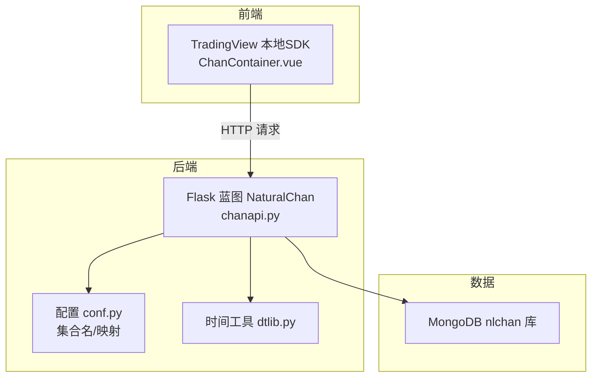
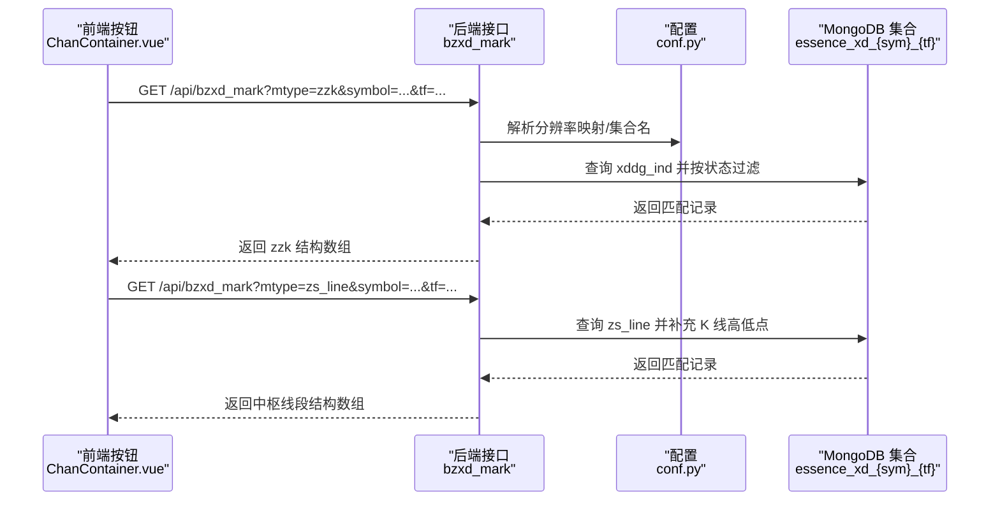
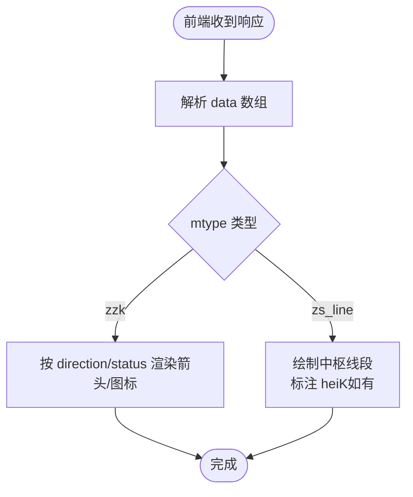
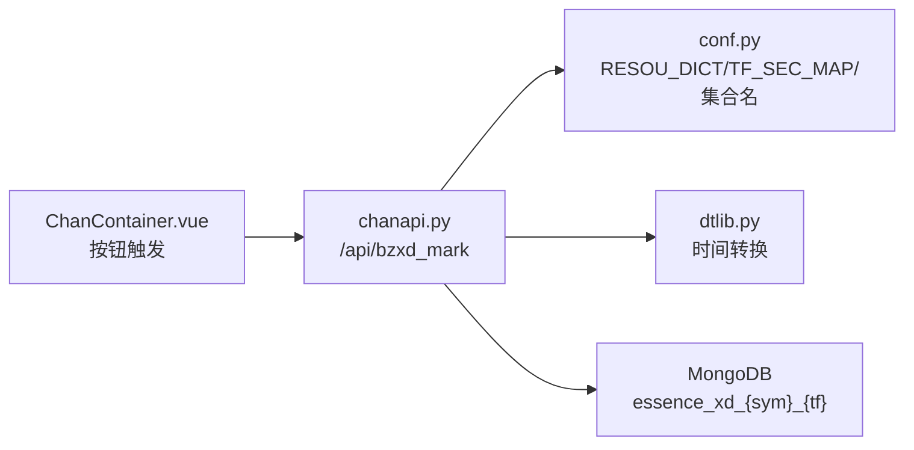

# 中枢数据API

<cite>
**本文引用的文件**
- [chanapi.py](file://api/chanapi.py)
- [conf.py](file://comm/conf.py)
- [dtlib.py](file://utils/dtlib.py)
- [symbol_info.py](file://api/symbol_info.py)
- [ChanContainer.vue](file://ui/src/components/ChanContainer.vue)
- [README.md](file://README.md)
</cite>

## 目录
1. [简介](#简介)
2. [项目结构](#项目结构)
3. [核心组件](#核心组件)
4. [架构总览](#架构总览)
5. [详细组件分析](#详细组件分析)
6. [依赖关系分析](#依赖关系分析)
7. [性能考量](#性能考量)
8. [故障排查指南](#故障排查指南)
9. [结论](#结论)
10. [附录](#附录)

## 简介
本文件聚焦于中枢数据API，围绕后端接口 bzxd_mark 的两个关键模式 mtype=zzk 与 mtype=zs_line，系统性阐述：
- 如何从嵌套文档 xddg_ind 中提取中枢数据（zzk 字段）
- zs_line 端点如何结合 K 线高低点构建中枢线段
- 中枢数据结构中的时间、价格区间与状态字段
- 中枢合并（merged）与延伸（extended）状态的业务含义
- 查询参数对中枢数据过滤的影响（时间边界与状态过滤）
- 实际响应数据示例与前端渲染思路

## 项目结构
- 后端服务：Flask 提供 REST 接口，核心路由位于 api/chanapi.py
- 数据层：MongoDB 存储历史K线与中枢识别结果，集合命名由配置文件定义
- 前端：基于 TradingView 本地 SDK 的 Vue 组件，负责可视化中枢与线段

**图表来源**
- [chanapi.py](file://api/chanapi.py#L280-L420)
- [conf.py](file://comm/conf.py#L1-L166)
- [dtlib.py](file://utils/dtlib.py#L1-L207)

**章节来源**
- [README.md](file://README.md#L90-L136)
- [chanapi.py](file://api/chanapi.py#L280-L420)
- [conf.py](file://comm/conf.py#L1-L166)

## 核心组件
- 后端接口：/api/bzxd_mark，支持 mtype 参数选择不同中枢输出模式
- 数据源：CHAN_DB 下的 essence_xd_{sym}_{tf} 集合，包含 xddg_ind 与 zs_line 等字段
- 时间边界：通过 replay_config 集合中的 current_ts 与 tf_sec 计算有效时间上限
- 前端可视化：ChanContainer.vue 通过按钮触发请求并绘制中枢线与转折K

**章节来源**
- [chanapi.py](file://api/chanapi.py#L280-L420)
- [conf.py](file://comm/conf.py#L139-L166)
- [ChanContainer.vue](file://ui/src/components/ChanContainer.vue#L1948-L2077)

## 架构总览
中枢数据API的调用链路如下：

**图表来源**
- [chanapi.py](file://api/chanapi.py#L280-L420)
- [conf.py](file://comm/conf.py#L139-L166)
- [ChanContainer.vue](file://ui/src/components/ChanContainer.vue#L1948-L2077)

## 详细组件分析

### 接口：/api/bzxd_mark
- 入参
  - mtype：模式选择，zzk 或 zs_line
  - symbol：标的代码
  - tf：时间周期（1/5/30/240/D/W 等）
- 出参
  - status：ok
  - data：根据不同 mtype 返回不同结构的中枢数据数组

关键实现要点：
- 解析 tf 映射到内部周期字符串
- 读取 replay_config 中 current_ts 与 tf_sec，构造时间上限 current_dt
- 对 mtype=zzk：从 xddg_ind 中提取 zzk，并按 xd_dg 的 status 过滤
- 对 mtype=zs_line：从 zs_line 中提取中枢线段，并补充该周期的 low/high

**章节来源**
- [chanapi.py](file://api/chanapi.py#L280-L420)
- [conf.py](file://comm/conf.py#L12-L31)
- [conf.py](file://comm/conf.py#L139-L166)

### 模式 mtype=zzk：从 xddg_ind 提取中枢数据（zzk）
- 数据来源：essence_xd_{sym}_{tf} 集合
- 过滤条件：
  - xddg_ind 不为空
  - dt ≤ current_dt（受回测进度影响）
  - xd_dg.status ∈ {ok, merged, extended, divergence}
- 输出字段（示例结构）
  - dt：中枢时间
  - direction：方向（up/down）
  - low/high：K 线区间
  - 其他可能包含：value/区间上下沿等（具体以实际文档为准）

业务含义：
- merged：中枢发生合并，通常表示多段中枢在时间上重叠或被吞并
- extended：中枢发生延伸，表示中枢在原有基础上继续扩展
- divergence：背离状态，常用于指示趋势潜在变化

**章节来源**
- [chanapi.py](file://api/chanapi.py#L318-L341)
- [ChanContainer.vue](file://ui/src/components/ChanContainer.vue#L1847-L1896)

### 模式 mtype=zs_line：结合 K 线高低点构建中枢线段
- 数据来源：essence_xd_{sym}_{tf} 集合
- 过滤条件：
  - zs_line 不为空
  - dt ≤ current_dt
- 输出字段（示例结构）
  - dt：中枢起始时间
  - low/high：该周期 K 线最低/最高
  - value：中枢线段所在价格水平
  - direction：方向（up/down）
  - status：状态（如 ok/extended/merged 等）
  - heiK：若有黑K（突破K线）则标注该K线时间，否则为占位符

业务含义：
- 该模式直接给出中枢线段的可视化锚点与区间，便于前端绘制水平线与标注
- 当存在突破K线（heiK）时，前端可额外标注该K线位置，增强可读性

**章节来源**
- [chanapi.py](file://api/chanapi.py#L371-L390)
- [ChanContainer.vue](file://ui/src/components/ChanContainer.vue#L1948-L2077)

### 时间边界与状态过滤
- 时间边界
  - 通过 replay_config.current_ts 与 TF_SEC_MAP 计算 current_dt，确保查询不超过当前回测进度
  - 该机制避免前端请求到尚未完成的未来数据
- 状态过滤
  - mtype=zzk：仅保留 xd_dg.status ∈ {ok, merged, extended, divergence}
  - mtype=zs_line：按 dt ≤ current_dt 过滤，不额外限定状态

**章节来源**
- [chanapi.py](file://api/chanapi.py#L295-L317)
- [chanapi.py](file://api/chanapi.py#L318-L341)
- [chanapi.py](file://api/chanapi.py#L371-L390)
- [conf.py](file://comm/conf.py#L23-L31)
- [conf.py](file://comm/conf.py#L139-L166)

### 响应数据示例（结构示意）
以下为两种模式的典型响应结构（字段名称以实际为准）：

- mtype=zzk
  - [
      {
        "dt": "2025-01-01 10:30:00",
        "direction": "up",
        "low": 10000,
        "high": 10500,
        "value": 10250,
        "status": "ok"
      },
      {
        "dt": "2025-01-02 14:15:00",
        "direction": "down",
        "low": 9900,
        "high": 10100,
        "value": 10000,
        "status": "merged"
      }
    ]

- mtype=zs_line
  - [
      {
        "dt": "2025-01-01 09:30:00",
        "low": 9800,
        "high": 10200,
        "value": 10000,
        "direction": "up",
        "status": "ok",
        "heiK": "-"
      },
      {
        "dt": "2025-01-02 09:30:00",
        "low": 9900,
        "high": 10100,
        "value": 10000,
        "direction": "down",
        "status": "extended",
        "heiK": "2025-01-02 10:30:00"
      }
    ]

说明：
- dt 为中枢起始时间，value 为中枢线段价格
- direction 表示中枢方向，status 表示状态
- heiK 用于标注突破K线时间，若无则为占位符

**章节来源**
- [chanapi.py](file://api/chanapi.py#L318-L341)
- [chanapi.py](file://api/chanapi.py#L371-L390)
- [ChanContainer.vue](file://ui/src/components/ChanContainer.vue#L1948-L2077)

### 前端渲染思路
- 中枢线（zs_line）
  - 读取 data 数组，按 direction 决定颜色与图标
  - 若 heiK 非占位符，则额外绘制黑K标记
  - 可根据 status 决定线型（实线/虚线）
- 转折K（zzk）
  - 读取 data 数组，按 direction 与 status 渲染箭头或图标
  - 将 dt 转换为时间戳后在图表上定位

**图表来源**
- [ChanContainer.vue](file://ui/src/components/ChanContainer.vue#L1847-L1896)
- [ChanContainer.vue](file://ui/src/components/ChanContainer.vue#L1948-L2077)

**章节来源**
- [ChanContainer.vue](file://ui/src/components/ChanContainer.vue#L1847-L1896)
- [ChanContainer.vue](file://ui/src/components/ChanContainer.vue#L1948-L2077)

## 依赖关系分析

**图表来源**
- [chanapi.py](file://api/chanapi.py#L280-L420)
- [conf.py](file://comm/conf.py#L12-L31)
- [dtlib.py](file://utils/dtlib.py#L148-L164)
- [ChanContainer.vue](file://ui/src/components/ChanContainer.vue#L1948-L2077)

**章节来源**
- [chanapi.py](file://api/chanapi.py#L280-L420)
- [conf.py](file://comm/conf.py#L12-L31)
- [dtlib.py](file://utils/dtlib.py#L148-L164)
- [ChanContainer.vue](file://ui/src/components/ChanContainer.vue#L1948-L2077)

## 性能考量
- 查询范围控制：通过 current_dt 限制查询时间范围，避免扫描全表
- 索引建议：在 dt、xddg_ind、zs_line 等字段建立索引可显著提升查询效率
- 分页与缓存：对于高频访问的中枢线段，可在前端或网关层增加缓存策略
- 数据量：若集合规模较大，建议按 symbol/tf 分片或分区

[本节为通用建议，不直接分析具体文件]

## 故障排查指南
- 无数据返回
  - 检查 symbol/tf 是否正确，确认集合是否存在
  - 确认 replay_config 中 current_ts 是否存在且合理
- 数据过旧
  - 检查 current_dt 的计算逻辑，确保未被提前截断
- 状态过滤异常
  - 确认 mtype 与过滤条件匹配（zzk 仅返回特定状态）
- 前端不显示
  - 检查前端按钮是否正确发起请求（含 tf/symbol）
  - 确认返回字段与前端解析一致（如 dt/value/low/high）

**章节来源**
- [chanapi.py](file://api/chanapi.py#L295-L317)
- [chanapi.py](file://api/chanapi.py#L318-L341)
- [chanapi.py](file://api/chanapi.py#L371-L390)
- [ChanContainer.vue](file://ui/src/components/ChanContainer.vue#L1948-L2077)

## 结论
- mtype=zzk 与 mtype=zs_line 分别面向“转折K中枢”与“中枢线段”两类可视化需求
- 后端通过 xddg_ind 与 zs_line 文档提取中枢数据，并结合时间边界与状态过滤保证数据有效性
- 前端基于响应数据进行图标与线段渲染，支持合并与延伸状态的差异化展示
- 实际部署中建议完善索引、缓存与错误监控，以提升查询性能与用户体验

[本节为总结性内容，不直接分析具体文件]

## 附录

### API 定义（摘要）
- 路径：/api/bzxd_mark
- 方法：GET
- 参数：
  - mtype：zzk | zs_line
  - symbol：标的代码
  - tf：周期映射（1/5/30/240/D/W 等）
- 返回：
  - status：ok
  - data：中枢数据数组（见前文示例）

**章节来源**
- [chanapi.py](file://api/chanapi.py#L280-L420)

### 配置与集合命名
- 周期映射：RESOU_DICT
- 时间周期秒数：TF_SEC_MAP
- 集合名模板：ESSENCE_XD_COL
- 数据库连接：CHAN_DB

**章节来源**
- [conf.py](file://comm/conf.py#L12-L31)
- [conf.py](file://comm/conf.py#L139-L166)