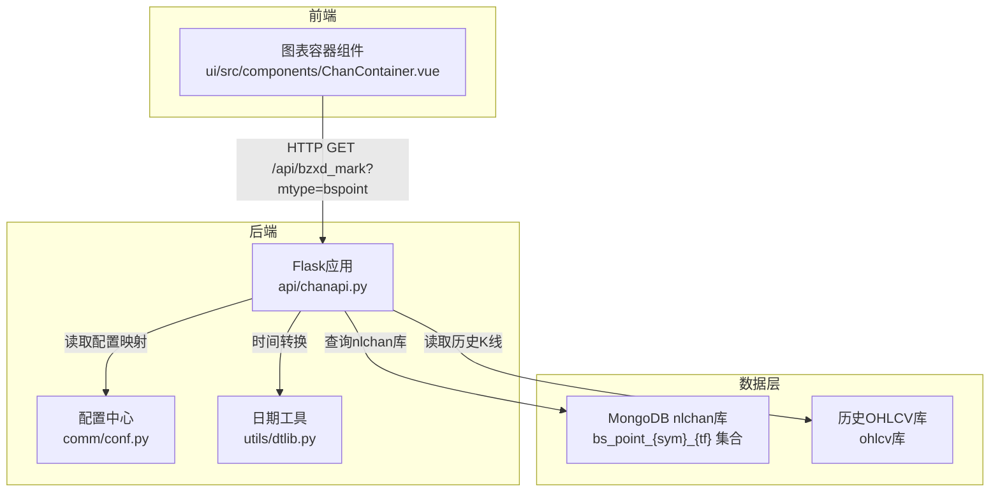
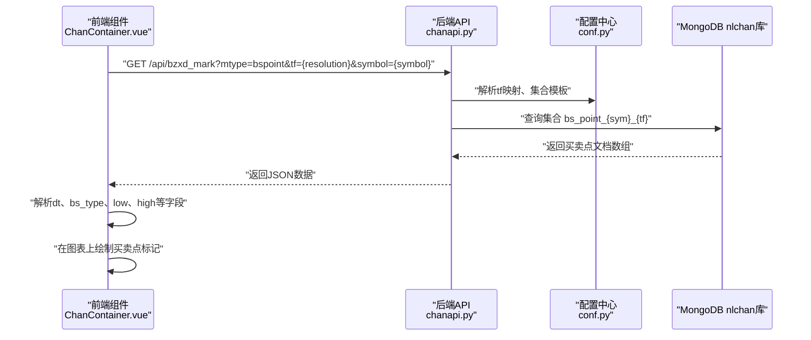
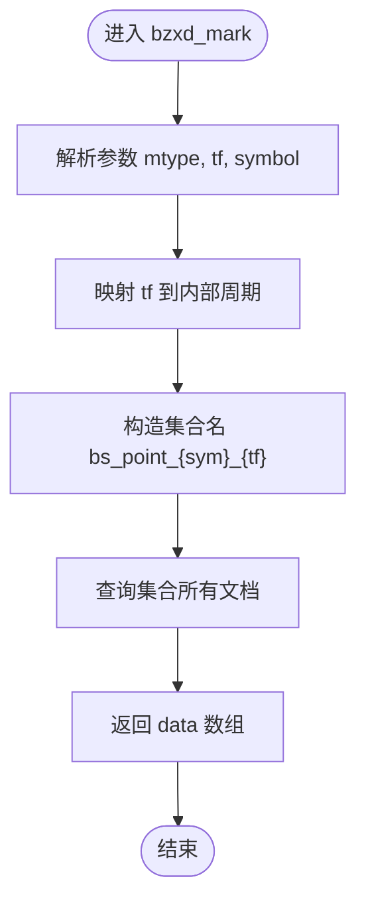
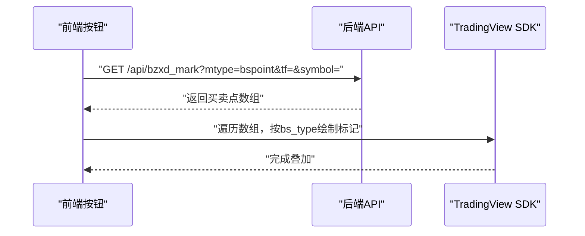
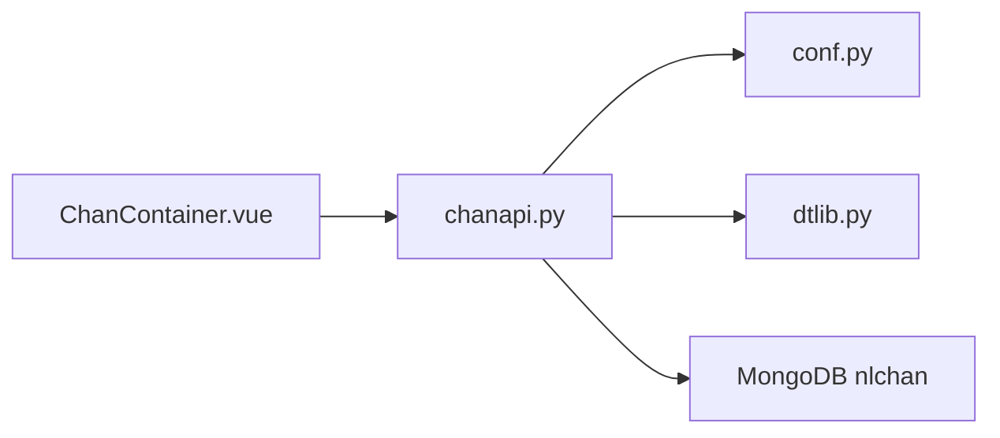

# 买卖点数据API

<cite>
**本文引用的文件**
- [chanapi.py](file://api/chanapi.py)
- [conf.py](file://comm/conf.py)
- [dtlib.py](file://utils/dtlib.py)
- [symbol_info.py](file://api/symbol_info.py)
- [ChanContainer.vue](file://ui/src/components/ChanContainer.vue)
- [README.md](file://README.md)
</cite>

## 目录
1. [简介](#简介)
2. [项目结构](#项目结构)
3. [核心组件](#核心组件)
4. [架构总览](#架构总览)
5. [详细组件分析](#详细组件分析)
6. [依赖关系分析](#依赖关系分析)
7. [性能考量](#性能考量)
8. [故障排查指南](#故障排查指南)
9. [结论](#结论)
10. [附录](#附录)

## 简介
本文件聚焦于买卖点数据API，围绕 bzxd_mark 接口中的 mtype=bspoint 实现进行系统化说明。内容涵盖：
- bs_point_{sym}_{tf} 集合的命名规则与数据存储结构
- 买卖点数据从文件系统（bs-{freq}.csv）迁移到MongoDB的演进过程
- 买卖点数据模型字段含义（如 dt、bs_type 等）
- 前端如何将标记叠加在主图表上
- 对比API实现与文件读取两种方式的性能差异
- 当前MongoDB存储方案的优势
- 买卖点类型编码规范与扩展新类型的方法

## 项目结构
本项目采用前后端分离架构，后端使用Flask提供REST API，前端基于TradingView本地SDK渲染图表并调用后端接口叠加标记。买卖点数据API位于后端模块中，前端通过按钮触发调用。

**图表来源**
- [chanapi.py](file://api/chanapi.py#L280-L420)
- [conf.py](file://comm/conf.py#L139-L166)
- [dtlib.py](file://utils/dtlib.py#L148-L164)
- [ChanContainer.vue](file://ui/src/components/ChanContainer.vue#L2145-L2191)

**章节来源**
- [README.md](file://README.md#L90-L106)
- [chanapi.py](file://api/chanapi.py#L280-L420)
- [conf.py](file://comm/conf.py#L139-L166)

## 核心组件
- 后端API：提供买卖点数据查询接口，支持从MongoDB读取bs_point_{sym}_{tf}集合，并返回给前端。
- 配置中心：提供时间周期映射、数据库连接、集合命名模板等。
- 日期工具：提供时间戳与字符串互转，确保前后端时间格式一致。
- 前端组件：通过按钮触发调用后端接口，并将返回的买卖点标记绘制到图表上。

关键职责与交互：
- 后端根据请求参数解析 symbol、tf，并构造集合名 bs_point_{sym}_{tf}，查询所有文档并返回。
- 前端解析返回数据，按买卖类型在图表上绘制图标或箭头标记。

**章节来源**
- [chanapi.py](file://api/chanapi.py#L280-L420)
- [conf.py](file://comm/conf.py#L139-L166)
- [dtlib.py](file://utils/dtlib.py#L148-L164)
- [ChanContainer.vue](file://ui/src/components/ChanContainer.vue#L2145-L2191)

## 架构总览
买卖点数据API的调用链路如下：

**图表来源**
- [chanapi.py](file://api/chanapi.py#L280-L420)
- [conf.py](file://comm/conf.py#L139-L166)
- [ChanContainer.vue](file://ui/src/components/ChanContainer.vue#L2145-L2191)

## 详细组件分析

### 1) bzxd_mark 接口中 mtype=bspoint 的实现
- 请求参数
  - mtype：标记类型，bspoint 表示买卖点
  - tf：时间周期，映射为内部周期字符串（如 1m、5m、1h、1d、1w）
  - symbol：交易标的，如 btc、sh 等
- 数据来源
  - 从 CHAN_DB 中查询集合 bs_point_{sym}_{tf}
  - 返回字段包含 dt（时间）、bs_type（买卖类型）、low（最低价）、high（最高价）等
- 前端叠加
  - 前端根据 bs_type 绘制不同颜色与形状的标记（例如做多/做空）

**图表来源**
- [chanapi.py](file://api/chanapi.py#L280-L420)

**章节来源**
- [chanapi.py](file://api/chanapi.py#L280-L420)

### 2) bs_point_{sym}_{tf} 集合命名规则与数据存储结构
- 命名规则
  - 集合名称模板：bs_point_{sym}_{tf}
  - sym：交易标的（如 btc、sh），统一小写
  - tf：内部时间周期字符串（如 1m、5m、1h、1d、1w）
- 存储结构
  - 文档字段包含但不限于：
    - dt：字符串格式的时间
    - bs_type：买卖类型（如 long、short）
    - low：K线最低价
    - high：K线最高价
    - 其他可能的业务字段（由具体生成逻辑决定）
- 查询行为
  - 当 mtype=bspoint 时，后端直接查询该集合的所有文档，无需额外过滤条件

**章节来源**
- [chanapi.py](file://api/chanapi.py#L410-L414)
- [conf.py](file://comm/conf.py#L139-L166)

### 3) 买卖点数据从文件系统迁移到MongoDB的演进过程
- 历史实现（文件系统）
  - 通过 /api/get_bspoint 接口读取 CSV 文件：bs-{freq}.csv
  - 文件每行包含三列：序号、时间dt、买卖类型bs_type
  - 读取后组装为 JSON 返回
- 现状（MongoDB）
  - 通过 /api/bzxd_mark 接口，mtype=bspoint 直接查询 bs_point_{sym}_{tf} 集合
  - 该集合由ETL流程导入，字段包含 dt、bs_type、low、high 等
- 迁移优势
  - 结构化查询：支持按时间、类型等条件过滤
  - 索引优化：可在常用查询字段上建立索引提升性能
  - 扩展性强：可灵活增加字段与聚合统计

**章节来源**
- [chanapi.py](file://api/chanapi.py#L244-L278)
- [chanapi.py](file://api/chanapi.py#L410-L414)

### 4) 买卖点数据模型字段含义
- dt：字符串格式的时间，通常与K线时间对齐
- bs_type：买卖类型，常见取值包括 long（做多）、short（做空）
- low、high：用于在图表上定位标记位置（如做多标记绘制在low下方，做空标记绘制在high上方）
- 其他字段：根据实际导入数据可能包含更多业务字段（如生成器附加的统计信息）

**章节来源**
- [chanapi.py](file://api/chanapi.py#L410-L414)
- [ChanContainer.vue](file://ui/src/components/ChanContainer.vue#L2145-L2191)

### 5) 前端如何将标记叠加在主图表上
- 触发方式
  - 前端创建“量化买卖”按钮，点击后调用 /api/bzxd_mark?mtype=bspoint&tf={resolution}&symbol={symbol}
- 绘制逻辑
  - 解析返回数据，遍历每个买卖点
  - 根据 bs_type 决定标记颜色与形状
  - 使用 TradingView SDK 在指定时间与价格位置绘制图标或箭头
- 位置控制
  - 做多标记绘制在 low 的略下方
  - 做空标记绘制在 high 的略上方

**图表来源**
- [ChanContainer.vue](file://ui/src/components/ChanContainer.vue#L2145-L2191)

**章节来源**
- [ChanContainer.vue](file://ui/src/components/ChanContainer.vue#L2145-L2191)

### 6) API实现与文件读取两种方式的性能差异
- 文件读取（历史）
  - 优点：实现简单，无需数据库
  - 缺点：每次请求需顺序扫描CSV文件，无法利用索引；大规模数据时延迟高
- MongoDB实现（现状）
  - 优点：可建立索引，支持条件过滤与聚合；查询效率高；便于扩展字段
  - 缺点：需要维护数据库与ETL流程；首次查询可能受集合大小影响
- 实践建议
  - 为 dt、bs_type 等常用查询字段建立索引
  - 对于高频查询，考虑缓存热点数据
  - 控制返回数据量，必要时增加分页或时间窗口限制

**章节来源**
- [chanapi.py](file://api/chanapi.py#L244-L278)
- [chanapi.py](file://api/chanapi.py#L410-L414)

### 7) 买卖点类型编码规范与扩展新类型
- 类型编码规范
  - 使用语义明确的小写英文标识，如 long、short
  - 保持与前端绘制逻辑一致的枚举值
- 扩展新类型的方法
  - 在数据生成阶段新增 bs_type 值，并保证与前端渲染逻辑兼容
  - 若需在后端过滤特定类型，可在 bzxd_mark 的 mtype 分支中增加相应条件
  - 前端根据新 bs_type 值调整绘制样式与颜色

**章节来源**
- [chanapi.py](file://api/chanapi.py#L410-L414)
- [ChanContainer.vue](file://ui/src/components/ChanContainer.vue#L2145-L2191)

## 依赖关系分析
- 后端API依赖配置中心提供的数据库连接与集合模板
- 前端组件依赖后端API返回的标准化数据结构
- 日期工具用于时间戳与字符串互转，确保前后端时间一致性

**图表来源**
- [chanapi.py](file://api/chanapi.py#L280-L420)
- [conf.py](file://comm/conf.py#L139-L166)
- [dtlib.py](file://utils/dtlib.py#L148-L164)
- [ChanContainer.vue](file://ui/src/components/ChanContainer.vue#L2145-L2191)

**章节来源**
- [chanapi.py](file://api/chanapi.py#L280-L420)
- [conf.py](file://comm/conf.py#L139-L166)
- [dtlib.py](file://utils/dtlib.py#L148-L164)
- [ChanContainer.vue](file://ui/src/components/ChanContainer.vue#L2145-L2191)

## 性能考量
- 索引优化：为 dt、bs_type 等常用查询字段建立索引，减少全表扫描
- 查询裁剪：仅返回必要字段（如 _id=False），降低网络传输与序列化开销
- 数据量控制：对返回数据量进行上限控制，避免一次性返回过多标记导致前端渲染卡顿
- 缓存策略：对热点symbol/tf组合进行短期缓存，降低数据库压力
- 并发与限流：结合业务流量特征，设置合理的并发与限流策略

[本节为通用指导，不直接分析具体文件]

## 故障排查指南
- 接口无数据
  - 检查 symbol、tf 是否正确映射，确认集合 bs_point_{sym}_{tf} 是否存在
  - 核对数据是否已导入MongoDB（ETL流程）
- 时间不一致
  - 确认 dt 字段格式与前端解析一致，必要时使用日期工具进行转换
- 前端不显示标记
  - 检查 bs_type 是否与前端绘制逻辑匹配
  - 确认时间戳与 TradingView 时间轴单位一致

**章节来源**
- [chanapi.py](file://api/chanapi.py#L410-L414)
- [dtlib.py](file://utils/dtlib.py#L148-L164)
- [ChanContainer.vue](file://ui/src/components/ChanContainer.vue#L2145-L2191)

## 结论
- bzxd_mark 接口中的 mtype=bspoint 已实现从MongoDB读取买卖点数据，并返回给前端进行叠加展示
- bs_point_{sym}_{tf} 集合命名清晰、字段结构简洁，便于扩展与维护
- 相比文件读取，MongoDB方案在查询性能、扩展性与可维护性方面具有明显优势
- 建议持续完善索引、缓存与限流策略，保障高并发下的稳定表现

[本节为总结，不直接分析具体文件]

## 附录
- API端点
  - GET /api/bzxd_mark?mtype=bspoint&tf={resolution}&symbol={symbol}
  - GET /api/get_bspoint?symbol={symbol}&resolution={resolution}
- 关键配置
  - 时间周期映射、数据库连接、集合模板均在配置中心定义

**章节来源**
- [chanapi.py](file://api/chanapi.py#L244-L278)
- [chanapi.py](file://api/chanapi.py#L280-L420)
- [conf.py](file://comm/conf.py#L139-L166)