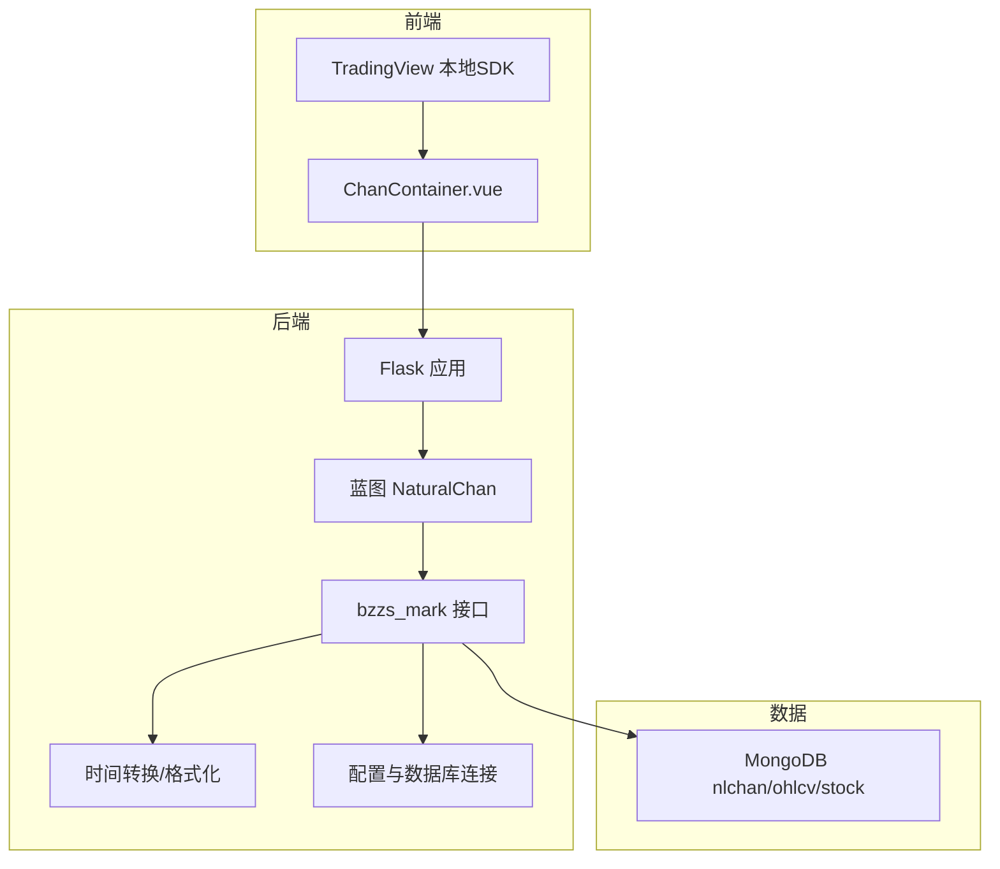
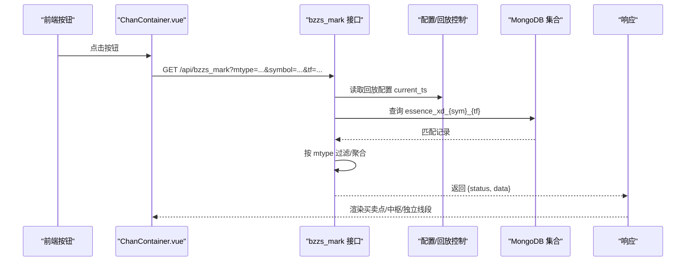
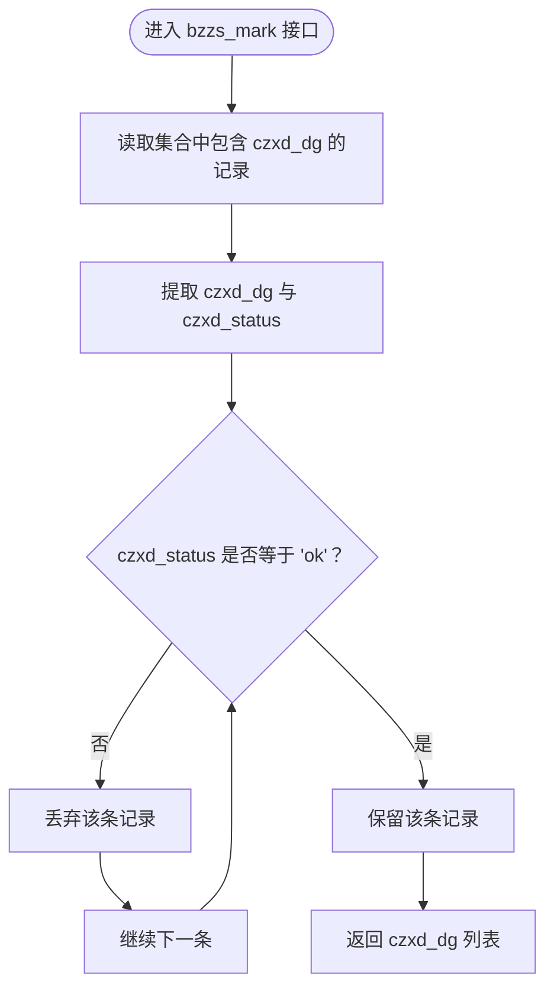
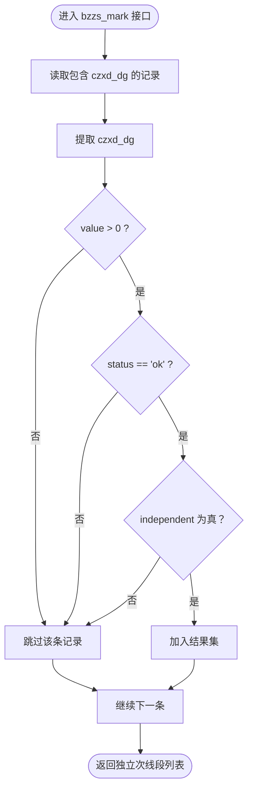
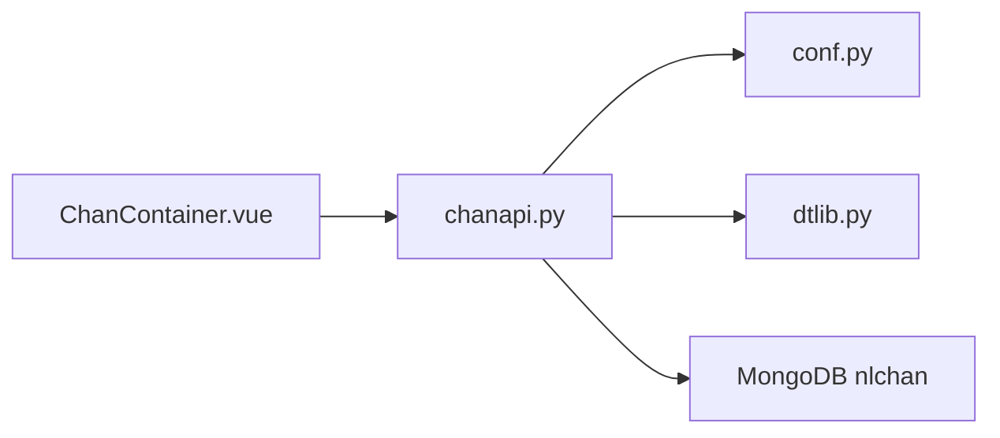

# 标准中枢与次线段API

<cite>
**本文引用的文件**
- [chanapi.py](file://api/chanapi.py)
- [symbol_info.py](file://api/symbol_info.py)
- [dtlib.py](file://utils/dtlib.py)
- [conf.py](file://comm/conf.py)
- [ChanContainer.vue](file://ui/src/components/ChanContainer.vue)
- [README.md](file://README.md)
</cite>

## 目录
1. [简介](#简介)
2. [项目结构](#项目结构)
3. [核心组件](#核心组件)
4. [架构总览](#架构总览)
5. [详细组件分析](#详细组件分析)
6. [依赖关系分析](#依赖关系分析)
7. [性能考量](#性能考量)
8. [故障排查指南](#故障排查指南)
9. [结论](#结论)
10. [附录](#附录)

## 简介
本文件围绕“标准中枢与次线段API”展开，重点解析后端接口 bzzs_mark 的实现，聚焦 mtype=czzd_dg 时如何提取次级别线段（czxd_dg）数据，并通过 czxd_status 状态字段进行有效线段过滤；同时说明 bzxd_zzk 端点如何获取标准线段的中枢数据，以及 bzzs 端点返回的本级别中枢结构。文档还深入分析 3_buysell 和 indp_cz 等特殊买卖点的提取逻辑，尤其是独立次线段（independent 字段）的筛选条件，并阐述这些数据在多级别联立分析中的作用，以及如何支持高级缠论策略的验证。

## 项目结构
- 后端服务：基于 Flask 的蓝图 NaturalChan，提供统一的 API 入口。
- 数据层：MongoDB 存储历史K线与缠论识别结果，配置与连接由 comm/conf.py 统一管理。
- 前端：基于 TradingView 本地 SDK 的 Vue 组件，通过 axios 调用后端接口展示中枢、线段与买卖点。

图表来源
- [chanapi.py](file://api/chanapi.py#L422-L491)
- [conf.py](file://comm/conf.py#L143-L158)
- [dtlib.py](file://utils/dtlib.py#L148-L154)

章节来源
- [README.md](file://README.md#L91-L136)
- [chanapi.py](file://api/chanapi.py#L422-L491)
- [conf.py](file://comm/conf.py#L143-L158)

## 核心组件
- bzzs_mark 接口：统一入口，根据 mtype 参数返回不同类型的中枢/线段/买卖点数据。
- 数据来源：essence_xd_{sym}_{tf} 集合，包含 czxd_dg、czxd_status、bzzs、3_buysell、indp_cz 等字段。
- 时间约束：接口会结合回放配置中的 current_ts，确保仅返回到当前回测时刻之前的有效数据。
- 前端集成：ChanContainer.vue 中通过按钮触发不同 mtype 的请求，渲染买卖点、独立日线中枢等。

章节来源
- [chanapi.py](file://api/chanapi.py#L422-L491)
- [conf.py](file://comm/conf.py#L143-L158)
- [ChanContainer.vue](file://ui/src/components/ChanContainer.vue#L2446-L2541)

## 架构总览
后端通过 Flask 蓝图提供 REST 接口，读取 MongoDB 中的缠论识别结果，按 mtype 返回标准化的数据结构。前端通过 TradingView 本地 SDK 的按钮事件调用接口，将数据可视化到图表上。

图表来源
- [chanapi.py](file://api/chanapi.py#L422-L491)
- [conf.py](file://comm/conf.py#L143-L158)

## 详细组件分析

### bzzs_mark 接口与 mtype 分支
- 接口路径：/api/bzzs_mark
- 关键参数：mtype、symbol、tf
- 数据来源：CHAN_DB[ESSENCE_XD_COL.format(sym, tf)]

mtype 分支说明（与目标文档直接相关）：
- bzxd_zzk
  - 从集合中读取包含 xddg_ind 的记录，提取 bzxd_zzk 字段，并要求 xd_dg.status 在 ('ok','last') 范围内。
  - 用途：获取标准线段的中枢数据，用于多级别联立分析。
- czxd_dg
  - 从集合中读取包含 czxd_dg 的记录，同时读取 dt 与 czxd_status。
  - 过滤条件：仅保留 czxd_status == 'ok' 的记录。
  - 用途：提取次级别线段（czxd_dg）数据，作为本级别中枢的输入之一。
- bzzs
  - 从集合中读取包含 bzzs 的记录，直接返回 bzzs 结构。
  - 用途：返回本级别中枢结构，供前端绘制与分析。
- 3_buysell
  - 从集合中读取包含 3_buysell 的记录，返回 dt、high、low 等字段。
  - 用途：特殊买卖点标注，辅助策略验证。
- indp_cz
  - 从集合中读取包含 czxd_dg 的记录，提取 czxd_dg 并筛选 value > 0 且 status == 'ok' 且 independent 为真。
  - 用途：独立次线段筛选，强调独立性与有效性。

章节来源
- [chanapi.py](file://api/chanapi.py#L422-L491)

### czxd_dg 与 czxd_status 的过滤逻辑
- 数据来源：essence_xd_{sym}_{tf} 集合中的 czxd_dg 与 czxd_status 字段。
- 过滤规则：仅保留 czxd_status == 'ok' 的记录，确保返回的是有效线段。
- 输出结构：返回 czxd_dg 对象数组，每个对象包含线段的关键属性（如起止时间、方向、中枢区间等）。

图表来源
- [chanapi.py](file://api/chanapi.py#L444-L461)

章节来源
- [chanapi.py](file://api/chanapi.py#L444-L461)

### bzxd_zzk 端点与本级别中枢结构
- bzxd_zzk
  - 从集合中读取包含 xddg_ind 的记录，提取 bzxd_zzk 字段。
  - 过滤条件：要求 xd_dg.status 在 ('ok','last') 范围内。
  - 用途：返回标准线段的中枢数据，用于多级别联立分析。
- bzzs
  - 从集合中读取包含 bzzs 的记录，直接返回 bzzs 结构。
  - 用途：返回本级别中枢结构，供前端绘制与分析。

章节来源
- [chanapi.py](file://api/chanapi.py#L437-L471)

### 3_buysell 与 indp_cz 的提取逻辑
- 3_buysell
  - 从集合中读取包含 3_buysell 的记录，返回 dt、high、low 等字段。
  - 用途：特殊买卖点标注，辅助策略验证。
- indp_cz
  - 从集合中读取包含 czxd_dg 的记录，提取 czxd_dg。
  - 过滤条件：value > 0 且 status == 'ok' 且 independent 为真。
  - 用途：独立次线段筛选，强调独立性与有效性。

图表来源
- [chanapi.py](file://api/chanapi.py#L478-L486)

章节来源
- [chanapi.py](file://api/chanapi.py#L472-L486)

### 前端集成与可视化
- 前端通过按钮事件调用 bzzs_mark 接口，传入 mtype、symbol、tf。
- 不同 mtype 对应不同可视化行为：
  - 3_buysell：在图表上绘制第三买卖点标记。
  - indp_cz：在图表上绘制独立日线中枢标记。
- 前端按钮与接口调用的映射关系见 ChanContainer.vue。

章节来源
- [ChanContainer.vue](file://ui/src/components/ChanContainer.vue#L2446-L2541)

## 依赖关系分析
- 数据库连接：通过 conf.py 中的 CHAN_DB、ESSENCE_XD_COL、ESSENCE_ZS_COL、LNCHAN_XD_COL 等常量访问集合。
- 时间处理：使用 utils/dtlib.py 提供的 int2time、time2int 等函数进行时间戳与字符串互转。
- 回放控制：通过 CONF_DB['replay_config'] 读取 current_ts，限制查询时间范围，确保只返回到当前回测时刻之前的数据。
- 符号与分辨率：symbol_info.py 提供支持的符号列表，chanapi.py 使用 RESOU_DICT 将前端分辨率映射到内部周期。

图表来源
- [chanapi.py](file://api/chanapi.py#L422-L491)
- [conf.py](file://comm/conf.py#L143-L158)
- [dtlib.py](file://utils/dtlib.py#L148-L154)

章节来源
- [conf.py](file://comm/conf.py#L143-L158)
- [dtlib.py](file://utils/dtlib.py#L148-L154)
- [chanapi.py](file://api/chanapi.py#L422-L491)

## 性能考量
- 查询范围控制：通过回放配置 current_ts 限制查询时间范围，避免全量扫描，提高查询效率。
- 字段投影：按需选择返回字段（如仅返回 czxd_dg、czxd_status），减少网络传输与序列化开销。
- 过滤前置：优先在数据库侧进行状态过滤（如 status == 'ok'），减少不必要的数据传输。
- 建议索引：为常用查询字段（如 dt、czxd_status、czxd_dg、bzzs、3_buysell、indp_cz）建立索引，提升查询性能。

## 故障排查指南
- 接口返回空数据
  - 检查 symbol 与 tf 是否正确，确认 ESSENCE_XD_COL 对应集合是否存在数据。
  - 检查回放配置 current_ts 是否合理，确保查询时间范围覆盖有效数据。
- 数据异常或过旧
  - 确认回放配置是否更新，current_ts 是否指向正确的周期末尾。
  - 检查 RESOU_DICT 映射是否正确，避免分辨率与内部周期不一致导致查询不到数据。
- 前端不显示标记
  - 确认 mtype 与前端按钮绑定一致，检查接口返回的数据结构是否包含预期字段（如 dt、value、independent 等）。
  - 检查过滤条件是否过于严格（如 status != 'ok' 或 independent 为假），导致结果为空。

章节来源
- [chanapi.py](file://api/chanapi.py#L422-L491)
- [conf.py](file://comm/conf.py#L143-L158)

## 结论
bzzs_mark 接口通过 mtype 参数实现了对标准中枢、次线段、特殊买卖点与独立中枢的统一输出，配合前端可视化组件，能够高效支撑多级别联立分析与高级缠论策略验证。通过对 czxd_status 的严格过滤与 independent 字段的筛选，接口确保了输出数据的质量与有效性，为策略回测与实盘应用提供了可靠的数据基础。

## 附录
- API 端点清单（与目标文档相关）
  - /api/bzzs_mark?mtype=bzxd_zzk&symbol=...&tf=...
  - /api/bzzs_mark?mtype=czxd_dg&symbol=...&tf=...
  - /api/bzzs_mark?mtype=bzzs&symbol=...&tf=...
  - /api/bzzs_mark?mtype=3_buysell&symbol=...&tf=...
  - /api/bzzs_mark?mtype=indp_cz&symbol=...&tf=...

章节来源
- [chanapi.py](file://api/chanapi.py#L422-L491)
- [ChanContainer.vue](file://ui/src/components/ChanContainer.vue#L2446-L2541)