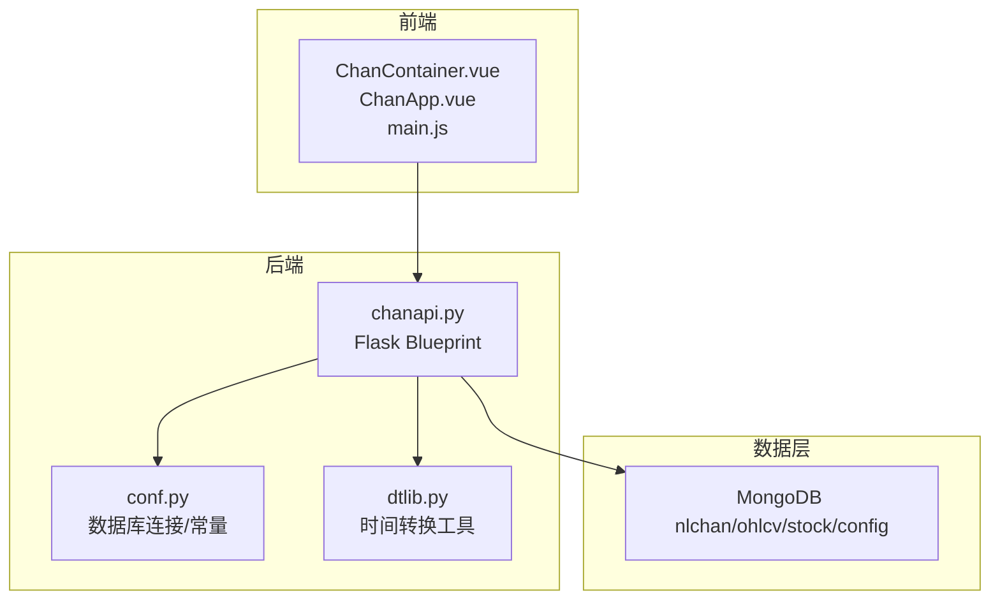
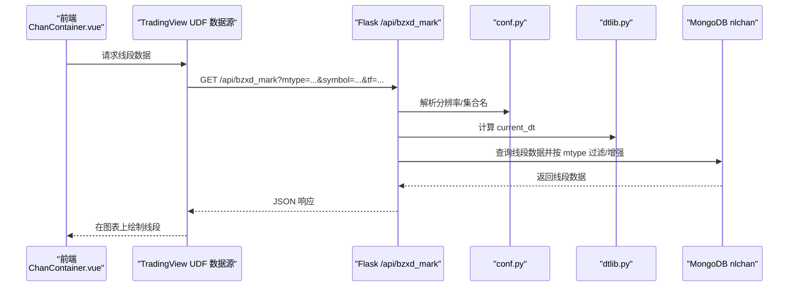
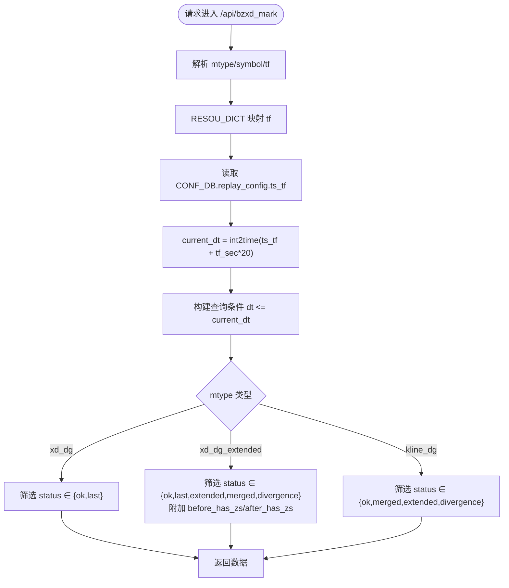
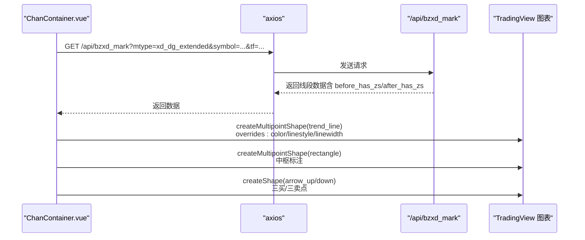
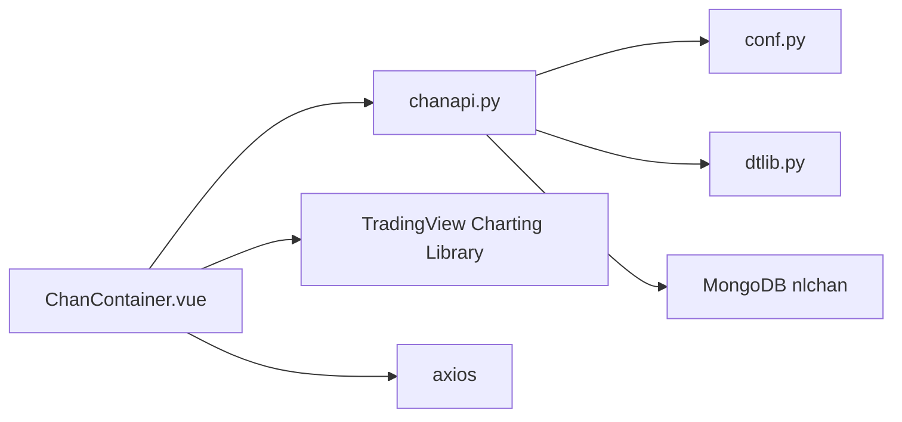

# 线段数据API

<cite>
**本文引用的文件**
- [api/chanapi.py](file://api/chanapi.py)
- [comm/conf.py](file://comm/conf.py)
- [utils/dtlib.py](file://utils/dtlib.py)
- [ui/src/components/ChanContainer.vue](file://ui/src/components/ChanContainer.vue)
- [ui/src/ChanApp.vue](file://ui/src/ChanApp.vue)
- [ui/src/main.js](file://ui/src/main.js)
- [api/symbol_info.py](file://api/symbol_info.py)
</cite>

## 目录
1. [简介](#简介)
2. [项目结构](#项目结构)
3. [核心组件](#核心组件)
4. [架构总览](#架构总览)
5. [详细组件分析](#详细组件分析)
6. [依赖分析](#依赖分析)
7. [性能考虑](#性能考虑)
8. [故障排查指南](#故障排查指南)
9. [结论](#结论)
10. [附录](#附录)

## 简介
本文件围绕线段数据API进行系统化文档化，重点覆盖 bzxd_mark 接口在 mtype=xd_dg、xd_dg_extended 和 kline_dg 三种模式下的行为与数据结构。内容涵盖：
- 线段数据（xd_dg）的关键字段设计：起始时间、结束时间、方向、极值点、状态、中枢关联等
- 不同 mtype 对线段数据过滤的影响
- current_dt 时间边界在实时线段识别中的作用
- has_zs 字段如何反映线段与中枢的关联关系
- 前端图表中线段数据的渲染方式与样式配置

## 项目结构
该项目采用前后端分离架构：
- 后端：Flask 提供 REST API，负责从数据库查询线段数据并按 mtype 进行过滤与增强
- 前端：基于 TradingView Charting Library 的 Vue 应用，通过 UDF 兼容数据源消费后端接口，并在图表上绘制线段、中枢等标记

**图表来源**
- [api/chanapi.py](file://api/chanapi.py#L1-L120)
- [comm/conf.py](file://comm/conf.py#L139-L166)
- [utils/dtlib.py](file://utils/dtlib.py#L148-L164)
- [ui/src/components/ChanContainer.vue](file://ui/src/components/ChanContainer.vue#L1-L120)
- [ui/src/ChanApp.vue](file://ui/src/ChanApp.vue#L1-L41)
- [ui/src/main.js](file://ui/src/main.js#L1-L12)

**章节来源**
- [api/chanapi.py](file://api/chanapi.py#L1-L120)
- [comm/conf.py](file://comm/conf.py#L139-L166)
- [ui/src/components/ChanContainer.vue](file://ui/src/components/ChanContainer.vue#L1-L120)

## 核心组件
- 线段数据接口：/api/bzxd_mark，支持多 mtype 过滤与增强
- 数据库配置：MongoDB 连接、集合命名规范、时间周期映射
- 时间工具：时间戳与字符串互转，用于 current_dt 边界控制
- 前端图表容器：ChanContainer.vue 通过 TradingView Charting Library 渲染线段与中枢

**章节来源**
- [api/chanapi.py](file://api/chanapi.py#L280-L420)
- [comm/conf.py](file://comm/conf.py#L139-L166)
- [utils/dtlib.py](file://utils/dtlib.py#L148-L164)
- [ui/src/components/ChanContainer.vue](file://ui/src/components/ChanContainer.vue#L1-L120)

## 架构总览
后端通过 Flask Blueprint 暴露 /api/bzxd_mark 接口，根据 mtype 参数从 MongoDB 中查询线段数据，并结合 current_dt 实时边界进行过滤。前端通过 TradingView UDF 兼容数据源消费接口，将线段数据渲染到图表上。

**图表来源**
- [api/chanapi.py](file://api/chanapi.py#L280-L420)
- [comm/conf.py](file://comm/conf.py#L12-L41)
- [utils/dtlib.py](file://utils/dtlib.py#L148-L164)
- [ui/src/components/ChanContainer.vue](file://ui/src/components/ChanContainer.vue#L1-L120)

## 详细组件分析

### 线段数据API：/api/bzxd_mark
- 功能概述：按 mtype 过滤并返回线段数据，支持实时边界 current_dt 控制
- 关键参数：
  - mtype：过滤策略标识
  - symbol：标的代码
  - tf：时间周期（1/5/30/240/D/W/M 等）
- 数据来源：ESSENCE_XD_COL 集合，按 symbol 和 tf 组合命名
- 实时边界：current_dt = ts_tf + tf_sec * 20，仅返回 dt ≤ current_dt 的记录

**图表来源**
- [api/chanapi.py](file://api/chanapi.py#L280-L420)
- [comm/conf.py](file://comm/conf.py#L12-L41)
- [utils/dtlib.py](file://utils/dtlib.py#L148-L164)

**章节来源**
- [api/chanapi.py](file://api/chanapi.py#L280-L420)
- [comm/conf.py](file://comm/conf.py#L12-L41)
- [utils/dtlib.py](file://utils/dtlib.py#L148-L164)

### 线段数据结构与字段说明（基于接口实现）
以下字段来源于接口对 MongoDB 文档的提取与增强逻辑，用于前端渲染与业务判断：

- 基础字段
  - dt：线段起始时间（字符串）
  - end_dt：线段结束时间（字符串）
  - direction：方向（上升/下降）
  - high：线段内最高价
  - low：线段内最低价
  - status：线段状态（ok/last/extended/merged/divergence 等）

- 中枢关联字段（仅在扩展模式下增强）
  - before_has_zs：线段起始前是否存在中枢
  - after_has_zs：线段结束后是否存在中枢

- 说明
  - has_zs 字段在接口实现中以 before_has_zs/after_has_zs 形式返回，用于判断线段与中枢的关联关系
  - current_dt 作为实时边界，确保只返回到最新可用时间点之前的数据

**章节来源**
- [api/chanapi.py](file://api/chanapi.py#L334-L370)
- [api/chanapi.py](file://api/chanapi.py#L342-L360)

### mtype 参数对线段数据过滤的影响
- mtype=xd_dg
  - 返回确认线段：status ∈ {ok,last}
  - 适用于稳定确认后的线段展示
- mtype=xd_dg_extended
  - 返回扩展状态线段：status ∈ {ok,last,extended,merged,divergence}
  - 对每条线段附加 before_has_zs/after_has_zs 字段，便于前端判断中枢关联
- mtype=kline_dg
  - 返回与K线重合的线段：status ∈ {ok,merged,extended,divergence}
  - 适合强调与K线形态一致的线段识别

**章节来源**
- [api/chanapi.py](file://api/chanapi.py#L334-L370)
- [api/chanapi.py](file://api/chanapi.py#L342-L360)

### current_dt 时间边界与实时线段识别
- current_dt 来源于 CONF_DB.replay_config 中的 ts_tf，加上 tf_sec*20 秒偏移
- 查询时以 dt ≤ current_dt 作为过滤条件，避免返回未来时间点的线段
- 该机制保证前端图表仅显示到“当前可回放/实时”的有效线段

**章节来源**
- [api/chanapi.py](file://api/chanapi.py#L295-L305)
- [utils/dtlib.py](file://utils/dtlib.py#L148-L164)
- [comm/conf.py](file://comm/conf.py#L139-L166)

### has_zs 字段与中枢关联判断
- 接口实现中未直接返回 has_zs，而是拆分为 before_has_zs 与 after_has_zs
- has_zs 的语义即为“线段与中枢的关联”，可通过两个布尔字段判断：
  - before_has_zs：线段起始前存在中枢
  - after_has_zs：线段结束后存在中枢
- 前端可根据这两个字段决定是否标注中枢关联或调整线段样式

**章节来源**
- [api/chanapi.py](file://api/chanapi.py#L342-L360)

### 前端图表渲染与样式配置
- 数据源：ChanContainer.vue 使用 TradingView UDF 兼容数据源，通过 axios 调用后端 /api/bzxd_mark
- 渲染策略：
  - 线段：使用趋势线形状（trend_line），起止时间为 dt/end_dt，方向由 vtype 决定
  - 样式：颜色、线型、线宽通过 overrides 配置；当线段状态不稳定（如 end_status=false）时，线型改为虚线
- 中枢：使用矩形形状（rectangle）标注中枢区间，透明度与颜色可配置
- 买卖点：使用箭头形状（arrow_up/arrow_down）标注三买/三卖点

**图表来源**
- [ui/src/components/ChanContainer.vue](file://ui/src/components/ChanContainer.vue#L2300-L2499)
- [api/chanapi.py](file://api/chanapi.py#L342-L360)

**章节来源**
- [ui/src/components/ChanContainer.vue](file://ui/src/components/ChanContainer.vue#L2300-L2499)

## 依赖分析
- 后端依赖
  - Flask 蓝图：组织路由与响应
  - MongoDB：存储线段与中枢数据
  - 时间工具：统一时间格式转换
- 前端依赖
  - TradingView Charting Library：提供 UDF 兼容数据源与绘图能力
  - Axios：HTTP 请求封装

**图表来源**
- [api/chanapi.py](file://api/chanapi.py#L1-L120)
- [comm/conf.py](file://comm/conf.py#L139-L166)
- [utils/dtlib.py](file://utils/dtlib.py#L148-L164)
- [ui/src/components/ChanContainer.vue](file://ui/src/components/ChanContainer.vue#L1-L120)

**章节来源**
- [api/chanapi.py](file://api/chanapi.py#L1-L120)
- [comm/conf.py](file://comm/conf.py#L139-L166)
- [utils/dtlib.py](file://utils/dtlib.py#L148-L164)
- [ui/src/components/ChanContainer.vue](file://ui/src/components/ChanContainer.vue#L1-L120)

## 性能考虑
- 查询优化
  - 使用 dt ≤ current_dt 限制扫描范围，避免全表扫描
  - 仅投影所需字段（如 dt、xd_dg、has_zs），减少网络传输
- 分辨率映射
  - 通过 RESOU_DICT 与 TF_SEC_MAP 将人类可读周期映射为内部表示，便于快速计算 current_dt
- 前端渲染
  - 仅在按钮点击时拉取线段数据，避免频繁请求
  - 对线段与中枢使用批量创建形状（createMultipointShape），提升渲染效率

[本节为通用建议，不直接分析具体文件]

## 故障排查指南
- 接口无数据返回
  - 检查 mtype 是否正确传入，确认集合中是否存在对应字段
  - 确认 current_dt 是否过早，导致 dt > current_dt 被过滤
- 线段未显示或样式异常
  - 检查前端 overrides 配置（颜色、线型、线宽）
  - 确认线段 end_status 或状态字段是否影响了渲染逻辑
- 数据库连接失败
  - 检查 conf.py 中 MongoDB 连接配置与集合命名规范

**章节来源**
- [api/chanapi.py](file://api/chanapi.py#L280-L420)
- [comm/conf.py](file://comm/conf.py#L139-L166)
- [ui/src/components/ChanContainer.vue](file://ui/src/components/ChanContainer.vue#L2300-L2499)

## 结论
- /api/bzxd_mark 提供了灵活的线段数据过滤能力，通过 mtype 实现“确认线段”“扩展线段（含中枢关联）”“与K线重合线段”的差异化输出
- current_dt 作为实时边界，确保线段数据与回放/实时场景匹配
- has_zs 通过 before_has_zs/after_has_zs 字段在扩展模式下直观表达线段与中枢的关系
- 前端基于 TradingView Charting Library 实现线段与中枢的可视化，支持丰富的样式配置

[本节为总结性内容，不直接分析具体文件]

## 附录

### API 定义与字段对照
- 接口路径：/api/bzxd_mark
- 方法：GET
- 参数：
  - mtype：过滤类型（xd_dg/xd_dg_extended/kline_dg 等）
  - symbol：标的代码
  - tf：时间周期
- 返回字段（示例，实际以接口为准）：
  - dt：起始时间
  - end_dt：结束时间
  - direction：方向
  - high/low：极值
  - status：状态
  - before_has_zs/after_has_zs：中枢关联（扩展模式）
  - 其他：如 vtype、is_valid_czxd 等（用于前端渲染）

**章节来源**
- [api/chanapi.py](file://api/chanapi.py#L280-L420)
- [ui/src/components/ChanContainer.vue](file://ui/src/components/ChanContainer.vue#L2300-L2499)