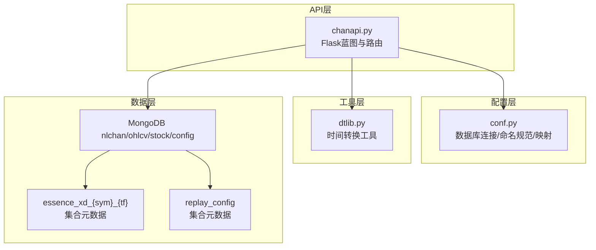
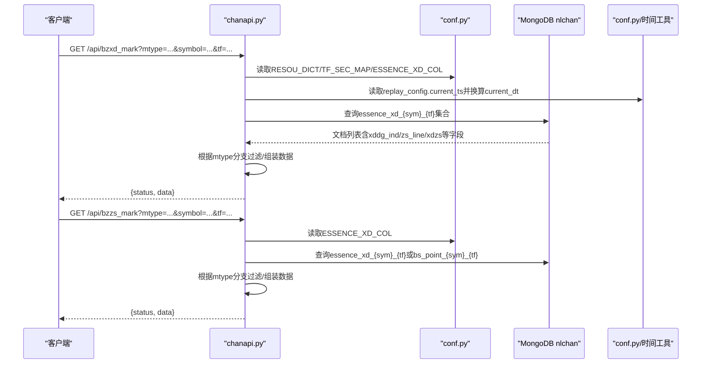
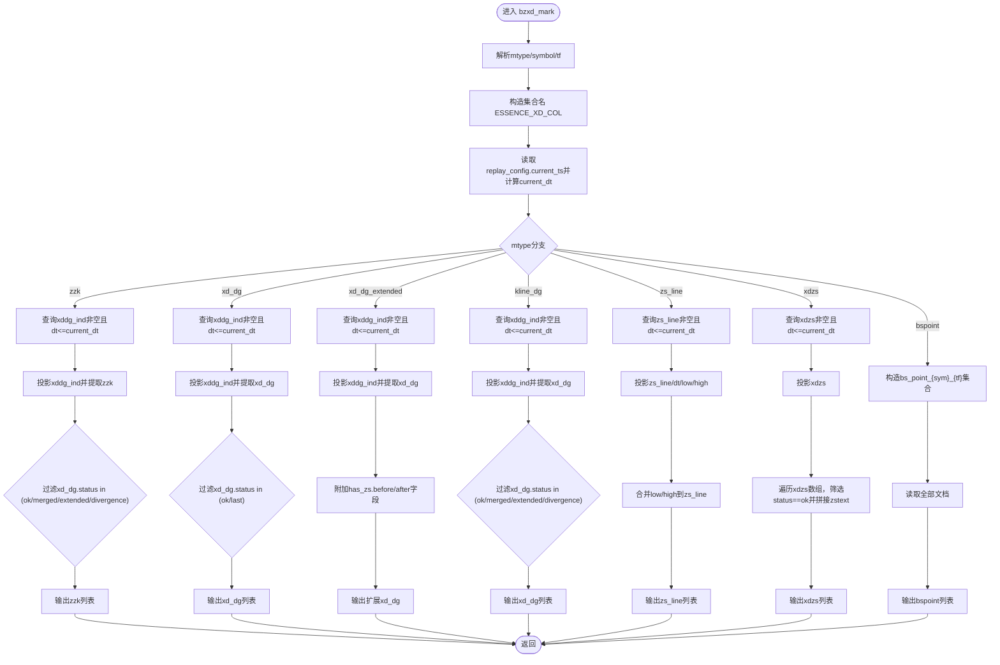
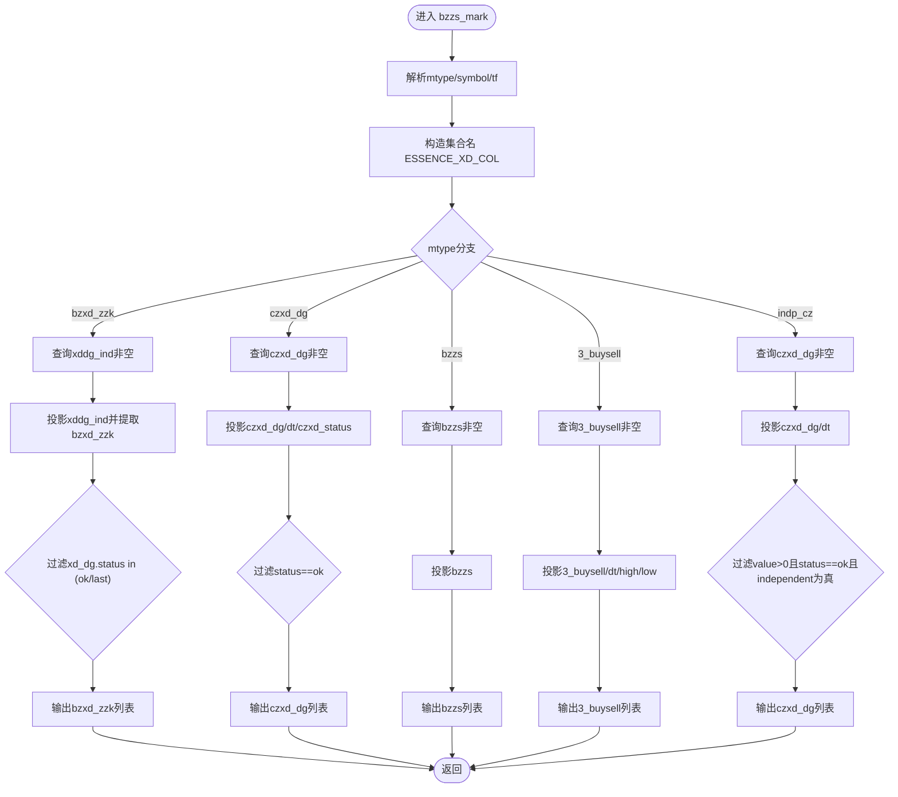
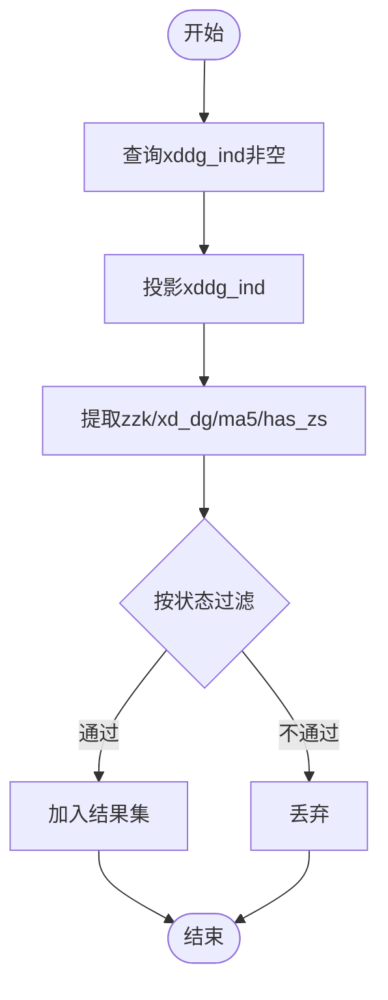
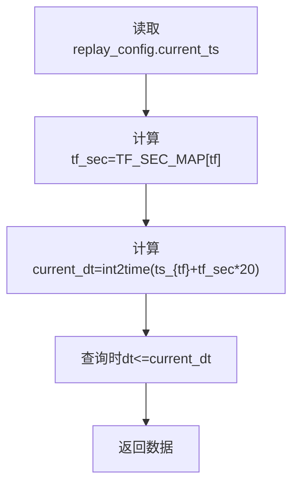
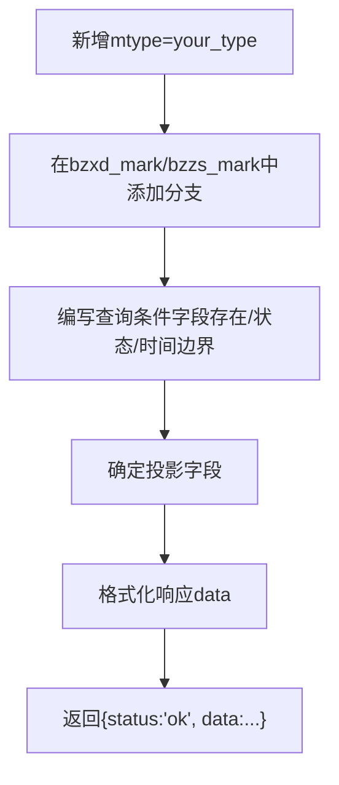
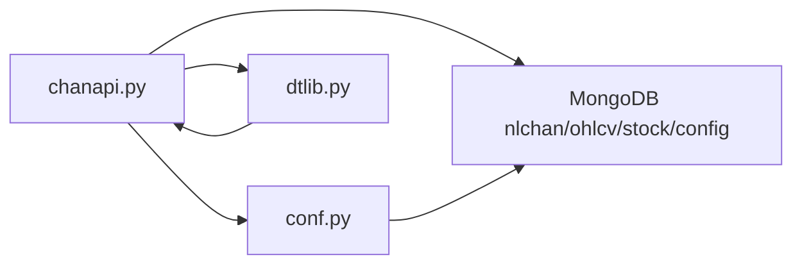

# 缠论结构数据API

<cite>
**本文引用的文件**
- [chanapi.py](file://api/chanapi.py)
- [conf.py](file://comm/conf.py)
- [dtlib.py](file://utils/dtlib.py)
- [essence_xd_000001.XSHG_1d.metadata.json](file://data/nlchan/essence_xd_000001.XSHG_1d.metadata.json)
- [replay_config.metadata.json](file://data/stock/replay_config.metadata.json)
- [bs_point_collection_example](file://api/chanapi.py)
</cite>

## 目录
1. [简介](#简介)
2. [项目结构](#项目结构)
3. [核心组件](#核心组件)
4. [架构总览](#架构总览)
5. [详细组件分析](#详细组件分析)
6. [依赖关系分析](#依赖关系分析)
7. [性能考量](#性能考量)
8. [故障排查指南](#故障排查指南)
9. [结论](#结论)
10. [附录](#附录)

## 简介
本文件面向开发者，系统性梳理缠论结构数据API，重点覆盖两个接口：/api/bzxd_mark 与 /api/bzzs_mark。文档围绕以下目标展开：
- 解释 mtype 参数的多态设计与分支逻辑，如何通过不同标记类型（zzk、xd_dg、bspoint 等）返回相应缠论结构数据；
- 分析 ESSENCE_XD_COL 集合命名规则（{sym}_{tf} 格式）与数据存储结构；
- 阐述 xddg_ind 嵌套文档的设计意图，以及如何从该结构中提取中枢、线段等复杂结构；
- 说明时间边界控制 current_dt 在实时分析中的作用；
- 提供自定义缠论标记类型的扩展方法，包括新增 mtype 处理分支、修改 MongoDB 查询条件与响应数据格式化。

## 项目结构
ChanVis 采用分层架构：API 层负责对外提供 REST 接口，配置层提供数据库连接与命名规范，工具层提供时间转换等辅助能力，数据层承载 MongoDB 集合元数据。



**图表来源**
- [chanapi.py](file://api/chanapi.py#L1-L120)
- [conf.py](file://comm/conf.py#L139-L166)
- [essence_xd_000001.XSHG_1d.metadata.json](file://data/nlchan/essence_xd_000001.XSHG_1d.metadata.json#L1-L1)
- [replay_config.metadata.json](file://data/stock/replay_config.metadata.json#L1-L1)

**章节来源**
- [chanapi.py](file://api/chanapi.py#L1-L120)
- [conf.py](file://comm/conf.py#L139-L166)

## 核心组件
- 接口路由与参数解析：/api/bzxd_mark 与 /api/bzzs_mark 通过请求参数 mtype、symbol、tf 获取业务分支与数据集。
- 数据库与集合命名：ESSENCE_XD_COL 为本质线段集合命名模板，结合符号与时间周期形成最终集合名；bspoint 类型使用独立集合命名模板。
- 时间边界控制：通过 CONF_DB 中的 replay_config 获取 current_ts，并换算为 current_dt，限制查询时间上限，确保实时分析的正确性。
- 响应格式：统一返回 {status, data} 结构，data 内容由 mtype 分支决定。

**章节来源**
- [chanapi.py](file://api/chanapi.py#L280-L491)
- [conf.py](file://comm/conf.py#L151-L158)

## 架构总览
下图展示了两条核心接口的调用链路与数据流向。



**图表来源**
- [chanapi.py](file://api/chanapi.py#L280-L491)
- [conf.py](file://comm/conf.py#L139-L166)
- [dtlib.py](file://utils/dtlib.py#L148-L154)

## 详细组件分析

### /api/bzxd_mark 接口
- 功能：返回线段相关的标记点与结构数据，通过 mtype 参数选择不同输出形态。
- 关键参数：
  - mtype：标记类型，如 zzk、xd_dg、xd_dg_extended、kline_dg、zs_line、xdzs、bspoint 等；
  - symbol：标的符号；
  - tf：时间周期，内部映射至 RESOU_DICT。
- 时间边界控制：
  - 从 CONF_DB.replay_config 读取 ts_{tf}，结合 TF_SEC_MAP[tf] 计算 current_dt；
  - 查询条件 dt ≤ current_dt，避免未来数据污染实时分析。
- 数据来源：
  - ESSENCE_XD_COL.format(sym, tf) 集合；
  - 特殊类型 bspoint 使用 bs_point_{sym}_{tf} 集合。
- 响应结构：统一 {status: "ok", data: [...]}

mtype 分支要点（节选）：
- zzk：从 xddg_ind 提取 zzk，仅保留 xd_dg.status 在特定状态的记录。
- xd_dg：从 xddg_ind 提取 xd_dg，筛选状态为 ok/last 的记录。
- xd_dg_extended：从 xddg_ind 提取 xd_dg，附加 before_has_zs/after_has_zs 字段。
- kline_dg：从 xddg_ind 提取 xd_dg，筛选状态为 ok/merged/extended/divergence。
- zs_line：从集合直接读取 zs_line，并合并 low/high 等字段。
- xdzs：从 xdzs 数组中筛选 status 为 ok 的项，拼接 zstext 字段。
- bspoint：从 bs_point_{sym}_{tf} 集合读取全部文档。



**图表来源**
- [chanapi.py](file://api/chanapi.py#L280-L420)

**章节来源**
- [chanapi.py](file://api/chanapi.py#L280-L420)

### /api/bzzs_mark 接口
- 功能：返回中枢相关的标记点与结构数据，通过 mtype 参数选择不同输出形态。
- 关键参数：mtype、symbol、tf。
- 数据来源：ESSENCE_XD_COL.format(sym, tf) 集合；特殊类型 bspoint 使用 bs_point_{sym}_{tf} 集合。
- 响应结构：统一 {status: "ok", data: [...]}

mtype 分支要点（节选）：
- bzxd_zzk：从 xddg_ind 提取 bzxd_zzk，要求 xd_dg.status 为 ok/last。
- czxd_dg：从 czxd_dg 字段筛选 status 为 ok 的记录。
- bzzs：从 bzzs 字段读取对象列表。
- 3_buysell：从 3_buysell 字段读取对象列表，并投影 dt、high、low。
- indp_cz：从 czxd_dg 字段筛选 value>0 且 status 为 ok 且 independent 为真。



**图表来源**
- [chanapi.py](file://api/chanapi.py#L422-L491)

**章节来源**
- [chanapi.py](file://api/chanapi.py#L422-L491)

### ESSENCE_XD_COL 集合命名规则与数据存储结构
- 命名规则：essence_xd_{sym}_{tf}，其中 {sym} 为符号，{tf} 为映射后的时间周期（如 1m、5m、1d 等）。
- 存储结构要点：
  - 文档内包含 xddg_ind 嵌套对象，用于存放中枢、线段等复杂结构；
  - 可能包含 zs_line、xdzs、czxd_dg、bzxd_zzk、bzzs、3_buysell 等字段；
  - 每条记录通常包含 dt（时间）、low/high（中枢/线段边界）等字段。
- 元数据示例：essence_xd_000001.XSHG_1d 集合存在，表明该集合已创建并可用于查询。

```mermaid
erDiagram
ESSENCE_XD {
string dt
object xddg_ind
object zs_line
array xdzs
object czxd_dg
object bzxd_zzk
object bzzs
object 3_buysell
float low
float high
}
XDDG_IND {
object xd_dg
object ma5
object zzk
object has_zs
}
XD_DG {
string status
string start
string end
string start_type
string end_type
}
ZS_LINE {
string type
float low
float high
}
XDXS {
string status
map zstype
string zstext
}
CZXD_DG {
string status
float value
bool independent
}
BZZS {
string type
float low
float high
}
ESSENCE_XD ||--|| XDDG_IND : "包含"
XDDG_IND ||--|| XD_DG : "包含"
ESSENCE_XD ||--|| ZS_LINE : "可选"
ESSENCE_XD ||--o{ XDXS : "数组"
ESSENCE_XD ||--|| CZXD_DG : "可选"
ESSENCE_XD ||--|| BZZS : "可选"
ESSENCE_XD ||--|| 3_BUYSELL : "可选"
```

**图表来源**
- [chanapi.py](file://api/chanapi.py#L280-L491)
- [essence_xd_000001.XSHG_1d.metadata.json](file://data/nlchan/essence_xd_000001.XSHG_1d.metadata.json#L1-L1)

**章节来源**
- [conf.py](file://comm/conf.py#L151-L158)
- [chanapi.py](file://api/chanapi.py#L280-L491)
- [essence_xd_000001.XSHG_1d.metadata.json](file://data/nlchan/essence_xd_000001.XSHG_1d.metadata.json#L1-L1)

### xddg_ind 嵌套文档的设计意图与提取流程
- 设计意图：
  - 将中枢、线段、买卖点等复杂结构集中在一个嵌套对象中，便于按需投影与筛选；
  - 通过字段存在性与状态字段（如 status）实现灵活过滤。
- 提取流程：
  - 先查询 xddg_ind 非空的文档；
  - 投影 xddg_ind 字段；
  - 从嵌套对象中提取所需字段（如 zzk、xd_dg、ma5、has_zs）；
  - 根据状态字段进一步过滤（如 ok/last/merged/extended/divergence）。



**图表来源**
- [chanapi.py](file://api/chanapi.py#L318-L360)

**章节来源**
- [chanapi.py](file://api/chanapi.py#L318-L360)

### 时间边界控制（current_dt）在实时分析中的作用
- 来源：从 CONF_DB.replay_config 读取 ts_{tf}，结合 TF_SEC_MAP[tf] 计算 current_dt = int2time(ts_{tf} + tf_sec * 20)；
- 作用：
  - 限制查询条件 dt ≤ current_dt，避免使用尚未产生的未来数据；
  - 确保在回放/实时场景下，分析结果仅基于已发生的历史数据；
  - 与历史数据接口中的回放机制协同，保证跨周期一致性。



**图表来源**
- [chanapi.py](file://api/chanapi.py#L295-L298)
- [conf.py](file://comm/conf.py#L23-L31)
- [dtlib.py](file://utils/dtlib.py#L148-L154)

**章节来源**
- [chanapi.py](file://api/chanapi.py#L295-L298)
- [conf.py](file://comm/conf.py#L23-L31)
- [dtlib.py](file://utils/dtlib.py#L148-L154)

### 自定义缠论标记类型的扩展方法
- 新增 mtype 处理分支：
  - 在对应接口函数中添加新的 mtype 分支，参考现有分支的查询与过滤逻辑；
  - 明确查询条件（如字段存在性、状态过滤）与投影字段。
- 修改 MongoDB 查询条件：
  - 根据新标记类型选择合适的字段（如 xddg_ind、czxd_dg、bzzs 等）；
  - 若需要时间边界，沿用 current_dt 限制。
- 响应数据格式化：
  - 保持统一的 {status, data} 结构；
  - data 内容按新标记类型进行必要的字段拼接或转换（如拼接 zstext、附加 has_zs 字段等）。



**图表来源**
- [chanapi.py](file://api/chanapi.py#L280-L491)

**章节来源**
- [chanapi.py](file://api/chanapi.py#L280-L491)

## 依赖关系分析
- API 层依赖配置层（数据库连接、命名规范、映射）与工具层（时间转换）；
- 接口查询依赖 MongoDB 集合（essence_xd_{sym}_{tf}、bs_point_{sym}_{tf}、replay_config）；
- 时间边界依赖 CONF_DB.replay_config 与 TF_SEC_MAP。



**图表来源**
- [chanapi.py](file://api/chanapi.py#L1-L120)
- [conf.py](file://comm/conf.py#L139-L166)
- [dtlib.py](file://utils/dtlib.py#L148-L154)

**章节来源**
- [chanapi.py](file://api/chanapi.py#L1-L120)
- [conf.py](file://comm/conf.py#L139-L166)
- [dtlib.py](file://utils/dtlib.py#L148-L154)

## 性能考量
- 查询条件尽量使用索引字段（如 dt、字段存在性），减少全表扫描；
- 投影字段仅包含必要字段，降低网络传输与序列化开销；
- 对于大数组字段（如 xdzs），在分支中尽早过滤，避免不必要的数据拼接；
- 时间边界限制可显著缩小查询范围，提升响应速度。

## 故障排查指南
- 无数据返回：
  - 检查 symbol/tf 是否正确映射，确认集合是否存在；
  - 确认 replay_config 中 ts_{tf} 是否存在，current_dt 是否合理；
  - 检查 mtype 分支是否匹配集合字段。
- 数据异常：
  - 核对状态字段过滤条件（如 status in (...)）；
  - 检查投影字段是否遗漏关键字段。
- 时间越界：
  - 确认 current_dt 计算逻辑与 TF_SEC_MAP 一致；
  - 检查查询条件 dt ≤ current_dt 是否生效。

**章节来源**
- [chanapi.py](file://api/chanapi.py#L295-L298)
- [conf.py](file://comm/conf.py#L23-L31)
- [dtlib.py](file://utils/dtlib.py#L148-L154)

## 结论
本 API 通过 mtype 参数实现了缠论标记类型的多态设计，结合 ESSENCE_XD_COL 的标准化集合命名与 xddg_ind 嵌套结构，提供了灵活而清晰的中枢、线段与买卖点数据输出。时间边界控制 current_dt 确保了实时分析的正确性。通过遵循既定的扩展流程，开发者可便捷地新增自定义标记类型并保持接口一致性。

## 附录
- 集合命名与元数据：
  - ESSENCE_XD_COL：essence_xd_{sym}_{tf}
  - bs_point_{sym}_{tf}：买卖点专用集合
  - 元数据示例：essence_xd_000001.XSHG_1d
- 时间映射：
  - RESOU_DICT：1→1m、5→5m、15→15m、30→30m、60→1h、240→4h、1D→1d、1W→1w
  - TF_SEC_MAP：1m→60s、5m→300s、30m→1800s、1h→3600s、4h→14400s、1d→86400s、1w→604800s

**章节来源**
- [conf.py](file://comm/conf.py#L12-L31)
- [conf.py](file://comm/conf.py#L151-L158)
- [essence_xd_000001.XSHG_1d.metadata.json](file://data/nlchan/essence_xd_000001.XSHG_1d.metadata.json#L1-L1)
- [replay_config.metadata.json](file://data/stock/replay_config.metadata.json#L1-L1)