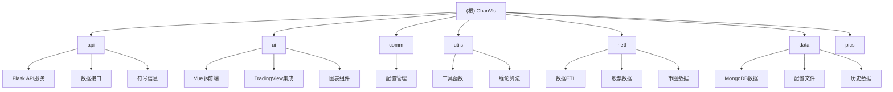
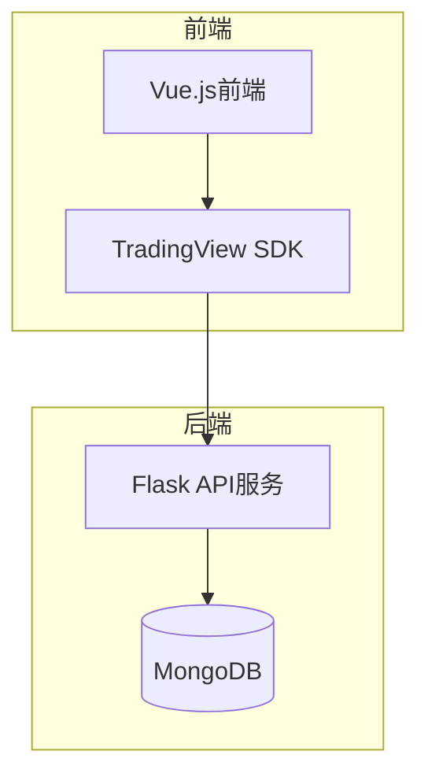
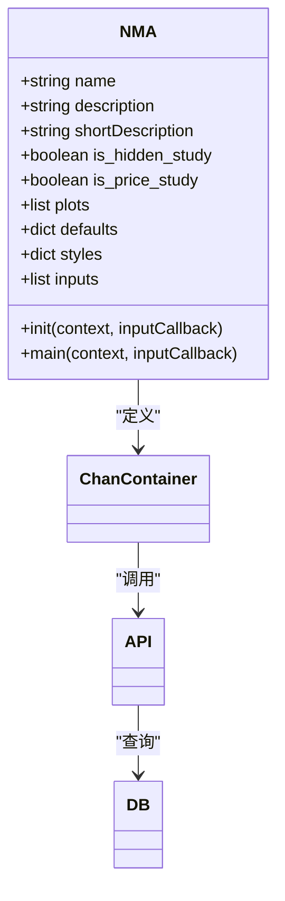
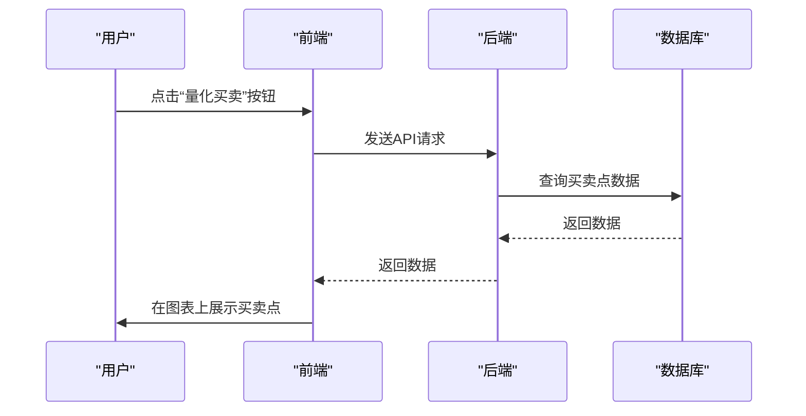
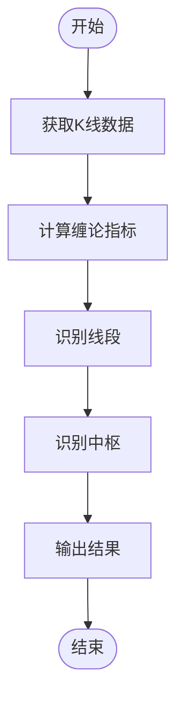
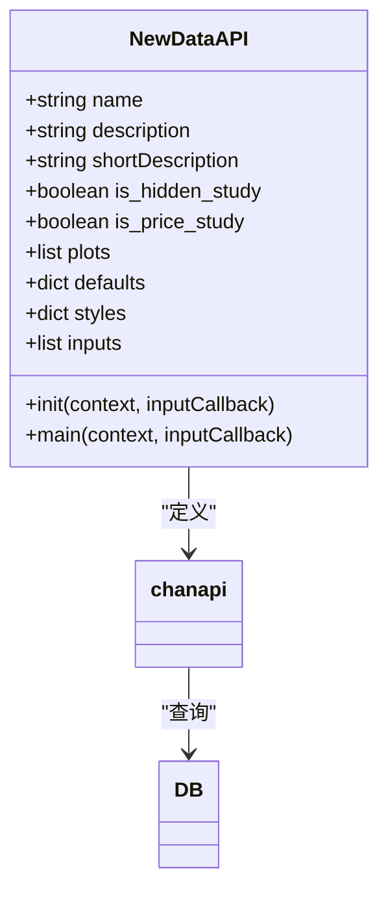
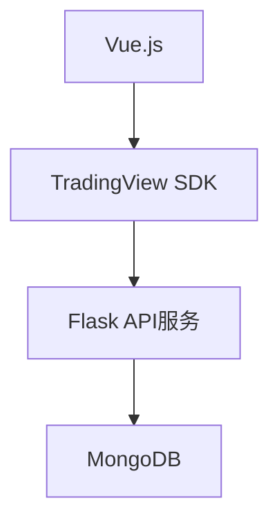

# 扩展与定制开发

<cite>
**本文档引用的文件**   
- [chanapi.py](file://api/chanapi.py)
- [ChanContainer.vue](file://ui/src/components/ChanContainer.vue)
- [conf.py](file://comm/conf.py)
- [symbol_info.py](file://api/symbol_info.py)
- [nlchan.py](file://utils/nlchan.py)
- [dtlib.py](file://utils/dtlib.py)
</cite>

## 目录
1. [引言](#引言)
2. [项目结构](#项目结构)
3. [核心组件](#核心组件)
4. [架构概述](#架构概述)
5. [详细组件分析](#详细组件分析)
6. [依赖分析](#依赖分析)
7. [性能考虑](#性能考虑)
8. [故障排除指南](#故障排除指南)
9. [结论](#结论)
10. [附录](#附录)（如有必要）

## 引言
本开发扩展与定制开发文档旨在指导开发者如何基于本平台进行二次开发。文档详细说明了如何添加新的自定义指标、扩展TradingView按钮功能、开发新的缠论识别算法（利用utils中的工具函数）以及集成新的数据源API。同时提供API扩展示例（新增endpoint）、前端组件复用模式和AI智能体插件开发接口。本文档强调“千人千缠”的设计理念，鼓励用户根据自身交易体系进行个性化定制。

## 项目结构
本项目采用前后端分离的架构设计，前端基于Vue.js实现，后端使用Python的Flask框架提供API接口。项目结构清晰，主要分为以下几个目录：

- **api/**: 包含后端API服务代码，核心文件为`chanapi.py`，提供数据接口和符号信息。
- **ui/**: 前端代码目录，基于Vue.js和TradingView的本地SDK实现，核心文件为`ChanContainer.vue`。
- **comm/**: 配置管理目录，包含系统配置信息。
- **utils/**: 工具函数目录，包含日期处理和缠论相关算法。
- **hetl/**: 数据ETL（提取、转换、加载）相关脚本，用于处理股票和币圈数据。
- **data/**: 存放MongoDB数据、配置文件和历史数据。

**图源**
- [api/CLAUDE.md](file://api/CLAUDE.md)
- [ui/CLAUDE.md](file://ui/CLAUDE.md)
- [comm/CLAUDE.md](file://comm/CLAUDE.md)
- [utils/CLAUDE.md](file://utils/CLAUDE.md)
- [hetl/CLAUDE.md](file://hetl/CLAUDE.md)
- [data/CLAUDE.md](file://data/CLAUDE.md)

## 核心组件
本平台的核心组件包括后端API服务、前端图表组件和数据处理工具。后端API服务基于Flask框架，提供数据接口和符号信息；前端图表组件基于Vue.js和TradingView的本地SDK，实现图表展示和交互功能；数据处理工具则负责数据的提取、转换和加载。

**节源**
- [chanapi.py](file://api/chanapi.py)
- [ChanContainer.vue](file://ui/src/components/ChanContainer.vue)
- [conf.py](file://comm/conf.py)

## 架构概述
本平台采用前后端分离的架构设计，前端基于Vue.js实现，后端使用Python的Flask框架提供API接口。前端通过TradingView的本地SDK与后端API进行通信，实现数据的可视化展示。数据存储采用MongoDB，用于存储K线的历史数据和缠论识别出来的结构数据。

**图源**
- [chanapi.py](file://api/chanapi.py)
- [ChanContainer.vue](file://ui/src/components/ChanContainer.vue)
- [conf.py](file://comm/conf.py)

## 详细组件分析
### 自定义指标开发
本平台支持自定义指标的开发，开发者可以通过在`ChanContainer.vue`中定义新的指标来实现。例如，可以定义一个名为`NMA`的指标，通过调用后端API获取数据并在图表上展示。

**图源**
- [ChanContainer.vue](file://ui/src/components/ChanContainer.vue#L147-L2541)

### TradingView按钮功能扩展
本平台支持扩展TradingView按钮功能，开发者可以通过在`ChanContainer.vue`中创建新的按钮来实现。例如，可以创建一个名为“量化买卖”的按钮，点击后调用后端API获取买卖点数据并在图表上展示。

**图源**
- [ChanContainer.vue](file://ui/src/components/ChanContainer.vue#L2145-L2192)

### 缠论识别算法开发
本平台支持开发新的缠论识别算法，开发者可以利用`utils`目录中的工具函数来实现。例如，可以利用`nlchan.py`中的`sym_float`函数来获取小数点的位数，从而实现更精确的缠论识别。

**图源**
- [nlchan.py](file://utils/nlchan.py#L6-L25)
- [dtlib.py](file://utils/dtlib.py)

### 新数据源API集成
本平台支持集成新的数据源API，开发者可以通过在`chanapi.py`中添加新的API接口来实现。例如，可以添加一个名为`get_new_data`的接口，用于获取新的数据源数据。

**图源**
- [chanapi.py](file://api/chanapi.py)

## 依赖分析
本平台的依赖关系清晰，前端依赖于Vue.js和TradingView的本地SDK，后端依赖于Flask框架和MongoDB数据库。各组件之间的依赖关系如下：

**图源**
- [requirements.txt](file://api/requirements.txt)
- [package.json](file://ui/package.json)

## 性能考虑
本平台在设计时充分考虑了性能问题，采用前后端分离的架构设计，前端通过TradingView的本地SDK与后端API进行通信，减少了网络延迟。同时，数据存储采用MongoDB，具有良好的读写性能。

## 故障排除指南
在使用本平台时，可能会遇到一些常见问题，如数据加载失败、图表显示异常等。建议检查网络连接、API接口是否正常、数据源是否可用等。

**节源**
- [chanapi.py](file://api/chanapi.py)
- [ChanContainer.vue](file://ui/src/components/ChanContainer.vue)

## 结论
本开发扩展与定制开发文档详细介绍了如何基于本平台进行二次开发，包括添加新的自定义指标、扩展TradingView按钮功能、开发新的缠论识别算法以及集成新的数据源API。通过本文档的指导，开发者可以充分利用本平台的功能，实现“千人千缠”的个性化定制。

## 附录
### API接口列表
| 接口名称 | HTTP方法 | 请求路径 | 描述 |
| --- | --- | --- | --- |
| config | GET | /api/config | 获取配置信息 |
| search | GET | /api/search | 支持搜索的列表 |
| symbols | GET | /api/symbols | 获取币种信息 |
| history | GET | /api/history | 获取历史数据 |
| get_bspoint | GET | /api/get_bspoint | 获取买卖点 |
| bzxd_mark | GET | /api/bzxd_mark | 线段的标记点 |
| bzzs_mark | GET | /api/bzzs_mark | 中枢的标记点 |
| get_upper_fx | GET | /api/get_upper_fx | 获取上级别的分型 |

**节源**
- [chanapi.py](file://api/chanapi.py)