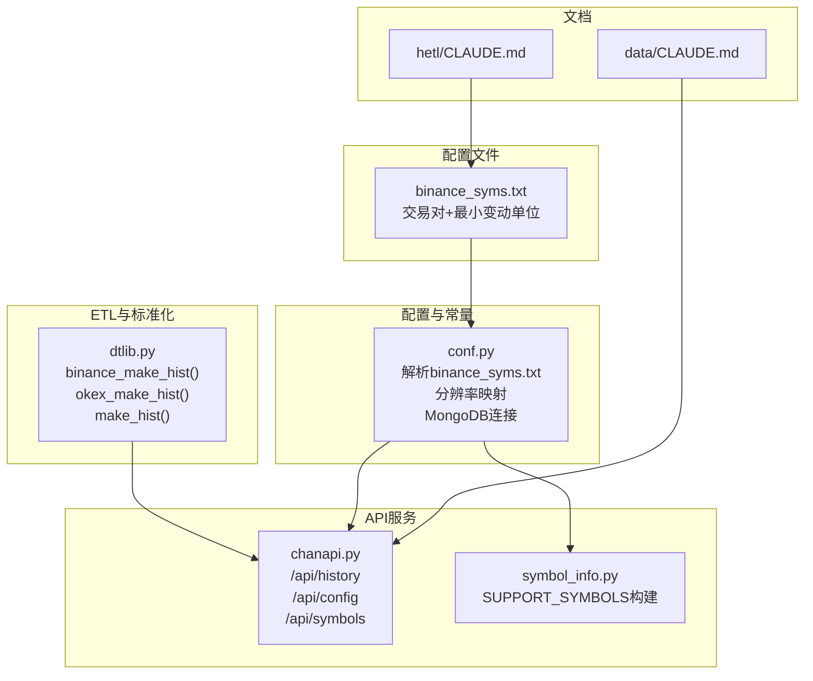
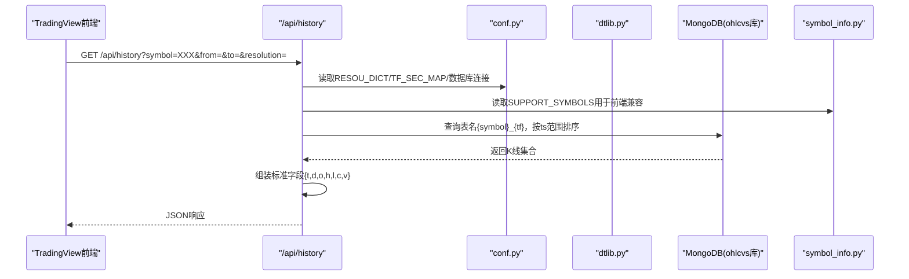
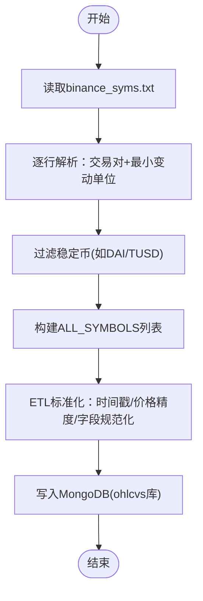
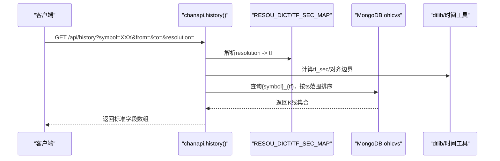
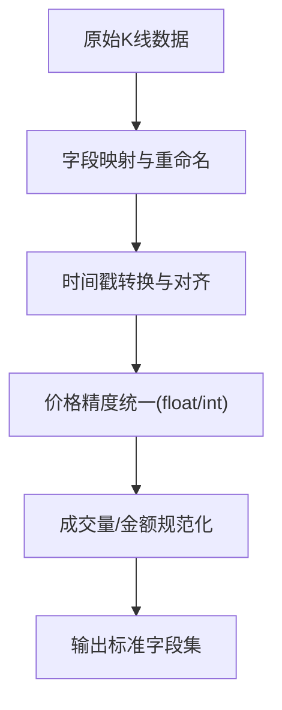
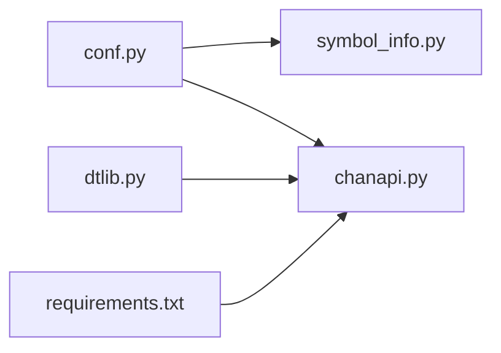

# 加密货币数据源集成

<cite>
**本文引用的文件**
- [binance_syms.txt](file://hetl/selcoin/binance_syms.txt)
- [conf.py](file://comm/conf.py)
- [dtlib.py](file://utils/dtlib.py)
- [chanapi.py](file://api/chanapi.py)
- [symbol_info.py](file://api/symbol_info.py)
- [CLAUDE.md（ETL模块）](file://hetl/CLAUDE.md)
- [CLAUDE.md（数据存储模块）](file://data/CLAUDE.md)
- [requirements.txt（API依赖）](file://api/requirements.txt)
</cite>

## 目录
1. [简介](#简介)
2. [项目结构](#项目结构)
3. [核心组件](#核心组件)
4. [架构总览](#架构总览)
5. [详细组件分析](#详细组件分析)
6. [依赖分析](#依赖分析)
7. [性能考量](#性能考量)
8. [故障排查指南](#故障排查指南)
9. [结论](#结论)
10. [附录](#附录)

## 简介
本文件面向希望接入加密货币数据源（以Binance为例）的用户，围绕“binance_syms.txt”这一配置文件，系统说明如何定义交易对列表、如何将其与ETL流程联动、如何实现数据获取脚本与配置文件的对接，以及如何完成K线数据的标准化（时间戳对齐、价格精度统一、字段命名规范化）。同时，文档阐明了与现有API接口（如/api/history）的兼容方式，特别是时间分辨率（1m/5m等）与TradingView前端的映射关系，并提供扩展指南，帮助你添加新的交易所支持（如OKX、Coinbase）或自定义交易对组合。

## 项目结构
该项目采用模块化组织，加密货币数据源集成主要涉及以下模块：
- 配置与常量：comm/conf.py
- 数据ETL与标准化：utils/dtlib.py
- API服务与前端交互：api/chanapi.py、api/symbol_info.py
- 配置文件：hetl/selcoin/binance_syms.txt
- 文档与说明：hetl/CLAUDE.md、data/CLAUDE.md

图表来源
- [conf.py](file://comm/conf.py#L88-L110)
- [dtlib.py](file://utils/dtlib.py#L109-L133)
- [chanapi.py](file://api/chanapi.py#L96-L235)
- [symbol_info.py](file://api/symbol_info.py#L1-L40)
- [binance_syms.txt](file://hetl/selcoin/binance_syms.txt#L1-L118)
- [CLAUDE.md（ETL模块）](file://hetl/CLAUDE.md#L62-L76)
- [CLAUDE.md（数据存储模块）](file://data/CLAUDE.md#L1-L32)

章节来源
- [conf.py](file://comm/conf.py#L88-L110)
- [dtlib.py](file://utils/dtlib.py#L109-L133)
- [chanapi.py](file://api/chanapi.py#L96-L235)
- [symbol_info.py](file://api/symbol_info.py#L1-L40)
- [binance_syms.txt](file://hetl/selcoin/binance_syms.txt#L1-L118)
- [CLAUDE.md（ETL模块）](file://hetl/CLAUDE.md#L62-L76)
- [CLAUDE.md（数据存储模块）](file://data/CLAUDE.md#L1-L32)

## 核心组件
- 交易对配置文件：hetl/selcoin/binance_syms.txt
  - 每行包含“交易对名称 最小变动单位”，用于驱动数据采集与前端展示。
- 配置与常量：comm/conf.py
  - 解析binance_syms.txt，构建ALL_SYMBOLS列表；提供分辨率映射RESOU_DICT、秒级映射TF_SEC_MAP、MongoDB连接等。
- 数据标准化：utils/dtlib.py
  - 提供binance_make_hist()、okex_make_hist()、make_hist()等函数，完成时间戳、价格精度、字段规范化等。
- API服务：api/chanapi.py
  - 对外提供/api/history、/api/config、/api/symbols等接口，按分辨率返回K线数据。
- 符号信息：api/symbol_info.py
  - 基于ALL_SYMBOLS构建SUPPORT_SYMBOLS，供前端搜索与展示。

章节来源
- [binance_syms.txt](file://hetl/selcoin/binance_syms.txt#L1-L118)
- [conf.py](file://comm/conf.py#L88-L110)
- [dtlib.py](file://utils/dtlib.py#L109-L133)
- [chanapi.py](file://api/chanapi.py#L96-L235)
- [symbol_info.py](file://api/symbol_info.py#L1-L40)

## 架构总览
下图展示了从配置文件到API返回的关键链路，以及与MongoDB的交互。

图表来源
- [chanapi.py](file://api/chanapi.py#L96-L235)
- [conf.py](file://comm/conf.py#L12-L20)
- [conf.py](file://comm/conf.py#L23-L31)
- [symbol_info.py](file://api/symbol_info.py#L1-L40)

## 详细组件分析

### 交易对配置文件与ETL联动
- 配置文件格式
  - 每行“交易对名称 最小变动单位”，例如“BTC 0.01000000”。最小变动单位用于前端价格刻度（pricescale）计算。
- 解析与过滤
  - conf.py会读取binance_syms.txt，构建ALL_SYMBOLS列表，并过滤掉DAI、TUSD等稳定币。
- ETL标准化
  - 若使用Binance数据，可参考dtlib.binace_make_hist()的实现思路，将原始K线转换为标准字段集（id、datetime、open、high、low、close、volume、amount），并对时间戳、价格精度进行统一处理。

图表来源
- [conf.py](file://comm/conf.py#L92-L109)
- [dtlib.py](file://utils/dtlib.py#L109-L133)
- [binance_syms.txt](file://hetl/selcoin/binance_syms.txt#L1-L118)

章节来源
- [binance_syms.txt](file://hetl/selcoin/binance_syms.txt#L1-L118)
- [conf.py](file://comm/conf.py#L92-L109)
- [dtlib.py](file://utils/dtlib.py#L109-L133)

### API接口与时间分辨率映射
- 接口定义
  - /api/history：根据symbol、from、to、resolution返回K线数据。
  - /api/config：返回支持的分辨率列表（1、5、30、240、1D、1W、1M）。
  - /api/symbols：返回符号信息，供前端搜索。
- 分辨率映射
  - 前端传入的resolution字符串（如"1"、"5"、"30"、"240"、"1D"、"1W"、"1M"）由RESOU_DICT映射为内部周期标识（如"1m"、"5m"、"1h"、"4h"、"1d"、"1w"）。
- 时间范围与偏移
  - API会根据TF_SEC_MAP将resolution转换为秒级粒度，结合from/to裁剪MongoDB查询范围；若处于回放阶段，还会考虑partial K线的边界处理。

图表来源
- [chanapi.py](file://api/chanapi.py#L96-L235)
- [conf.py](file://comm/conf.py#L12-L20)
- [conf.py](file://comm/conf.py#L23-L31)

章节来源
- [chanapi.py](file://api/chanapi.py#L96-L235)
- [conf.py](file://comm/conf.py#L12-L20)
- [conf.py](file://comm/conf.py#L23-L31)

### 数据标准化（时间戳对齐、价格精度统一、字段命名规范化）
- 时间戳对齐
  - dtlib提供int2time、gmt2local等工具，确保K线时间统一为本地时间字符串；binance_make_hist()会将openTime转换为id并映射datetime。
- 价格精度统一
  - 标准化过程中将open、high、low、close、volume、amount等字段转换为浮点或整型，保证前后端一致。
- 字段命名规范化
  - 标准字段集包含id、datetime、open、high、low、close、volume、amount，便于跨数据源统一处理。
- 多交易所适配
  - dtlib提供了okex_make_hist()与make_hist()，分别针对不同交易所的K线字段顺序与含义进行适配，便于扩展至OKX、Coinbase等。

图表来源
- [dtlib.py](file://utils/dtlib.py#L66-L106)
- [dtlib.py](file://utils/dtlib.py#L109-L133)

章节来源
- [dtlib.py](file://utils/dtlib.py#L66-L106)
- [dtlib.py](file://utils/dtlib.py#L109-L133)

### 与TradingView前端的映射关系
- 分辨率映射
  - 前端resolution字符串与后端tf的映射由RESOU_DICT决定，确保1m/5m/30m/4h/1d/1w等周期与MongoDB集合名一致。
- 符号信息
  - symbol_info.py基于ALL_SYMBOLS构建SUPPORT_SYMBOLS，包含pricescale（由最小变动单位推导）、intraday_multipliers等字段，满足TradingView前端的搜索与显示需求。
- 响应格式
  - /api/history返回标准字段数组（t、d、o、h、l、c、v），与TradingView期望一致。

章节来源
- [conf.py](file://comm/conf.py#L12-L20)
- [symbol_info.py](file://api/symbol_info.py#L1-L40)
- [chanapi.py](file://api/chanapi.py#L96-L235)

### 扩展指南：新增交易所与自定义交易对组合
- 新增交易所支持
  - 在ETL层新增对应make_hist函数（如okex_make_hist、coinbase_make_hist），遵循标准字段集规范。
  - 在conf.py中维护新交易所的K线字段映射常量（如OK_KDATA_COLUMNS、E_KDATA_COLUMNS等）。
  - 在数据获取脚本中增加API请求构造与分页拉取逻辑，完成后调用标准化函数写入MongoDB。
- 自定义交易对组合
  - 在binance_syms.txt中新增一行“交易对名称 最小变动单位”，注意过滤稳定币（DAI/TUSD）。
  - 若需调试，可使用binance_syms.debug（由conf.py在DEBUG模式下读取）。
  - 重启API服务后，/api/symbols与前端搜索将自动包含新交易对。

章节来源
- [dtlib.py](file://utils/dtlib.py#L109-L133)
- [conf.py](file://comm/conf.py#L44-L65)
- [conf.py](file://comm/conf.py#L92-L109)
- [CLAUDE.md（ETL模块）](file://hetl/CLAUDE.md#L62-L76)

## 依赖分析
- 组件耦合
  - conf.py是ETL与API的共同依赖，负责解析配置、映射分辨率、连接数据库。
  - dtlib.py为ETL标准化的核心工具，被数据获取脚本与API查询结果组装环节间接使用。
  - symbol_info.py依赖ALL_SYMBOLS，向API提供前端所需符号信息。
- 外部依赖
  - API服务依赖Flask、PyMongo、Arrow、Pandas等；MongoDB存储ohlcvs库与config库。
- 潜在循环依赖
  - 当前模块间为单向依赖（conf->symbol_info、conf->chanapi、dtlib独立），未发现循环依赖。

图表来源
- [conf.py](file://comm/conf.py#L143-L147)
- [symbol_info.py](file://api/symbol_info.py#L1-L40)
- [chanapi.py](file://api/chanapi.py#L1-L20)
- [requirements.txt](file://api/requirements.txt#L1-L9)

章节来源
- [conf.py](file://comm/conf.py#L143-L147)
- [requirements.txt](file://api/requirements.txt#L1-L9)

## 性能考量
- 索引优化
  - 在MongoDB的{symbol}_{tf}集合上为ts字段建立升序索引，可显著提升/api/history的查询性能。
- 分页与分片
  - 对于长周期回放，建议按tf_sec分片查询，避免一次性返回过多数据。
- 缓存策略
  - 对高频访问的symbol/resolution组合，可在API层引入Redis缓存，降低数据库压力。
- 数据量控制
  - 合理设置DATE_START_TS，避免历史数据无限增长导致查询变慢。

[本节为通用建议，不直接分析具体文件]

## 故障排查指南
- /api/history返回空数据
  - 检查symbol是否存在于ALL_SYMBOLS；确认MongoDB中是否存在{symbol}_{tf}集合；核对from/to与tf_sec的换算是否正确。
- 分辨率映射异常
  - 确认前端传入的resolution字符串与RESOU_DICT一致；检查TF_SEC_MAP是否覆盖目标周期。
- 价格刻度不匹配
  - 检查symbol_info.py中pricescale的计算逻辑（基于最小变动单位）；确保binance_syms.txt中的minmov正确。
- MongoDB连接失败
  - 确认MongoDB服务运行正常；检查conf.py中的连接参数与数据库名（ohlcvs、config、nlchan、stock）。

章节来源
- [chanapi.py](file://api/chanapi.py#L96-L235)
- [conf.py](file://comm/conf.py#L12-L20)
- [conf.py](file://comm/conf.py#L23-L31)
- [symbol_info.py](file://api/symbol_info.py#L1-L40)

## 结论
通过binance_syms.txt定义交易对列表，配合conf.py的解析与映射、dtlib.py的标准化函数，以及chanapi.py的API接口，可以高效地将加密货币数据接入系统。该方案实现了时间戳对齐、价格精度统一与字段规范化，确保与TradingView前端的分辨率映射与响应格式兼容。同时，文档提供了扩展指南，便于后续接入更多交易所与自定义交易对组合。

[本节为总结，不直接分析具体文件]

## 附录
- 快速对照表
  - 分辨率映射：1→1m、5→5m、30→30m、240→4h、1D→1d、1W→1w、1M→1m（按TF_SEC_MAP换算）
  - 标准字段集：id、datetime、open、high、low、close、volume、amount
  - 配置文件位置：hetl/selcoin/binance_syms.txt
  - API依赖：参见api/requirements.txt

[本节为补充信息，不直接分析具体文件]