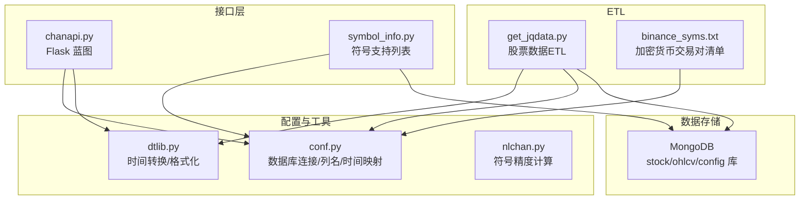
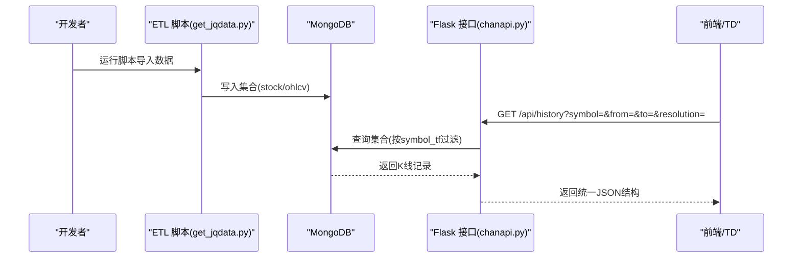
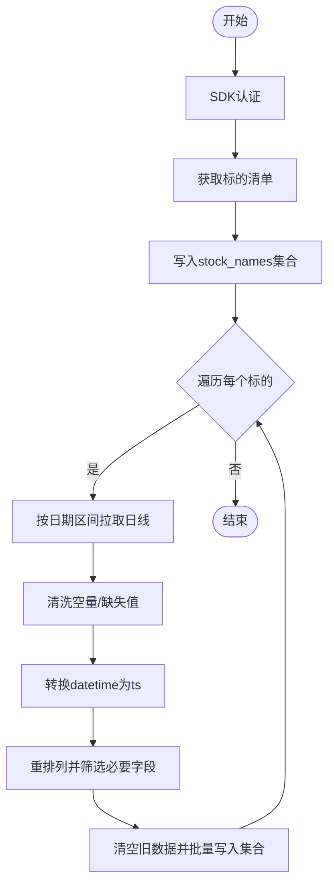
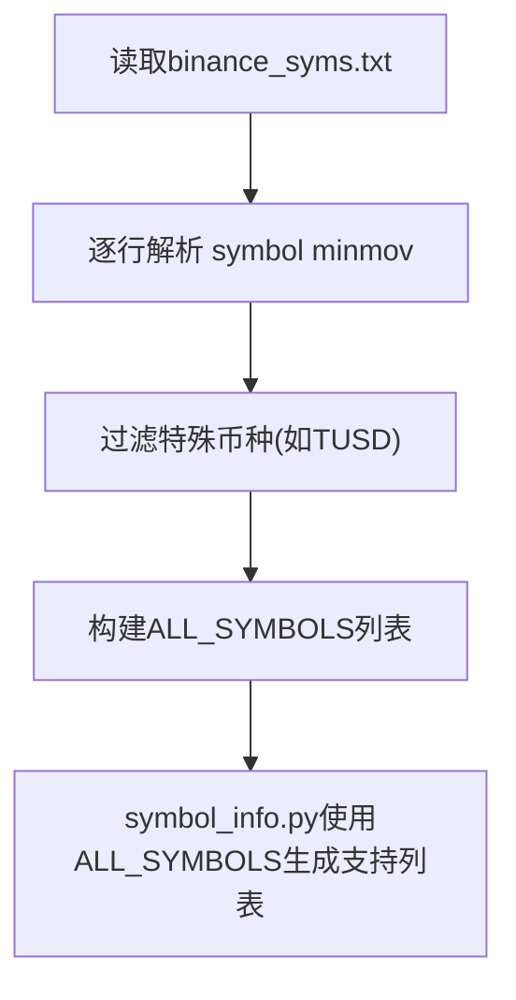
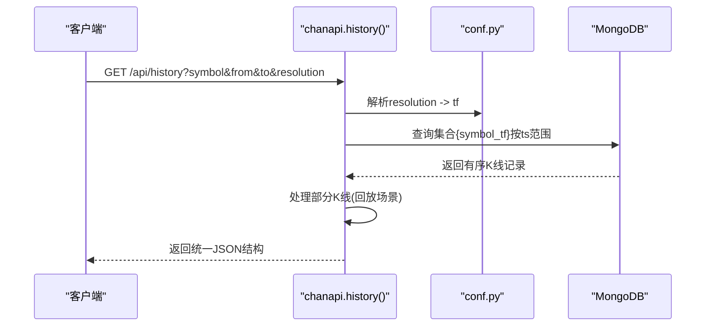
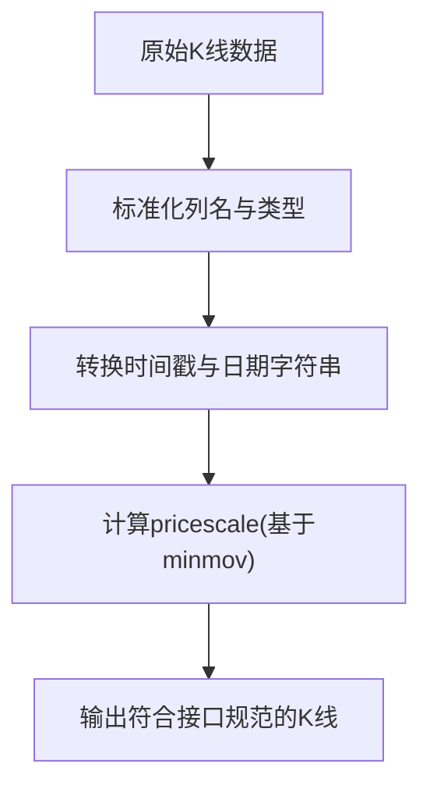
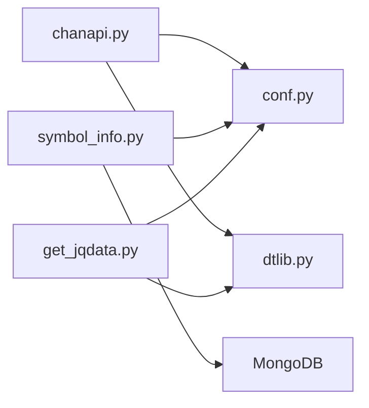

# 数据源集成

<cite>
**本文引用的文件**
- [get_jqdata.py](file://hetl/stock/get_jqdata.py)
- [binance_syms.txt](file://hetl/selcoin/binance_syms.txt)
- [chanapi.py](file://api/chanapi.py)
- [conf.py](file://comm/conf.py)
- [dtlib.py](file://utils/dtlib.py)
- [symbol_info.py](file://api/symbol_info.py)
- [nlchan.py](file://utils/nlchan.py)
- [stock_names.metadata.json](file://data/stock/stock_names.metadata.json)
- [replay_config.metadata.json](file://data/config/replay_config.metadata.json)
</cite>

## 目录
1. [简介](#简介)
2. [项目结构](#项目结构)
3. [核心组件](#核心组件)
4. [架构总览](#架构总览)
5. [详细组件分析](#详细组件分析)
6. [依赖关系分析](#依赖关系分析)
7. [性能考量](#性能考量)
8. [故障排查指南](#故障排查指南)
9. [结论](#结论)
10. [附录](#附录)

## 简介
本文件面向希望接入新金融数据源的开发者，以 get_jqdata.py 为例，系统讲解股票数据 ETL 流程的设计模式：数据获取、清洗、转换与存储。同时给出加密货币数据接入方式，说明如何基于 binance_syms.txt 的格式添加新交易对，并提供数据格式转换示例，确保新数据源的 K 线数据符合 /api/history 接口的输出规范（时间戳、价格精度、字段命名等）。

## 项目结构
该项目采用按功能域分层组织：
- api：对外服务与接口，负责查询历史数据、符号信息等
- comm：通用配置与数据库连接
- utils：时间与数据格式工具函数
- data：本地数据目录（包含历史数据与元数据）
- hetl：数据抽取、转换、加载脚本（含股票与加密货币）

图表来源
- [chanapi.py](file://api/chanapi.py#L1-L120)
- [conf.py](file://comm/conf.py#L1-L166)
- [dtlib.py](file://utils/dtlib.py#L1-L86)
- [symbol_info.py](file://api/symbol_info.py#L1-L74)
- [get_jqdata.py](file://hetl/stock/get_jqdata.py#L1-L100)
- [binance_syms.txt](file://hetl/selcoin/binance_syms.txt#L1-L118)

章节来源
- [chanapi.py](file://api/chanapi.py#L1-L120)
- [conf.py](file://comm/conf.py#L1-L166)

## 核心组件
- 接口层（/api/history 等）：从 MongoDB 读取指定周期的历史 K 线，返回统一格式
- 配置层：定义时间分辨率映射、列名规范、MongoDB 连接与默认起始时间
- 工具层：时间戳与字符串互转、格式化、精度计算
- ETL 层：股票数据从第三方 SDK 获取并入库；加密货币交易对清单来自文本文件
- 存储层：MongoDB，分别有 stock、ohlcv、config 三个库

章节来源
- [chanapi.py](file://api/chanapi.py#L96-L235)
- [conf.py](file://comm/conf.py#L1-L166)
- [dtlib.py](file://utils/dtlib.py#L1-L86)
- [get_jqdata.py](file://hetl/stock/get_jqdata.py#L1-L100)
- [binance_syms.txt](file://hetl/selcoin/binance_syms.txt#L1-L118)

## 架构总览
下图展示从数据源到接口返回的关键路径：ETL 脚本将数据写入 MongoDB 对应集合，接口层根据请求参数选择集合并查询，最终返回统一的 JSON 结构给前端。

图表来源
- [get_jqdata.py](file://hetl/stock/get_jqdata.py#L33-L58)
- [chanapi.py](file://api/chanapi.py#L96-L235)
- [conf.py](file://comm/conf.py#L1-L166)

## 详细组件分析

### 股票数据ETL流程（get_jqdata.py）
- 认证与初始化：通过第三方 SDK 完成认证；可替换为自有密钥管理
- 获取全量标的：读取股票/指数/基金清单，写入 stock_names 集合
- 获取日线历史：按标的循环拉取日线，清洗空量/缺失值，转换时间戳，写入对应集合
- 集合命名规范：stock 库名下，集合名为“stk_{symbol}_{tf}”，tf 为 1d
- 时间字段：保留 datetime 字符串与 ts 整数时间戳，便于查询与排序

图表来源
- [get_jqdata.py](file://hetl/stock/get_jqdata.py#L18-L58)

章节来源
- [get_jqdata.py](file://hetl/stock/get_jqdata.py#L18-L58)

### 加密货币交易对接入（binance_syms.txt）
- 文件格式：每行一个交易对，空格分隔“币种+最小跳动”，如 BTC 0.01
- 加载逻辑：读取文件构建 ALL_SYMBOLS 列表，供符号信息与接口使用
- 新增步骤：在 binance_syms.txt 中新增一行，保存后即生效

图表来源
- [conf.py](file://comm/conf.py#L88-L109)
- [symbol_info.py](file://api/symbol_info.py#L1-L40)
- [binance_syms.txt](file://hetl/selcoin/binance_syms.txt#L1-L118)

章节来源
- [conf.py](file://comm/conf.py#L88-L109)
- [symbol_info.py](file://api/symbol_info.py#L1-L40)
- [binance_syms.txt](file://hetl/selcoin/binance_syms.txt#L1-L118)

### 接口与数据格式规范（/api/history）
- 请求参数：symbol、from、to、resolution
- 分辨率映射：1/5/15/30/60/240/D/W/M 映射到内部周期
- 存储集合：symbol_tf 组合，如 btc_1d 或 stk_000001.XSHG_1d
- 返回结构：包含状态码、时间数组、日期数组、开盘/最高/最低/收盘、成交量等字段

图表来源
- [chanapi.py](file://api/chanapi.py#L96-L235)
- [conf.py](file://comm/conf.py#L10-L31)

章节来源
- [chanapi.py](file://api/chanapi.py#L96-L235)
- [conf.py](file://comm/conf.py#L10-L31)

### 数据格式转换与精度控制（dtlib.py）
- 时间转换：提供 time2int、int2time、gmt2local 等工具
- K线标准化：提供多种 make_hist 变体，统一列名与类型（open/high/low/close/volume/amount），确保与接口返回字段一致
- 精度计算：通过 nlchan.sym_float 将最小跳动转换为 pricescale，保障前端显示精度

图表来源
- [dtlib.py](file://utils/dtlib.py#L65-L107)
- [nlchan.py](file://utils/nlchan.py#L6-L25)
- [symbol_info.py](file://api/symbol_info.py#L1-L40)

章节来源
- [dtlib.py](file://utils/dtlib.py#L65-L107)
- [nlchan.py](file://utils/nlchan.py#L6-L25)
- [symbol_info.py](file://api/symbol_info.py#L1-L40)

## 依赖关系分析
- 接口层依赖配置层（分辨率映射、数据库连接）、工具层（时间转换）
- ETL 层依赖工具层（时间转换）、配置层（数据库连接、集合命名）
- 符号信息依赖配置层（ALL_SYMBOLS）与数据库（stock_names）

图表来源
- [chanapi.py](file://api/chanapi.py#L1-L120)
- [conf.py](file://comm/conf.py#L1-L166)
- [dtlib.py](file://utils/dtlib.py#L1-L86)
- [symbol_info.py](file://api/symbol_info.py#L1-L74)
- [get_jqdata.py](file://hetl/stock/get_jqdata.py#L1-L100)

章节来源
- [chanapi.py](file://api/chanapi.py#L1-L120)
- [conf.py](file://comm/conf.py#L1-L166)
- [dtlib.py](file://utils/dtlib.py#L1-L86)
- [symbol_info.py](file://api/symbol_info.py#L1-L74)
- [get_jqdata.py](file://hetl/stock/get_jqdata.py#L1-L100)

## 性能考量
- 批量写入：ETL 中使用批量插入减少网络往返
- 索引建议：按 ts 升序建立索引，提升范围查询效率
- 分页与缓存：接口侧已按时间范围查询，避免一次性返回过多数据
- 并发与限速：ETL 中对第三方 API 添加了延时，避免触发限流

章节来源
- [get_jqdata.py](file://hetl/stock/get_jqdata.py#L82-L86)
- [chanapi.py](file://api/chanapi.py#L171-L179)

## 故障排查指南
- 认证失败：确认 SDK 认证流程与密钥配置是否正确
- 集合不存在：检查 symbol_tf 是否与写入逻辑一致，确认数据库连接
- 时间范围异常：核对 from/to 与 resolution 的映射，确认接口侧时间转换逻辑
- 无数据返回：确认集合中是否存在数据，或检查时间范围是否超出可用区间
- 交易对未生效：确认 binance_syms.txt 中新增行已保存且未被过滤

章节来源
- [get_jqdata.py](file://hetl/stock/get_jqdata.py#L18-L58)
- [chanapi.py](file://api/chanapi.py#L96-L235)
- [conf.py](file://comm/conf.py#L88-L109)
- [stock_names.metadata.json](file://data/stock/stock_names.metadata.json#L1-L1)
- [replay_config.metadata.json](file://data/config/replay_config.metadata.json#L1-L1)

## 结论
通过统一的 ETL 模式与接口规范，系统实现了从多数据源到统一存储与查询的闭环。接入新数据源时，重点在于：
- 明确认证与密钥配置
- 规范化数据清洗与转换流程
- 严格遵循集合命名与字段规范
- 保证 /api/history 输出格式一致性

## 附录

### 新增股票数据源步骤
- 在 ETL 脚本中替换或扩展数据源 SDK 认证与拉取逻辑
- 保持清洗与转换流程一致（时间戳、字段筛选、空值处理）
- 写入集合命名规则：stock 库名下，集合名为“stk_{symbol}_{tf}”
- 确保接口层能识别新 symbol（若为股票，需在 stock_names 集合中存在）

章节来源
- [get_jqdata.py](file://hetl/stock/get_jqdata.py#L18-L58)
- [conf.py](file://comm/conf.py#L143-L147)

### 新增加密货币交易对步骤
- 在 binance_syms.txt 中新增一行，格式为“币种 最小跳动”
- 启动时自动加载 ALL_SYMBOLS，无需重启接口
- 如需过滤特殊币种，可在加载逻辑中增加条件

章节来源
- [binance_syms.txt](file://hetl/selcoin/binance_syms.txt#L1-L118)
- [conf.py](file://comm/conf.py#L88-L109)

### 数据格式转换示例（K线字段与精度）
- 字段命名：统一为 ts、datetime、open、high、low、close、volume
- 时间精度：ts 为整数秒，datetime 为字符串“YYYY-MM-DD HH:MM:SS”
- 价格精度：通过 pricescale 与最小跳动 minmov 计算，确保前端显示一致
- 体积字段：volume 为交易量，amount 为计价币种成交量

章节来源
- [dtlib.py](file://utils/dtlib.py#L65-L107)
- [symbol_info.py](file://api/symbol_info.py#L1-L40)
- [nlchan.py](file://utils/nlchan.py#L6-L25)