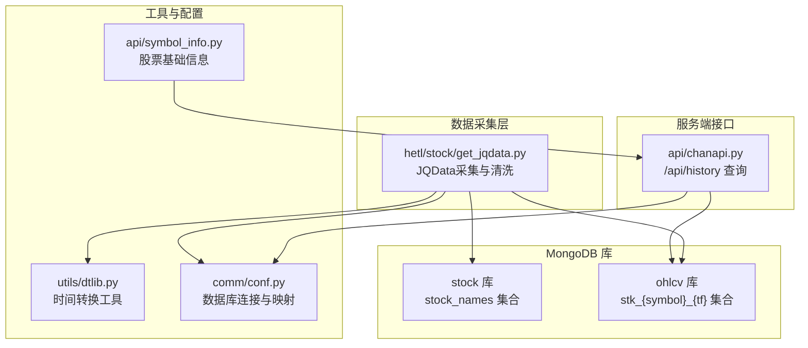
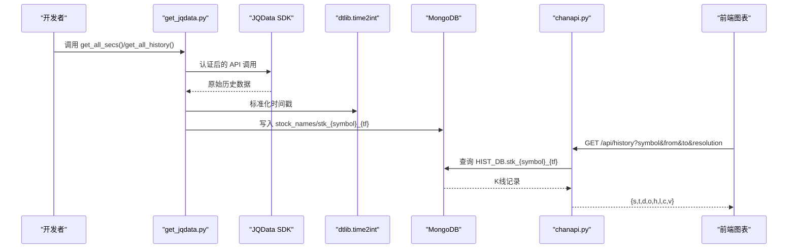
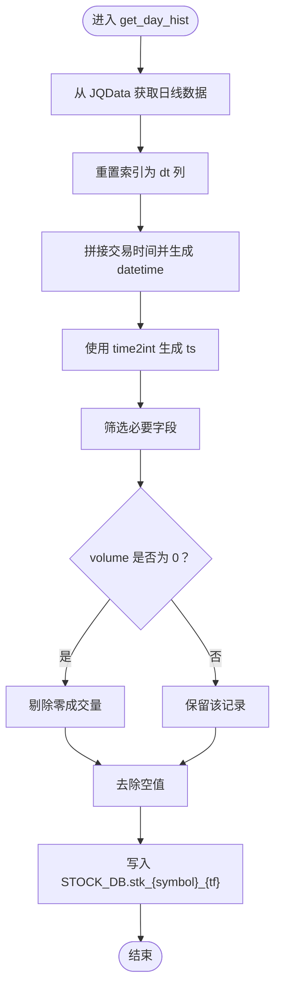
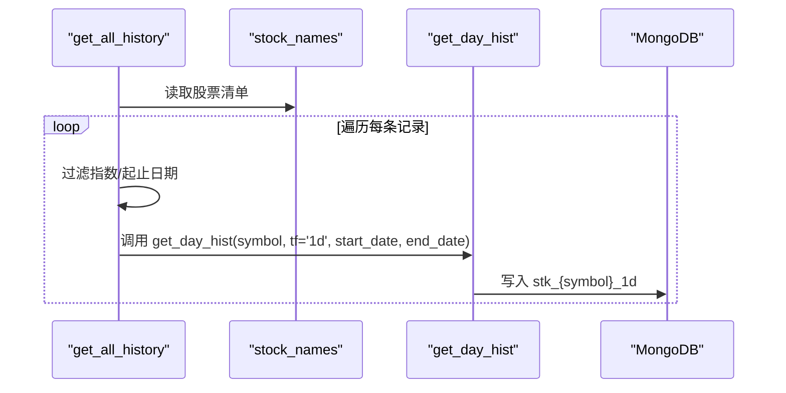
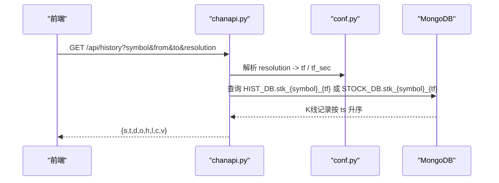
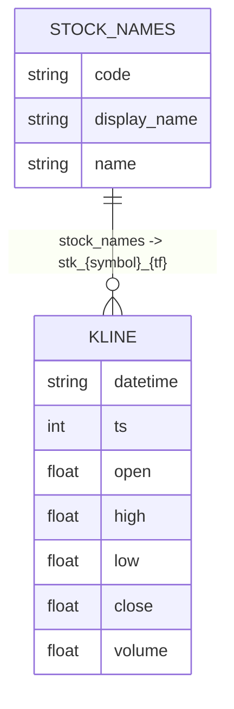
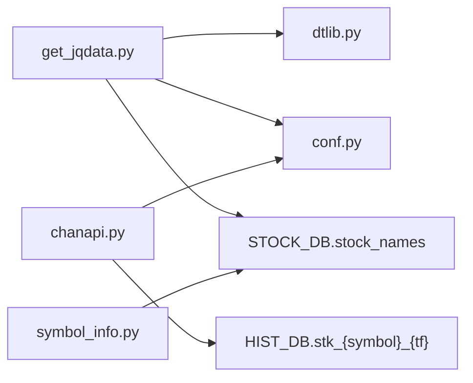

# 股票数据源集成

<cite>
**本文引用的文件**
- [get_jqdata.py](file://hetl/stock/get_jqdata.py)
- [chanapi.py](file://api/chanapi.py)
- [conf.py](file://comm/conf.py)
- [dtlib.py](file://utils/dtlib.py)
- [symbol_info.py](file://api/symbol_info.py)
- [CLAUDE.md（hetl）](file://hetl/CLAUDE.md)
- [stock_names.metadata.json](file://data/stock/stock_names.metadata.json)
- [stk_000001.XSHG_1d.metadata.json](file://data/stock/stk_000001.XSHG_1d.metadata.json)
</cite>

## 目录
1. [简介](#简介)
2. [项目结构](#项目结构)
3. [核心组件](#核心组件)
4. [架构总览](#架构总览)
5. [详细组件分析](#详细组件分析)
6. [依赖关系分析](#依赖关系分析)
7. [性能考量](#性能考量)
8. [故障排查指南](#故障排查指南)
9. [结论](#结论)
10. [附录](#附录)

## 简介
本文件围绕 get_jqdata.py 的实现，系统化说明如何接入 JQData 股票数据源，完成全市场元数据同步、历史 K 线清洗与导入、以及通过 /api/history 接口对外提供统一数据访问。文档重点覆盖：
- 认证配置（jqauth 模块）
- 元数据同步（get_all_secs）
- 历史 K 线获取与清洗（get_day_hist）
- 批量导入流程（get_all_history）
- 数据清洗逻辑（时间戳标准化、空值处理、零成交量过滤）
- MongoDB 集合命名与字段映射（stk_{symbol}_{tf}）
- 字段映射对照表与 /api/history 输出规范
- 扩展支持新证券类型（如期权、债券）
- 调整时间范围与频率参数以适配不同分析需求

## 项目结构
下图展示与股票数据源集成相关的模块与文件关系，突出数据采集、清洗、入库与服务端查询的关键路径。

图表来源
- [get_jqdata.py](file://hetl/stock/get_jqdata.py#L1-L100)
- [dtlib.py](file://utils/dtlib.py#L1-L207)
- [conf.py](file://comm/conf.py#L1-L166)
- [symbol_info.py](file://api/symbol_info.py#L1-L74)
- [chanapi.py](file://api/chanapi.py#L96-L235)

章节来源
- [get_jqdata.py](file://hetl/stock/get_jqdata.py#L1-L100)
- [conf.py](file://comm/conf.py#L139-L166)
- [dtlib.py](file://utils/dtlib.py#L22-L63)
- [symbol_info.py](file://api/symbol_info.py#L1-L74)
- [chanapi.py](file://api/chanapi.py#L96-L235)

## 核心组件
- JQData 采集与清洗（get_jqdata.py）
  - 认证：通过 jqauth.auth 包装 jqdatasdk 实例
  - 元数据：获取股票/指数/基金全量清单并写入 stock_names
  - 历史数据：按 symbol 获取日线，清洗后写入 stk_{symbol}_{tf}
  - 批量导入：遍历 stock_names，按起止日期抓取并入库
- 时间转换工具（dtlib.py）
  - time2int：将“年-月-日 时:分:秒”字符串转换为 Unix 时间戳
- 配置与数据库连接（conf.py）
  - STOCK_DB/HIST_DB/MONGO 连接、分辨率映射、时间周期秒数映射
- 服务端查询接口（chanapi.py）
  - /api/history：按 symbol/resolution/from/to 返回标准字段序列
- 股票基础信息（symbol_info.py）
  - 从 stock_names 读取股票清单，构造前端可用的 SUPPORT_SYMBOLS

章节来源
- [get_jqdata.py](file://hetl/stock/get_jqdata.py#L1-L100)
- [dtlib.py](file://utils/dtlib.py#L22-L63)
- [conf.py](file://comm/conf.py#L139-L166)
- [chanapi.py](file://api/chanapi.py#L96-L235)
- [symbol_info.py](file://api/symbol_info.py#L47-L70)

## 架构总览
下图展示从 JQData 抓取到服务端查询的整体流程，包括认证、数据清洗、入库与查询路径。

图表来源
- [get_jqdata.py](file://hetl/stock/get_jqdata.py#L18-L100)
- [dtlib.py](file://utils/dtlib.py#L22-L37)
- [chanapi.py](file://api/chanapi.py#L96-L235)
- [conf.py](file://comm/conf.py#L139-L166)

## 详细组件分析

### 组件A：JQData 认证与采集（jqauth 模块）
- 认证入口
  - 在 get_jqdata.py 中通过 import jqauth 并以 api = jqauth.auth(api) 的方式包装 JQData SDK 实例，从而在后续调用中自动完成认证。
- jqauth 实现要求
  - 需自行实现 jqauth.py，并提供 auth() 函数，用于对 jqdatasdk.api 进行认证封装。
- 建议
  - 将认证信息置于安全位置（如环境变量或配置文件），避免硬编码。

章节来源
- [get_jqdata.py](file://hetl/stock/get_jqdata.py#L9-L16)
- [CLAUDE.md（hetl）](file://hetl/CLAUDE.md#L40-L43)
- [CLAUDE.md（hetl）](file://hetl/CLAUDE.md#L136-L138)

### 组件B：全市场元数据同步（get_all_secs）
- 功能概述
  - 从 JQData 获取股票、指数、基金三类全量清单，重置索引为 code 字段，清空并写入 STOCK_DB.stock_names。
- 数据流向
  - JQData -> DataFrame -> 删除旧数据 -> 插入新数据
- 注意事项
  - 若需扩展类型（如期权、债券），可在 types 参数中增加相应类别。

章节来源
- [get_jqdata.py](file://hetl/stock/get_jqdata.py#L18-L32)

### 组件C：历史 K 线获取与清洗（get_day_hist）
- 输入参数
  - symbol：股票代码
  - tf：时间周期（默认 1d）
  - start_date/end_date：时间范围
- 清洗步骤
  - 标准化日期时间：将 dt 列重置为普通列，拼接固定交易时间（例如 08:00:00），形成 datetime 字段
  - 时间戳标准化：使用 time2int 将 datetime 转换为 Unix 时间戳 ts
  - 字段筛选：仅保留 datetime、ts、open、high、low、close、volume
  - 过滤零成交量：剔除 volume==0 的记录
  - 空值处理：dropna 去除缺失值
  - 入库：删除旧数据并批量插入到 STOCK_DB.stk_{symbol}_{tf}
- 重要提示
  - 集合命名采用“stk_{symbol}_{tf}”，其中 tf 与 /api/history 的 resolution 对应映射由 conf.py 的 RESOU_DICT/TF_SEC_MAP 控制。

图表来源
- [get_jqdata.py](file://hetl/stock/get_jqdata.py#L33-L58)
- [dtlib.py](file://utils/dtlib.py#L22-L37)

章节来源
- [get_jqdata.py](file://hetl/stock/get_jqdata.py#L33-L58)
- [dtlib.py](file://utils/dtlib.py#L22-L37)

### 组件D：批量导入流程（get_all_history）
- 数据来源
  - 从本地 CSV 或 STOCK_DB.stock_names 读取股票清单（示例中使用 CSV）
- 过滤与截断
  - 指数仅保留上证指数（000001.XSHG），其他指数跳过
  - 对起止日期进行边界处理：起始日期不早于 2005-01-01，若早于 2021-01-01 则跳过（数据量不足）
  - 结束日期固定为 2022-04-30
- 导入策略
  - 逐条调用 get_day_hist，按 tf='1d' 抓取并入库
  - 每次导入后 sleep 1 秒，避免请求过于频繁

图表来源
- [get_jqdata.py](file://hetl/stock/get_jqdata.py#L59-L91)

章节来源
- [get_jqdata.py](file://hetl/stock/get_jqdata.py#L59-L91)

### 组件E：服务端查询接口（/api/history）
- 请求参数
  - symbol：标的代码（股票代码）
  - from/to：Unix 时间戳
  - resolution：解析周期（如 D/1D/W/M）
- 处理逻辑
  - 解析 resolution -> tf（如 D/1D -> 1d）
  - 选择数据库：股票使用 STOCK_DB，其他使用 HIST_DB
  - 选择集合：{symbol}_{tf}（股票 symbol 会前置“stk_”）
  - 查询条件：按 ts 范围升序查询
  - 返回结构：包含状态码 s、时间数组 t、日期数组 d、开盘 o、最高 h、最低 l、收盘 c、成交量 v
- 时间范围控制
  - 通过 conf.py 的 TF_SEC_MAP/RESOU_DICT 将 resolution 映射为秒级周期，结合 from/to 生成最终查询区间

图表来源
- [chanapi.py](file://api/chanapi.py#L96-L235)
- [conf.py](file://comm/conf.py#L12-L31)

章节来源
- [chanapi.py](file://api/chanapi.py#L96-L235)
- [conf.py](file://comm/conf.py#L12-L31)

### 组件F：MongoDB 集合命名与字段映射
- 集合命名
  - 元数据：STOCK_DB.stock_names
  - K线数据：STOCK_DB.stk_{symbol}_{tf}（tf 来源于 resolution 的映射）
- 字段映射
  - 清洗后字段：datetime、ts、open、high、low、close、volume
  - 服务端返回字段：t、d、o、h、l、c、v（分别对应 ts、datetime、open、high、low、close、volume）

图表来源
- [get_jqdata.py](file://hetl/stock/get_jqdata.py#L28-L31)
- [get_jqdata.py](file://hetl/stock/get_jqdata.py#L52-L57)
- [chanapi.py](file://api/chanapi.py#L223-L234)

章节来源
- [get_jqdata.py](file://hetl/stock/get_jqdata.py#L28-L31)
- [get_jqdata.py](file://hetl/stock/get_jqdata.py#L52-L57)
- [chanapi.py](file://api/chanapi.py#L223-L234)

## 依赖关系分析
- 组件耦合
  - get_jqdata.py 依赖 dtlib.time2int 进行时间戳标准化
  - get_jqdata.py 依赖 conf.py 的 STOCK_DB 连接与集合命名约定
  - chanapi.py 依赖 conf.py 的数据库连接、分辨率映射与时间周期映射
  - symbol_info.py 依赖 STOCK_DB.stock_names 生成前端可用的股票清单
- 外部依赖
  - jqdatasdk：JQData SDK
  - jqauth：自定义认证模块（需自行实现）
  - MongoDB：stock/ohlcv 库

图表来源
- [get_jqdata.py](file://hetl/stock/get_jqdata.py#L1-L100)
- [dtlib.py](file://utils/dtlib.py#L22-L37)
- [conf.py](file://comm/conf.py#L139-L166)
- [symbol_info.py](file://api/symbol_info.py#L47-L70)
- [chanapi.py](file://api/chanapi.py#L96-L235)

章节来源
- [get_jqdata.py](file://hetl/stock/get_jqdata.py#L1-L100)
- [conf.py](file://comm/conf.py#L139-L166)
- [symbol_info.py](file://api/symbol_info.py#L47-L70)
- [chanapi.py](file://api/chanapi.py#L96-L235)

## 性能考量
- 请求节流
  - get_all_history 中对每次导入后 sleep 1 秒，避免触发 JQData 限流
- 数据量控制
  - 对起止日期进行边界处理，减少无效请求
- 查询优化
  - /api/history 按 ts 升序返回，建议在 ts 上建立索引以提升查询性能
- 批量写入
  - 使用 delete_many + insert_many 的方式批量入库，减少多次往返

[本节为通用建议，无需特定文件引用]

## 故障排查指南
- 认证失败
  - 确认 jqauth.auth 已正确包装 jqdatasdk.api，且 auth() 函数返回有效实例
  - 参考：[get_jqdata.py](file://hetl/stock/get_jqdata.py#L9-L16)，[CLAUDE.md（hetl）](file://hetl/CLAUDE.md#L40-L43)
- 元数据未入库
  - 检查 STOCK_DB.stock_names 是否存在，确认 get_all_secs 是否执行成功
  - 参考：[get_jqdata.py](file://hetl/stock/get_jqdata.py#L18-L32)，[stock_names.metadata.json](file://data/stock/stock_names.metadata.json#L1-L1)
- K线未入库或为空
  - 检查 get_day_hist 的清洗逻辑（时间戳、零成交量过滤、空值处理）
  - 参考：[get_jqdata.py](file://hetl/stock/get_jqdata.py#L33-L58)，[dtlib.py](file://utils/dtlib.py#L22-L37)
- 查询不到数据
  - 确认 symbol 与 tf 的组合是否与集合命名一致（STOCK_DB.stk_{symbol}_{tf}）
  - 检查 resolution 到 tf 的映射是否正确
  - 参考：[chanapi.py](file://api/chanapi.py#L96-L235)，[conf.py](file://comm/conf.py#L12-L31)
- 集合不存在
  - 首次导入时会自动创建集合；若仍报错，请检查 MongoDB 连接与权限
  - 参考：[stk_000001.XSHG_1d.metadata.json](file://data/stock/stk_000001.XSHG_1d.metadata.json#L1-L1)

章节来源
- [get_jqdata.py](file://hetl/stock/get_jqdata.py#L9-L16)
- [get_jqdata.py](file://hetl/stock/get_jqdata.py#L18-L32)
- [get_jqdata.py](file://hetl/stock/get_jqdata.py#L33-L58)
- [dtlib.py](file://utils/dtlib.py#L22-L37)
- [chanapi.py](file://api/chanapi.py#L96-L235)
- [conf.py](file://comm/conf.py#L12-L31)
- [stock_names.metadata.json](file://data/stock/stock_names.metadata.json#L1-L1)
- [stk_000001.XSHG_1d.metadata.json](file://data/stock/stk_000001.XSHG_1d.metadata.json#L1-L1)

## 结论
通过 jqauth 认证、get_all_secs 元数据同步、get_day_hist 清洗与入库、以及 get_all_history 批量导入，可完整实现 JQData 股票数据的采集与服务化。配合 /api/history 的统一查询接口，能够满足前端图表与回测系统的数据需求。建议在生产环境中补充数据校验、增量更新与重试机制，以提升稳定性与可维护性。

[本节为总结，无需特定文件引用]

## 附录

### 字段映射对照表（MongoDB -> /api/history）
- MongoDB 文档字段
  - datetime：日期时间字符串
  - ts：Unix 时间戳
  - open：开盘价
  - high：最高价
  - low：最低价
  - close：收盘价
  - volume：成交量
- /api/history 返回字段
  - t：时间数组（ts）
  - d：日期数组（datetime）
  - o：开盘数组（open）
  - h：最高数组（high）
  - l：最低数组（low）
  - c：收盘数组（close）
  - v：成交量数组（volume）

章节来源
- [get_jqdata.py](file://hetl/stock/get_jqdata.py#L44-L57)
- [chanapi.py](file://api/chanapi.py#L223-L234)

### 扩展支持新证券类型（期权、债券）
- 修改点
  - 在 get_all_secs 的 types 参数中加入目标类型（如 “option”、“bond”）
  - 在 get_all_history 中根据类型进行过滤或特殊处理
  - 在 /api/history 中确保 resolution 与 tf 的映射能覆盖新类型所需周期
- 注意
  - 不同类型可能有不同的起始日期与交易日历，需在 get_all_history 中做边界处理

章节来源
- [get_jqdata.py](file://hetl/stock/get_jqdata.py#L18-L32)
- [get_jqdata.py](file://hetl/stock/get_jqdata.py#L59-L91)
- [conf.py](file://comm/conf.py#L12-L31)

### 调整时间范围与频率参数
- 时间范围
  - 在 get_all_history 中修改 start_date/end_date 截断逻辑，以适配不同分析阶段
- 频率参数
  - 在 get_day_hist 中传入 tf 参数（如 1d/5d/1w/1m），并在 /api/history 中通过 resolution 映射到 tf
- 建议
  - 保持 resolution 与 tf 的一致性，避免查询时出现字段不匹配

章节来源
- [get_jqdata.py](file://hetl/stock/get_jqdata.py#L33-L58)
- [get_jqdata.py](file://hetl/stock/get_jqdata.py#L59-L91)
- [chanapi.py](file://api/chanapi.py#L96-L235)
- [conf.py](file://comm/conf.py#L12-L31)