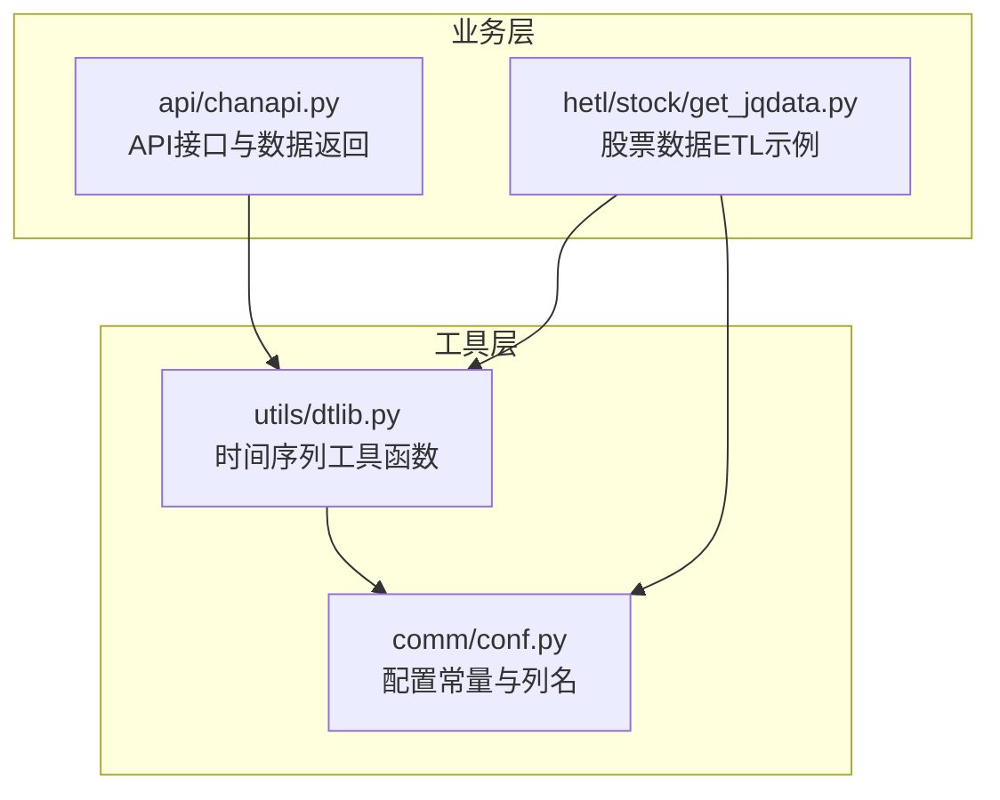
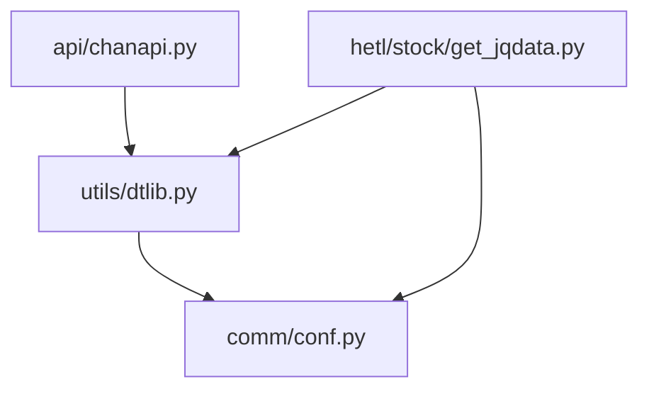
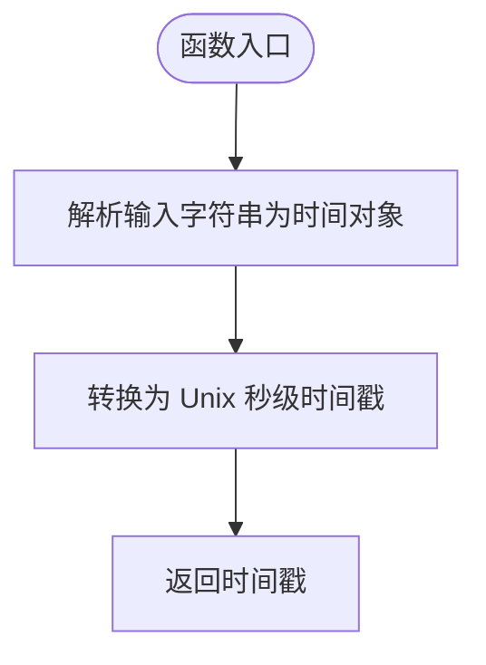
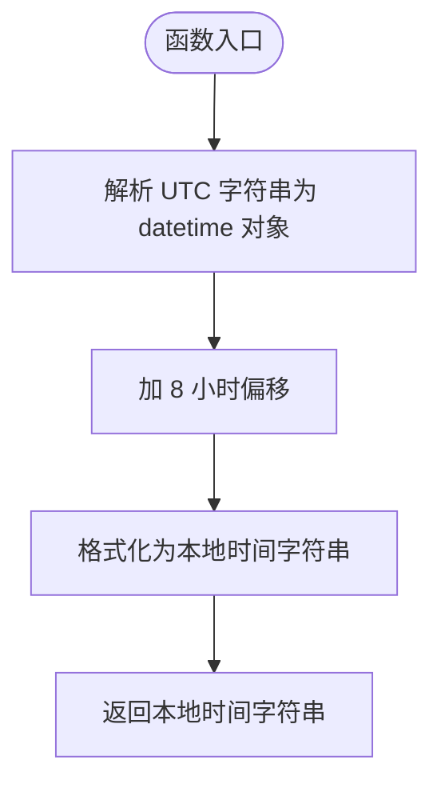
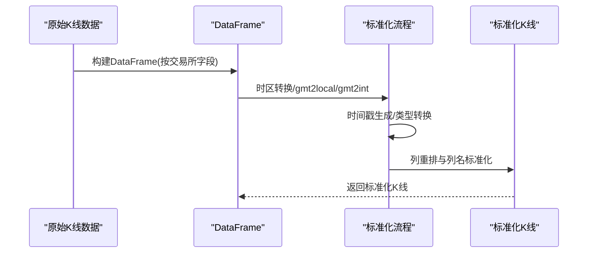
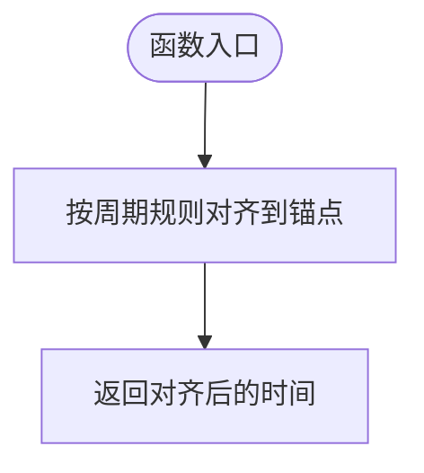
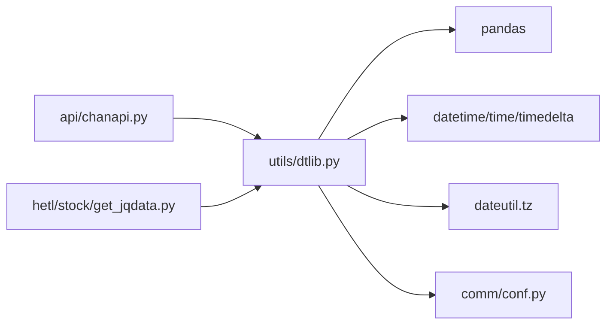

# 时间序列数据处理

<cite>
**本文引用的文件**
- [utils/dtlib.py](file://utils/dtlib.py)
- [comm/conf.py](file://comm/conf.py)
- [api/chanapi.py](file://api/chanapi.py)
- [hetl/stock/get_jqdata.py](file://hetl/stock/get_jqdata.py)
- [utils/CLAUDE.md](file://utils/CLAUDE.md)
</cite>

## 目录
1. [简介](#简介)
2. [项目结构](#项目结构)
3. [核心组件](#核心组件)
4. [架构总览](#架构总览)
5. [详细组件分析](#详细组件分析)
6. [依赖关系分析](#依赖关系分析)
7. [性能考量](#性能考量)
8. [故障排查指南](#故障排查指南)
9. [结论](#结论)
10. [附录](#附录)

## 简介
本文件聚焦于 utils/dtlib.py 中的时间序列处理工具函数，系统梳理时间戳转换（time2int、int2time）、时区处理（gmt2local）、K线数据标准化（make_hist、okex_make_hist、binance_make_hist）以及周期合并（tomerge_15、to_4hour）等关键能力。结合缠论分析对多周期数据对齐、交易所原始数据清洗与格式化的实际需求，给出使用建议、流程图示与常见问题排查方法，帮助读者将不同数据源（OKX、Binance）的原始K线数据转换为统一标准格式，支撑缠论算法稳定运行。

## 项目结构
- 时间序列处理位于 utils/dtlib.py，提供时间戳与字符串互转、时区转换、K线标准化、周期合并等基础能力。
- 配置常量（如标准列名、时间周期映射）集中在 comm/conf.py，被 dtlib 与业务模块共同引用。
- API 层（api/chanapi.py）在对外接口中调用 dtlib 的时间转换函数，确保 TradingView 请求参数与内部存储格式一致。
- ETL 脚本（hetl/stock/get_jqdata.py）展示了如何在数据入库前使用 dtlib 进行时间规范化。

**图表来源**
- [utils/dtlib.py](file://utils/dtlib.py#L1-L207)
- [comm/conf.py](file://comm/conf.py#L44-L65)
- [api/chanapi.py](file://api/chanapi.py#L17-L235)
- [hetl/stock/get_jqdata.py](file://hetl/stock/get_jqdata.py#L1-L100)

**章节来源**
- [utils/dtlib.py](file://utils/dtlib.py#L1-L207)
- [comm/conf.py](file://comm/conf.py#L44-L65)
- [api/chanapi.py](file://api/chanapi.py#L17-L235)
- [hetl/stock/get_jqdata.py](file://hetl/stock/get_jqdata.py#L1-L100)

## 核心组件
- 时间戳与字符串互转
  - time2int：将“年-月-日 时:分:秒”字符串转换为 Unix 秒级时间戳。
  - int2time：将 Unix 秒级时间戳转换为“年-月-日 时:分:秒”本地时间字符串。
  - int2hour：将 Unix 秒级时间戳转换为“年-月-日:时”的小时粒度字符串。
- 时区处理
  - gmt2local：将 ISO 格式的 UTC 时间字符串（含毫秒）转换为本地时间字符串（硬编码+8小时）。
  - gmt2int：将 ISO 格式 UTC 时间字符串转换为 Unix 秒级时间戳。
- K线数据标准化
  - make_hist：面向 OKX 原始字段集，完成时区转换、类型转换、列重排与列名标准化。
  - okex_make_hist：面向 OKX 时间戳字段，完成时间戳归一化、类型转换与列标准化。
  - binance_make_hist：面向 Binance 原始字段集，完成时间戳归一化、类型转换与列标准化。
- 周期合并与对齐
  - tomerge_15：将秒级时间对齐到 15 分钟周期锚点。
  - to_4hour：将“年-月-日 时:分:秒”对齐到 4 小时锚点（00:00、04:00、08:00、12:00、16:00、20:00）。
- 辅助函数
  - get_start、get_end：生成 UTC 格式的时间字符串，便于外部数据源请求。

上述函数在缠论分析中承担“统一时间基准、清洗原始数据、对齐多周期”的关键角色，确保不同交易所、不同时间粒度的数据能在同一坐标系下进行结构识别与周期联动。

**章节来源**
- [utils/dtlib.py](file://utils/dtlib.py#L22-L206)
- [comm/conf.py](file://comm/conf.py#L44-L65)

## 架构总览
下图展示 dtlib 在系统中的位置与调用关系，以及与配置常量的耦合点。

**图表来源**
- [utils/dtlib.py](file://utils/dtlib.py#L1-L207)
- [comm/conf.py](file://comm/conf.py#L44-L65)
- [api/chanapi.py](file://api/chanapi.py#L17-L235)
- [hetl/stock/get_jqdata.py](file://hetl/stock/get_jqdata.py#L1-L100)

## 详细组件分析

### 时间戳与字符串互转（time2int、int2time、int2hour）
- 设计要点
  - time2int：面向“年-月-日 时:分:秒”字符串，使用本地时区解析为 Unix 秒级时间戳。
  - int2time/int2hour：将 Unix 秒级时间戳转换为本地时间字符串或小时粒度字符串，便于后续对齐与展示。
- 复杂度与性能
  - O(1) 时间复杂度；字符串解析与格式化开销极低。
- 错误处理与边界
  - 输入格式不匹配会导致解析失败；建议在上游严格约束输入格式。
- 在缠论中的作用
  - 统一时间基准，避免跨时区导致的对齐偏差；为多周期对齐提供原子时间单位。

**图表来源**
- [utils/dtlib.py](file://utils/dtlib.py#L22-L36)
- [utils/dtlib.py](file://utils/dtlib.py#L148-L163)

**章节来源**
- [utils/dtlib.py](file://utils/dtlib.py#L22-L36)
- [utils/dtlib.py](file://utils/dtlib.py#L148-L163)

### 时区处理（gmt2local、gmt2int）
- 设计要点
  - gmt2local：将 ISO 格式 UTC 时间字符串（含毫秒）转换为本地时间字符串（硬编码+8小时），再格式化为“年-月-日 时:分:秒”。
  - gmt2int：将 ISO 格式 UTC 时间字符串转换为 Unix 秒级时间戳。
- 复杂度与性能
  - O(1)；字符串解析与加减运算常数时间。
- 错误处理与边界
  - 输入必须符合预期格式；若毫秒部分缺失或格式不符，解析会失败。
- 在缠论中的作用
  - 将交易所返回的 UTC 时间统一为本地时间，保证与本地业务时间一致，避免跨时区导致的K线锚点错位。

**图表来源**
- [utils/dtlib.py](file://utils/dtlib.py#L39-L62)

**章节来源**
- [utils/dtlib.py](file://utils/dtlib.py#L39-L62)

### K线数据标准化（make_hist、okex_make_hist、binance_make_hist）
- 设计要点
  - make_hist：面向 OKX 原始字段集，执行以下步骤：
    - 时区转换：将 UTC 时间字符串转换为本地时间字符串；
    - 时间戳生成：将本地时间字符串转换为 Unix 秒级时间戳；
    - 类型转换：开盘、最高、最低、收盘、成交量、金额等字段转换为数值类型；
    - 列重排与列名标准化：按标准列顺序与列名输出。
  - okex_make_hist：面向 OKX 时间戳字段，执行以下步骤：
    - 将时间戳字段除以 1000 归一化为秒级；
    - 通过 int2time 转换为本地时间字符串；
    - 类型转换与列标准化。
  - binance_make_hist：面向 Binance 原始字段集，执行以下步骤：
    - 逆序组装数据（保持时间升序）；
    - 将时间戳字段除以 1000 归一化为秒级；
    - 通过 int2time 转换为本地时间字符串；
    - 类型转换与列标准化。
- 复杂度与性能
  - DataFrame 映射与列重排为 O(n)；整体受数据量影响。
- 错误处理与边界
  - 不同交易所字段名差异较大，需确保传入字段与配置常量一致；
  - 数值字段可能包含空字符串或非数值，需在上游清洗或在函数内增加健壮性。
- 在缠论中的作用
  - 将不同交易所的原始K线数据转换为统一的“id、datetime、open、high、low、close、volume、amount”标准格式，保证后续多周期对齐与结构识别的稳定性。

**图表来源**
- [utils/dtlib.py](file://utils/dtlib.py#L65-L106)
- [utils/dtlib.py](file://utils/dtlib.py#L110-L133)
- [comm/conf.py](file://comm/conf.py#L44-L65)

**章节来源**
- [utils/dtlib.py](file://utils/dtlib.py#L65-L106)
- [utils/dtlib.py](file://utils/dtlib.py#L110-L133)
- [comm/conf.py](file://comm/conf.py#L44-L65)

### 周期合并与对齐（tomerge_15、to_4hour）
- 设计要点
  - tomerge_15：将秒级时间对齐到 15 分钟周期锚点（00、15、30、45），返回对齐后的秒级时间。
  - to_4hour：将“年-月-日 时:分:秒”对齐到 4 小时锚点（00:00、04:00、08:00、12:00、16:00、20:00），返回对齐后的字符串。
- 复杂度与性能
  - O(1)；纯数学运算。
- 错误处理与边界
  - 输入必须为合法的秒级时间或“年-月-日 时:分:秒”字符串；非法输入会导致异常。
- 在缠论中的作用
  - 为多周期数据对齐提供锚点，确保不同周期（如 15 分钟、4 小时）在同一时间锚点下进行结构对比与联动。

**图表来源**
- [utils/dtlib.py](file://utils/dtlib.py#L166-L200)

**章节来源**
- [utils/dtlib.py](file://utils/dtlib.py#L166-L200)

### 辅助函数（get_start、get_end）
- 设计要点
  - get_start：生成当前 UTC 时间减去指定分钟数的 ISO 字符串（带 Z 后缀）。
  - get_end：生成当前 UTC 时间的 ISO 字符串（带 Z 后缀）。
- 复杂度与性能
  - O(1)；字符串拼接与时间计算常数时间。
- 在缠论中的作用
  - 为外部数据源请求提供起止时间参数，确保请求范围覆盖分析所需的多周期窗口。

**章节来源**
- [utils/dtlib.py](file://utils/dtlib.py#L136-L145)

## 依赖关系分析
- dtlib 依赖
  - pandas：用于 DataFrame 构建与列映射。
  - datetime、time、timedelta：用于时间解析、格式化与加减运算。
  - dateutil.tz：用于时区处理（代码中存在注释，当前实现采用硬编码偏移）。
  - comm.conf：引入标准列名与各交易所字段映射常量。
- 调用关系
  - API 层在返回历史数据时调用 dtlib 的时间转换函数，确保返回给 TradingView 的时间格式一致。
  - ETL 层在入库前调用 dtlib 的时间转换函数，保证数据入库时间字段的统一性。

**图表来源**
- [utils/dtlib.py](file://utils/dtlib.py#L1-L207)
- [comm/conf.py](file://comm/conf.py#L44-L65)
- [api/chanapi.py](file://api/chanapi.py#L17-L235)
- [hetl/stock/get_jqdata.py](file://hetl/stock/get_jqdata.py#L1-L100)

**章节来源**
- [utils/dtlib.py](file://utils/dtlib.py#L1-L207)
- [comm/conf.py](file://comm/conf.py#L44-L65)
- [api/chanapi.py](file://api/chanapi.py#L17-L235)
- [hetl/stock/get_jqdata.py](file://hetl/stock/get_jqdata.py#L1-L100)

## 性能考量
- 时间转换与格式化
  - time2int、int2time、int2hour、gmt2local、gmt2int 均为 O(1)，对大数据量影响有限。
- DataFrame 映射
  - make_hist、okex_make_hist、binance_make_hist 中的 map 操作为 O(n)，建议在上游控制数据规模或分批处理。
- 时区偏移
  - 当前 gmt2local 使用固定+8 小时偏移，简单高效；若需支持动态时区，可替换为 dateutil.tz 的 gettz 方案，但会增加解析成本。
- 周期对齐
  - tomerge_15、to_4hour 为纯数学运算，O(1)，可忽略不计。

[本节为通用性能讨论，无需特定文件引用]

## 故障排查指南
- 常见错误与定位
  - 输入格式不匹配：time2int、int2time、gmt2local、gmt2int 对输入格式有严格要求。若解析失败，检查传入字符串是否符合期望格式。
  - 时区偏移不正确：当前 gmt2local 固定+8 小时，若目标市场为其他时区，应调整偏移或改用 dateutil.tz 的动态时区处理。
  - 交易所字段不一致：make_hist、okex_make_hist、binance_make_hist 依赖配置常量中的列名。若上游字段名变化，需同步更新配置。
  - 数值类型异常：类型转换（float、int）可能因空字符串或非数值导致异常。建议在上游清洗或在函数内增加健壮性。
- 排查步骤
  - 核对输入时间字符串格式与期望格式是否一致；
  - 检查配置常量（OK_KDATA_COLUMNS、BA_KDATA_COLUMNS、STAND_KDATA_COLUMNS）是否与上游字段一致；
  - 验证时间戳是否为秒级（OKX/Binance 可能为毫秒级，需除以 1000 归一化）；
  - 对多周期对齐函数，确认输入时间是否为合法的秒级时间或“年-月-日 时:分:秒”字符串。
- 相关实现参考
  - 时间转换与格式化：参见 [utils/dtlib.py](file://utils/dtlib.py#L22-L36)、[utils/dtlib.py](file://utils/dtlib.py#L148-L163)、[utils/dtlib.py](file://utils/dtlib.py#L39-L62)。
  - K线标准化：参见 [utils/dtlib.py](file://utils/dtlib.py#L65-L106)、[utils/dtlib.py](file://utils/dtlib.py#L110-L133)、[comm/conf.py](file://comm/conf.py#L44-L65)。
  - 周期对齐：参见 [utils/dtlib.py](file://utils/dtlib.py#L166-L200)。

**章节来源**
- [utils/dtlib.py](file://utils/dtlib.py#L22-L36)
- [utils/dtlib.py](file://utils/dtlib.py#L39-L62)
- [utils/dtlib.py](file://utils/dtlib.py#L65-L106)
- [utils/dtlib.py](file://utils/dtlib.py#L110-L133)
- [utils/dtlib.py](file://utils/dtlib.py#L166-L200)
- [comm/conf.py](file://comm/conf.py#L44-L65)

## 结论
dtlib 提供了缠论分析所需的关键时间序列处理能力：统一时间基准、清洗与标准化不同交易所的K线数据、以及多周期对齐。通过合理使用 time2int、int2time、gmt2local、make_hist、okex_make_hist、binance_make_hist、tomerge_15、to_4hour 等函数，可以将来自 OKX、Binance 等不同数据源的原始K线转换为统一标准格式，从而提升缠论结构识别的准确性与稳定性。建议在生产环境中加强输入校验与异常处理，并根据实际业务场景选择合适的时区处理方案。

[本节为总结性内容，无需特定文件引用]

## 附录

### 使用示例（路径指引）
- 将 OKX 原始K线转换为标准格式
  - 步骤：构建 DataFrame（按 OK_KDATA_COLUMNS），调用 make_hist 完成时区转换、类型转换与列标准化。
  - 参考实现：[utils/dtlib.py](file://utils/dtlib.py#L65-L85)、[comm/conf.py](file://comm/conf.py#L44-L65)
- 将 OKX 时间戳字段转换为标准格式
  - 步骤：将时间戳除以 1000 归一化为秒级，再通过 int2time 转换为本地时间字符串，最后完成类型转换与列标准化。
  - 参考实现：[utils/dtlib.py](file://utils/dtlib.py#L88-L106)
- 将 Binance 原始K线转换为标准格式
  - 步骤：逆序组装数据，将时间戳除以 1000 归一化为秒级，通过 int2time 转换为本地时间字符串，完成类型转换与列标准化。
  - 参考实现：[utils/dtlib.py](file://utils/dtlib.py#L110-L133)
- 多周期对齐
  - 15 分钟对齐：调用 tomerge_15，将秒级时间对齐到 15 分钟锚点。
    - 参考实现：[utils/dtlib.py](file://utils/dtlib.py#L166-L170)
  - 4 小时对齐：调用 to_4hour，将“年-月-日 时:分:秒”对齐到 4 小时锚点。
    - 参考实现：[utils/dtlib.py](file://utils/dtlib.py#L180-L199)
- API 层时间转换
  - 在返回历史数据时，使用 time2int、int2time 确保时间格式一致。
  - 参考实现：[api/chanapi.py](file://api/chanapi.py#L17-L235)
- ETL 层时间转换
  - 在入库前使用 time2int 将日期字符串转换为时间戳，保证入库一致性。
  - 参考实现：[hetl/stock/get_jqdata.py](file://hetl/stock/get_jqdata.py#L33-L57)

**章节来源**
- [utils/dtlib.py](file://utils/dtlib.py#L65-L133)
- [utils/dtlib.py](file://utils/dtlib.py#L166-L199)
- [api/chanapi.py](file://api/chanapi.py#L17-L235)
- [hetl/stock/get_jqdata.py](file://hetl/stock/get_jqdata.py#L33-L57)

### 术语与配置常量
- 标准列名
  - STAND_KDATA_COLUMNS：统一的 K 线列名集合，用于输出标准化数据。
  - 参考定义：[comm/conf.py](file://comm/conf.py#L58-L58)
- 交易所字段映射
  - OK_KDATA_COLUMNS：OKX 原始字段集合。
  - BA_KDATA_COLUMNS：Binance 原始字段集合。
  - 参考定义：[comm/conf.py](file://comm/conf.py#L50-L53)
- 工具函数文档
  - 工具函数模块文档对 dtlib 的用途与使用方式进行了概述。
  - 参考文档：[utils/CLAUDE.md](file://utils/CLAUDE.md#L21-L39)

**章节来源**
- [comm/conf.py](file://comm/conf.py#L44-L65)
- [utils/CLAUDE.md](file://utils/CLAUDE.md#L21-L39)