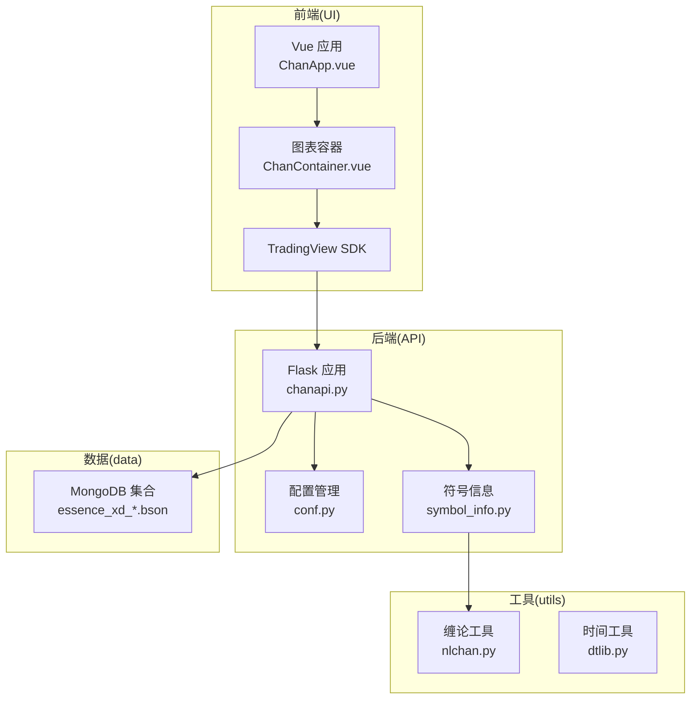
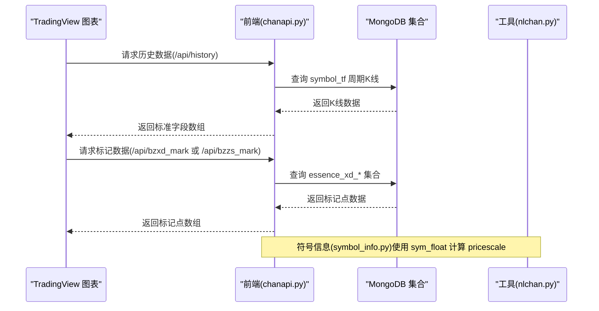
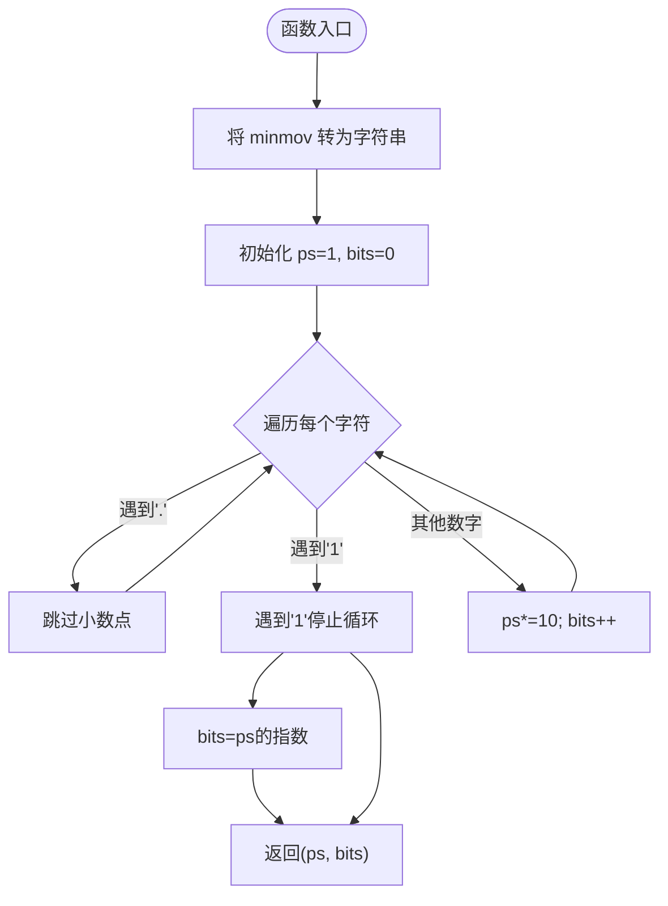
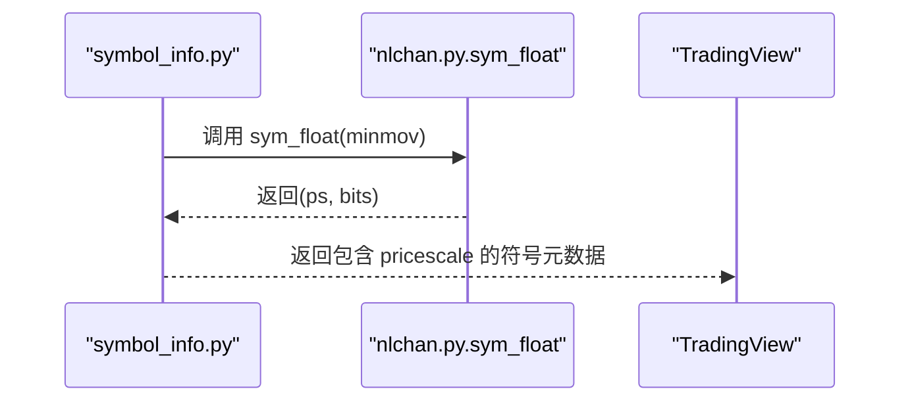
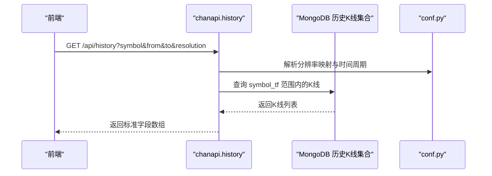
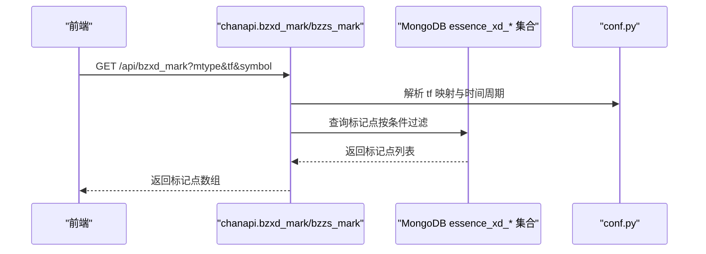
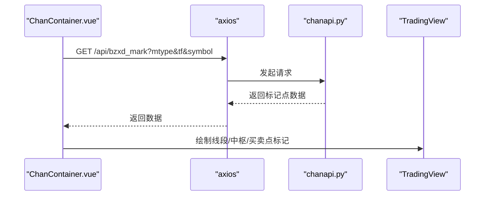
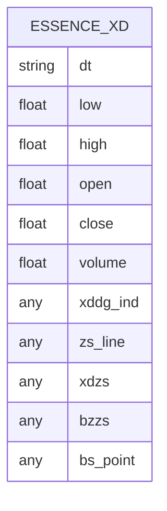
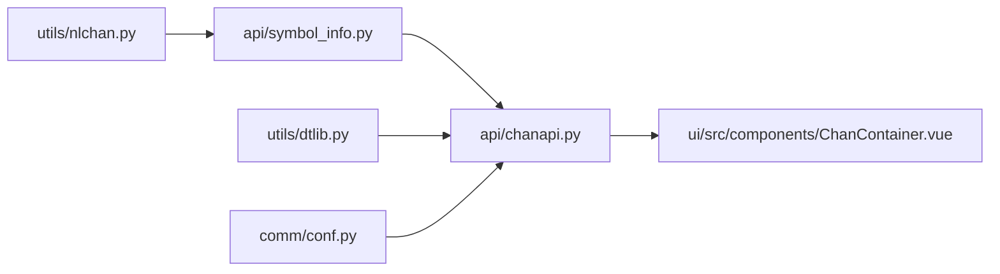

# 缠论算法开发

<cite>
**本文引用的文件**
- [utils/nlchan.py](file://utils/nlchan.py)
- [utils/dtlib.py](file://utils/dtlib.py)
- [api/chanapi.py](file://api/chanapi.py)
- [api/symbol_info.py](file://api/symbol_info.py)
- [comm/conf.py](file://comm/conf.py)
- [data/nlchan/essence_xd_000001.XSHG_1d.metadata.json](file://data/nlchan/essence_xd_000001.XSHG_1d.metadata.json)
- [ui/src/components/ChanContainer.vue](file://ui/src/components/ChanContainer.vue)
- [ui/src/ChanApp.vue](file://ui/src/ChanApp.vue)
- [ui/src/main.js](file://ui/src/main.js)
- [README.md](file://README.md)
</cite>

## 目录
1. [引言](#引言)
2. [项目结构](#项目结构)
3. [核心组件](#核心组件)
4. [架构总览](#架构总览)
5. [详细组件分析](#详细组件分析)
6. [依赖关系分析](#依赖关系分析)
7. [性能考量](#性能考量)
8. [故障排查指南](#故障排查指南)
9. [结论](#结论)
10. [附录](#附录)

## 引言
本文件围绕 nlchan.py 中的核心函数 sym_float，系统性阐述缠论线段、中枢与买卖点的识别算法实现原理，重点说明如何通过最小变动单位（minmov）计算价格精度与小数位数，以满足 TradingView 图表的精度要求。同时提供算法扩展的开发模板，展示如何在保持接口兼容的前提下实现自定义缠论结构识别逻辑；结合实际代码示例说明算法输入输出格式、异常处理机制及性能优化策略；阐述新算法如何与现有数据模型（如 essence_xd_*.bson）对接，并通过 API 服务暴露给前端进行可视化渲染。

## 项目结构
项目采用前后端分离架构，后端基于 Flask 提供 API 接口，前端基于 Vue 集成 TradingView SDK，通过 UDF 兼容数据源对接后端接口，实现 K 线与缠论结构的可视化。

**图表来源**
- [ui/src/ChanApp.vue](file://ui/src/ChanApp.vue#L1-L41)
- [ui/src/components/ChanContainer.vue](file://ui/src/components/ChanContainer.vue#L1-L120)
- [api/chanapi.py](file://api/chanapi.py#L1-L120)
- [api/symbol_info.py](file://api/symbol_info.py#L1-L40)
- [utils/nlchan.py](file://utils/nlchan.py#L1-L25)
- [utils/dtlib.py](file://utils/dtlib.py#L1-L60)
- [comm/conf.py](file://comm/conf.py#L1-L60)

**章节来源**
- [README.md](file://README.md#L107-L137)

## 核心组件
- sym_float：解析最小变动单位（minmov），计算价格精度 ps 与小数位数 bits，用于 TradingView 的 pricescale 设置与数据精度控制。
- API 接口：提供历史数据、买卖点、线段/中枢标记等接口，统一输出 TradingView 所需的数据格式。
- 符号信息：读取 ALL_SYMBOLS，结合 sym_float 计算 pricescale，向 TradingView 暴露符号元数据。
- 配置管理：维护时间周期映射、数据库连接、集合命名规范等。
- 数据模型：essence_xd_* 等集合存储缠论识别结果，供 API 查询与前端渲染。

**章节来源**
- [utils/nlchan.py](file://utils/nlchan.py#L1-L25)
- [api/chanapi.py](file://api/chanapi.py#L244-L420)
- [api/symbol_info.py](file://api/symbol_info.py#L1-L40)
- [comm/conf.py](file://comm/conf.py#L1-L60)
- [data/nlchan/essence_xd_000001.XSHG_1d.metadata.json](file://data/nlchan/essence_xd_000001.XSHG_1d.metadata.json#L1-L1)

## 架构总览
后端通过 Flask BluePrint 暴露接口，前端通过 TradingView UDF 兼容数据源拉取历史数据与标记数据，API 从 MongoDB 读取 essence_xd_* 等集合，返回标准字段（时间、开盘、最高、最低、收盘、成交量等）以及标记点（线段、中枢、买卖点等）。符号信息模块根据 minmov 计算 pricescale，确保图表价格刻度与数据精度一致。

**图表来源**
- [api/chanapi.py](file://api/chanapi.py#L96-L235)
- [api/chanapi.py](file://api/chanapi.py#L280-L420)
- [api/symbol_info.py](file://api/symbol_info.py#L1-L40)
- [utils/nlchan.py](file://utils/nlchan.py#L1-L25)

## 详细组件分析

### sym_float 算法详解
sym_float 的目标是根据最小变动单位（minmov）字符串，计算价格精度 ps 与小数位数 bits，从而为 TradingView 的 pricescale 提供准确数值，保证图表刻度与数据精度一致。

- 输入：minmov（字符串，如 "0.01"、"0.001"、"1"）
- 输出：(ps, bits) 其中 ps 为价格精度（10 的幂次），bits 为小数位数
- 算法流程：
  1) 将 minmov 转换为字符串，遍历字符，忽略小数点；
  2) 遇到第一个非零数字（'1'）停止计数，累计的乘积即 ps；
  3) 返回 ps 与 bits（ps 的指数）。

**图表来源**
- [utils/nlchan.py](file://utils/nlchan.py#L1-L25)

**章节来源**
- [utils/nlchan.py](file://utils/nlchan.py#L1-L25)

### 价格精度与 TradingView 集成
- 符号信息模块读取 ALL_SYMBOLS 中的 minmov，调用 sym_float 计算 ps，并将 ps 作为 pricescale 返回给 TradingView，确保图表刻度与数据精度一致。
- 对于股票数据，pricescale 固定为 100，以满足不同市场的报价精度。

**图表来源**
- [api/symbol_info.py](file://api/symbol_info.py#L1-L40)
- [utils/nlchan.py](file://utils/nlchan.py#L1-L25)

**章节来源**
- [api/symbol_info.py](file://api/symbol_info.py#L1-L40)

### 历史数据接口与回测支持
- /api/history 接口根据 symbol、from、to、resolution 获取历史数据，支持回测场景下的部分 K 线处理（partial_k），确保小级别推进时大级别只走对应周期。
- 返回字段包括时间序列、日期字符串、OHLCV 等，满足 TradingView UDF 规范。

**图表来源**
- [api/chanapi.py](file://api/chanapi.py#L96-L235)
- [comm/conf.py](file://comm/conf.py#L1-L60)

**章节来源**
- [api/chanapi.py](file://api/chanapi.py#L96-L235)
- [comm/conf.py](file://comm/conf.py#L1-L60)

### 线段/中枢/买卖点标记接口
- /api/bzxd_mark：按 mtype 返回线段标记、中枢线、线段中枢、买卖点等数据，查询 essence_xd_* 集合并过滤当前时间之前的标记点。
- /api/bzzs_mark：返回本质线段、本质中枢、三买点等标记。
- /api/get_bspoint：返回买卖点 CSV 数据（按 symbol 和频率解析）。

**图表来源**
- [api/chanapi.py](file://api/chanapi.py#L280-L420)
- [api/chanapi.py](file://api/chanapi.py#L422-L491)
- [api/chanapi.py](file://api/chanapi.py#L244-L278)
- [comm/conf.py](file://comm/conf.py#L1-L60)

**章节来源**
- [api/chanapi.py](file://api/chanapi.py#L280-L420)
- [api/chanapi.py](file://api/chanapi.py#L422-L491)
- [api/chanapi.py](file://api/chanapi.py#L244-L278)

### 前端可视化与交互
- 前端通过 ChanContainer.vue 创建 TradingView Widget，使用 UDF 兼容数据源指向后端 API。
- 通过按钮触发调用 /api/bzxd_mark、/api/bzzs_mark 等接口，将线段、中枢、买卖点等标记绘制到图表上。

**图表来源**
- [ui/src/components/ChanContainer.vue](file://ui/src/components/ChanContainer.vue#L1-L120)
- [ui/src/components/ChanContainer.vue](file://ui/src/components/ChanContainer.vue#L2056-L2471)

**章节来源**
- [ui/src/components/ChanContainer.vue](file://ui/src/components/ChanContainer.vue#L1-L120)
- [ui/src/components/ChanContainer.vue](file://ui/src/components/ChanContainer.vue#L2056-L2471)

### 数据模型与集合命名
- essence_xd_* 等集合存储缠论识别结果，文件名包含 symbol 与 tf（时间周期），metadata.json 记录集合元信息。
- 集合命名规范由 conf.py 中 ESSENCE_XD_COL 定义，便于 API 查询与前端渲染。

**图表来源**
- [comm/conf.py](file://comm/conf.py#L151-L158)
- [data/nlchan/essence_xd_000001.XSHG_1d.metadata.json](file://data/nlchan/essence_xd_000001.XSHG_1d.metadata.json#L1-L1)

**章节来源**
- [comm/conf.py](file://comm/conf.py#L151-L158)
- [data/nlchan/essence_xd_000001.XSHG_1d.metadata.json](file://data/nlchan/essence_xd_000001.XSHG_1d.metadata.json#L1-L1)

## 依赖关系分析
- utils/nlchan.py 与 api/symbol_info.py：符号信息模块依赖 sym_float 计算 pricescale。
- api/chanapi.py 与 comm/conf.py：API 依赖配置映射（分辨率、时间周期、集合命名）。
- api/chanapi.py 与 utils/dtlib.py：历史数据接口依赖时间转换工具。
- ui/src/components/ChanContainer.vue 与 api/chanapi.py：前端通过 UDF 兼容数据源调用后端接口。

**图表来源**
- [utils/nlchan.py](file://utils/nlchan.py#L1-L25)
- [api/symbol_info.py](file://api/symbol_info.py#L1-L40)
- [api/chanapi.py](file://api/chanapi.py#L1-L120)
- [utils/dtlib.py](file://utils/dtlib.py#L1-L60)
- [comm/conf.py](file://comm/conf.py#L1-L60)
- [ui/src/components/ChanContainer.vue](file://ui/src/components/ChanContainer.vue#L1-L120)

**章节来源**
- [utils/nlchan.py](file://utils/nlchan.py#L1-L25)
- [api/symbol_info.py](file://api/symbol_info.py#L1-L40)
- [api/chanapi.py](file://api/chanapi.py#L1-L120)
- [utils/dtlib.py](file://utils/dtlib.py#L1-L60)
- [comm/conf.py](file://comm/conf.py#L1-L60)
- [ui/src/components/ChanContainer.vue](file://ui/src/components/ChanContainer.vue#L1-L120)

## 性能考量
- 数据查询优化：API 在查询历史与标记数据时，应尽量使用索引字段（如 ts、dt）进行筛选，减少扫描范围。
- 分辨率映射缓存：将 RESOU_DICT、TF_SEC_MAP 缓存至内存，避免重复构建。
- 分页与分批：对于大量标记点数据，建议分页或按时间窗口分批返回，降低前端渲染压力。
- 前端渲染优化：仅在可见区间内绘制标记，超出范围的标记延迟加载。
- MongoDB 索引：为 essence_xd_* 集合建立 dt/ts 等常用查询字段索引，提升查询效率。

[本节为通用性能建议，无需特定文件来源]

## 故障排查指南
- 符号精度异常：检查 symbol_info.py 中 pricescale 是否正确由 sym_float 计算，确认 minmov 格式合法。
- 历史数据为空：确认 /api/history 的 from/to 与 resolution 是否匹配，检查回测配置与时间边界。
- 标记点缺失：确认 /api/bzxd_mark、/api/bzzs_mark 的 mtype 与 tf 是否正确，检查集合中是否存在相应字段。
- MongoDB 连接失败：检查 conf.py 中数据库连接配置与集合命名规范。

**章节来源**
- [api/symbol_info.py](file://api/symbol_info.py#L1-L40)
- [api/chanapi.py](file://api/chanapi.py#L96-L235)
- [api/chanapi.py](file://api/chanapi.py#L280-L420)
- [comm/conf.py](file://comm/conf.py#L143-L158)

## 结论
本项目通过 sym_float 将最小变动单位转换为 TradingView 的价格精度，配合 API 层对历史与标记数据的标准化输出，实现了缠论线段、中枢与买卖点的可视化。通过清晰的模块划分与接口约定，可在保持兼容性的前提下扩展新的缠论结构识别逻辑，并与现有数据模型无缝对接。

[本节为总结性内容，无需特定文件来源]

## 附录

### 开发模板：扩展自定义缠论结构识别
- 接口兼容性
  - 保持返回字段与 TradingView UDF 规范一致（时间、开盘、最高、最低、收盘、成交量等）。
  - 标记点返回结构应包含 dt、price 等关键字段，便于前端绘制。
- 数据模型
  - 在 essence_xd_* 集合中新增字段（如自定义标记字段），并在 API 中读取并返回。
- 精度控制
  - 使用 sym_float 计算 pricescale，确保图表刻度与数据精度一致。
- 异常处理
  - 对空数据、无效参数、数据库异常等情况返回标准错误码与消息。
- 性能优化
  - 使用索引、分页、缓存等手段提升查询与渲染性能。

[本节为开发指导，无需特定文件来源]