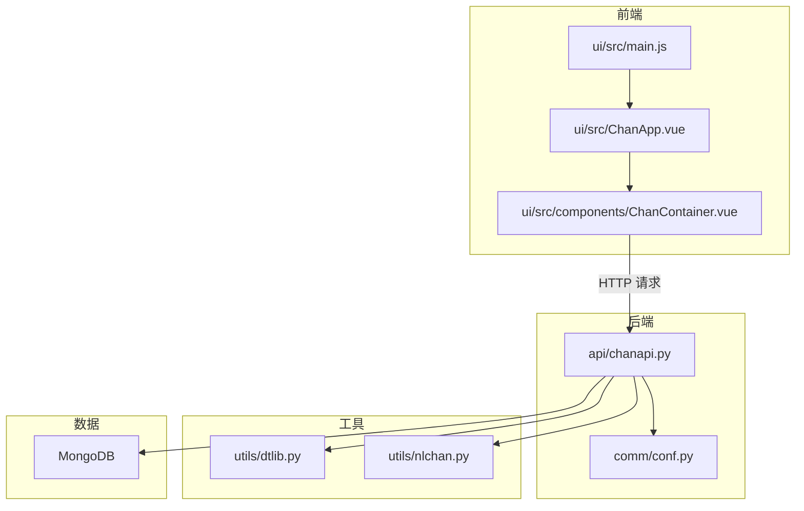
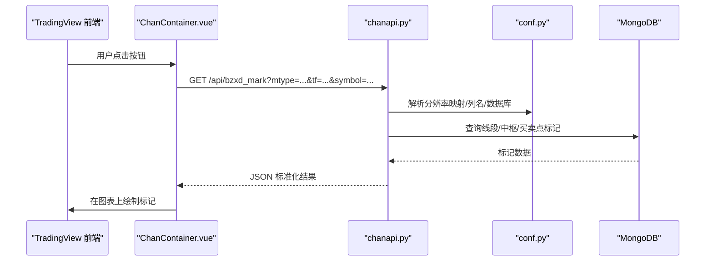
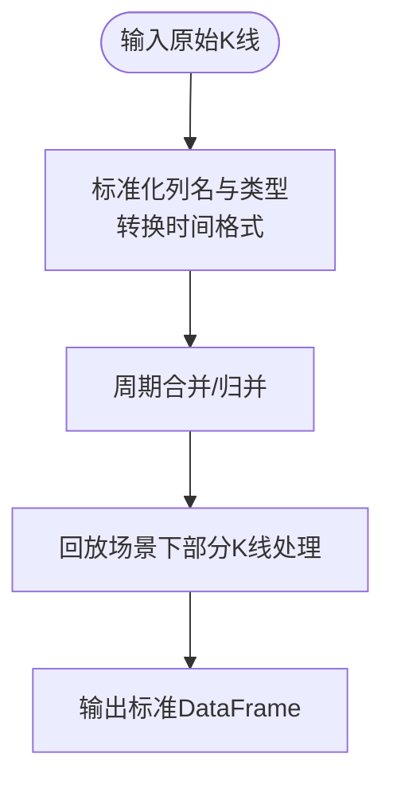
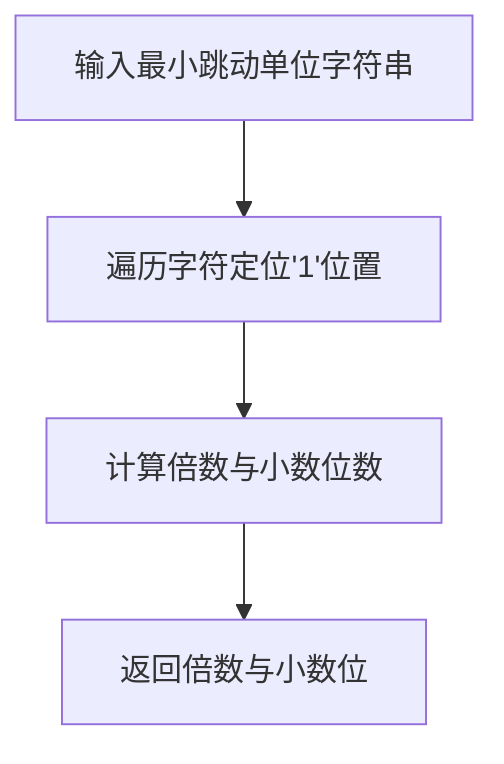
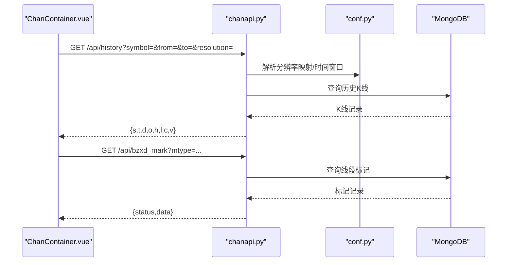
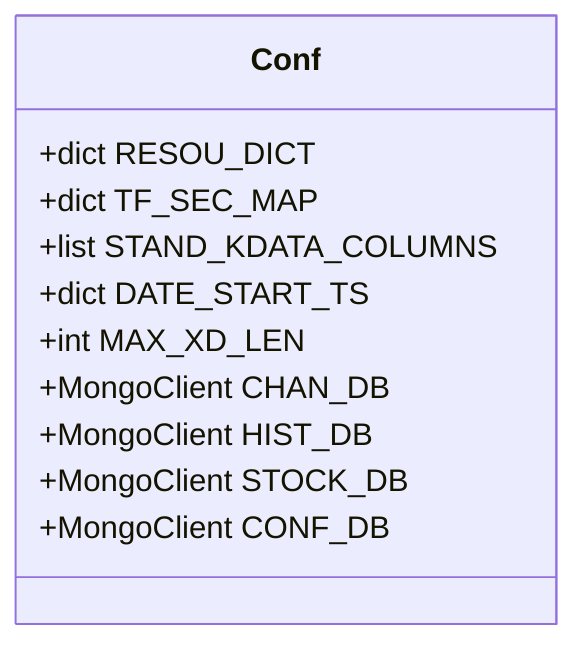
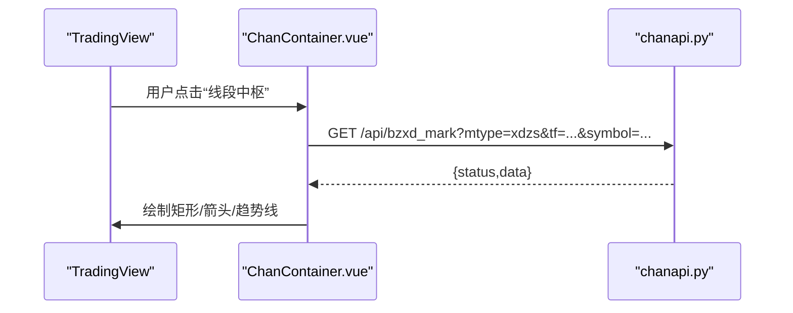
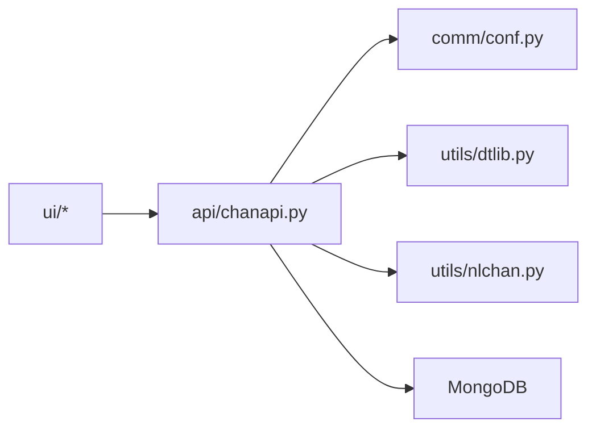

# 缠论算法扩展

<cite>
**本文引用的文件**
- [utils/nlchan.py](file://utils/nlchan.py)
- [utils/dtlib.py](file://utils/dtlib.py)
- [api/chanapi.py](file://api/chanapi.py)
- [comm/conf.py](file://comm/conf.py)
- [ui/src/components/ChanContainer.vue](file://ui/src/components/ChanContainer.vue)
- [ui/src/ChanApp.vue](file://ui/src/ChanApp.vue)
- [ui/src/main.js](file://ui/src/main.js)
- [README.md](file://README.md)
</cite>

## 目录
1. [简介](#简介)
2. [项目结构](#项目结构)
3. [核心组件](#核心组件)
4. [架构总览](#架构总览)
5. [详细组件分析](#详细组件分析)
6. [依赖关系分析](#依赖关系分析)
7. [性能考量](#性能考量)
8. [故障排查指南](#故障排查指南)
9. [结论](#结论)
10. [附录](#附录)

## 简介
本文件面向希望基于现有工具链扩展“缠论识别算法”的开发者，围绕以下目标展开：
- 基于 utils 模块中的工具函数，开发新的缠论结构识别算法（线段、中枢、买卖点等）。
- 结合 nlchan.py 的计算逻辑，说明线段、中枢、买卖点的识别原理与实现方法。
- 展示如何使用 dtlib.py 进行时间序列处理与数据转换。
- 提供开发自定义缠论策略的框架建议，包括模块化设计、参数配置与结果输出格式。
- 说明新算法如何与现有数据管道集成，并通过 API 暴露给前端进行可视化展示。

## 项目结构
项目采用前后端分离架构，后端使用 Python Flask 提供 API，前端使用 Vue + TradingView SDK 进行可视化。核心目录与职责如下：
- utils：通用工具模块，包含时间序列处理与缠论辅助计算。
- api：后端 API 蓝图，负责历史数据查询、标记点查询与上层分析结果的导出。
- comm：全局配置，包括数据库连接、时间周期映射、列名规范等。
- ui：前端可视化层，通过按钮触发 API 请求并在图表上绘制标记。
- data：示例数据集合（MongoDB 集合元数据），用于验证数据结构与 API 返回格式。

**图表来源**
- [ui/src/main.js](file://ui/src/main.js#L1-L12)
- [ui/src/ChanApp.vue](file://ui/src/ChanApp.vue#L1-L41)
- [ui/src/components/ChanContainer.vue](file://ui/src/components/ChanContainer.vue#L2056-L2471)
- [api/chanapi.py](file://api/chanapi.py#L1-L120)
- [comm/conf.py](file://comm/conf.py#L1-L166)
- [utils/dtlib.py](file://utils/dtlib.py#L1-L207)
- [utils/nlchan.py](file://utils/nlchan.py#L1-L25)

**章节来源**
- [README.md](file://README.md#L91-L105)
- [ui/src/main.js](file://ui/src/main.js#L1-L12)
- [ui/src/ChanApp.vue](file://ui/src/ChanApp.vue#L1-L41)
- [ui/src/components/ChanContainer.vue](file://ui/src/components/ChanContainer.vue#L2056-L2471)
- [api/chanapi.py](file://api/chanapi.py#L1-L120)
- [comm/conf.py](file://comm/conf.py#L1-L166)
- [utils/dtlib.py](file://utils/dtlib.py#L1-L207)
- [utils/nlchan.py](file://utils/nlchan.py#L1-L25)

## 核心组件
- 工具模块
  - dtlib：提供时间戳与字符串互转、历史数据标准化、不同交易所数据格式适配、周期合并等。
  - nlchan：提供基础的数值精度处理辅助（如最小跳动单位的小数位数推导）。
- API 层
  - 提供历史数据、买卖点、线段标记、中枢标记等接口；统一返回格式，便于前端渲染。
- 配置模块
  - 统一管理时间周期映射、列名规范、数据库连接、默认起止时间等。
- 前端可视化
  - 通过按钮触发 API 请求，将后端返回的标记点在 TradingView 图表上绘制。

**章节来源**
- [utils/dtlib.py](file://utils/dtlib.py#L1-L207)
- [utils/nlchan.py](file://utils/nlchan.py#L1-L25)
- [api/chanapi.py](file://api/chanapi.py#L1-L200)
- [comm/conf.py](file://comm/conf.py#L1-L166)
- [ui/src/components/ChanContainer.vue](file://ui/src/components/ChanContainer.vue#L2056-L2471)

## 架构总览
后端 API 从 MongoDB 读取历史 K 线与已识别的结构数据，按请求参数返回标准格式；前端通过按钮调用相应 API，解析返回数据并在图表上绘制标记。整体流程如下：

**图表来源**
- [ui/src/components/ChanContainer.vue](file://ui/src/components/ChanContainer.vue#L2056-L2471)
- [api/chanapi.py](file://api/chanapi.py#L280-L420)
- [comm/conf.py](file://comm/conf.py#L1-L166)

## 详细组件分析

### 工具模块：时间序列与数据转换（dtlib）
- 时间转换
  - 提供多种时间格式与整型时间戳之间的转换函数，确保历史数据与前端显示一致。
  - 支持 GMT 字符串转本地时间、时间戳转字符串、小时粒度归并等。
- 历史数据标准化
  - 将不同来源的数据（如现货、币安、OKX）转换为统一列名与类型，便于后续分析。
  - 输出包含 id、datetime、open、high、low、close、volume、amount 等字段的标准 DataFrame。
- 周期合并与回测支持
  - 提供将细粒度周期合并到粗粒度周期的函数，便于多级别联动分析。
  - 支持回放场景下的“部分K线”处理，保证大级别数据与最小级别推进同步。

**图表来源**
- [utils/dtlib.py](file://utils/dtlib.py#L65-L133)
- [utils/dtlib.py](file://utils/dtlib.py#L136-L207)

**章节来源**
- [utils/dtlib.py](file://utils/dtlib.py#L1-L207)

### 工具模块：数值精度辅助（nlchan）
- 最小跳动单位精度推导
  - 通过最小跳动单位字符串推导小数位数与倍数，便于价格比较与区间划分。
- 应用场景
  - 在中枢边界判断、线段高低点筛选等环节，避免浮点误差导致的误判。

**图表来源**
- [utils/nlchan.py](file://utils/nlchan.py#L1-L25)

**章节来源**
- [utils/nlchan.py](file://utils/nlchan.py#L1-L25)

### API 层：历史与标记查询
- 历史数据接口
  - 支持按 symbol、from、to、resolution 查询历史 K 线，返回标准字段数组。
  - 内部处理回放场景下的部分周期数据，保证大级别与最小级别推进一致性。
- 标记查询接口
  - 线段标记：支持多类标记（中枢线、线段顶底、扩展/合并/背驰等）。
  - 中枢标记：本质中枢、线段中枢等。
  - 买卖点：三买/三卖等标记点。
- 返回格式
  - 统一返回包含状态码与数据的对象，前端直接消费。

**图表来源**
- [api/chanapi.py](file://api/chanapi.py#L96-L235)
- [api/chanapi.py](file://api/chanapi.py#L280-L420)
- [comm/conf.py](file://comm/conf.py#L1-L166)

**章节来源**
- [api/chanapi.py](file://api/chanapi.py#L96-L235)
- [api/chanapi.py](file://api/chanapi.py#L280-L420)
- [api/chanapi.py](file://api/chanapi.py#L422-L491)

### 配置模块：时间周期与列名规范
- 时间周期映射
  - 将前端分辨率字符串映射到数据库集合后缀，如 "1" -> "1m"、"240" -> "4h" 等。
- 列名规范
  - 定义不同来源数据的列名映射，最终统一为标准列名集合。
- 数据库连接
  - 定义缠论分析库、OHLCV 历史库、股票库、配置库等连接对象。
- 其他
  - 定义最大线段长度、默认起始时间等全局参数。

**图表来源**
- [comm/conf.py](file://comm/conf.py#L1-L166)

**章节来源**
- [comm/conf.py](file://comm/conf.py#L1-L166)

### 前端可视化：按钮触发与标记绘制
- 按钮事件
  - 不同按钮分别调用不同 API（线段中枢、本质中枢、三买点等）。
- 数据消费
  - 解析后端返回的 data 数组，按需在图表上绘制矩形、箭头、趋势线等形状。
- 交互性
  - 支持切换不同级别（1 分钟、5 分钟、日线等）与不同标的。

**图表来源**
- [ui/src/components/ChanContainer.vue](file://ui/src/components/ChanContainer.vue#L2056-L2471)
- [api/chanapi.py](file://api/chanapi.py#L280-L420)

**章节来源**
- [ui/src/components/ChanContainer.vue](file://ui/src/components/ChanContainer.vue#L2056-L2471)

## 依赖关系分析
- 模块耦合
  - api/chanapi.py 依赖 comm/conf.py（配置）、utils/dtlib.py（时间/数据转换）、MongoDB（数据源）。
  - utils/dtlib.py 依赖 comm/conf.py（列名与周期映射）。
  - 前端 ui 依赖 api/chanapi.py（HTTP 接口）。
- 外部依赖
  - Flask、Pandas、Arrow、MongoDB、TradingView SDK。
- 潜在循环依赖
  - 当前结构清晰，无明显循环导入。

**图表来源**
- [api/chanapi.py](file://api/chanapi.py#L1-L120)
- [comm/conf.py](file://comm/conf.py#L1-L166)
- [utils/dtlib.py](file://utils/dtlib.py#L1-L207)
- [utils/nlchan.py](file://utils/nlchan.py#L1-L25)

**章节来源**
- [api/chanapi.py](file://api/chanapi.py#L1-L120)
- [comm/conf.py](file://comm/conf.py#L1-L166)
- [utils/dtlib.py](file://utils/dtlib.py#L1-L207)
- [utils/nlchan.py](file://utils/nlchan.py#L1-L25)

## 性能考量
- 数据访问
  - 历史查询与标记查询均通过数据库聚合与排序，建议在 ts、datetime 等字段建立索引以提升查询效率。
- 时间转换
  - 大批量时间转换建议向量化或缓存常用映射，减少重复计算。
- 前端渲染
  - 标记点过多时，建议分页或按需加载，避免一次性绘制造成卡顿。
- 回放场景
  - 部分周期数据处理逻辑已在后端实现，前端应避免重复计算。

[本节为通用指导，无需具体文件分析]

## 故障排查指南
- 常见问题
  - API 返回空数据：检查 symbol、resolution 是否正确，确认数据库中是否存在对应集合。
  - 时间显示异常：确认时间转换函数是否被正确调用，注意时区与 GMT/本地时间差异。
  - 标记未显示：检查前端按钮是否正确调用对应 mtype，确认后端返回 data 非空且字段完整。
- 调试建议
  - 在 API 层打印关键参数与查询条件，核对数据库集合命名与字段。
  - 使用最小化数据集复现问题，逐步缩小范围。

**章节来源**
- [api/chanapi.py](file://api/chanapi.py#L96-L235)
- [api/chanapi.py](file://api/chanapi.py#L280-L420)
- [utils/dtlib.py](file://utils/dtlib.py#L1-L207)

## 结论
本项目提供了完整的“缠论识别算法 + API + 前端可视化”闭环。通过 dtlib 的数据标准化与 nlchan 的数值精度辅助，结合 API 的统一接口与前端的交互式绘制，开发者可以快速扩展新的缠论结构识别算法，并将其无缝集成到现有数据管道与可视化系统中。

[本节为总结，无需具体文件分析]

## 附录

### 开发自定义缠论策略的框架建议
- 模块化设计
  - 将“线段识别”“中枢生成”“买卖点判定”拆分为独立模块，每个模块输出标准化结构（含时间、价格、状态、类型等）。
  - 使用 conf.py 中的列名规范与周期映射，确保输出与现有数据管道兼容。
- 参数配置
  - 将阈值、周期、过滤规则等参数集中管理，便于调试与对比实验。
- 结果输出格式
  - 输出统一的标记对象（如包含 dt、price、type、status、附加属性等），便于前端直接消费。
- 与数据管道集成
  - 在 dtlib 的基础上，先将原始 K 线标准化，再进行算法计算，最后写入 MongoDB 对应集合。
- API 暴露与前端可视化
  - 新增 API 接口，返回统一格式；前端按钮调用新接口并绘制标记。

[本节为通用指导，无需具体文件分析]

### API 接口清单（与现有实现对照）
- 历史数据
  - GET /api/history?symbol=&from=&to=&resolution=
  - 返回字段：状态、时间数组、日期数组、开盘、最高、最低、收盘、成交量。
- 买卖点
  - GET /api/get_bspoint?symbol=&resolution=
  - 返回字段：状态、数据数组（包含日期与买卖类型）。
- 线段标记
  - GET /api/bzxd_mark?mtype=...&tf=...&symbol=...
  - 支持中枢线、线段顶底、扩展/合并/背驰等。
- 中枢标记
  - GET /api/bzzs_mark?mtype=...&tf=...&symbol=...
  - 支持本质中枢、线段中枢、三买点等。
- 上层分型
  - GET /api/get_upper_fx?symbol=&resolution=&fx_jibie=...

**章节来源**
- [api/chanapi.py](file://api/chanapi.py#L96-L235)
- [api/chanapi.py](file://api/chanapi.py#L244-L278)
- [api/chanapi.py](file://api/chanapi.py#L280-L420)
- [api/chanapi.py](file://api/chanapi.py#L422-L491)
- [api/chanapi.py](file://api/chanapi.py#L494-L558)