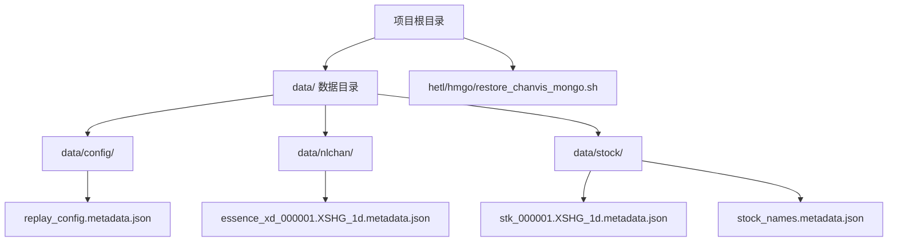
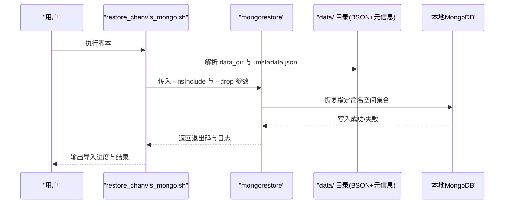
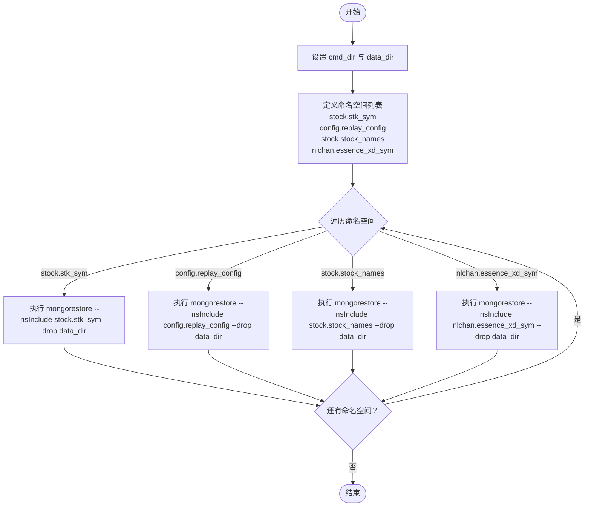
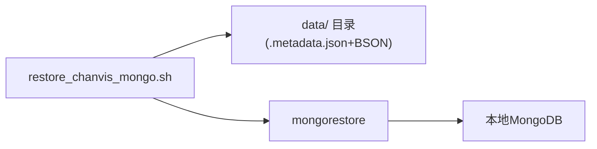

# MongoDB数据导入与恢复

<cite>
**本文引用的文件**
- [restore_chanvis_mongo.sh](file://hetl/hmgo/restore_chanvis_mongo.sh)
- [README.md](file://README.md)
- [CLAUDE.md](file://CLAUDE.md)
- [replay_config.metadata.json](file://data/config/replay_config.metadata.json)
- [essence_xd_000001.XSHG_1d.metadata.json](file://data/nlchan/essence_xd_000001.XSHG_1d.metadata.json)
- [stk_000001.XSHG_1d.metadata.json](file://data/stock/stk_000001.XSHG_1d.metadata.json)
- [stock_names.metadata.json](file://data/stock/stock_names.metadata.json)
</cite>

## 目录
1. [简介](#简介)
2. [项目结构](#项目结构)
3. [核心组件](#核心组件)
4. [架构总览](#架构总览)
5. [详细组件分析](#详细组件分析)
6. [依赖分析](#依赖分析)
7. [性能考虑](#性能考虑)
8. [故障排查指南](#故障排查指南)
9. [结论](#结论)
10. [附录](#附录)

## 简介
本指南围绕 ChanVis 项目中的 MongoDB 数据导入脚本 restore_chanvis_mongo.sh 展开，目标是帮助用户理解该 Shell 脚本如何调用 mongorestore 将 data/ 目录下的 BSON 二进制文件批量恢复到本地 MongoDB 实例，涵盖数据库与集合映射、索引重建策略、执行环境要求、标准操作命令与预期输出日志解析、元信息文件与数据文件的对应关系，以及导入后数据完整性与一致性的验证方法。同时提供错误处理建议与性能优化提示（如批量导入顺序、索引延迟创建）。

## 项目结构
- 数据目录 data/ 下按业务域划分：config、nlchan、stock 等子目录，存放 MongoDB 导出的 BSON 文件与对应的 .metadata.json 元信息文件。
- 导入脚本位于 hetl/hmgo/restore_chanvis_mongo.sh，负责调用 mongorestore 对指定命名空间（数据库.集合）进行恢复。
- README.md 与 CLAUDE.md 提供了项目背景、MongoDB 版本要求、快速启动步骤与数据准备说明。



**章节来源**
- [README.md](file://README.md#L107-L131)
- [CLAUDE.md](file://CLAUDE.md#L99-L105)

## 核心组件
- 导入脚本 restore_chanvis_mongo.sh
  - 定义命令目录 cmd_dir 与数据目录 data_dir。
  - 通过 --nsInclude 参数限定仅恢复特定命名空间（数据库.集合），并使用 --drop 在恢复前删除目标集合，确保数据一致性。
  - 恢复顺序：stock.stk_{sym}、config.replay_config、stock.stock_names、nlchan.essence_xd_{sym}。
- 元信息文件 .metadata.json
  - 描述集合的索引、UUID、集合名与类型等元数据，用于指导导入与校验。
- 数据文件
  - data/stock/stock_names.metadata.json、data/stock/stk_000001.XSHG_1d.metadata.json、data/config/replay_config.metadata.json、data/nlchan/essence_xd_000001.XSHG_1d.metadata.json。

**章节来源**
- [restore_chanvis_mongo.sh](file://hetl/hmgo/restore_chanvis_mongo.sh#L1-L30)
- [replay_config.metadata.json](file://data/config/replay_config.metadata.json#L1-L1)
- [essence_xd_000001.XSHG_1d.metadata.json](file://data/nlchan/essence_xd_000001.XSHG_1d.metadata.json#L1-L1)
- [stk_000001.XSHG_1d.metadata.json](file://data/stock/stk_000001.XSHG_1d.metadata.json#L1-L1)
- [stock_names.metadata.json](file://data/stock/stock_names.metadata.json#L1-L1)

## 架构总览
下图展示了数据导入的整体流程：脚本定位数据与命令目录，调用 mongorestore 指定命名空间进行恢复，最终写入本地 MongoDB。



**图表来源**
- [restore_chanvis_mongo.sh](file://hetl/hmgo/restore_chanvis_mongo.sh#L1-L30)

**章节来源**
- [restore_chanvis_mongo.sh](file://hetl/hmgo/restore_chanvis_mongo.sh#L1-L30)

## 详细组件分析

### 导入脚本 restore_chanvis_mongo.sh
- 目录与变量
  - cmd_dir 指向 mgtools（包含 mongorestore 等工具）。
  - data_dir 指向 data/ 目录。
- 命名空间与集合映射
  - stock.stk_{sym}：股票历史数据集合。
  - config.replay_config：回放配置集合。
  - stock.stock_names：股票名称映射集合。
  - nlchan.essence_xd_{sym}：缠论分析结果集合（以 sym 为后缀标识周期与标的）。
- 关键参数
  - --nsInclude：精确限定仅恢复指定命名空间，避免误导入其他集合。
  - --drop：在恢复前删除目标集合，确保导入数据与现有数据一致。
- 执行顺序
  - 先恢复 stock.stk_{sym}，再恢复 config.replay_config 与 stock.stock_names，最后恢复 nlchan.essence_xd_{sym}，保证依赖与一致性。



**图表来源**
- [restore_chanvis_mongo.sh](file://hetl/hmgo/restore_chanvis_mongo.sh#L1-L30)

**章节来源**
- [restore_chanvis_mongo.sh](file://hetl/hmgo/restore_chanvis_mongo.sh#L1-L30)

### 元信息文件与数据文件的对应关系
- 元信息文件 .metadata.json
  - 包含集合的索引定义、UUID、集合名与类型等信息，用于指导导入与校验。
- 数据文件
  - stock_names.metadata.json：对应 stock.stock_names 集合。
  - stk_000001.XSHG_1d.metadata.json：对应 stock.stk_000001.XSHG_1d 集合。
  - replay_config.metadata.json：对应 config.replay_config 集合。
  - essence_xd_000001.XSHG_1d.metadata.json：对应 nlchan.essence_xd_000001.XSHG_1d 集合。
- 关系说明
  - 集合名与 .metadata.json 文件名一一对应，便于脚本自动识别与恢复。

```mermaid
erDiagram
COLLECTIONS {
string name
string db
string bson_file
string metadata_file
}
COLLECTIONS ||--|| MONGO_DB : "恢复到"
COLLECTIONS {
"stock.stock_names" ||--|| "stock_names.metadata.json"
"stock.stk_000001.XSHG_1d" ||--|| "stk_000001.XSHG_1d.metadata.json"
"config.replay_config" ||--|| "replay_config.metadata.json"
"nlchan.essence_xd_000001.XSHG_1d" ||--|| "essence_xd_000001.XSHG_1d.metadata.json"
}
```

**图表来源**
- [stock_names.metadata.json](file://data/stock/stock_names.metadata.json#L1-L1)
- [stk_000001.XSHG_1d.metadata.json](file://data/stock/stk_000001.XSHG_1d.metadata.json#L1-L1)
- [replay_config.metadata.json](file://data/config/replay_config.metadata.json#L1-L1)
- [essence_xd_000001.XSHG_1d.metadata.json](file://data/nlchan/essence_xd_000001.XSHG_1d.metadata.json#L1-L1)

**章节来源**
- [stock_names.metadata.json](file://data/stock/stock_names.metadata.json#L1-L1)
- [stk_000001.XSHG_1d.metadata.json](file://data/stock/stk_000001.XSHG_1d.metadata.json#L1-L1)
- [replay_config.metadata.json](file://data/config/replay_config.metadata.json#L1-L1)
- [essence_xd_000001.XSHG_1d.metadata.json](file://data/nlchan/essence_xd_000001.XSHG_1d.metadata.json#L1-L1)

### 执行环境要求
- MongoDB 服务
  - 需确保本地 MongoDB 正常运行，且 mongorestore 可用。
- 权限设置
  - 脚本需具备执行权限；若 mongorestore 需要认证，应在命令行或环境变量中正确配置。
- 脚本位置
  - 建议在 hetl/hmgo 目录下执行，以便 cmd_dir 与 data_dir 能正确解析。

**章节来源**
- [CLAUDE.md](file://CLAUDE.md#L99-L105)
- [README.md](file://README.md#L124-L131)

### 标准操作命令示例
- 在 hetl/hmgo 目录下执行脚本，完成数据恢复。
- 命令示例路径：[./restore_chanvis_mongo.sh](file://hetl/hmgo/restore_chanvis_mongo.sh#L1-L30)

**章节来源**
- [README.md](file://README.md#L124-L131)

### 预期输出日志解析
- 成功场景
  - mongorestore 输出包含集合恢复进度、文档计数、索引构建等信息，脚本返回 0。
- 失败场景
  - 若连接失败、权限不足或命名空间不匹配，mongorestore 将输出错误信息，脚本返回非零值。
- 日志要点
  - 关注集合是否被删除与重建、索引是否创建、是否有重复键冲突等。

**章节来源**
- [restore_chanvis_mongo.sh](file://hetl/hmgo/restore_chanvis_mongo.sh#L1-L30)

### 数据完整性与一致性验证
- 验证集合存在与文档数量
  - 通过 MongoDB Shell 或客户端工具检查目标集合是否存在、文档条数是否符合预期。
- 验证索引
  - 检查集合索引是否与 .metadata.json 中定义一致（索引键、名称、版本等）。
- 验证数据内容
  - 抽样比对关键字段，确保字段类型与业务含义正确。
- 建议流程
  - 恢复完成后，先进行集合数量与索引核对，再进行少量文档抽样验证。

**章节来源**
- [replay_config.metadata.json](file://data/config/replay_config.metadata.json#L1-L1)
- [essence_xd_000001.XSHG_1d.metadata.json](file://data/nlchan/essence_xd_000001.XSHG_1d.metadata.json#L1-L1)
- [stk_000001.XSHG_1d.metadata.json](file://data/stock/stk_000001.XSHG_1d.metadata.json#L1-L1)
- [stock_names.metadata.json](file://data/stock/stock_names.metadata.json#L1-L1)

## 依赖分析
- 组件耦合
  - 脚本依赖 data/ 目录结构与 .metadata.json 文件名约定，确保集合名与文件名一致。
  - 依赖本地 MongoDB 服务与 mongorestore 命令可用。
- 外部依赖
  - MongoDB 版本要求见 CLAUDE.md；确保与导出时的版本兼容。



**图表来源**
- [restore_chanvis_mongo.sh](file://hetl/hmgo/restore_chanvis_mongo.sh#L1-L30)

**章节来源**
- [CLAUDE.md](file://CLAUDE.md#L99-L105)
- [restore_chanvis_mongo.sh](file://hetl/hmgo/restore_chanvis_mongo.sh#L1-L30)

## 性能考虑
- 批量导入顺序
  - 先恢复基础数据（如 stock.stock_names），再恢复业务数据（如 stock.stk_{sym}），最后恢复分析结果（nlchan.essence_xd_{sym}），有助于减少依赖问题与索引重建压力。
- 索引延迟创建
  - 脚本使用 --drop 删除集合，导入后再由 MongoDB 根据 .metadata.json 重建索引。若集合较大，可考虑在导入后手动控制索引创建时机，以降低导入过程中的写放大。
- 并发与资源
  - 控制同时运行的 mongorestore 进程数量，避免磁盘与网络带宽争用。
- 数据量与分批
  - 对超大数据集，可考虑拆分为多个命名空间或分批导入，以提升稳定性与可观测性。

[本节为通用性能建议，无需具体文件分析]

## 故障排查指南
- 连接失败
  - 确认 MongoDB 服务已启动且监听端口可达；若需要认证，确保凭据正确。
- 命名空间不匹配
  - 检查 .metadata.json 中 collectionName 与脚本中 --nsInclude 是否一致；确保 data/ 目录下存在对应 BSON 文件。
- 权限不足
  - 确保执行用户对 data/ 目录与 mongorestore 具备读取与执行权限。
- 索引冲突
  - 若导入过程中出现重复键冲突，检查唯一索引定义与数据内容，必要时清理重复数据或调整索引策略。
- 日志定位
  - 关注 mongorestore 输出的集合恢复进度、文档计数与错误信息，结合脚本返回码判断问题类型。

**章节来源**
- [restore_chanvis_mongo.sh](file://hetl/hmgo/restore_chanvis_mongo.sh#L1-L30)

## 结论
restore_chanvis_mongo.sh 通过明确的命名空间过滤与集合删除策略，实现了对 data/ 目录中 BSON 数据的有序恢复。配合 .metadata.json 元信息文件，能够较为可靠地重建集合与索引。建议在生产环境中遵循既定的导入顺序、关注日志输出、进行完整性验证，并根据数据规模与资源情况优化索引创建时机与并发策略。

[本节为总结性内容，无需具体文件分析]

## 附录
- 快速启动与数据准备
  - 参考 README.md 中“数据准备”章节，进入 hetl/hmgo 目录执行脚本完成导入。
- 环境要求
  - 参考 CLAUDE.md 中“环境要求”，确保 MongoDB 版本满足项目需求。

**章节来源**
- [README.md](file://README.md#L124-L131)
- [CLAUDE.md](file://CLAUDE.md#L99-L105)