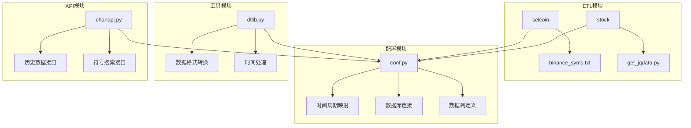
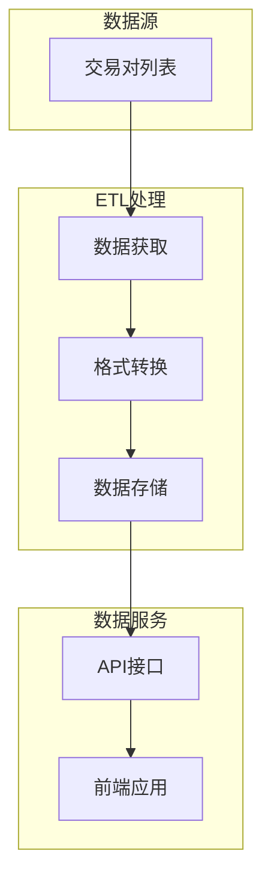
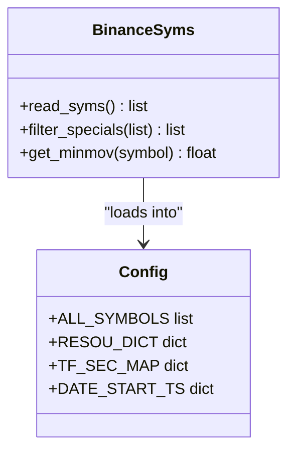
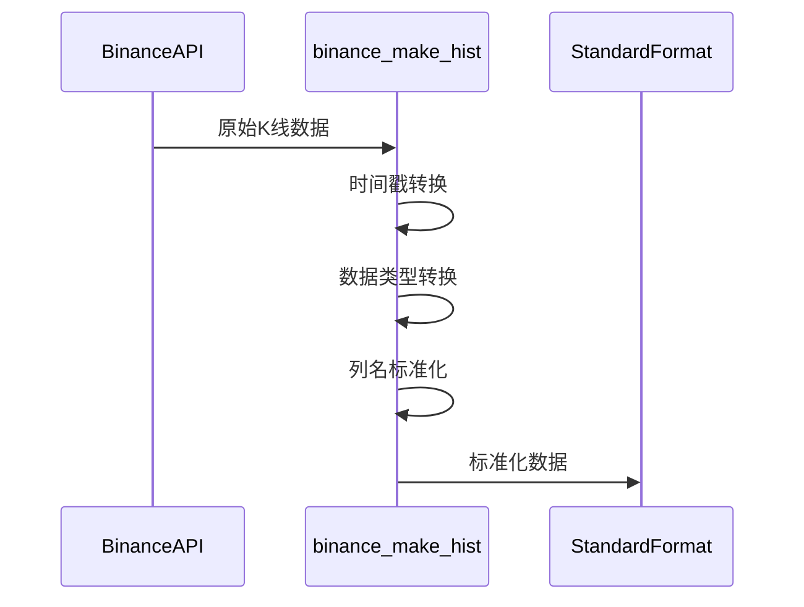
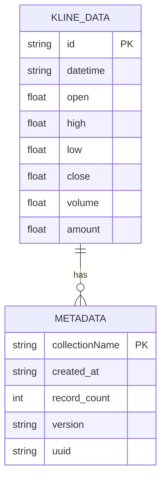
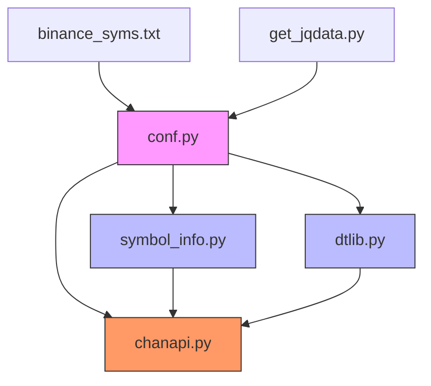

# 加密货币数据ETL流程

<cite>
**本文档引用的文件**
- [binance_syms.txt](file://hetl/selcoin/binance_syms.txt)
- [conf.py](file://comm/conf.py)
- [chanapi.py](file://api/chanapi.py)
- [symbol_info.py](file://api/symbol_info.py)
- [dtlib.py](file://utils/dtlib.py)
- [get_jqdata.py](file://hetl/stock/get_jqdata.py)
</cite>

## 目录
1. [项目结构](#项目结构)
2. [核心组件](#核心组件)
3. [架构概述](#架构概述)
4. [详细组件分析](#详细组件分析)
5. [依赖分析](#依赖分析)
6. [性能考虑](#性能考虑)
7. [故障排除指南](#故障排除指南)
8. [结论](#结论)

## 项目结构

该项目采用模块化设计，主要分为API接口、通用配置、数据存储、历史数据ETL处理、工具函数等模块。ETL流程主要集中在`hetl`模块中，特别是`selcoin`子模块负责加密货币数据的获取。

**图表来源**
- [conf.py](file://comm/conf.py)
- [binance_syms.txt](file://hetl/selcoin/binance_syms.txt)
- [get_jqdata.py](file://hetl/stock/get_jqdata.py)

**章节来源**
- [conf.py](file://comm/conf.py)
- [hetl/CLAUDE.md](file://hetl/CLAUDE.md)

## 核心组件

系统的核心组件包括交易对管理、数据获取、格式转换和存储。`binance_syms.txt`文件定义了需要获取数据的加密货币交易对，`conf.py`配置文件管理时间周期映射和数据库连接，`dtlib.py`提供数据格式转换功能，`chanapi.py`提供数据访问接口。

**章节来源**
- [conf.py](file://comm/conf.py#L88-L108)
- [dtlib.py](file://utils/dtlib.py#L109-L133)

## 架构概述

系统采用典型的ETL（抽取-转换-加载）架构，从Binance等交易所获取原始K线数据，经过格式标准化处理后存储到MongoDB数据库中，最后通过API接口提供给前端应用使用。

**图表来源**
- [conf.py](file://comm/conf.py)
- [dtlib.py](file://utils/dtlib.py)
- [chanapi.py](file://api/chanapi.py)

## 详细组件分析

### 数据获取与准备流程分析

#### 交易对列表管理
`hetl/selcoin/binance_syms.txt`文件管理着需要获取数据的加密货币交易对列表。每行包含交易对名称和最小变动单位，系统通过读取此文件来确定需要获取哪些交易对的数据。

**图表来源**
- [binance_syms.txt](file://hetl/selcoin/binance_syms.txt)
- [conf.py](file://comm/conf.py#L88-L108)

#### 数据获取与格式化
系统通过`dtlib.py`中的`binance_make_hist`函数将Binance API返回的原始数据转换为标准格式。转换过程包括时间戳处理、数据类型转换和列名标准化。

**图表来源**
- [dtlib.py](file://utils/dtlib.py#L110-L133)

#### 数据存储与命名规范
系统采用一致的命名规范存储数据，如`essence_xd_000001.XSHG_1d.metadata.json`，其中包含数据类型、股票代码、时间周期等信息，确保与MongoDB数据结构的一致性。

**图表来源**
- [data/nlchan/essence_xd_000001.XSHG_1d.metadata.json](file://data/nlchan/essence_xd_000001.XSHG_1d.metadata.json)
- [conf.py](file://comm/conf.py)

**章节来源**
- [dtlib.py](file://utils/dtlib.py#L65-L84)
- [conf.py](file://comm/conf.py#L58-L60)

## 依赖分析

系统各组件之间存在明确的依赖关系，`conf.py`作为核心配置文件被多个模块引用，`dtlib.py`提供通用的数据处理功能，`symbol_info.py`基于配置生成API可用的符号信息。

**图表来源**
- [conf.py](file://comm/conf.py)
- [symbol_info.py](file://api/symbol_info.py)
- [dtlib.py](file://utils/dtlib.py)
- [chanapi.py](file://api/chanapi.py)

**章节来源**
- [conf.py](file://comm/conf.py)
- [symbol_info.py](file://api/symbol_info.py)
- [dtlib.py](file://utils/dtlib.py)

## 性能考虑

系统在设计时考虑了性能因素，通过配置文件中的`DATE_START_TS`设置数据获取的起始时间，避免获取过多历史数据影响性能。同时，API接口通过分页和范围查询优化数据检索效率。

## 故障排除指南

当数据获取出现问题时，应首先检查`binance_syms.txt`文件格式是否正确，然后确认`conf.py`中的配置是否准确，最后验证网络连接和API访问权限。

**章节来源**
- [conf.py](file://comm/conf.py)
- [binance_syms.txt](file://hetl/selcoin/binance_syms.txt)

## 结论

该加密货币数据ETL流程设计合理，通过清晰的模块划分和标准化的数据处理流程，实现了从数据获取到服务提供的完整链条。系统具有良好的可扩展性，可以通过简单地修改配置文件来添加新的交易对或交易所。