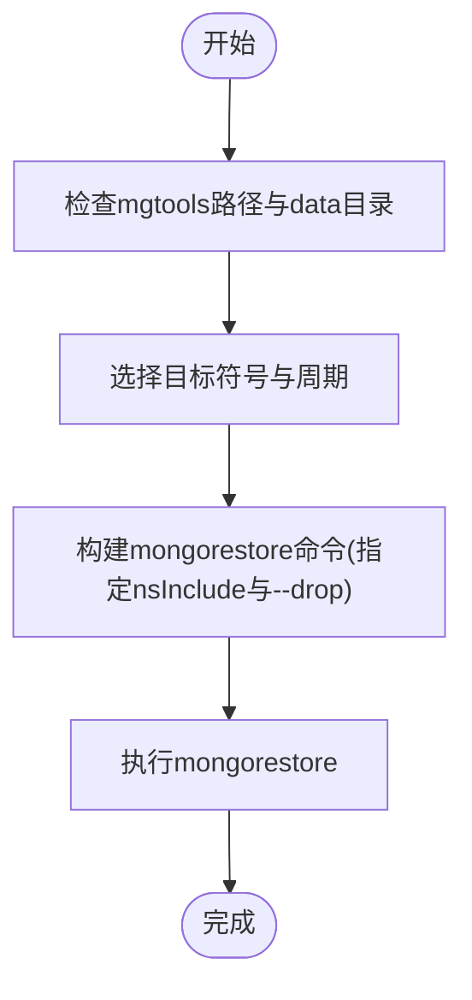

# 数据处理与ETL流程

<cite>
**本文引用的文件**
- [README.md](file://README.md)
- [get_jqdata.py](file://hetl/stock/get_jqdata.py)
- [restore_chanvis_mongo.sh](file://hetl/hmgo/restore_chanvis_mongo.sh)
- [conf.py](file://comm/conf.py)
- [dtlib.py](file://utils/dtlib.py)
- [nlchan.py](file://utils/nlchan.py)
- [binance_syms.txt](file://hetl/selcoin/binance_syms.txt)
- [chanapi.py](file://api/chanapi.py)
- [stk_000001.XSHG_1d.metadata.json](file://data/stock/stk_000001.XSHG_1d.metadata.json)
- [stock_names.metadata.json](file://data/stock/stock_names.metadata.json)
- [essence_xd_000001.XSHG_1d.metadata.json](file://data/nlchan/essence_xd_000001.XSHG_1d.metadata.json)
- [replay_config.metadata.json](file://data/config/replay_config.metadata.json)
</cite>

## 目录
1. [简介](#简介)
2. [项目结构](#项目结构)
3. [核心组件](#核心组件)
4. [架构总览](#架构总览)
5. [详细组件分析](#详细组件分析)
6. [依赖关系分析](#依赖关系分析)
7. [性能考量](#性能考量)
8. [故障排查指南](#故障排查指南)
9. [结论](#结论)
10. [附录](#附录)

## 简介
本文件聚焦于 hetl 模块中的 ETL 流程，系统性说明以下内容：
- 如何从聚宽（JQData）获取股票历史数据并进行清洗转换
- 如何使用 restore_chanvis_mongo.sh 将 data/ 目录下的 BSON 文件恢复到 MongoDB 数据库
- 数据导入的标准流程、执行命令与依赖环境
- 数据文件命名规则（如 stk_000001.XSHG_1d.metadata.json）与其对应的数据结构
- 扩展指南：如何添加新的数据源（如 Binance）或支持新的金融品种

## 项目结构
围绕数据处理与 ETL 的关键目录与文件如下：
- hetl/stock/get_jqdata.py：从 JQData 获取股票日线数据并写入 MongoDB stock 库
- hetl/hmgo/restore_chanvis_mongo.sh：将 data/ 下的 BSON 数据恢复到 MongoDB
- data/stock、data/nlchan、data/config：MongoDB 导入导出的 BSON 数据与集合元数据
- comm/conf.py：数据库连接、时间周期映射、集合命名模板等配置
- utils/dtlib.py：时间戳与时间字符串互转、K线标准化等工具
- api/chanapi.py：对外提供历史数据查询 API，读取 stock 与 ohlcv 数据库
- 其他：binance_syms.txt（币安符号清单）、nlchan.py（辅助函数）

图表来源
- [get_jqdata.py](file://hetl/stock/get_jqdata.py#L1-L100)
- [restore_chanvis_mongo.sh](file://hetl/hmgo/restore_chanvis_mongo.sh#L1-L30)
- [conf.py](file://comm/conf.py#L1-L166)
- [dtlib.py](file://utils/dtlib.py#L1-L207)
- [nlchan.py](file://utils/nlchan.py#L1-L25)
- [chanapi.py](file://api/chanapi.py#L1-L568)

章节来源
- [README.md](file://README.md#L107-L136)

## 核心组件
- JQData 数据采集与清洗
  - 通过 JQData SDK 获取股票、指数、基金的基础信息与日线行情
  - 清洗步骤：重命名索引、填充时间戳、过滤空量、标准化字段顺序
  - 写入目标：MongoDB stock 库名下的多个集合（stock_names、各股票日线集合）
- MongoDB 恢复脚本
  - 使用 mongorestore 指定命名空间（nsInclude）与 drop 选项，将 data/ 下的 BSON 恢复到本地 MongoDB
- 配置与工具
  - conf.py 提供数据库连接、时间周期映射、集合命名模板、时间窗口等
  - dtlib.py 提供时间转换、K线标准化、常用列名映射等
- API 层读取
  - chanapi.py 从 stock 与 ohlcv 数据库读取历史数据，支持多周期与回测场景

章节来源
- [get_jqdata.py](file://hetl/stock/get_jqdata.py#L1-L100)
- [restore_chanvis_mongo.sh](file://hetl/hmgo/restore_chanvis_mongo.sh#L1-L30)
- [conf.py](file://comm/conf.py#L1-L166)
- [dtlib.py](file://utils/dtlib.py#L1-L207)
- [chanapi.py](file://api/chanapi.py#L1-L235)

## 架构总览
下图展示从数据源到存储再到 API 查询的整体流程。

图表来源
- [get_jqdata.py](file://hetl/stock/get_jqdata.py#L1-L100)
- [chanapi.py](file://api/chanapi.py#L96-L235)
- [conf.py](file://comm/conf.py#L143-L166)

## 详细组件分析

### 组件A：JQData 数据采集与清洗（get_jqdata.py）
- 认证与初始化
  - 通过外部认证模块初始化 JQData SDK
  - 读取 conf.py 中的 STOCK_DB 连接
- 基础信息采集
  - 获取股票、指数、基金列表，写入 stock_names 集合
- 日线数据采集与清洗
  - 按股票代码循环拉取日线数据
  - 标准化字段：时间列重命名、时间字符串转时间戳、过滤零成交量、缺失值处理
  - 写入集合：stock 库名下以“stk_{symbol}_{tf}”命名的集合
- 批量处理
  - 控制起止日期、类型筛选（指数仅保留上证指数），并加入延时避免请求过快

图表来源
- [get_jqdata.py](file://hetl/stock/get_jqdata.py#L1-L100)
- [conf.py](file://comm/conf.py#L143-L146)
- [dtlib.py](file://utils/dtlib.py#L22-L37)

章节来源
- [get_jqdata.py](file://hetl/stock/get_jqdata.py#L1-L100)
- [dtlib.py](file://utils/dtlib.py#L22-L37)
- [conf.py](file://comm/conf.py#L143-L146)

### 组件B：MongoDB 恢复脚本（restore_chanvis_mongo.sh）
- 脚本职责
  - 使用 mongorestore 指定命名空间（如 stock.stk_000001.XSHG_1d、config.replay_config、stock.stock_names、nlchan.essence_xd_000001.XSHG_1d）并启用 drop 选项
  - 从 data/ 目录恢复 BSON 到本地 MongoDB
- 使用建议
  - 在执行前确保 MongoDB 服务已启动
  - 根据实际数据集调整符号与周期参数

图表来源
- [restore_chanvis_mongo.sh](file://hetl/hmgo/restore_chanvis_mongo.sh#L1-L30)

章节来源
- [restore_chanvis_mongo.sh](file://hetl/hmgo/restore_chanvis_mongo.sh#L1-L30)

### 组件C：数据文件命名规则与结构
- 命名规则
  - 股票日线集合：stk_{symbol}_{tf}
  - 缠论分析结果集合：essence_xd_{symbol}_{tf}
  - 配置集合：replay_config
  - 股票名称集合：stock_names
- 对应元数据文件
  - data/stock/stk_000001.XSHG_1d.metadata.json：集合元数据（索引、UUID、集合名等）
  - data/nlchan/essence_xd_000001.XSHG_1d.metadata.json：缠论集合元数据
  - data/config/replay_config.metadata.json：配置集合元数据
  - data/stock/stock_names.metadata.json：股票基础信息集合元数据
- 字段规范（来自 conf.py 与 dtlib.py）
  - 标准 K 线字段：id、datetime、open、high、low、close、volume、amount
  - 时间戳字段：ts（整秒时间戳）
  - 周期映射：1m、5m、30m、1h、4h、1d、1w 等

章节来源
- [stk_000001.XSHG_1d.metadata.json](file://data/stock/stk_000001.XSHG_1d.metadata.json#L1-L1)
- [essence_xd_000001.XSHG_1d.metadata.json](file://data/nlchan/essence_xd_000001.XSHG_1d.metadata.json#L1-L1)
- [replay_config.metadata.json](file://data/config/replay_config.metadata.json#L1-L1)
- [stock_names.metadata.json](file://data/stock/stock_names.metadata.json#L1-L1)
- [conf.py](file://comm/conf.py#L48-L65)
- [dtlib.py](file://utils/dtlib.py#L65-L86)

### 组件D：API 层读取与回测集成（chanapi.py）
- 接口职责
  - 提供历史数据查询接口，支持多周期与回测场景
  - 自动切换数据库（stock 或 ohlcv），根据 symbol 类型区分股票与币类
  - 支持部分周期（partial）数据拼接，保证小级别推进时大级别数据的完整性
- 关键流程
  - 解析参数（symbol、from、to、resolution）
  - 计算时间窗口与周期秒数映射
  - 查询对应集合并返回标准字段数组

图表来源
- [chanapi.py](file://api/chanapi.py#L96-L235)
- [conf.py](file://comm/conf.py#L23-L41)

章节来源
- [chanapi.py](file://api/chanapi.py#L96-L235)
- [conf.py](file://comm/conf.py#L23-L41)

## 依赖关系分析
- 组件耦合
  - get_jqdata.py 依赖 conf.py 提供的 STOCK_DB 连接与 dtlib.py 的时间转换
  - chanapi.py 依赖 conf.py 的数据库连接、分辨率映射与集合命名模板
- 外部依赖
  - JQData SDK（认证与数据拉取）
  - MongoDB 与 mongorestore/mongodump
  - Python 包：pandas、jqdatasdk、pymongo、arrow 等（见 requirements.txt）

图表来源
- [get_jqdata.py](file://hetl/stock/get_jqdata.py#L1-L100)
- [chanapi.py](file://api/chanapi.py#L1-L120)
- [conf.py](file://comm/conf.py#L143-L166)
- [restore_chanvis_mongo.sh](file://hetl/hmgo/restore_chanvis_mongo.sh#L1-L30)

章节来源
- [get_jqdata.py](file://hetl/stock/get_jqdata.py#L1-L100)
- [chanapi.py](file://api/chanapi.py#L1-L120)
- [conf.py](file://comm/conf.py#L143-L166)
- [restore_chanvis_mongo.sh](file://hetl/hmgo/restore_chanvis_mongo.sh#L1-L30)

## 性能考量
- 请求节流
  - get_jqdata.py 中对批量拉取设置了延时，避免触发 JQData 限流
- 数据清洗效率
  - 使用向量化操作（pandas）进行字段重命名、时间转换与过滤
- 存储与查询
  - 建议在 ts 字段建立索引，提升历史查询性能
  - 对高频周期（如 1m）建议分表或分区策略，降低单集合规模

[本节为通用指导，无需列出具体文件来源]

## 故障排查指南
- JQData 认证失败
  - 确认认证模块正确初始化，且登录凭据有效
  - 检查网络连通性与代理设置
- MongoDB 连接异常
  - 确认本地 MongoDB 服务已启动
  - 检查 conf.py 中的连接串与数据库权限
- 数据恢复失败
  - 确认 mongorestore 路径与 data/ 目录结构一致
  - 使用 nsInclude 精确匹配集合，避免误删其他集合
- 历史数据为空
  - 检查 symbol 与 tf 是否与集合命名一致
  - 核对时间窗口是否落在已有数据范围内

章节来源
- [get_jqdata.py](file://hetl/stock/get_jqdata.py#L1-L100)
- [restore_chanvis_mongo.sh](file://hetl/hmgo/restore_chanvis_mongo.sh#L1-L30)
- [conf.py](file://comm/conf.py#L143-L166)
- [chanapi.py](file://api/chanapi.py#L171-L235)

## 结论
本文件梳理了 hetl 模块中的 ETL 流程：从 JQData 获取原始日线数据，经过清洗与标准化后写入 MongoDB；并通过 restore_chanvis_mongo.sh 快速恢复数据；API 层统一读取并提供给前端可视化。通过明确的数据命名规则与配置模板，系统具备良好的扩展性，便于新增数据源与金融品种。

[本节为总结性内容，无需列出具体文件来源]

## 附录

### 数据导入标准流程与执行命令
- 从 JQData 导入
  - 运行 get_jqdata.py，先执行基础信息采集，再执行批量历史数据采集
  - 依赖：JQData SDK、MongoDB、pandas
- 从 BSON 恢复
  - 执行 restore_chanvis_mongo.sh，指定符号与周期，使用 mongorestore 恢复
  - 依赖：mongorestore、MongoDB

章节来源
- [get_jqdata.py](file://hetl/stock/get_jqdata.py#L1-L100)
- [restore_chanvis_mongo.sh](file://hetl/hmgo/restore_chanvis_mongo.sh#L1-L30)

### 数据文件命名规则与对应结构
- 集合命名
  - 股票日线：stk_{symbol}_{tf}
  - 缠论分析：essence_xd_{symbol}_{tf}
  - 配置：replay_config
  - 股票名称：stock_names
- 元数据文件
  - 各集合对应的 metadata.json 描述集合索引、UUID、集合名等
- 字段规范
  - 标准 K 线字段：id、datetime、open、high、low、close、volume、amount
  - 时间戳：ts（整秒）

章节来源
- [stk_000001.XSHG_1d.metadata.json](file://data/stock/stk_000001.XSHG_1d.metadata.json#L1-L1)
- [essence_xd_000001.XSHG_1d.metadata.json](file://data/nlchan/essence_xd_000001.XSHG_1d.metadata.json#L1-L1)
- [replay_config.metadata.json](file://data/config/replay_config.metadata.json#L1-L1)
- [stock_names.metadata.json](file://data/stock/stock_names.metadata.json#L1-L1)
- [conf.py](file://comm/conf.py#L48-L65)

### 扩展指南：新增数据源与金融品种
- 新增数据源（以 Binance 为例）
  - 准备符号清单：binance_syms.txt
  - 参考 dtlib.py 中的 make_hist、okex_make_hist、binance_make_hist 等函数，编写适配器函数，将 Binance 原始字段映射为标准 K 线字段
  - 在 conf.py 中维护 ALL_SYMBOLS 与 minmov 映射
  - 编写 ETL 脚本，调用 Binance API 拉取历史数据，清洗后写入对应集合（如 ohlcv.{symbol}_{tf}）
- 新增金融品种
  - 在 conf.py 中扩展 TF_SEC_MAP、RESOU_DICT、DTRANGE 等映射
  - 在 API 层（chanapi.py）增加对新品种的路由与查询逻辑
  - 在前端（ui/）中补充 symbol_info 与搜索逻辑

图表来源
- [binance_syms.txt](file://hetl/selcoin/binance_syms.txt#L1-L118)
- [dtlib.py](file://utils/dtlib.py#L65-L134)
- [conf.py](file://comm/conf.py#L88-L109)
- [nlchan.py](file://utils/nlchan.py#L1-L25)
- [chanapi.py](file://api/chanapi.py#L61-L95)

章节来源
- [binance_syms.txt](file://hetl/selcoin/binance_syms.txt#L1-L118)
- [dtlib.py](file://utils/dtlib.py#L65-L134)
- [conf.py](file://comm/conf.py#L88-L109)
- [nlchan.py](file://utils/nlchan.py#L1-L25)
- [chanapi.py](file://api/chanapi.py#L61-L95)