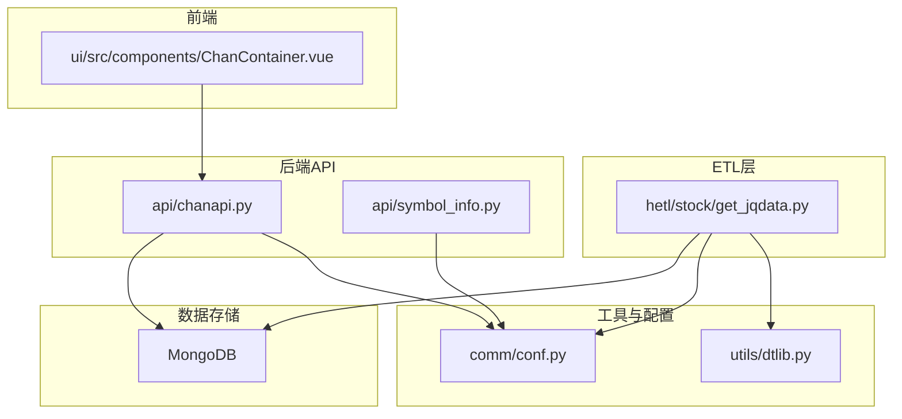
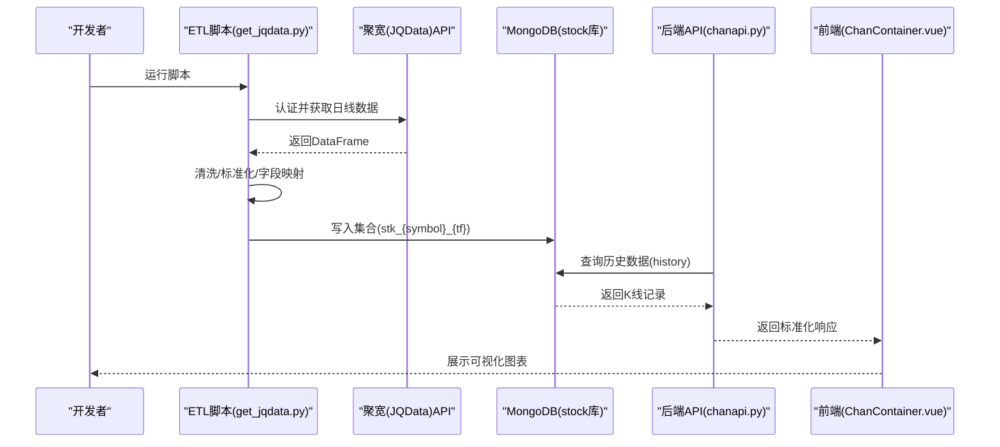
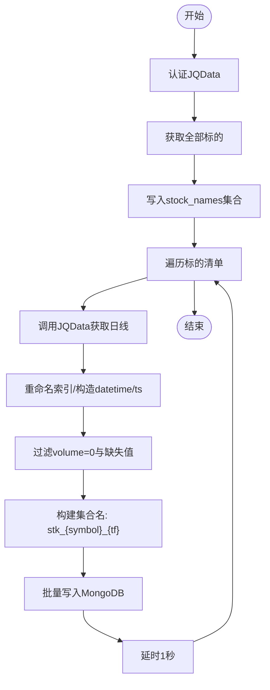
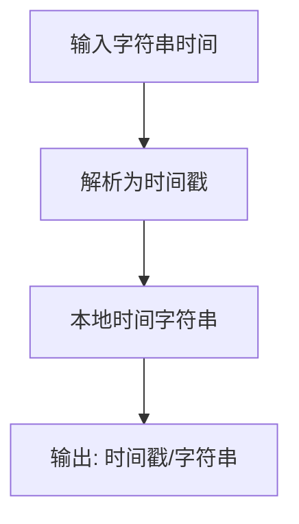
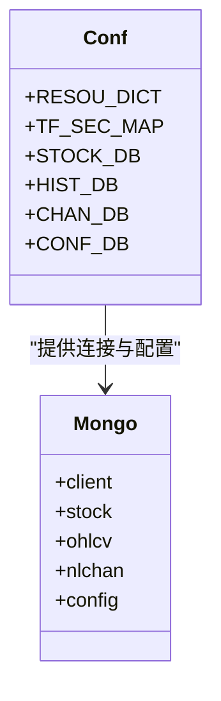
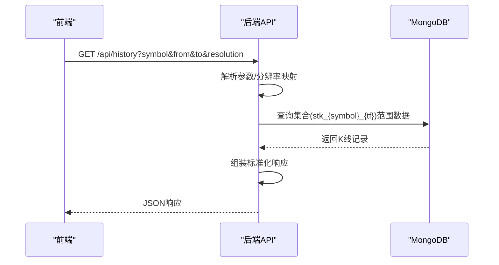
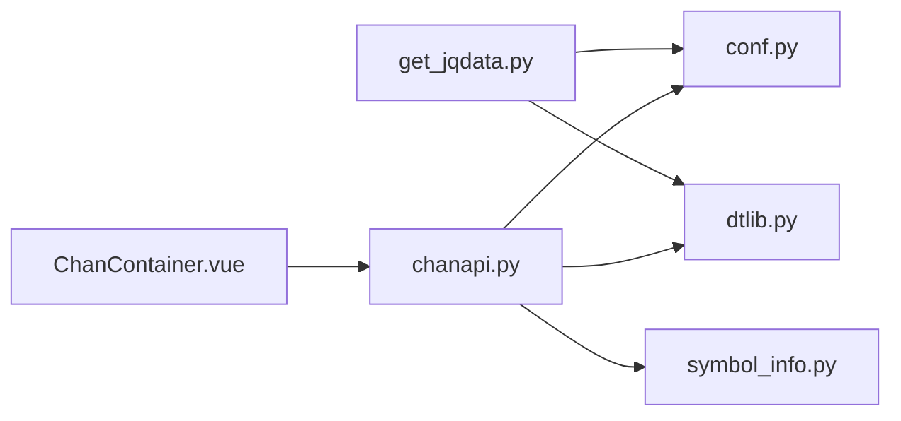

# 股票数据ETL流程

<cite>
**本文引用的文件**
- [get_jqdata.py](file://hetl/stock/get_jqdata.py)
- [dtlib.py](file://utils/dtlib.py)
- [conf.py](file://comm/conf.py)
- [chanapi.py](file://api/chanapi.py)
- [symbol_info.py](file://api/symbol_info.py)
- [README.md](file://README.md)
- [stk_000001.XSHG_1d.metadata.json](file://data/stock/stk_000001.XSHG_1d.metadata.json)
</cite>

## 目录
1. [简介](#简介)
2. [项目结构](#项目结构)
3. [核心组件](#核心组件)
4. [架构总览](#架构总览)
5. [详细组件分析](#详细组件分析)
6. [依赖关系分析](#依赖关系分析)
7. [性能考量](#性能考量)
8. [故障排查指南](#故障排查指南)
9. [结论](#结论)
10. [附录](#附录)

## 简介
本文件围绕 hetl/stock/get_jqdata.py 模块，系统性阐述其通过聚宽（JQData）API抓取股票历史K线数据的实现机制，覆盖数据获取、清洗、格式转换与标准化、以及最终写入MongoDB的完整ETL流程。文档同时解释时间周期参数（如1d、1w等）的处理逻辑，给出数据字段映射规则（时间戳转换、价格精度处理），并提供常见问题排查建议（API调用频率限制、网络超时等）。此外，还说明该模块在整个数据流中的位置，以及与后端API和前端可视化组件的关联。

## 项目结构
该项目采用前后端分离架构，数据ETL位于“hetl”目录，后端API服务位于“api”，通用配置与工具位于“comm”和“utils”，可视化前端位于“ui”。股票数据ETL负责从聚宽拉取K线，清洗标准化后写入MongoDB的stock库；后端API提供历史数据查询接口，前端通过TradingView本地SDK进行可视化。

图表来源
- [get_jqdata.py](file://hetl/stock/get_jqdata.py#L1-L100)
- [dtlib.py](file://utils/dtlib.py#L1-L207)
- [conf.py](file://comm/conf.py#L1-L166)
- [chanapi.py](file://api/chanapi.py#L1-L568)
- [symbol_info.py](file://api/symbol_info.py#L1-L74)

章节来源
- [README.md](file://README.md#L90-L136)

## 核心组件
- 聚宽数据获取与清洗：从JQData SDK读取日线数据，重命名索引、构造标准字段、过滤空量与缺失值，并写入MongoDB的stock库。
- 时间戳与日期转换：统一使用时间戳与本地时间字符串，确保前后端一致。
- 配置与连接：通过MongoDB客户端连接stock库，使用集合名规范存储不同周期的K线。
- 后端API对接：后端history接口按分辨率映射到数据库集合，提供给前端可视化组件使用。

章节来源
- [get_jqdata.py](file://hetl/stock/get_jqdata.py#L1-L100)
- [dtlib.py](file://utils/dtlib.py#L22-L63)
- [conf.py](file://comm/conf.py#L139-L166)
- [chanapi.py](file://api/chanapi.py#L96-L235)

## 架构总览
下图展示了从聚宽拉取数据到前端可视化的端到端流程，包括ETL阶段的数据清洗与入库、后端API的历史数据查询、以及前端通过TradingView SDK消费数据。

图表来源
- [get_jqdata.py](file://hetl/stock/get_jqdata.py#L33-L58)
- [chanapi.py](file://api/chanapi.py#L96-L235)
- [symbol_info.py](file://api/symbol_info.py#L47-L70)

## 详细组件分析

### 组件A：聚宽数据获取与清洗（get_jqdata.py）
- 认证与初始化
  - 通过jqauth模块对JQData SDK进行认证，避免硬编码登录信息。
  - 引入时间转换工具与MongoDB连接配置。
- 获取全部股票/指数/基金清单
  - 调用JQData接口获取所有标的，重置索引并写入stock库的stock_names集合。
- 日线数据获取与清洗
  - 以指定起止日期调用JQData获取日线，重置索引为日期列。
  - 将日期列替换为固定时区时间字符串（08:00:00），并转换为时间戳。
  - 仅保留标准字段：datetime、ts、open、high、low、close、volume，并过滤掉volume为0的记录。
  - 对缺失值进行删除，避免脏数据进入数据库。
  - 将清洗后的记录批量写入MongoDB对应集合（集合命名规则：stk_{symbol}_{tf}）。
- 全量历史数据拉取
  - 读取本地CSV或从stock_names集合读取标的清单，按类型与起始日期筛选。
  - 对指数仅保留上证指数，对起止日期进行边界修正，循环调用日线获取并插入数据库。
  - 在每次请求之间加入延时，降低API压力。

图表来源
- [get_jqdata.py](file://hetl/stock/get_jqdata.py#L18-L100)

章节来源
- [get_jqdata.py](file://hetl/stock/get_jqdata.py#L9-L16)
- [get_jqdata.py](file://hetl/stock/get_jqdata.py#L18-L32)
- [get_jqdata.py](file://hetl/stock/get_jqdata.py#L33-L58)
- [get_jqdata.py](file://hetl/stock/get_jqdata.py#L59-L91)

### 组件B：时间戳与日期转换（dtlib.py）
- 时间戳转换
  - 提供将字符串时间转换为整型时间戳的函数，保证统一的Unix时间戳格式。
- 日期本地化
  - 提供GMT时间到本地时间的转换，确保K线时间与本地时区一致。
- 时间戳到字符串
  - 提供将整型时间戳转换为本地时间字符串的函数，便于数据库与前端显示。

图表来源
- [dtlib.py](file://utils/dtlib.py#L22-L63)
- [dtlib.py](file://utils/dtlib.py#L148-L154)

章节来源
- [dtlib.py](file://utils/dtlib.py#L22-L63)
- [dtlib.py](file://utils/dtlib.py#L148-L154)

### 组件C：配置与MongoDB连接（conf.py）
- 分辨率映射
  - 定义分辨率到周期的映射关系，用于后端API将前端分辨率转换为数据库集合后缀。
- 周期秒数映射
  - 定义各周期对应的秒数，用于计算时间窗口与回测逻辑。
- MongoDB连接
  - 建立MongoDB客户端连接，分别指向nlchan、ohlcv、stock、config四个数据库，供各模块使用。
- 集合命名规范
  - 定义股票K线集合命名规则：stk_{symbol}_{tf}，确保ETL与后端查询一致性。

图表来源
- [conf.py](file://comm/conf.py#L12-L31)
- [conf.py](file://comm/conf.py#L139-L166)

章节来源
- [conf.py](file://comm/conf.py#L12-L31)
- [conf.py](file://comm/conf.py#L139-L166)

### 组件D：后端API历史数据查询（chanapi.py）
- 接口路径
  - /api/history：接收symbol、from、to、resolution参数，返回标准化的历史K线数据。
- 分辨率映射
  - 将前端分辨率映射到内部周期tf，如"D"映射为"1d"，"W"映射为"1w"。
- 数据库查询
  - 根据symbol与tf拼接集合名，查询指定时间范围内的K线记录，按时间升序返回。
- 周期与回测控制
  - 结合回放配置，处理部分K线（partial）与回测时间窗口，确保线上回测一致性。
- 响应格式
  - 返回包含状态码、时间数组、开盘价数组、最高价数组、最低价数组、收盘价数组、成交量数组的标准结构。

图表来源
- [chanapi.py](file://api/chanapi.py#L96-L235)

章节来源
- [chanapi.py](file://api/chanapi.py#L96-L235)

### 组件E：股票符号与前端支持（symbol_info.py）
- 股票符号列表
  - 从stock库的stock_names集合读取股票代码、名称等信息，组装成前端可搜索的符号列表。
- 前端配置
  - 为股票符号设置价格精度、时区、会话、内盘多乘数等，确保前端正确渲染与交互。

章节来源
- [symbol_info.py](file://api/symbol_info.py#L47-L70)

## 依赖关系分析
- get_jqdata.py 依赖
  - utils/dtlib.py：时间戳与日期转换工具。
  - comm/conf.py：MongoDB连接与集合命名规范。
- 后端API依赖
  - comm/conf.py：分辨率映射、周期秒数、数据库连接。
  - utils/dtlib.py：时间戳与字符串互转。
  - api/symbol_info.py：股票符号列表，用于前端搜索与展示。
- 前端依赖
  - 后端API接口，提供历史数据与标记点等。

图表来源
- [get_jqdata.py](file://hetl/stock/get_jqdata.py#L1-L16)
- [dtlib.py](file://utils/dtlib.py#L1-L207)
- [conf.py](file://comm/conf.py#L1-L166)
- [chanapi.py](file://api/chanapi.py#L1-L568)
- [symbol_info.py](file://api/symbol_info.py#L1-L74)

章节来源
- [get_jqdata.py](file://hetl/stock/get_jqdata.py#L1-L16)
- [chanapi.py](file://api/chanapi.py#L1-L568)

## 性能考量
- API调用节流
  - 在全量拉取过程中，每批次请求间增加延时，避免触发聚宽API限流。
- 数据清洗效率
  - 使用向量化操作（如apply、query）进行字段映射与过滤，减少循环开销。
- 批量写入
  - 使用批量插入减少网络往返次数，提升入库速度。
- 时间窗口控制
  - 后端按分辨率映射周期秒数，合理设置查询范围，避免一次性返回过多数据导致内存压力。

[本节为通用性能建议，无需特定文件引用]

## 故障排查指南
- 聚宽认证失败
  - 确认jqauth模块已正确初始化，避免在代码中硬编码用户名密码。
  - 如需临时调试，可参考脚本中的注释提示，使用替代认证方式。
- API调用频率限制
  - 在全量拉取时增加延时，分批处理，避免短时间内大量请求。
- 网络超时与异常
  - 对JQData接口调用增加重试与异常捕获，必要时分段重试。
- 数据缺失与空量
  - 清洗阶段已过滤volume为0与缺失值，若仍出现异常，检查原始数据质量与起止日期边界。
- MongoDB写入失败
  - 确认MongoDB服务运行正常，集合命名与权限配置正确；检查集合索引是否存在。
- 前端数据为空
  - 检查后端history接口参数是否正确（symbol、resolution、from、to），确认数据库中对应集合存在且有数据。

章节来源
- [get_jqdata.py](file://hetl/stock/get_jqdata.py#L9-L16)
- [get_jqdata.py](file://hetl/stock/get_jqdata.py#L59-L91)
- [chanapi.py](file://api/chanapi.py#L96-L235)

## 结论
hetl/stock/get_jqdata.py模块实现了从聚宽拉取股票日线数据的完整ETL流程，涵盖认证、数据获取、清洗、标准化与入库。通过统一的时间戳与日期转换、严格的字段映射与过滤，确保数据质量与前后端一致性。配合后端API的历史数据查询接口与前端可视化组件，形成了从数据采集到可视化的闭环。建议在生产环境中进一步增强错误处理与监控告警，以提升稳定性与可观测性。

[本节为总结性内容，无需特定文件引用]

## 附录

### 数据字段映射规则
- 输入字段
  - 聚宽返回的原始字段包含日期与OHLCV等。
- 标准化字段
  - 输出字段：datetime、ts、open、high、low、close、volume。
- 映射与转换
  - 日期列重命名为dt，再构造datetime字符串（固定时区时间），并转换为时间戳ts。
  - 价格字段统一转换为数值类型，volume过滤为非零记录。
  - 最终仅保留标准字段并按顺序排列。

章节来源
- [get_jqdata.py](file://hetl/stock/get_jqdata.py#L33-L58)

### 时间周期参数处理逻辑
- 分辨率到周期映射
  - 前端分辨率如"D"映射为"1d"，"W"映射为"1w"，后端据此确定数据库集合后缀。
- 周期秒数映射
  - 不同周期对应秒数，用于计算时间窗口与回测逻辑。
- 集合命名规范
  - 集合名为stk_{symbol}_{tf}，确保ETL与后端查询一致。

章节来源
- [conf.py](file://comm/conf.py#L12-L31)
- [conf.py](file://comm/conf.py#L139-L166)
- [get_jqdata.py](file://hetl/stock/get_jqdata.py#L52-L57)

### 执行流程示例（路径指引）
- 运行全量历史拉取
  - 路径：[get_all_history](file://hetl/stock/get_jqdata.py#L59-L91)
- 获取单个标的日线并写入
  - 路径：[get_day_hist](file://hetl/stock/get_jqdata.py#L33-L58)
- 获取全部标的清单并写入
  - 路径：[get_all_secs](file://hetl/stock/get_jqdata.py#L18-L32)

### 数据存储与集合命名
- 集合命名
  - 股票K线集合：stk_{symbol}_{tf}
- 示例集合元数据
  - [stk_000001.XSHG_1d.metadata.json](file://data/stock/stk_000001.XSHG_1d.metadata.json#L1-L1)