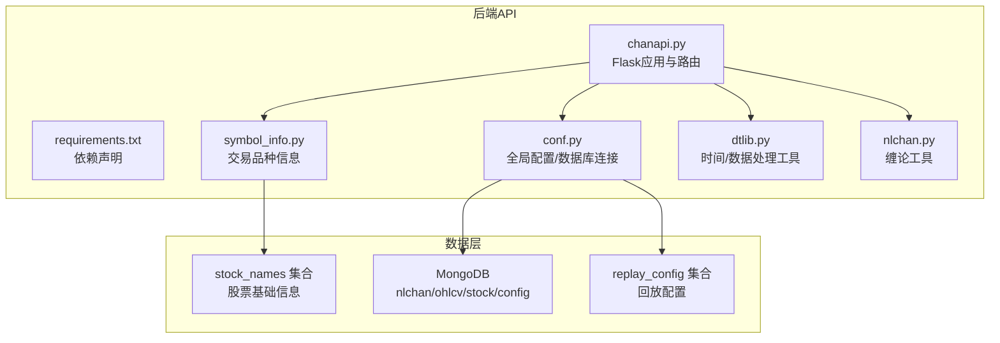
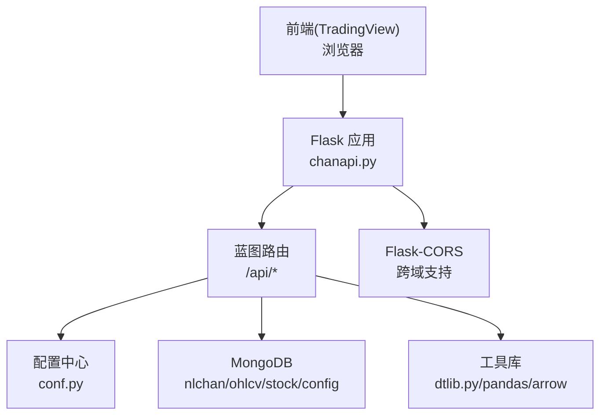
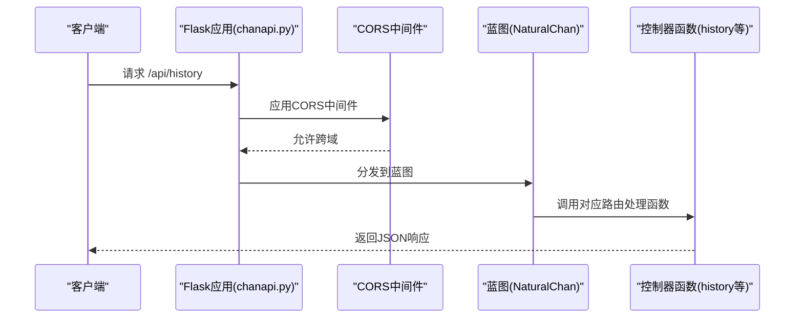
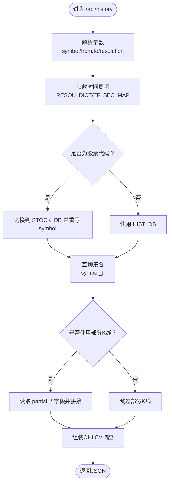
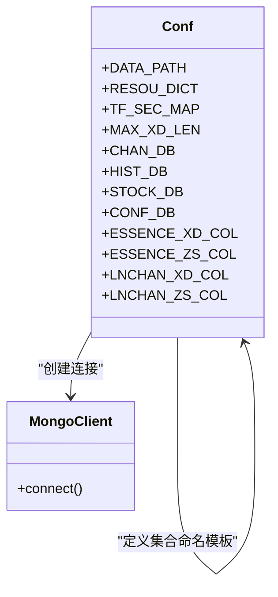
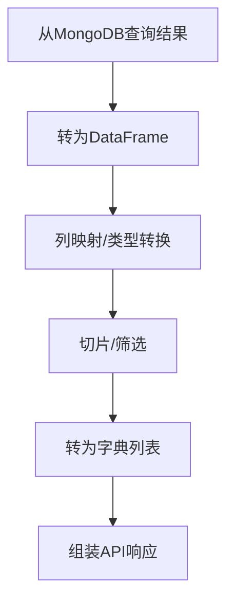
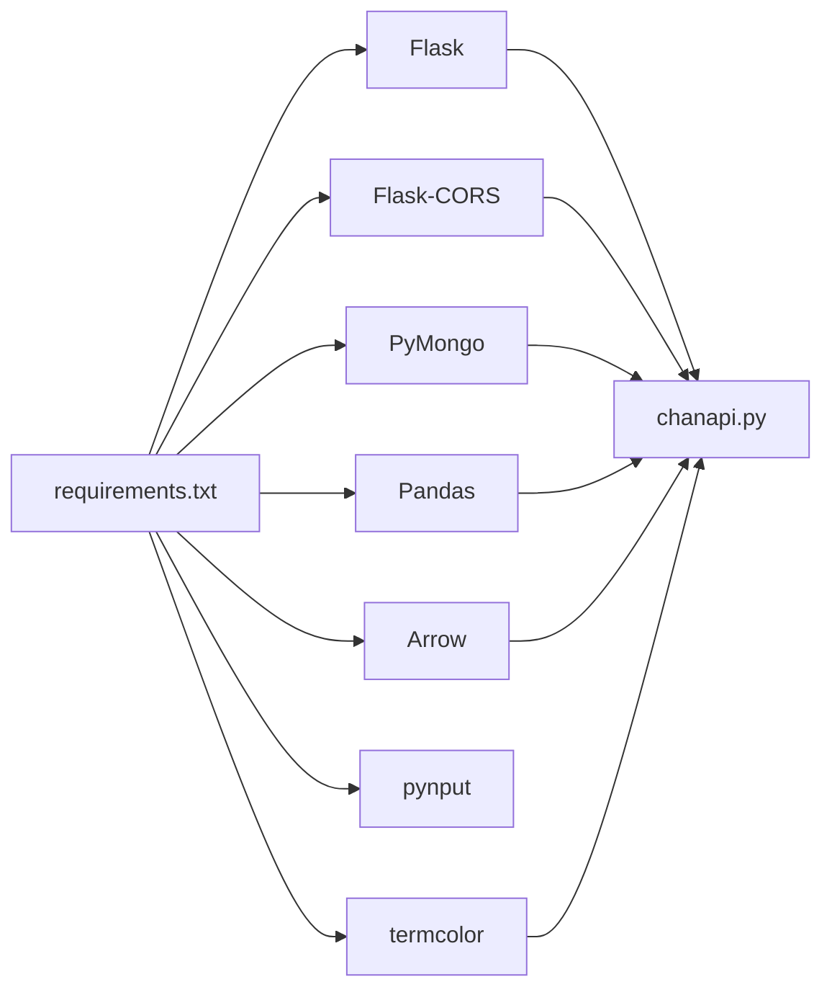

# 后端技术栈

<cite>
**本文引用的文件**
- [chanapi.py](file://api/chanapi.py)
- [requirements.txt](file://api/requirements.txt)
- [conf.py](file://comm/conf.py)
- [symbol_info.py](file://api/symbol_info.py)
- [dtlib.py](file://utils/dtlib.py)
- [nlchan.py](file://utils/nlchan.py)
- [README.md](file://README.md)
- [CLAUDE.md](file://api/CLAUDE.md)
- [restore_chanvis_mongo.sh](file://hetl/hmgo/restore_chanvis_mongo.sh)
- [get_jqdata.py](file://hetl/stock/get_jqdata.py)
</cite>

## 目录
1. [简介](#简介)
2. [项目结构](#项目结构)
3. [核心组件](#核心组件)
4. [架构总览](#架构总览)
5. [详细组件分析](#详细组件分析)
6. [依赖关系分析](#依赖关系分析)
7. [性能考量](#性能考量)
8. [故障排查指南](#故障排查指南)
9. [结论](#结论)
10. [附录](#附录)

## 简介
本文件面向后端技术栈文档目标，聚焦于使用 Python Flask 微框架构建 RESTful API 服务，围绕以下主题展开：
- Flask 与 Flask-CORS 的集成以支持跨域请求
- PyMongo 连接 MongoDB 数据库，读取 K 线与缠论结构数据
- Pandas 用于数据清洗与处理
- Arrow 用于时间序列转换
- requirements.txt 中依赖项的作用说明（含 pynput、termcolor）
- 基于 chanapi.py 的路由定义，说明 API 如何响应前端请求
- 基于 conf.py 的全局配置，管理数据库连接与路径设置
- Python 3.6+ 环境搭建与依赖安装指引

## 项目结构
后端 API 位于 api 目录，核心文件包括：
- 主程序与路由：chanapi.py
- 依赖声明：requirements.txt
- 全局配置：comm/conf.py
- 品种信息：api/symbol_info.py
- 工具库：utils/dtlib.py、utils/nlchan.py
- 数据导入脚本：hetl/stock/get_jqdata.py
- MongoDB 数据恢复脚本：hetl/hmgo/restore_chanvis_mongo.sh
- 项目说明与 API 文档：README.md、api/CLAUDE.md

图表来源
- [chanapi.py](file://api/chanapi.py#L1-L60)
- [requirements.txt](file://api/requirements.txt#L1-L9)
- [symbol_info.py](file://api/symbol_info.py#L1-L74)
- [conf.py](file://comm/conf.py#L1-L166)

章节来源
- [README.md](file://README.md#L90-L136)
- [CLAUDE.md](file://api/CLAUDE.md#L1-L40)

## 核心组件
- Flask 应用与蓝图：在主程序中创建 Flask 应用与蓝图，注册路由，提供 RESTful 接口。
- 路由与控制器：定义 /api/config、/api/search、/api/symbols、/api/history、/api/time、/api/get_bspoint、/api/bzxd_mark、/api/bzzs_mark、/api/get_upper_fx 等接口。
- 跨域支持：在开发模式下启用 Flask-CORS，允许前端跨域访问。
- 数据库连接：通过 PyMongo 连接本地 MongoDB，分别访问 nlchan、ohlcv、stock、config 数据库。
- 数据处理：使用 Arrow 进行时间处理，Pandas 进行数据清洗与转换，dtlib 提供时间戳与字符串互转、数据标准化等工具。
- 配置管理：conf.py 统一管理路径、时间周期映射、数据库连接、集合命名等全局配置。
- 品种信息：symbol_info.py 从配置与数据库中生成支持的交易品种列表，供前端搜索与展示。

章节来源
- [chanapi.py](file://api/chanapi.py#L41-L568)
- [requirements.txt](file://api/requirements.txt#L1-L9)
- [conf.py](file://comm/conf.py#L1-L166)
- [symbol_info.py](file://api/symbol_info.py#L1-L74)
- [dtlib.py](file://utils/dtlib.py#L1-L207)
- [nlchan.py](file://utils/nlchan.py#L1-L25)

## 架构总览
后端采用“微服务式”的 API 设计，以 Flask 提供 RESTful 接口，通过 PyMongo 访问 MongoDB 存储层，使用 Pandas/Arrow 进行数据处理与时间转换，配合 conf.py 的集中配置实现灵活扩展。

图表来源
- [chanapi.py](file://api/chanapi.py#L560-L568)
- [conf.py](file://comm/conf.py#L143-L158)
- [requirements.txt](file://api/requirements.txt#L1-L9)

## 详细组件分析

### Flask 应用与蓝图
- 应用创建与蓝图注册：在主程序中创建 Flask 应用并注册名为 NaturalChan 的蓝图，统一挂载到根路径。
- 路由组织：所有 /api/* 路由均在蓝图内定义，便于模块化管理。
- 跨域配置：在开发模式下直接在主程序中启用 CORS，支持凭据传递。

图表来源
- [chanapi.py](file://api/chanapi.py#L560-L568)
- [chanapi.py](file://api/chanapi.py#L96-L235)

章节来源
- [chanapi.py](file://api/chanapi.py#L23-L39)
- [chanapi.py](file://api/chanapi.py#L560-L568)

### 路由与数据接口
- /api/config：返回 TradingView 图表配置，包含支持的时间周期与功能开关。
- /api/search：根据关键词搜索支持的交易品种。
- /api/symbols：根据 symbol 返回具体品种信息。
- /api/history：查询 K 线历史数据，支持多周期与回测时间限制，返回标准 OHLCV 字段。
- /api/time：返回时间戳。
- /api/get_bspoint：读取 CSV 文件返回买卖点标记。
- /api/bzxd_mark /api/bzzs_mark：查询缠论结构标记数据，按不同标记类型过滤。
- /api/get_upper_fx：按上级周期聚合上下轨区间数据。

图表来源
- [chanapi.py](file://api/chanapi.py#L96-L235)
- [conf.py](file://comm/conf.py#L12-L31)
- [conf.py](file://comm/conf.py#L143-L158)

章节来源
- [chanapi.py](file://api/chanapi.py#L41-L235)
- [chanapi.py](file://api/chanapi.py#L237-L558)

### 跨域支持（Flask-CORS）
- 在主程序中导入并启用 CORS，支持凭据传递，确保前端跨域访问 API。
- 仅在开发模式下启用，生产环境建议通过反向代理或网关统一处理跨域。

章节来源
- [chanapi.py](file://api/chanapi.py#L563-L567)
- [requirements.txt](file://api/requirements.txt#L1-L9)

### 数据库连接与配置（PyMongo + conf.py）
- 数据库连接：通过 MongoClient 连接到本地 MongoDB，默认端口 27017。
- 数据库命名空间：
  - nlchan：存放缠论结构数据集合
  - ohlcv：存放 K 线历史数据集合
  - stock：存放股票基础信息集合
  - config：存放配置数据集合（如回放配置）
- 集合命名模板：通过 ESSENCE_XD_COL、ESSENCE_ZS_COL、LNCHAN_XD_COL、LNCHAN_ZS_COL 等模板生成集合名。
- 全局配置：DATA_PATH、RESOU_DICT、TF_SEC_MAP、MAX_XD_LEN 等集中管理。

图表来源
- [conf.py](file://comm/conf.py#L1-L166)

章节来源
- [conf.py](file://comm/conf.py#L143-L158)
- [restore_chanvis_mongo.sh](file://hetl/hmgo/restore_chanvis_mongo.sh#L1-L29)

### 数据处理与时间序列（Pandas + Arrow + dtlib）
- Arrow：用于时间戳与字符串的便捷转换与时间计算。
- Pandas：在部分接口中将查询结果转为 DataFrame，进行切片与列映射，提升数据处理效率。
- dtlib：提供时间戳与字符串互转、GMT 与本地时间转换、K线数据标准化等工具函数。

图表来源
- [chanapi.py](file://api/chanapi.py#L527-L557)
- [dtlib.py](file://utils/dtlib.py#L65-L107)
- [dtlib.py](file://utils/dtlib.py#L110-L133)

章节来源
- [chanapi.py](file://api/chanapi.py#L527-L557)
- [dtlib.py](file://utils/dtlib.py#L1-L207)

### 品种信息与回放配置
- 品种信息：symbol_info.py 从配置与数据库中生成支持的交易品种列表，包含最小变动单位、价格精度、交易时段等。
- 回放配置：conf.py 中维护 replay_config 集合，记录当前时间戳与各周期时间戳，用于控制回测边界与部分 K 线的拼接。

章节来源
- [symbol_info.py](file://api/symbol_info.py#L1-L74)
- [conf.py](file://comm/conf.py#L143-L158)

## 依赖关系分析
- 依赖声明：requirements.txt 明确列出 Flask、Flask-CORS、Arrow、PyMongo、Pandas、pynput、termcolor 等依赖。
- 运行时关系：
  - Flask 提供 Web 服务与路由
  - Flask-CORS 解决跨域
  - PyMongo 连接 MongoDB
  - Pandas/Arrow 用于数据处理与时间转换
  - pynput 用于系统级输入监控（调试用途）
  - termcolor 用于终端日志着色

图表来源
- [requirements.txt](file://api/requirements.txt#L1-L9)
- [chanapi.py](file://api/chanapi.py#L1-L20)

章节来源
- [requirements.txt](file://api/requirements.txt#L1-L9)

## 性能考量
- 查询优化：为高频查询字段建立索引（如 ts、datetime），减少扫描范围。
- 分页与限流：对大数据量接口增加分页与速率限制，避免一次性返回过多数据。
- 缓存策略：对静态配置与不常变化的数据引入缓存（如 Redis），降低数据库压力。
- 数据预处理：在入库阶段完成必要的清洗与标准化，减少运行时开销。
- 日志与监控：利用 termcolor 输出关键信息，结合日志系统定位性能瓶颈。

[本节为通用指导，无需特定文件来源]

## 故障排查指南
- MongoDB 连接失败：确认本地 MongoDB 已启动且端口为 27017；检查 conf.py 中连接串与数据库命名空间。
- 跨域报错：确认已启用 CORS；若为生产环境，检查反向代理或网关的跨域头配置。
- 时间转换异常：核对 dtlib 中时间戳与字符串格式；确保 Arrow 的时间处理逻辑一致。
- 响应为空：检查 /api/history 的时间范围与部分 K 线拼接逻辑；确认 replay_config 中当前时间戳与周期映射正确。
- 依赖缺失：执行 requirements.txt 中的安装命令，确保 Python 3.6+ 环境满足。

章节来源
- [conf.py](file://comm/conf.py#L143-L158)
- [chanapi.py](file://api/chanapi.py#L153-L207)
- [requirements.txt](file://api/requirements.txt#L1-L9)

## 结论
本后端技术栈以 Flask 为核心，结合 Flask-CORS、PyMongo、Pandas、Arrow、termcolor 等库，实现了面向 TradingView 的 RESTful API 服务。通过 conf.py 集中管理配置与数据库连接，配合 symbol_info.py 与 dtlib 工具，能够高效地提供 K 线与缠论结构数据查询。建议在生产环境中进一步完善跨域策略、数据库索引、缓存与监控体系，以提升稳定性与性能。

[本节为总结性内容，无需特定文件来源]

## 附录

### Python 3.6+ 环境搭建与依赖安装
- 环境要求：Python 3.6+
- 安装依赖：在项目根目录执行安装命令，安装 requirements.txt 中声明的所有依赖。
- 启动服务：在项目根目录运行主程序，启动 Flask 应用，默认监听 127.0.0.1:8421。

章节来源
- [CLAUDE.md](file://api/CLAUDE.md#L17-L36)
- [requirements.txt](file://api/requirements.txt#L1-L9)

### 数据导入与恢复
- MongoDB 数据恢复：使用 hetl/hmgo/restore_chanvis_mongo.sh 脚本导入示例数据（股票、回放配置、缠论结构等）。
- 股票数据采集：使用 hetl/stock/get_jqdata.py 从聚宽数据源抓取股票日线数据并写入 MongoDB。

章节来源
- [restore_chanvis_mongo.sh](file://hetl/hmgo/restore_chanvis_mongo.sh#L1-L29)
- [get_jqdata.py](file://hetl/stock/get_jqdata.py#L1-L99)