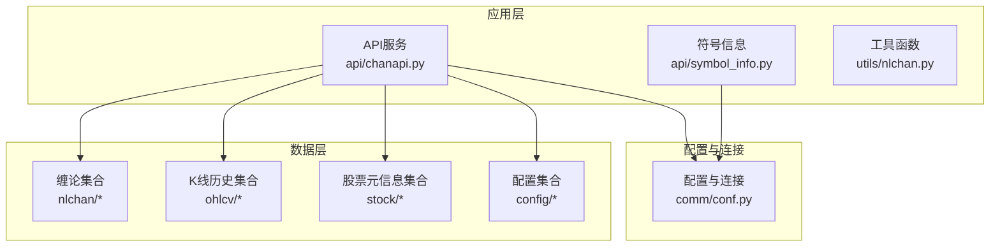
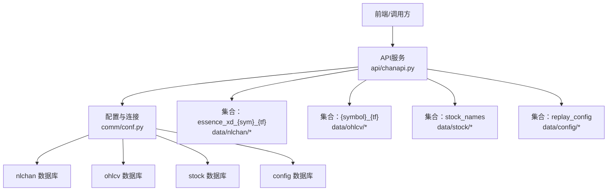
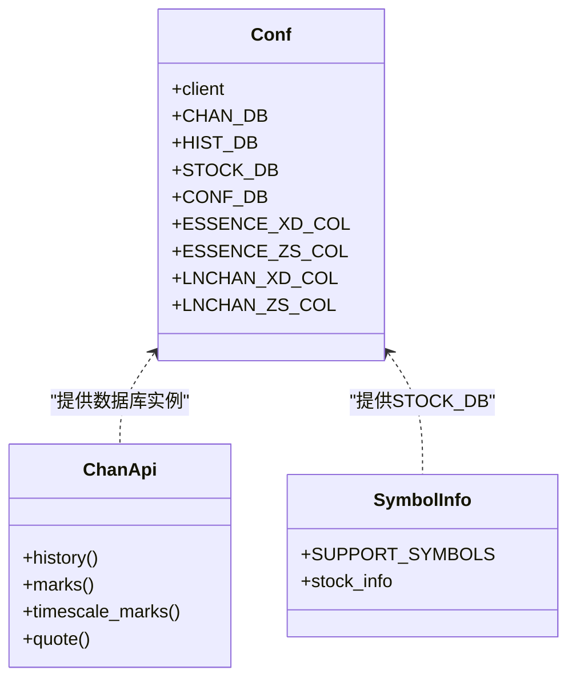
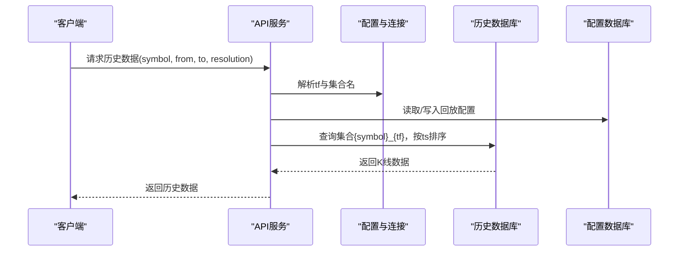
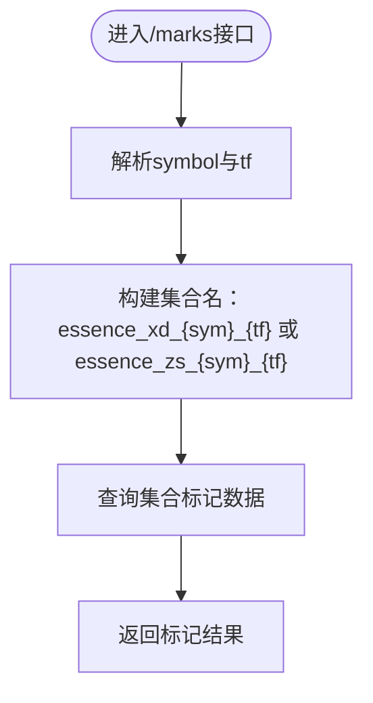
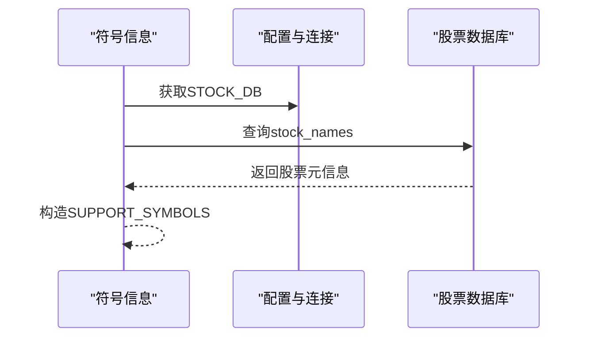
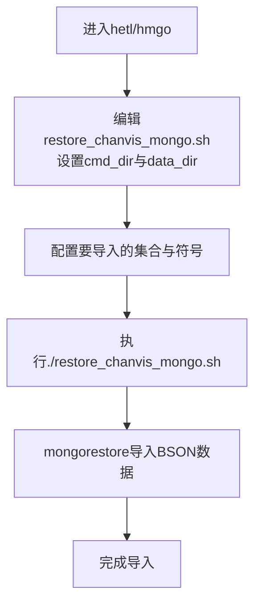
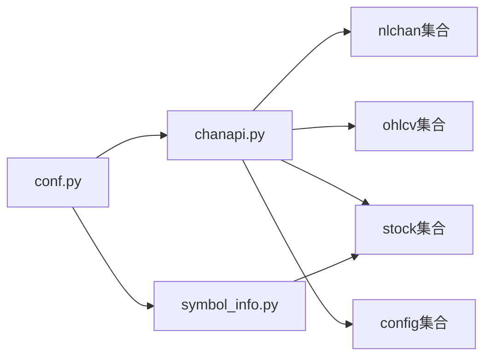

# 数据存储方案

<cite>
**本文引用的文件**
- [comm/conf.py](file://comm/conf.py)
- [api/chanapi.py](file://api/chanapi.py)
- [api/symbol_info.py](file://api/symbol_info.py)
- [utils/nlchan.py](file://utils/nlchan.py)
- [hetl/hmgo/restore_chanvis_mongo.sh](file://hetl/hmgo/restore_chanvis_mongo.sh)
- [data/nlchan/essence_xd_000001.XSHG_1d.metadata.json](file://data/nlchan/essence_xd_000001.XSHG_1d.metadata.json)
- [data/stock/stock_names.metadata.json](file://data/stock/stock_names.metadata.json)
- [data/config/replay_config.metadata.json](file://data/config/replay_config.metadata.json)
- [data/stock/stk_000001.XSHG_1d.metadata.json](file://data/stock/stk_000001.XSHG_1d.metadata.json)
- [data/CLAUDE.md](file://data/CLAUDE.md)
- [README.md](file://README.md)
- [api/CLAUDE.md](file://api/CLAUDE.md)
</cite>

## 目录
1. [简介](#简介)
2. [项目结构](#项目结构)
3. [核心组件](#核心组件)
4. [架构总览](#架构总览)
5. [详细组件分析](#详细组件分析)
6. [依赖分析](#依赖分析)
7. [性能考虑](#性能考虑)
8. [故障排查指南](#故障排查指南)
9. [结论](#结论)
10. [附录](#附录)

## 简介
本文件面向MongoDB作为核心数据存储引擎的设计，围绕conf.py中通过PyMongo连接多个数据库（nlchan、ohlcv、stock、config）进行说明，解释各数据库用途：CHAN_DB用于存储缠论线段与中枢结构，HIST_DB用于保存原始K线数据，STOCK_DB用于管理股票元信息。结合metadata.json文件说明集合命名规范（如essence_xd_{sym}_{tf}）与索引策略，并阐述选择MongoDB而非关系型数据库的原因，使其能够灵活支撑金融时序数据模型。同时提供数据库初始化脚本restore_chanvis_mongo.sh的使用方法，并给出性能优化建议（分片策略、查询缓存等）。

## 项目结构
- 数据层位于data目录，包含config、nlchan、stock三个子目录，分别对应config、nlchan、stock三类集合。
- 配置与连接集中在comm/conf.py，负责MongoDB客户端、数据库实例、集合命名模板等。
- API层通过api/chanapi.py访问数据库，按需读取历史K线、缠论标记、股票元信息等。
- 恢复脚本位于hetl/hmgo/restore_chanvis_mongo.sh，用于导入BSON数据至MongoDB。



图表来源
- [comm/conf.py](file://comm/conf.py#L139-L166)
- [api/chanapi.py](file://api/chanapi.py#L17-L21)
- [api/symbol_info.py](file://api/symbol_info.py#L1-L10)
- [README.md](file://README.md#L107-L137)

章节来源
- [README.md](file://README.md#L107-L137)

## 核心组件
- MongoDB客户端与数据库实例
  - 在conf.py中创建MongoDB客户端并建立四个数据库实例：CHAN_DB（nlchan）、HIST_DB（ohlcv）、STOCK_DB（stock）、CONF_DB（config）。
- 集合命名规范
  - 通过模板变量定义essence_xd、essence_zs、lnchan_xd、lnchan_zs等集合命名模式，其中{sym}表示交易标的，{tf}表示时间周期。
- 数据库用途
  - nlchan：存储缠论分析结果（线段、中枢等）。
  - ohlcv：存储原始K线历史数据。
  - stock：存储股票元信息（如股票名称、代码等）。
  - config：存储运行配置（如回放配置）。
- 元数据与索引
  - metadata.json文件记录集合的索引、UUID、集合名等信息，便于数据恢复与一致性校验。

章节来源
- [comm/conf.py](file://comm/conf.py#L139-L166)
- [data/nlchan/essence_xd_000001.XSHG_1d.metadata.json](file://data/nlchan/essence_xd_000001.XSHG_1d.metadata.json#L1-L1)
- [data/stock/stock_names.metadata.json](file://data/stock/stock_names.metadata.json#L1-L1)
- [data/config/replay_config.metadata.json](file://data/config/replay_config.metadata.json#L1-L1)

## 架构总览
下图展示了API如何通过conf.py中的数据库实例访问不同集合，以及集合命名规则如何与符号和时间周期关联。



图表来源
- [comm/conf.py](file://comm/conf.py#L139-L166)
- [api/chanapi.py](file://api/chanapi.py#L17-L21)
- [data/nlchan/essence_xd_000001.XSHG_1d.metadata.json](file://data/nlchan/essence_xd_000001.XSHG_1d.metadata.json#L1-L1)
- [data/stock/stock_names.metadata.json](file://data/stock/stock_names.metadata.json#L1-L1)
- [data/config/replay_config.metadata.json](file://data/config/replay_config.metadata.json#L1-L1)

## 详细组件分析

### 组件A：数据库连接与集合命名
- 连接方式
  - 通过PyMongo在本地27017端口建立MongoDB客户端，分别绑定nlchan、ohlcv、stock、config四个数据库实例。
- 集合命名模板
  - 使用字符串模板定义essence_xd_{sym}_{tf}、essence_zs_{sym}_{tf}、lnchan_xd_{sym}_{tf}、lnchan_zs_{sym}_{tf}，其中{sym}由符号文件或API输入决定，{tf}由分辨率映射得到。
- 用途划分
  - nlchan：存放缠论分析结果（线段、中枢），集合名遵循essence_*模板。
  - ohlcv：存放原始K线历史，集合名遵循{symbol}_{tf}模板。
  - stock：存放股票元信息，集合名固定为stock_names。
  - config：存放运行配置，集合名固定为replay_config。



图表来源
- [comm/conf.py](file://comm/conf.py#L139-L166)
- [api/chanapi.py](file://api/chanapi.py#L17-L21)
- [api/symbol_info.py](file://api/symbol_info.py#L1-L10)

章节来源
- [comm/conf.py](file://comm/conf.py#L139-L166)

### 组件B：历史K线与回放逻辑
- 历史数据接口
  - API根据symbol、from、to、resolution参数，解析时间周期tf，选择HIST_DB或STOCK_DB，集合名采用{symbol}_{tf}。
- 回放配置
  - 使用CONF_DB中的replay_config集合记录当前symbol、tf、当前时间戳等，确保回测过程与最小粒度对齐。
- 分辨率映射
  - 通过RESOU_DICT将短周期字符串映射为内部tf标识，再通过TF_SEC_MAP换算为秒级粒度，用于时间窗口计算与部分K线处理。



图表来源
- [api/chanapi.py](file://api/chanapi.py#L96-L200)
- [comm/conf.py](file://comm/conf.py#L139-L166)

章节来源
- [api/chanapi.py](file://api/chanapi.py#L96-L200)

### 组件C：缠论标记与中枢
- 标记数据接口
  - API提供/marks接口，用于获取缠论标记（线段、中枢等），底层从CHAN_DB的essence_*集合读取。
- 集合命名
  - 采用essence_xd_{sym}_{tf}、essence_zs_{sym}_{tf}等模板，确保不同符号与时间周期的数据隔离与可检索。



图表来源
- [api/chanapi.py](file://api/chanapi.py#L61-L95)
- [comm/conf.py](file://comm/conf.py#L151-L157)

章节来源
- [api/chanapi.py](file://api/chanapi.py#L61-L95)
- [comm/conf.py](file://comm/conf.py#L151-L157)

### 组件D：股票元信息与符号支持
- 股票元信息
  - 从STOCK_DB的stock_names集合读取股票基础信息，构造SUPPORT_SYMBOLS，供前端与API使用。
- 符号精度
  - 通过utils/nlchan.py提供的sym_float函数推导价格精度，用于前端显示与回测。



图表来源
- [api/symbol_info.py](file://api/symbol_info.py#L1-L10)
- [comm/conf.py](file://comm/conf.py#L139-L166)

章节来源
- [api/symbol_info.py](file://api/symbol_info.py#L1-L10)
- [utils/nlchan.py](file://utils/nlchan.py#L1-L25)

### 组件E：数据集合命名规范与索引策略
- 命名规范
  - essense_xd_{sym}_{tf}：缠论线段集合
  - essence_zs_{sym}_{tf}：缠论中枢集合
  - lnchan_xd_{sym}_{tf}、lnchan_zs_{sym}_{tf}：缠论扩展集合
  - {symbol}_{tf}：K线历史集合
  - stock_names：股票元信息集合
  - replay_config：回放配置集合
- 索引策略
  - metadata.json记录集合索引（如_id_），便于快速定位与一致性校验。
  - 建议在高频查询字段（如ts、symbol、tf）上建立复合索引，提升查询性能。

```mermaid
erDiagram
ESS["essence_xd_{sym}_{tf}"] ||--|| TS : "按时间戳ts排序"
ESS }|--|| SYMBOL : "按symbol过滤"
ESS }|--|| TF : "按tf过滤"
ZS["essence_zs_{sym}_{tf}"] ||--|| TS
ZS }|--|| SYMBOL
ZS }|--|| TF
KLINE["{symbol}_{tf}"] ||--|| TS
KLINE }|--|| SYMBOL
KLINE }|--|| TF
STOCK_NAMES["stock_names"] ||--|| CODE : "按股票代码code"
REPLAY["replay_config"] ||--|| CURRENT : "当前symbol与tf"
```

图表来源
- [comm/conf.py](file://comm/conf.py#L151-L157)
- [data/nlchan/essence_xd_000001.XSHG_1d.metadata.json](file://data/nlchan/essence_xd_000001.XSHG_1d.metadata.json#L1-L1)
- [data/stock/stock_names.metadata.json](file://data/stock/stock_names.metadata.json#L1-L1)
- [data/config/replay_config.metadata.json](file://data/config/replay_config.metadata.json#L1-L1)

章节来源
- [comm/conf.py](file://comm/conf.py#L151-L157)
- [data/nlchan/essence_xd_000001.XSHG_1d.metadata.json](file://data/nlchan/essence_xd_000001.XSHG_1d.metadata.json#L1-L1)
- [data/stock/stock_names.metadata.json](file://data/stock/stock_names.metadata.json#L1-L1)
- [data/config/replay_config.metadata.json](file://data/config/replay_config.metadata.json#L1-L1)

### 组件F：数据库初始化脚本restore_chanvis_mongo.sh
- 功能概述
  - 通过mongorestore将data目录下的BSON数据导入到MongoDB，覆盖stock、config、nlchan等集合。
- 使用步骤
  - 确保已安装MongoDB工具（mongorestore）并正确设置cmd_dir指向mgtools目录。
  - 在hetl/hmgo目录执行脚本，自动导入指定集合。
- 注意事项
  - 脚本默认导入示例数据（如000001.XSHG_1d），可根据需要修改sym或注释/取消注释相应行。
  - 使用--drop选项会先删除目标集合，导入后再重建，注意备份重要数据。



图表来源
- [hetl/hmgo/restore_chanvis_mongo.sh](file://hetl/hmgo/restore_chanvis_mongo.sh#L1-L30)
- [data/CLAUDE.md](file://data/CLAUDE.md#L77-L93)

章节来源
- [hetl/hmgo/restore_chanvis_mongo.sh](file://hetl/hmgo/restore_chanvis_mongo.sh#L1-L30)
- [data/CLAUDE.md](file://data/CLAUDE.md#L77-L93)

## 依赖分析
- 组件耦合
  - API层依赖conf.py提供的数据库实例，实现对nlchan、ohlcv、stock、config的统一访问。
  - symbol_info依赖STOCK_DB读取股票元信息，形成SUPPORT_SYMBOLS。
- 外部依赖
  - PyMongo用于MongoDB连接与操作。
  - MongoDB工具（mongodump/mongorestore）用于数据导出与导入。
- 潜在风险
  - 集合命名与索引策略需保持一致，避免跨模块不兼容。
  - 回放配置与时间周期映射需同步维护，防止查询越界或数据缺失。



图表来源
- [comm/conf.py](file://comm/conf.py#L139-L166)
- [api/chanapi.py](file://api/chanapi.py#L17-L21)
- [api/symbol_info.py](file://api/symbol_info.py#L1-L10)

章节来源
- [comm/conf.py](file://comm/conf.py#L139-L166)
- [api/chanapi.py](file://api/chanapi.py#L17-L21)
- [api/symbol_info.py](file://api/symbol_info.py#L1-L10)

## 性能考虑
- 选择MongoDB的原因
  - 文档型结构天然适配金融时序数据的半结构化特征，便于嵌套标记（如缠论线段、中枢）与时间序列字段组合。
  - 弹性schema减少模式变更成本，支持多时间周期与多标的并存。
  - 基于时间戳的索引与范围查询在高频K线场景表现优异。
- 索引建议
  - 在集合{symbol}_{tf}上为ts建立升序索引，提高范围查询效率。
  - 在essence_*集合上为symbol与tf建立复合索引，加速按标的与周期过滤。
  - 在stock_names集合上为code建立唯一索引，保证元信息唯一性。
- 查询缓存
  - 对热点时间段与常用标的的K线与标记结果进行缓存，降低重复查询开销。
- 分片策略
  - 按symbol进行水平分片，将不同标的的数据分布到不同分片，提升并发查询能力。
  - 对时间序列数据可采用时间范围分片（如按月/季度），便于归档与清理。
- 连接与事务
  - 使用连接池与长连接减少握手开销。
  - 对写入密集场景启用批量写入与事务控制，确保一致性。

## 故障排查指南
- 连接失败
  - 确认MongoDB服务已在localhost:27017运行，且网络连通。
  - 检查conf.py中的MongoDB地址与端口配置是否正确。
- 集合不存在
  - 使用restore_chanvis_mongo.sh导入数据，或手动执行mongorestore命令。
  - 确认集合名符合essence_xd_{sym}_{tf}、{symbol}_{tf}等命名规范。
- 查询异常
  - 检查metadata.json中索引定义，确认_id_索引存在。
  - 为ts、symbol、tf字段添加必要索引，避免全表扫描。
- 回放配置错误
  - 确认replay_config集合中current_symbol、current_tf与当前时间戳一致。
  - 检查resolution到tf的映射是否匹配，避免时间越界。

章节来源
- [comm/conf.py](file://comm/conf.py#L139-L166)
- [api/chanapi.py](file://api/chanapi.py#L96-L200)
- [data/config/replay_config.metadata.json](file://data/config/replay_config.metadata.json#L1-L1)
- [data/CLAUDE.md](file://data/CLAUDE.md#L77-L93)

## 结论
本方案以MongoDB为核心数据存储引擎，通过清晰的数据库用途划分与集合命名规范，有效支撑缠论分析与K线历史数据的灵活查询。配合restore_chanvis_mongo.sh实现快速数据恢复，结合索引与分片策略可进一步提升性能。建议持续完善索引设计、查询缓存与回放配置，确保系统在多标的、多周期场景下的稳定性与可扩展性。

## 附录
- 快速开始
  - 启动MongoDB服务后，在hetl/hmgo目录执行restore_chanvis_mongo.sh导入示例数据。
  - 启动API与前端服务，访问演示数据。
- 相关文件
  - 配置与连接：comm/conf.py
  - API接口：api/chanapi.py
  - 符号与股票元信息：api/symbol_info.py、utils/nlchan.py
  - 数据恢复脚本：hetl/hmgo/restore_chanvis_mongo.sh
  - 元数据示例：data/nlchan/essence_xd_000001.XSHG_1d.metadata.json、data/stock/stock_names.metadata.json、data/config/replay_config.metadata.json、data/stock/stk_000001.XSHG_1d.metadata.json