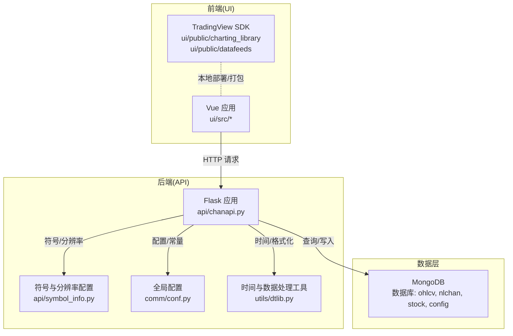
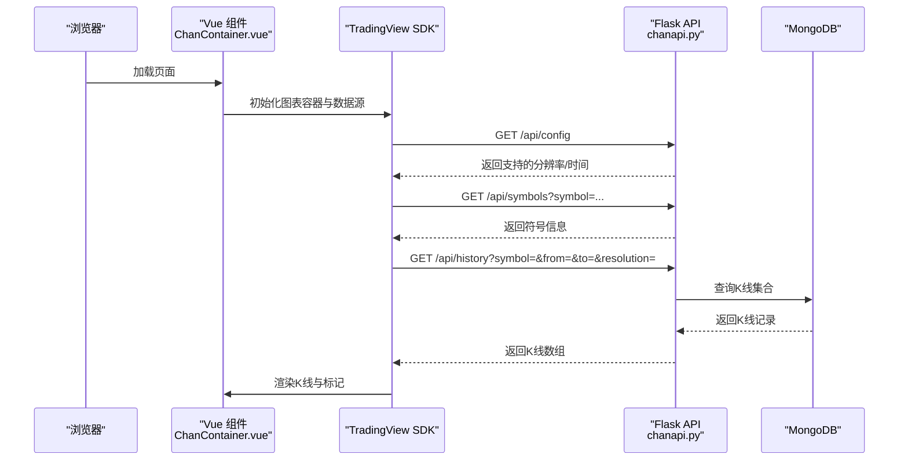
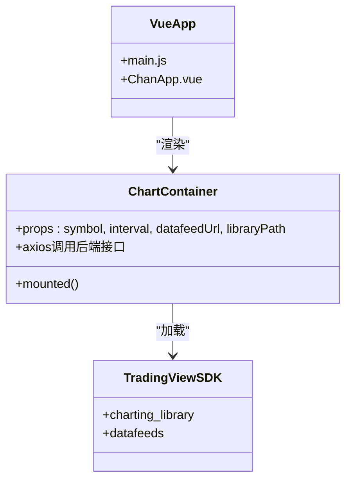
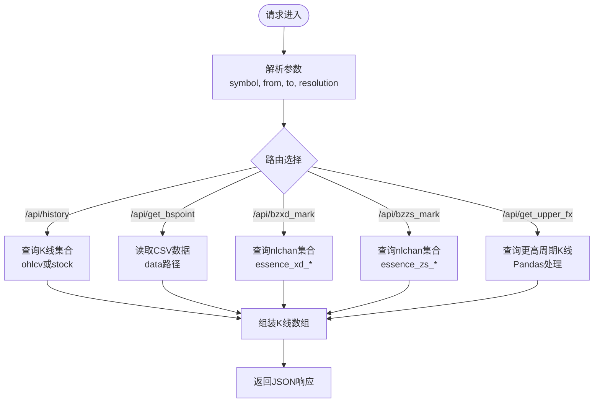
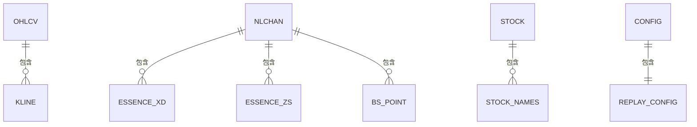
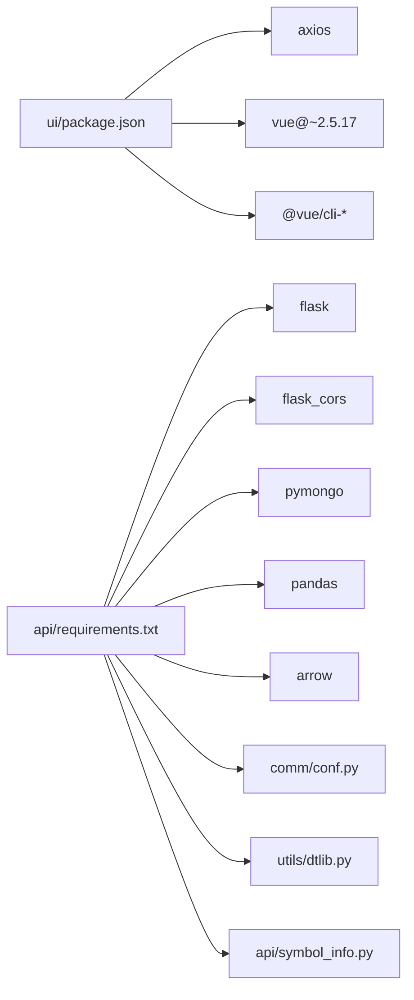

# 架构体系与技术栈

<cite>
**本文引用的文件**
- [README.md](file://README.md)
- [ui/README.md](file://ui/README.md)
- [ui/package.json](file://ui/package.json)
- [ui/public/index.html](file://ui/public/index.html)
- [ui/src/main.js](file://ui/src/main.js)
- [ui/src/ChanApp.vue](file://ui/src/ChanApp.vue)
- [ui/src/components/ChanContainer.vue](file://ui/src/components/ChanContainer.vue)
- [api/requirements.txt](file://api/requirements.txt)
- [api/chanapi.py](file://api/chanapi.py)
- [api/symbol_info.py](file://api/symbol_info.py)
- [comm/conf.py](file://comm/conf.py)
- [utils/dtlib.py](file://utils/dtlib.py)
</cite>

## 目录
1. [引言](#引言)
2. [项目结构](#项目结构)
3. [核心组件](#核心组件)
4. [架构总览](#架构总览)
5. [详细组件分析](#详细组件分析)
6. [依赖关系分析](#依赖关系分析)
7. [性能考量](#性能考量)
8. [故障排查指南](#故障排查指南)
9. [结论](#结论)
10. [附录](#附录)

## 引言
本项目采用前后端分离的MVC风格架构：前端使用Vue.js 2.5与TradingView Charting Library构建可视化界面，后端使用Flask提供RESTful API，数据层由MongoDB承载K线与缠论结构数据。系统围绕“自然之缠”的量化可视化目标，通过API将历史K线、缠论识别结果与买卖点等数据返回给前端TradingView图表组件，实现几何分析与策略结果的可视化展示。

## 项目结构
- 前端UI位于 ui/，包含Vue应用入口、组件与静态资源，以及部署时必需的TradingView SDK目录。
- 后端API位于 api/，提供历史K线、符号信息、缠论标记点、买卖点等接口。
- 公共配置与工具位于 comm/ 与 utils/，负责数据库连接、时间映射、数据列规范等。
- 数据目录 data/ 存放MongoDB导入的K线与缠论结构元数据，ETL脚本位于 hetl/。

**图表来源**
- [ui/src/main.js](file://ui/src/main.js#L1-L12)
- [ui/src/ChanApp.vue](file://ui/src/ChanApp.vue#L1-L41)
- [ui/src/components/ChanContainer.vue](file://ui/src/components/ChanContainer.vue#L1-L120)
- [api/chanapi.py](file://api/chanapi.py#L1-L120)
- [api/symbol_info.py](file://api/symbol_info.py#L1-L74)
- [comm/conf.py](file://comm/conf.py#L1-L166)
- [utils/dtlib.py](file://utils/dtlib.py#L1-L86)

**章节来源**
- [README.md](file://README.md#L90-L136)
- [ui/README.md](file://ui/README.md#L1-L38)

## 核心组件
- 前端Vue应用
  - 入口与根组件：ui/src/main.js、ui/src/ChanApp.vue
  - 图表容器组件：ui/src/components/ChanContainer.vue，集成TradingView SDK，通过UDF兼容数据源对接后端API
- 后端Flask服务
  - API蓝图：api/chanapi.py，提供配置、搜索、符号详情、历史K线、买卖点、缠论标记点等接口
  - 符号与分辨率：api/symbol_info.py，生成支持的交易对与股票符号列表
  - 全局配置：comm/conf.py，数据库连接、时间周期映射、列名规范、默认起始时间等
  - 时间与数据处理：utils/dtlib.py，时间戳转换、DataFrame构造、列标准化等
- 数据层
  - MongoDB：ohlcv（K线）、nlchan（缠论结构）、stock（股票）、config（回放配置）

**章节来源**
- [ui/src/main.js](file://ui/src/main.js#L1-L12)
- [ui/src/ChanApp.vue](file://ui/src/ChanApp.vue#L1-L41)
- [ui/src/components/ChanContainer.vue](file://ui/src/components/ChanContainer.vue#L1-L120)
- [api/chanapi.py](file://api/chanapi.py#L1-L120)
- [api/symbol_info.py](file://api/symbol_info.py#L1-L74)
- [comm/conf.py](file://comm/conf.py#L1-L166)
- [utils/dtlib.py](file://utils/dtlib.py#L1-L86)

## 架构总览
系统采用经典的前后端分离MVC风格：
- 视图层（V）：Vue组件渲染，TradingView图表容器负责K线与标记绘制
- 控制器（C）：Flask蓝图路由处理请求，解析参数，组织响应
- 模型（M）：MongoDB集合存储K线与缠论结构，conf.py集中管理数据库连接与命名空间

**图表来源**
- [ui/src/components/ChanContainer.vue](file://ui/src/components/ChanContainer.vue#L1-L120)
- [api/chanapi.py](file://api/chanapi.py#L41-L120)

**章节来源**
- [README.md](file://README.md#L90-L136)
- [api/chanapi.py](file://api/chanapi.py#L41-L120)

## 详细组件分析

### 前端技术栈与组件
- Vue.js 2.5
  - 入口挂载：ui/src/main.js
  - 根组件：ui/src/ChanApp.vue
  - 图表容器：ui/src/components/ChanContainer.vue，负责：
    - 加载本地TradingView SDK（charting_library、datafeeds）
    - 通过UDF兼容数据源对接后端API（默认 http://127.0.0.1:8421/api）
    - 自定义指标（NMA/NMM/NMC/NMS/NMC2/NDX）通过axios调用后端接口获取数据
- TradingView Charting Library
  - 部署要求：需手动复制charting_library与datafeeds至ui/public，并在index.html中引入bundle.js
  - 本地部署说明见ui/README.md

**图表来源**
- [ui/src/main.js](file://ui/src/main.js#L1-L12)
- [ui/src/ChanApp.vue](file://ui/src/ChanApp.vue#L1-L41)
- [ui/src/components/ChanContainer.vue](file://ui/src/components/ChanContainer.vue#L1-L120)
- [ui/public/index.html](file://ui/public/index.html#L1-L20)

**章节来源**
- [ui/src/main.js](file://ui/src/main.js#L1-L12)
- [ui/src/ChanApp.vue](file://ui/src/ChanApp.vue#L1-L41)
- [ui/src/components/ChanContainer.vue](file://ui/src/components/ChanContainer.vue#L1-L120)
- [ui/public/index.html](file://ui/public/index.html#L1-L20)
- [ui/README.md](file://ui/README.md#L1-L38)

### 后端技术栈与API流程
- Flask + Flask-CORS
  - 蓝图：NaturalChan，统一前缀（空）
  - 跨域：CORS启用
- PyMongo
  - 连接MongoDB，访问ohlcv、nlchan、stock、config数据库
- Pandas
  - 在部分接口中将查询结果转为DataFrame进行处理（如upper fx接口）
- Arrow
  - 时间处理（如时间戳转换）
- 接口职责
  - /api/config：返回支持的分辨率与时间配置
  - /api/search：搜索支持的符号
  - /api/symbols：返回符号详情
  - /api/history：返回K线数据（支持股票与加密货币）
  - /api/time：返回基准时间
  - /api/get_bspoint：返回买卖点CSV数据
  - /api/bzxd_mark、/api/bzzs_mark：返回缠论标记点
  - /api/get_upper_fx：返回上级周期高低点区间

**图表来源**
- [api/chanapi.py](file://api/chanapi.py#L96-L235)
- [api/chanapi.py](file://api/chanapi.py#L244-L420)
- [api/chanapi.py](file://api/chanapi.py#L494-L558)

**章节来源**
- [api/chanapi.py](file://api/chanapi.py#L1-L120)
- [api/chanapi.py](file://api/chanapi.py#L96-L235)
- [api/chanapi.py](file://api/chanapi.py#L244-L420)
- [api/chanapi.py](file://api/chanapi.py#L494-L558)

### 数据存储方案与配置
- MongoDB
  - 数据库：ohlcv（K线）、nlchan（缠论结构）、stock（股票）、config（回放配置）
  - 集合命名：如 essence_xd_{sym}_{tf}、essence_zs_{sym}_{tf}、lnchan_xd_{sym}_{tf}、bs_point_{sym}_{tf}
  - 回放配置：replay_config记录当前symbol、tf与时间戳
- SQLite
  - 文档中提及用于Swarm智能体（具体使用位置未在代码中直接体现）
- 配置中心
  - 时间周期映射：RESOU_DICT、TF_SEC_MAP
  - 列名规范：多套K线列名映射（OK_KDATA_COLUMNS、STAND_KDATA_COLUMNS等）
  - 默认起始时间：按周期计算的DATE_START_TS
  - 符号列表：来自hetl/selcoin/binance_syms.txt

**图表来源**
- [comm/conf.py](file://comm/conf.py#L1-L166)
- [api/chanapi.py](file://api/chanapi.py#L1-L60)

**章节来源**
- [comm/conf.py](file://comm/conf.py#L1-L166)
- [api/chanapi.py](file://api/chanapi.py#L1-L60)

### 时间与数据处理工具
- 时间转换：int2time、time2int、gmt2local、gmt2int
- DataFrame构造与列标准化：make_hist、okex_make_hist、binance_make_hist
- 时区与时序：统一转换为北京时间字符串，便于前端显示

**章节来源**
- [utils/dtlib.py](file://utils/dtlib.py#L1-L86)
- [utils/dtlib.py](file://utils/dtlib.py#L88-L134)
- [utils/dtlib.py](file://utils/dtlib.py#L148-L164)

## 依赖关系分析
- 前端依赖
  - Vue 2.5、axios、@vue/cli相关插件
  - 需要本地部署时复制charting_library与datafeeds至ui/public
- 后端依赖
  - Flask、Flask-CORS、PyMongo、Pandas、Arrow
  - 通过comm/conf.py集中管理数据库连接与命名空间
- 数据依赖
  - MongoDB集合命名与字段结构由comm/conf.py与utils/dtlib.py共同约束

**图表来源**
- [ui/package.json](file://ui/package.json#L1-L50)
- [api/requirements.txt](file://api/requirements.txt#L1-L9)
- [comm/conf.py](file://comm/conf.py#L1-L166)
- [utils/dtlib.py](file://utils/dtlib.py#L1-L86)
- [api/symbol_info.py](file://api/symbol_info.py#L1-L74)

**章节来源**
- [ui/package.json](file://ui/package.json#L1-L50)
- [api/requirements.txt](file://api/requirements.txt#L1-L9)
- [comm/conf.py](file://comm/conf.py#L1-L166)

## 性能考量
- 数据查询
  - 历史K线查询按时间范围与周期排序，建议在MongoDB集合上建立索引以提升查询效率
- 数据处理
  - 部分接口使用Pandas进行DataFrame转换，注意大数据量时的内存占用与序列化开销
- 前端渲染
  - TradingView SDK本地部署时，确保bundle.js与charting_library体积合理，避免首屏加载过慢
- 回放机制
  - 回放配置通过replay_config控制当前时间戳与周期，避免越界查询导致的无效数据

[本节为通用指导，无需特定文件引用]

## 故障排查指南
- TradingView SDK未正确复制
  - 现象：图表空白或报错
  - 处理：按照ui/README.md步骤复制charting_library与datafeeds至ui/public，并在index.html中引入bundle.js
- 后端API无法访问
  - 现象：前端请求失败或跨域错误
  - 处理：确认Flask服务已启动（默认端口8421），并检查CORS配置
- MongoDB连接失败
  - 现象：查询不到K线或集合
  - 处理：确认本地MongoDB运行正常，数据库名称与集合命名符合comm/conf.py定义
- 符号或分辨率异常
  - 现象：搜索不到符号或分辨率不可用
  - 处理：检查api/symbol_info.py生成的SUPPORT_SYMBOLS与RESOU_DICT映射
- 回放时间越界
  - 现象：历史数据截断或无数据
  - 处理：检查replay_config中的current_ts与当前周期边界

**章节来源**
- [ui/README.md](file://ui/README.md#L1-L38)
- [api/chanapi.py](file://api/chanapi.py#L96-L235)
- [comm/conf.py](file://comm/conf.py#L1-L166)
- [api/symbol_info.py](file://api/symbol_info.py#L1-L74)

## 结论
本项目以Vue.js与TradingView Charting Library构建前端可视化，以Flask提供RESTful API，MongoDB承载K线与缠论结构数据，形成清晰的前后端分离架构。通过统一的配置中心与数据处理工具，系统实现了从数据采集、存储到可视化的完整链路。部署时需特别关注TradingView SDK的手动复制与MongoDB集合命名规范，以确保前后端稳定交互。

[本节为总结性内容，无需特定文件引用]

## 附录

### 技术选型说明
- Vue.js 2.5
  - 优点：生态成熟、组件化开发、易于与TradingView SDK集成
  - 适用性：本项目前端组件化与图表容器渲染场景
- TradingView Charting Library
  - 优点：功能强大、支持本地部署、可扩展自定义指标
  - 关键步骤：手动复制charting_library与datafeeds至ui/public，并在index.html中引入bundle.js
- Flask
  - 优点：轻量、易部署、与PyMongo/Pandas配合良好
  - 适用性：提供RESTful API，满足前端图表数据需求
- PyMongo
  - 优点：Python原生驱动、语法简洁、适合快速原型
  - 适用性：连接MongoDB，读取K线与缠论结构数据
- Pandas
  - 优点：数据分析与处理能力强
  - 适用性：在部分接口中进行DataFrame转换与数据规整
- Arrow
  - 优点：时间处理便捷
  - 适用性：时间戳与字符串互转

**章节来源**
- [README.md](file://README.md#L90-L136)
- [ui/README.md](file://ui/README.md#L1-L38)
- [api/requirements.txt](file://api/requirements.txt#L1-L9)
- [api/chanapi.py](file://api/chanapi.py#L1-L60)

### 环境依赖与版本要求
- Python 3.6+
- Node.js 14+
- MongoDB（本地运行）
- TradingView SDK（需手动复制至ui/public）

**章节来源**
- [README.md](file://README.md#L90-L136)
- [ui/README.md](file://ui/README.md#L1-L38)
- [ui/package.json](file://ui/package.json#L1-L50)
- [api/requirements.txt](file://api/requirements.txt#L1-L9)