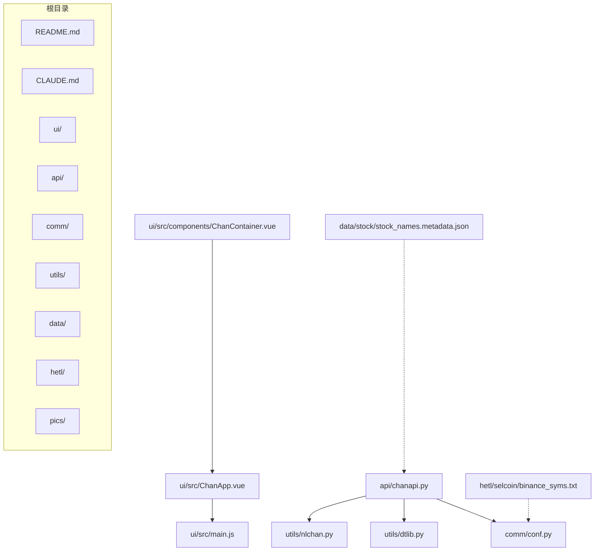
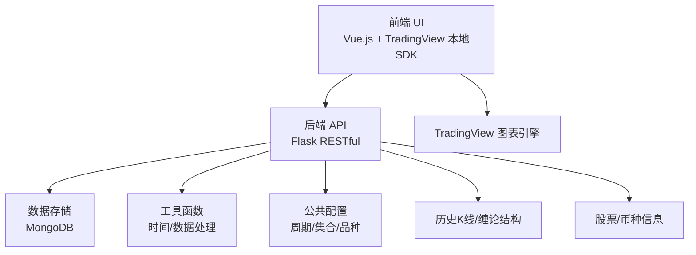
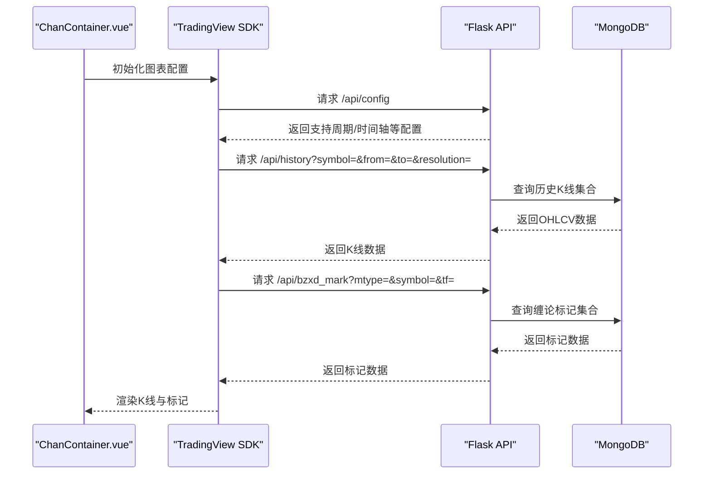
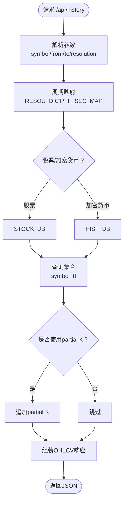
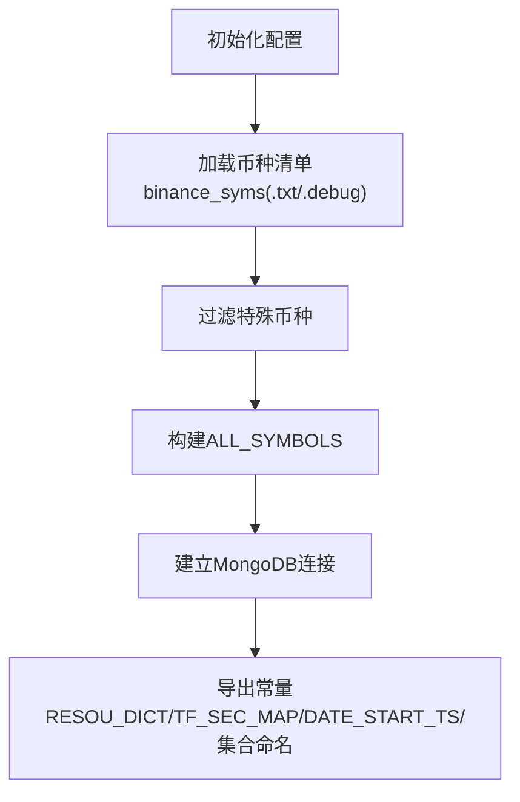
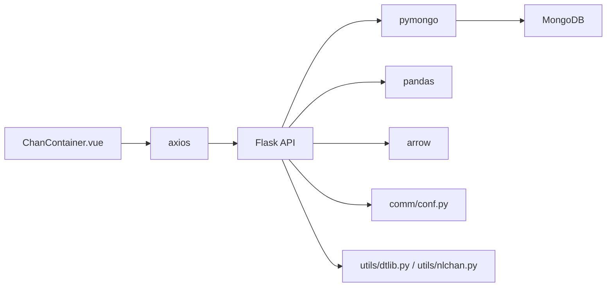
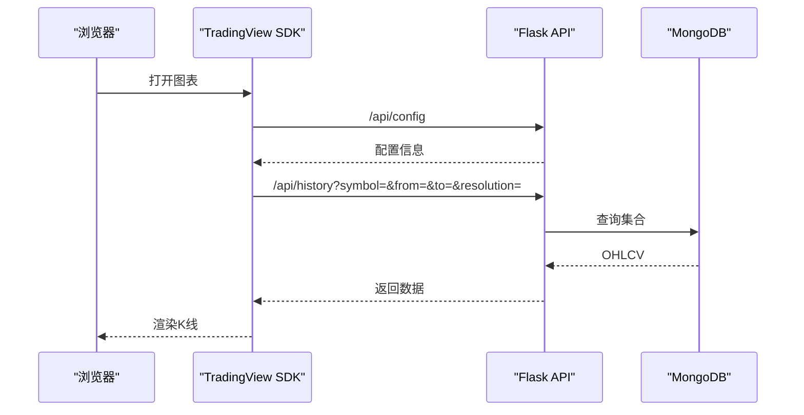

# 系统概述

<cite>
**本文引用的文件**
- [README.md](file://README.md)
- [CLAUDE.md](file://CLAUDE.md)
- [ui/README.md](file://ui/README.md)
- [api/CLAUDE.md](file://api/CLAUDE.md)
- [api/chanapi.py](file://api/chanapi.py)
- [comm/CLAUDE.md](file://comm/CLAUDE.md)
- [comm/conf.py](file://comm/conf.py)
- [ui/src/main.js](file://ui/src/main.js)
- [ui/src/ChanApp.vue](file://ui/src/ChanApp.vue)
- [ui/src/components/ChanContainer.vue](file://ui/src/components/ChanContainer.vue)
- [utils/dtlib.py](file://utils/dtlib.py)
- [utils/nlchan.py](file://utils/nlchan.py)
- [hetl/selcoin/binance_syms.txt](file://hetl/selcoin/binance_syms.txt)
- [data/stock/stock_names.metadata.json](file://data/stock/stock_names.metadata.json)
</cite>

## 目录
1. [简介](#简介)
2. [项目结构](#项目结构)
3. [核心组件](#核心组件)
4. [架构总览](#架构总览)
5. [详细组件分析](#详细组件分析)
6. [依赖关系分析](#依赖关系分析)
7. [性能考量](#性能考量)
8. [故障排查指南](#故障排查指南)
9. [结论](#结论)
10. [附录](#附录)

## 简介
ChanVis 是一个基于 TradingView 本地 SDK 的可视化平台，面向缠论量化研究与几何交易分析。项目定位为“几何化分析的可视化工具”，不包含回测或交易执行功能，强调前后端分离、本地/云端部署、无画图数量限制、自定义中枢与线段标注、以及与缠论分析逻辑解耦的 API 可视化方案。项目支持股票与加密货币两大类金融品种，提供自定义按钮与指标集成能力，配合 MongoDB 存储历史 K 线与缠论结构数据，满足从入门到进阶用户的使用需求。

## 项目结构
项目采用模块化组织，分为前端 UI、后端 API、公共配置、工具函数、数据与 ETL、图片资源等目录，配合 TradingView 本地 SDK 在浏览器端渲染图表。

**图表来源**
- [ui/src/components/ChanContainer.vue](file://ui/src/components/ChanContainer.vue#L1-L120)
- [ui/src/ChanApp.vue](file://ui/src/ChanApp.vue#L1-L41)
- [ui/src/main.js](file://ui/src/main.js#L1-L12)
- [api/chanapi.py](file://api/chanapi.py#L1-L120)
- [comm/conf.py](file://comm/conf.py#L1-L166)
- [utils/dtlib.py](file://utils/dtlib.py#L1-L207)
- [utils/nlchan.py](file://utils/nlchan.py#L1-L25)
- [data/stock/stock_names.metadata.json](file://data/stock/stock_names.metadata.json#L1-L1)
- [hetl/selcoin/binance_syms.txt](file://hetl/selcoin/binance_syms.txt#L1-L118)

**章节来源**
- [README.md](file://README.md#L107-L136)
- [CLAUDE.md](file://CLAUDE.md#L25-L81)

## 核心组件
- 前端 UI（Vue.js + TradingView 本地 SDK）
  - 通过 ChanContainer.vue 集成 TradingView 图表，配置数据源、时间周期、自定义指标与标记。
  - 通过 ChanApp.vue 作为根组件挂载，main.js 负责实例化 Vue 应用。
- 后端 API（Flask）
  - 提供 TradingView UDF 兼容接口，包括配置、搜索、符号信息、历史 K 线、标记数据、时间刻度、模拟实时报价等。
  - 支持股票与加密货币两类数据源，通过 MongoDB 存储历史 K 线与缠论结构数据。
- 公共配置（comm/conf.py）
  - 定义时间周期映射、数据库连接、交易品种集合、数据起始时间、集合命名规则等。
- 工具函数（utils）
  - 时间转换、K 线标准化、缠论辅助方法等。
- 数据与 ETL（data/hetl）
  - 提供样例数据与币种清单，支持股票与币圈数据导入与清洗。

**章节来源**
- [ui/src/components/ChanContainer.vue](file://ui/src/components/ChanContainer.vue#L1-L120)
- [ui/src/ChanApp.vue](file://ui/src/ChanApp.vue#L1-L41)
- [ui/src/main.js](file://ui/src/main.js#L1-L12)
- [api/chanapi.py](file://api/chanapi.py#L41-L120)
- [comm/conf.py](file://comm/conf.py#L1-L166)
- [utils/dtlib.py](file://utils/dtlib.py#L1-L207)
- [utils/nlchan.py](file://utils/nlchan.py#L1-L25)
- [data/stock/stock_names.metadata.json](file://data/stock/stock_names.metadata.json#L1-L1)
- [hetl/selcoin/binance_syms.txt](file://hetl/selcoin/binance_syms.txt#L1-L118)

## 架构总览
ChanVis 采用前后端分离架构，前端基于 Vue.js 与 TradingView 本地 SDK，后端基于 Flask 提供 RESTful API，数据层使用 MongoDB 存储历史 K 线与缠论结构数据。系统支持股票与加密货币两类数据源，通过统一的 TradingView UDF 接口对外提供数据。

**图表来源**
- [CLAUDE.md](file://CLAUDE.md#L13-L20)
- [api/CLAUDE.md](file://api/CLAUDE.md#L7-L15)
- [api/chanapi.py](file://api/chanapi.py#L96-L120)
- [comm/conf.py](file://comm/conf.py#L139-L166)
- [ui/README.md](file://ui/README.md#L1-L38)

**章节来源**
- [CLAUDE.md](file://CLAUDE.md#L9-L20)
- [README.md](file://README.md#L91-L106)

## 详细组件分析

### 前端组件：ChanContainer.vue
- 职责
  - 集成 TradingView 本地 SDK，配置数据源、时间周期、语言、覆盖样式、收藏等。
  - 注入自定义指标（如 NMA/NMM/NMC/NMS/NMC2/NDX 等），通过 axios 请求后端接口获取指标数据。
  - 通过 UDF 兼容数据源向后端拉取历史 K 线与标记数据。
- 关键点
  - datafeedUrl 默认指向后端 API 地址，支持本地开发环境。
  - 支持多时间周期与自定义指标注入，便于缠论分析与几何标注。
  - 通过 props 控制 symbol、interval、容器 ID、图表存储等。

**图表来源**
- [ui/src/components/ChanContainer.vue](file://ui/src/components/ChanContainer.vue#L1-L120)
- [api/chanapi.py](file://api/chanapi.py#L96-L120)
- [api/chanapi.py](file://api/chanapi.py#L280-L320)

**章节来源**
- [ui/src/components/ChanContainer.vue](file://ui/src/components/ChanContainer.vue#L1-L200)
- [ui/README.md](file://ui/README.md#L1-L38)

### 后端 API：chanapi.py
- 职责
  - 提供 TradingView UDF 兼容接口，包括配置、搜索、符号信息、历史 K 线、标记数据、时间刻度、模拟实时报价等。
  - 支持股票与加密货币两类数据源，通过 MongoDB 查询历史 K 线与缠论标记。
  - 处理回放逻辑（partial K 线），保证小级别推进时大级别同步前进。
- 关键接口
  - /api/config：返回图表配置（支持周期、时间轴等）。
  - /api/search：按关键词搜索支持的交易品种。
  - /api/symbols：返回指定品种的详细信息。
  - /api/history：返回指定周期的历史 K 线（OHLCV）。
  - /api/bzxd_mark /api/bzzs_mark：返回线段/中枢等标记数据。
  - /api/get_upper_fx：返回上级周期的高低点区间数据。
  - /api/get_bspoint：返回买卖点数据（CSV路径）。
  - /api/time：返回时间戳（兼容）。
- 数据模型
  - K 线数据：包含时间戳、开盘、最高、最低、收盘、成交量等字段。
  - 符号信息：包含名称、代码、交易所、最小变动单位、价格精度、支持周期等。
  - 标记数据：包含时间、颜色、文本、标签等。

**图表来源**
- [api/chanapi.py](file://api/chanapi.py#L96-L235)
- [comm/conf.py](file://comm/conf.py#L12-L31)
- [comm/conf.py](file://comm/conf.py#L139-L166)

**章节来源**
- [api/chanapi.py](file://api/chanapi.py#L41-L120)
- [api/chanapi.py](file://api/chanapi.py#L96-L235)
- [api/chanapi.py](file://api/chanapi.py#L237-L320)
- [api/chanapi.py](file://api/chanapi.py#L320-L420)
- [api/chanapi.py](file://api/chanapi.py#L420-L492)
- [api/chanapi.py](file://api/chanapi.py#L494-L558)
- [api/CLAUDE.md](file://api/CLAUDE.md#L39-L85)

### 公共配置：conf.py
- 职责
  - 定义全局配置参数，包括路径、时间周期映射、数据库连接、交易品种集合、数据起始时间、集合命名规则等。
  - 支持 DEBUG 模式切换，控制数据量与周期范围。
- 关键点
  - RESOU_DICT/TF_SEC_MAP：将 TradingView 周期映射到内部周期与秒数。
  - DATE_START_TS：各周期数据起始时间戳。
  - ALL_SYMBOLS：从币安符号清单加载，过滤特殊币种。
  - 集合命名规则：lnchan_xd_{sym}_{tf}、lnchan_zs_{sym}_{tf} 等。

**图表来源**
- [comm/conf.py](file://comm/conf.py#L1-L166)
- [hetl/selcoin/binance_syms.txt](file://hetl/selcoin/binance_syms.txt#L1-L118)

**章节来源**
- [comm/conf.py](file://comm/conf.py#L1-L166)

### 工具函数：dtlib.py 与 nlchan.py
- dtlib.py
  - 时间转换：GMT/本地时间互转、Unix 时间戳与字符串互转。
  - K 线标准化：将不同数据源的字段映射为统一列名与类型。
- nlchan.py
  - 缠论辅助：根据最小变动单位计算价格精度与小数位数。

**章节来源**
- [utils/dtlib.py](file://utils/dtlib.py#L1-L207)
- [utils/nlchan.py](file://utils/nlchan.py#L1-L25)

## 依赖关系分析
- 前端依赖
  - Vue.js 与 TradingView 本地 SDK，通过 ChanContainer.vue 注入数据源与自定义指标。
- 后端依赖
  - Flask 提供 RESTful 接口；pymongo 连接 MongoDB；pandas 用于数据处理；arrow 用于时间处理。
- 数据依赖
  - MongoDB 存储历史 K 线与缠论结构数据；股票数据来自 STOCK_DB，币种数据来自 HIST_DB。
- 配置依赖
  - 公共配置集中管理周期映射、集合命名、数据起始时间等。

**图表来源**
- [ui/src/components/ChanContainer.vue](file://ui/src/components/ChanContainer.vue#L1-L120)
- [api/chanapi.py](file://api/chanapi.py#L1-L40)
- [comm/conf.py](file://comm/conf.py#L139-L166)
- [utils/dtlib.py](file://utils/dtlib.py#L1-L207)
- [utils/nlchan.py](file://utils/nlchan.py#L1-L25)

**章节来源**
- [api/chanapi.py](file://api/chanapi.py#L1-L40)
- [api/CLAUDE.md](file://api/CLAUDE.md#L28-L36)
- [comm/conf.py](file://comm/conf.py#L139-L166)

## 性能考量
- 数据库索引
  - 为频繁查询的字段建立索引，提升历史 K 线与标记查询性能。
- 分页与缓存
  - 对大数据量查询实现分页；考虑引入 Redis 缓存热点数据。
- 查询优化
  - 合理使用时间范围与周期映射，避免全表扫描。
- 前端渲染
  - 控制标记数量与复杂度，避免一次性渲染过多图形元素导致卡顿。

[本节为通用指导，无需特定文件引用]

## 故障排查指南
- 前端无法加载 TradingView SDK
  - 确认已将 charting_library 与 datafeeds 复制到 ui/public 目录，并在 ChanContainer.vue 中正确配置 libraryPath。
- 后端 API 无法访问
  - 确认 Flask 已启动且端口为 8421；检查 requirements.txt 依赖安装。
- MongoDB 连接失败
  - 确认本地 MongoDB 已启动；检查 conf.py 中的连接参数。
- 历史数据为空
  - 检查 symbol 与 resolution 是否匹配；确认集合命名与数据是否存在。
- 回放逻辑异常
  - 检查 replay_config 集合中的 current_ts 与各周期 ts 字段是否正确更新。

**章节来源**
- [ui/README.md](file://ui/README.md#L1-L38)
- [api/CLAUDE.md](file://api/CLAUDE.md#L150-L162)
- [comm/conf.py](file://comm/conf.py#L139-L166)
- [api/chanapi.py](file://api/chanapi.py#L120-L170)

## 结论
ChanVis 以 TradingView 本地 SDK 为核心，结合 Vue.js 前端与 Flask 后端，构建了面向缠论研究的几何化分析可视化平台。项目强调“可视化工具”的定位，不包含回测或交易执行功能，通过统一的 API 接口与 MongoDB 数据存储，支持股票与加密货币的多周期 K 线与缠论标记展示。对于初学者，可直接使用现有示例与指标；对于高级用户，可基于现有架构扩展自定义中枢与线段识别、AI 智能体辅助等功能。

[本节为总结性内容，无需特定文件引用]

## 附录

### 项目愿景与定位
- 项目愿景：为缠论研究者与量化交易者提供强大的几何交易分析工具，支持缠论理论的程序化实现与可视化。
- 定位：几何化分析的可视化工具，不包含回测或交易执行功能。

**章节来源**
- [CLAUDE.md](file://CLAUDE.md#L5-L12)
- [README.md](file://README.md#L143-L153)

### 支持的金融品种
- 加密货币：从币安符号清单加载，过滤特殊币种。
- 股票：从 MongoDB stock_names 集合加载，支持股票代码前缀。

**章节来源**
- [comm/conf.py](file://comm/conf.py#L81-L109)
- [data/stock/stock_names.metadata.json](file://data/stock/stock_names.metadata.json#L1-L1)
- [hetl/selcoin/binance_syms.txt](file://hetl/selcoin/binance_syms.txt#L1-L118)

### 核心功能亮点
- 基于 TradingView 本地 SDK 的专业 K 线图表。
- 自定义按钮实现画笔、线段、中枢功能。
- 自定义指标集成（NMA/NMM/NMC/NMS/NMC2/NDX 等）。
- 无画图数量限制，支持本地/云端私有化部署。
- 与缠论分析逻辑解耦，通过 API 做可视化。

**章节来源**
- [README.md](file://README.md#L82-L106)
- [ui/src/components/ChanContainer.vue](file://ui/src/components/ChanContainer.vue#L140-L200)

### 数据流路径
- 前端通过 ChanContainer.vue 的 TradingView SDK 请求后端 API。
- 后端根据 symbol/resolution 解析周期映射，查询 MongoDB 历史 K 线与标记集合。
- 返回统一格式的 JSON 数据给前端渲染。

**图表来源**
- [ui/src/components/ChanContainer.vue](file://ui/src/components/ChanContainer.vue#L70-L120)
- [api/chanapi.py](file://api/chanapi.py#L96-L120)