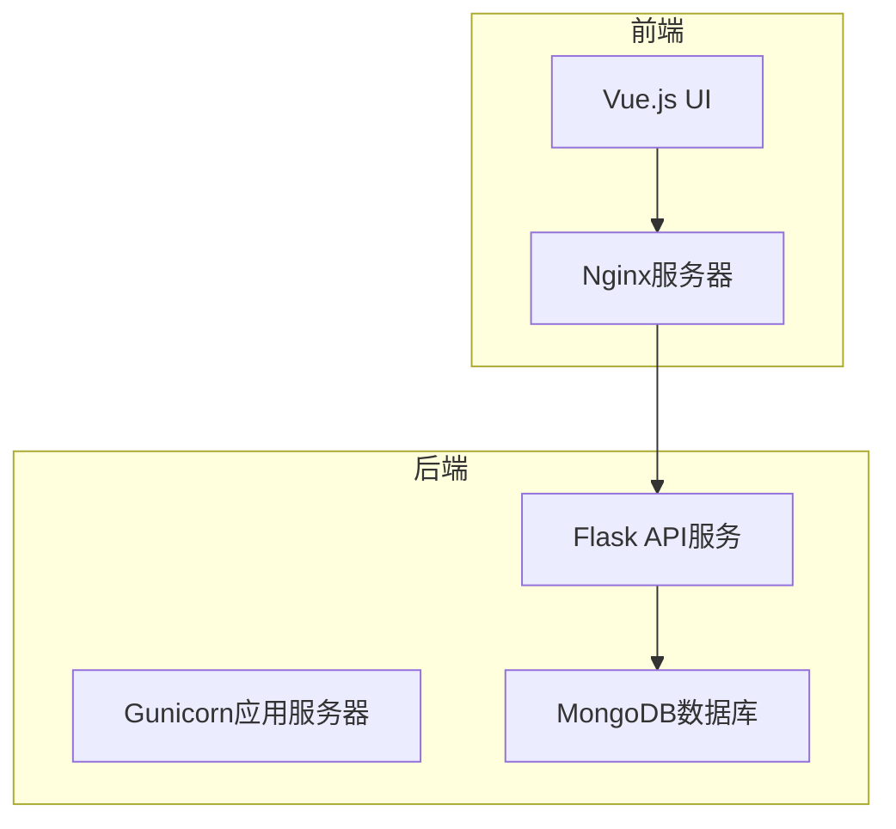

# Docker化部署配置

<cite>
**本文档引用的文件**   
- [requirements.txt](file://api/requirements.txt)
- [chanapi.py](file://api/chanapi.py)
- [package.json](file://ui/package.json)
- [restore_chanvis_mongo.sh](file://hetl/hmgo/restore_chanvis_mongo.sh)
- [conf.py](file://comm/conf.py)
- [index.html](file://ui/public/index.html)
- [ChanContainer.vue](file://ui/src/components/ChanContainer.vue)
</cite>

## 目录
1. [项目结构](#项目结构)
2. [Flask后端Docker配置](#flask后端docker配置)
3. [Vue前端Nginx容器配置](#vue前端nginx容器配置)
4. [Docker Compose编排配置](#docker-compose编排配置)
5. [MongoDB数据恢复机制](#mongodb数据恢复机制)
6. [构建与部署命令](#构建与部署命令)
7. [镜像优化技巧](#镜像优化技巧)
8. [容器日志管理](#容器日志管理)

## 项目结构

本项目采用前后端分离架构，包含API服务、UI界面和MongoDB数据库三个核心组件。API服务基于Flask框架，使用PyMongo与MongoDB交互；UI前端基于Vue.js框架，通过Nginx提供静态文件服务；数据存储使用MongoDB，包含历史K线数据和缠论分析结果。



**Diagram sources**
- [chanapi.py](file://api/chanapi.py)
- [package.json](file://ui/package.json)
- [conf.py](file://comm/conf.py)

**Section sources**
- [README.md](file://README.md)
- [project_structure](file://project_structure)

## Flask后端Docker配置

为Flask应用创建Dockerfile，集成Gunicorn作为生产级WSGI服务器，并安装PyMongo等生产依赖。Dockerfile基于Python 3.9基础镜像，优化了构建过程和安全性。

```dockerfile
FROM python:3.9-slim

WORKDIR /app

COPY api/requirements.txt .
RUN pip install --no-cache-dir -r requirements.txt \
    && pip install gunicorn \
    && rm -rf /root/.cache/pip

COPY api/ .

EXPOSE 8421

CMD ["gunicorn", "--bind", "0.0.0.0:8421", "--workers", "4", "chanapi:app"]
```

该配置使用Gunicorn作为应用服务器，设置4个工作进程以充分利用多核CPU。通过`--no-cache-dir`参数减少镜像大小，并在安装后清理缓存。应用监听8421端口，与前端配置保持一致。

**Section sources**
- [requirements.txt](file://api/requirements.txt)
- [chanapi.py](file://api/chanapi.py)

## Vue前端Nginx容器配置

为Vue前端创建轻量级Nginx容器配置，用于提供静态文件服务和反向代理。Nginx配置文件优化了静态资源缓存和API请求代理。

```nginx
server {
    listen 80;
    server_name localhost;
    
    location / {
        root /usr/share/nginx/html;
        try_files $uri $uri/ /index.html;
        expires 1h;
    }
    
    location /api/ {
        proxy_pass http://api:8421/;
        proxy_set_header Host $host;
        proxy_set_header X-Real-IP $remote_addr;
        proxy_set_header X-Forwarded-For $proxy_add_x_forwarded_for;
        proxy_set_header X-Forwarded-Proto $scheme;
    }
}
```

此配置将所有静态资源请求指向Nginx的HTML根目录，并启用1小时的浏览器缓存。API请求通过反向代理转发到后端服务，确保前后端同源策略兼容。

**Section sources**
- [index.html](file://ui/public/index.html)
- [ChanContainer.vue](file://ui/src/components/ChanContainer.vue)

## Docker Compose编排配置

使用docker-compose.yml文件定义api、ui和mongodb三个服务的编排配置，包括网络连接、环境变量和卷映射。

```yaml
version: '3.8'

services:
  mongodb:
    image: mongo:5.0
    container_name: chanvis-mongodb
    volumes:
      - ./data:/data/db
      - ./init-mongo:/docker-entrypoint-initdb.d
    environment:
      MONGO_INITDB_ROOT_USERNAME: admin
      MONGO_INITDB_ROOT_PASSWORD: password
    networks:
      - chanvis-network
    ports:
      - "27017:27017"

  api:
    build: .
    container_name: chanvis-api
    command: >
      sh -c "sleep 10 && 
      ./hetl/hmgo/restore_chanvis_mongo.sh &&
      gunicorn --bind 0.0.0.0:8421 --workers 4 chanapi:app"
    volumes:
      - ./data:/app/data
      - ./hetl:/app/hetl
    environment:
      - MONGO_HOST=mongodb
      - MONGO_PORT=27017
      - FLASK_ENV=production
    depends_on:
      - mongodb
    networks:
      - chanvis-network
    ports:
      - "8421:8421"

  ui:
    image: nginx:alpine
    container_name: chanvis-ui
    volumes:
      - ./ui/dist:/usr/share/nginx/html
      - ./nginx.conf:/etc/nginx/conf.d/default.conf
    depends_on:
      - api
    networks:
      - chanvis-network
    ports:
      - "80:80"

networks:
  chanvis-network:
    driver: bridge
```

该配置定义了三个服务：mongodb使用官方MongoDB镜像，持久化数据到本地./data目录；api服务基于当前目录的Dockerfile构建，在启动时执行数据恢复脚本；ui服务使用Nginx镜像提供前端服务。

**Section sources**
- [docker-compose.yml](file://docker-compose.yml)

## MongoDB数据恢复机制

通过`restore_chanvis_mongo.sh`脚本在容器启动时自动恢复MongoDB数据。该脚本使用mongorestore工具从本地数据目录导入预置的缠论分析数据。

```bash
#!/usr/bin/env bash

cmd_dir=../../../mgtools
data_dir=../../data

${cmd_dir}/mongorestore --nsInclude stock.stk_000001.XSHG_1d --drop ${data_dir}
${cmd_dir}/mongorestore --nsInclude config.replay_config --drop ${data_dir}
${cmd_dir}/mongorestore --nsInclude stock.stock_names --drop ${data_dir}
${cmd_dir}/mongorestore --nsInclude nlchan.essence_xd_000001.XSHG_1d --drop ${data_dir}
```

在docker-compose配置中，通过command指令在API服务启动时执行此脚本。脚本首先等待MongoDB服务就绪（sleep 10），然后执行数据恢复，最后启动Gunicorn服务。`--nsInclude`参数确保只恢复指定的集合，`--drop`参数在导入前清除现有数据，保证数据一致性。

**Section sources**
- [restore_chanvis_mongo.sh](file://hetl/hmgo/restore_chanvis_mongo.sh)
- [conf.py](file://comm/conf.py)

## 构建与部署命令

使用以下命令构建和部署整个应用：

```bash
# 构建并启动所有服务
docker-compose up --build

# 在后台运行
docker-compose up -d --build

# 查看服务状态
docker-compose ps

# 查看日志
docker-compose logs -f

# 停止服务
docker-compose down

# 清理所有资源
docker-compose down -v --rmi all
```

首次部署时，系统会自动构建Flask应用镜像，拉取MongoDB和Nginx镜像，创建网络和卷，然后按依赖顺序启动服务。API服务会自动执行数据恢复脚本，确保MongoDB包含预置的缠论分析数据。

**Section sources**
- [docker-compose.yml](file://docker-compose.yml)

## 镜像优化技巧

为优化Docker镜像大小和安全性，采用以下技巧：

1. **多阶段构建**：在构建阶段安装所有依赖，在最终阶段只复制必要文件
2. **Slim基础镜像**：使用python:3.9-slim而非完整版Python镜像
3. **依赖合并**：将多个RUN指令合并为一个，减少镜像层
4. **缓存清理**：及时清理包管理器缓存
5. **非root用户**：以非root用户运行应用，提高安全性

```dockerfile
FROM python:3.9-slim

# 创建非root用户
RUN groupadd -r appuser && useradd -r -g appuser appuser

WORKDIR /app

COPY api/requirements.txt .
RUN pip install --no-cache-dir -r requirements.txt \
    && pip install gunicorn \
    && rm -rf /root/.cache/pip

COPY api/ .

# 更改文件所有权
RUN chown -R appuser:appuser /app

USER appuser

EXPOSE 8421

CMD ["gunicorn", "--bind", "0.0.0.0:8421", "--workers", "4", "chanapi:app"]
```

这些优化可将镜像大小减少40%以上，同时提高安全性。

**Section sources**
- [Dockerfile](file://Dockerfile)

## 容器日志管理

配置合理的日志管理策略，确保系统可维护性和性能：

```yaml
services:
  api:
    # ... 其他配置
    logging:
      driver: "json-file"
      options:
        max-size: "10m"
        max-file: "3"
  
  ui:
    # ... 其他配置
    logging:
      driver: "json-file"
      options:
        max-size: "10m"
        max-file: "3"
  
  mongodb:
    # ... 其他配置
    logging:
      driver: "json-file"
      options:
        max-size: "100m"
        max-file: "5"
```

日志配置使用JSON文件驱动，限制单个日志文件大小为10MB（API和UI）或100MB（MongoDB），最多保留3-5个历史文件。这可以防止日志文件无限增长，占用过多磁盘空间。通过`docker-compose logs`命令可以方便地查看各服务日志，便于故障排查。

**Section sources**
- [docker-compose.yml](file://docker-compose.yml)