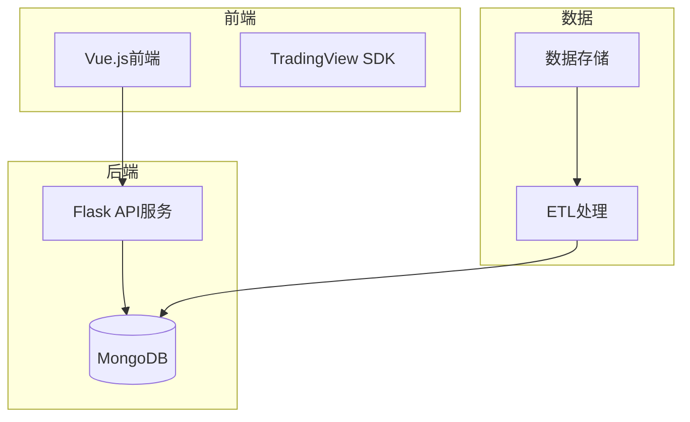
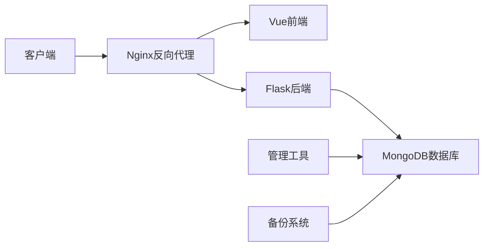
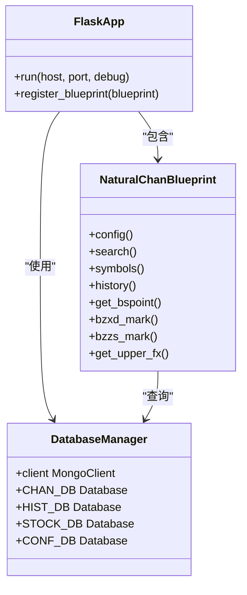
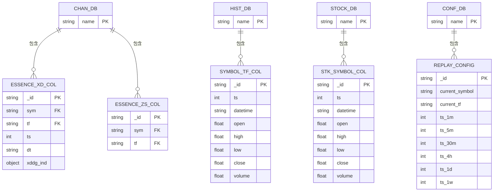
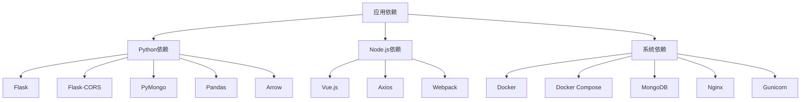

# 云端私有化部署

<cite>
**本文档引用的文件**  
- [chanapi.py](file://api/chanapi.py)
- [requirements.txt](file://api/requirements.txt)
- [conf.py](file://comm/conf.py)
- [ChanApp.vue](file://ui/src/ChanApp.vue)
- [main.js](file://ui/src/main.js)
- [index.html](file://ui/public/index.html)
- [package.json](file://ui/package.json)
- [restore_chanvis_mongo.sh](file://hetl/hmgo/restore_chanvis_mongo.sh)
- [README.md](file://README.md)
- [ui/README.md](file://ui/README.md)
</cite>

## 目录
1. [简介](#简介)
2. [项目结构](#项目结构)
3. [核心组件](#核心组件)
4. [架构概述](#架构概述)
5. [详细组件分析](#详细组件分析)
6. [依赖分析](#依赖分析)
7. [性能考虑](#性能考虑)
8. [故障排除指南](#故障排除指南)
9. [结论](#结论)

## 简介
本部署方案旨在为企业级生产环境提供完整的云端私有化部署解决方案。系统基于Flask后端和Vue前端架构，结合MongoDB数据存储，实现缠论量化研究的可视化平台。文档详细说明了容器化部署、反向代理配置、安全机制和高可用性策略，确保系统在企业环境中稳定运行。

## 项目结构
项目采用前后端分离架构，包含API服务、前端界面、数据存储和ETL处理四个主要模块。后端使用Python Flask框架提供RESTful API，前端基于Vue.js构建可视化界面，数据存储采用MongoDB，ETL模块负责数据导入导出。



**图示来源**  
- [README.md](file://README.md#L91-L96)
- [ui/README.md](file://ui/README.md#L3-L7)

**本节来源**  
- [README.md](file://README.md#L107-L137)
- [ui/README.md](file://ui/README.md#L1-L38)

## 核心组件
系统核心组件包括Flask后端服务、Vue前端应用和MongoDB数据库。后端提供数据接口服务，前端实现可视化展示，数据库存储K线数据和分析结果。通过Docker容器化部署，确保环境一致性，便于在企业级生产环境中部署和维护。

**本节来源**  
- [chanapi.py](file://api/chanapi.py#L23-L568)
- [main.js](file://ui/src/main.js#L1-L12)
- [conf.py](file://comm/conf.py#L143-L147)

## 架构概述
系统采用微服务架构，通过Docker容器化部署各个组件。前端Vue应用通过Nginx服务器提供静态资源服务，后端Flask应用通过Gunicorn服务器运行，MongoDB作为持久化存储。各服务通过Docker Compose进行编排，形成完整的应用栈。



**图示来源**  
- [chanapi.py](file://api/chanapi.py#L560-L568)
- [index.html](file://ui/public/index.html#L1-L20)
- [package.json](file://ui/package.json#L1-L50)

## 详细组件分析

### 后端服务分析
后端服务基于Flask框架构建，提供RESTful API接口。通过Blueprint组织路由，支持跨域请求，使用PyMongo连接MongoDB数据库。服务配置了CORS中间件，允许前端应用跨域访问。



**图示来源**  
- [chanapi.py](file://api/chanapi.py#L23-L568)
- [conf.py](file://comm/conf.py#L143-L147)

### 前端应用分析
前端应用基于Vue.js框架构建，使用TradingView SDK实现K线图可视化。应用通过Webpack打包，提供模块化开发支持。主入口文件初始化Vue实例，加载核心组件ChanContainer，实现交易图表功能。

```mermaid
classDiagram
class VueApp {
+$mount(selector)
+render(h)
}
class ChanApp {
+components : {ChanContainer}
}
class ChanContainer {
+template
+script
+style
}
class TradingViewSDK {
+charting_library/
+datafeeds/
}
VueApp --> ChanApp : "实例化"
ChanApp --> ChanContainer : "包含"
ChanContainer --> TradingViewSDK : "集成"
```

**图示来源**  
- [main.js](file://ui/src/main.js#L1-L12)
- [ChanApp.vue](file://ui/src/ChanApp.vue#L1-L41)
- [index.html](file://ui/public/index.html#L7-L8)

### 数据存储分析
数据存储采用MongoDB，包含多个数据库实例：nlchan存储缠论分析结果，ohlcv存储K线历史数据，stock存储股票相关信息，config存储系统配置。通过mongorestore工具实现数据导入导出，确保数据可迁移性和备份能力。



**图示来源**  
- [conf.py](file://comm/conf.py#L143-L158)
- [restore_chanvis_mongo.sh](file://hetl/hmgo/restore_chanvis_mongo.sh#L23-L29)

**本节来源**  
- [chanapi.py](file://api/chanapi.py#L109-L115)
- [conf.py](file://comm/conf.py#L143-L158)
- [restore_chanvis_mongo.sh](file://hetl/hmgo/restore_chanvis_mongo.sh#L23-L29)

## 依赖分析
系统依赖主要分为Python后端依赖、Node.js前端依赖和系统级依赖。Python依赖包括Flask、PyMongo等，Node.js依赖包括Vue.js、Axios等，系统依赖包括MongoDB、Docker等。通过容器化部署，有效管理各层级依赖关系。



**图示来源**  
- [requirements.txt](file://api/requirements.txt#L1-L9)
- [package.json](file://ui/package.json#L1-L50)

**本节来源**  
- [requirements.txt](file://api/requirements.txt#L1-L9)
- [package.json](file://ui/package.json#L1-L50)
- [README.md](file://README.md#L110-L113)

## 性能考虑
系统性能优化主要从数据库查询、API响应和前端渲染三个方面考虑。数据库层面建立适当索引，API层面优化数据序列化，前端层面实现懒加载和缓存机制。通过Gunicorn多工作进程部署，提高后端服务并发处理能力。

## 故障排除指南
常见问题包括数据导入失败、API访问异常和前端显示错误。数据导入问题通常由MongoDB连接配置引起，API问题多与跨域配置相关，前端问题常因TradingView SDK未正确部署导致。建议按照部署文档逐步检查各组件状态。

**本节来源**  
- [ui/README.md](file://ui/README.md#L35-L38)
- [CLAUDE.md](file://ui/CLAUDE.md#L149-L153)
- [README.md](file://README.md#L138-L141)

## 结论
本云端私有化部署方案提供了完整的企业级生产环境部署指南。通过Docker容器化技术，实现了应用的可移植性和环境一致性。结合Nginx反向代理和Gunicorn应用服务器，确保了系统的高性能和高可用性。数据安全和备份策略保障了企业数据的可靠性，为缠论量化研究提供了稳定的可视化平台。