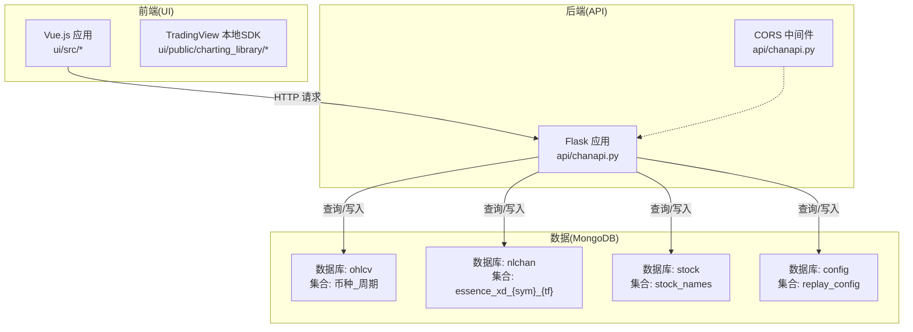
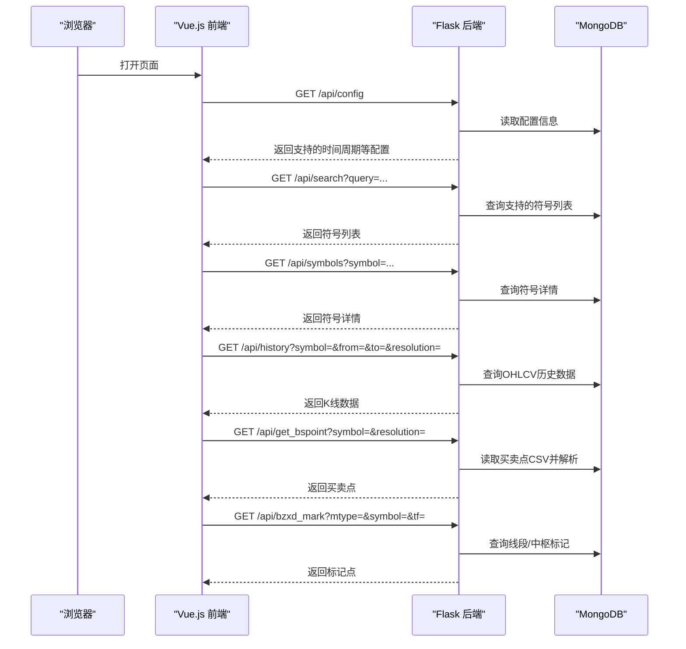
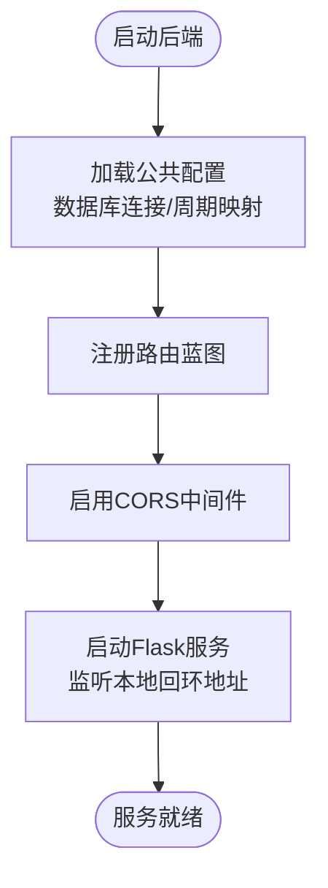
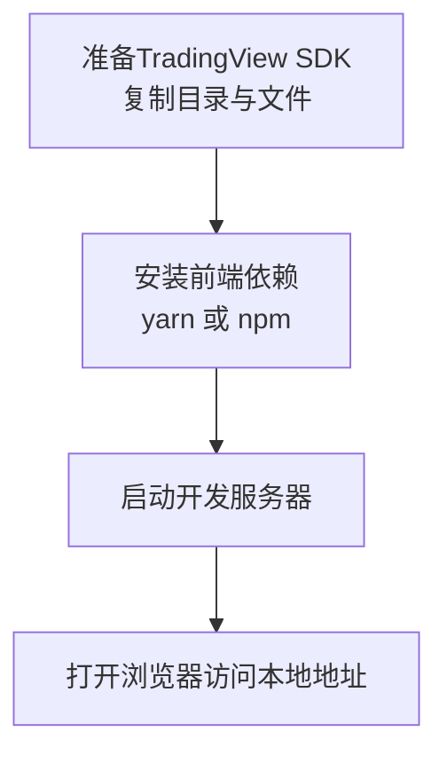
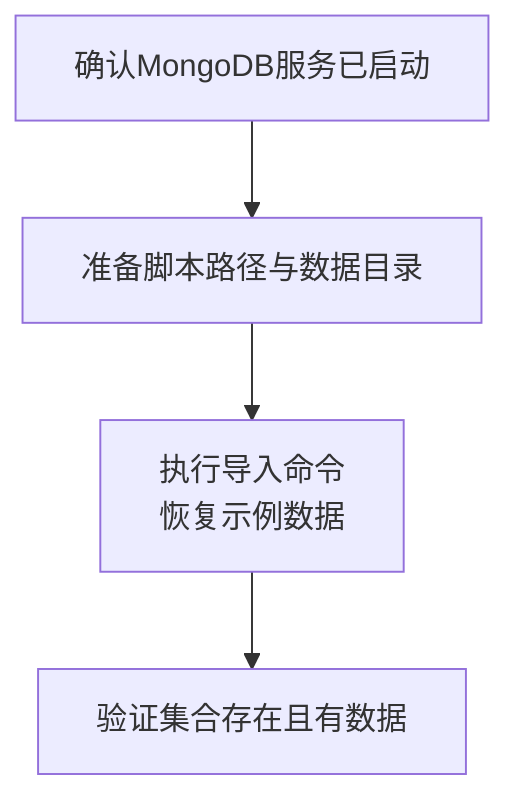
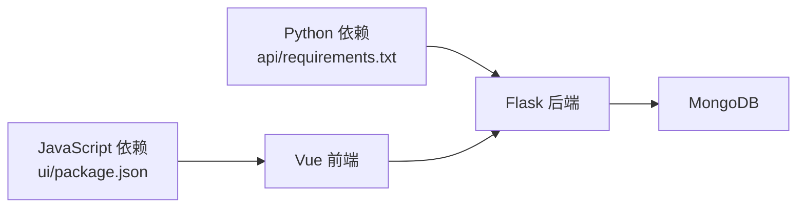

# 本地部署指南

<cite>
**本文引用的文件**
- [README.md](file://README.md)
- [api/requirements.txt](file://api/requirements.txt)
- [api/chanapi.py](file://api/chanapi.py)
- [api/symbol_info.py](file://api/symbol_info.py)
- [comm/conf.py](file://comm/conf.py)
- [ui/README.md](file://ui/README.md)
- [ui/package.json](file://ui/package.json)
- [hetl/hmgo/restore_chanvis_mongo.sh](file://hetl/hmgo/restore_chanvis_mongo.sh)
</cite>

## 目录
1. [简介](#简介)
2. [项目结构](#项目结构)
3. [核心组件](#核心组件)
4. [架构总览](#架构总览)
5. [详细组件分析](#详细组件分析)
6. [依赖关系分析](#依赖关系分析)
7. [性能考虑](#性能考虑)
8. [故障排查指南](#故障排查指南)
9. [结论](#结论)
10. [附录](#附录)

## 简介
本指南面向希望在本地或生产环境中部署“缠论可视化”项目的用户，覆盖以下内容：
- Python虚拟环境搭建与后端依赖安装
- Flask后端服务启动与跨域配置
- 前端Vue.js应用的依赖安装与运行
- MongoDB数据库初始化与测试数据恢复
- 常见启动问题与解决方案（端口冲突、依赖版本不匹配等）

## 项目结构
该项目采用前后端分离架构：
- 后端：Flask API，提供历史K线、买卖点、中枢/线段标记等接口
- 前端：Vue.js应用，集成TradingView本地SDK进行可视化
- 数据层：MongoDB，包含OHLCV历史数据、缠论识别结果、股票名称等集合
- 配置：统一的数据库连接与时间周期映射在公共配置模块中

图表来源
- [api/chanapi.py](file://api/chanapi.py#L1-L60)
- [comm/conf.py](file://comm/conf.py#L135-L166)
- [ui/README.md](file://ui/README.md#L1-L38)

章节来源
- [README.md](file://README.md#L90-L136)
- [ui/README.md](file://ui/README.md#L1-L38)
- [api/chanapi.py](file://api/chanapi.py#L1-L60)
- [comm/conf.py](file://comm/conf.py#L135-L166)

## 核心组件
- Flask后端服务
  - 提供配置、搜索、符号详情、历史K线、买卖点、中枢/线段标记等接口
  - 内置CORS中间件，默认允许跨域访问
- Vue.js前端应用
  - 通过HTTP请求调用后端API
  - 集成TradingView本地SDK进行可视化
- MongoDB数据库
  - 存储OHLCV历史数据、缠论识别结果、股票名称、回放配置等
- 公共配置
  - 统一管理数据库连接、时间周期映射、默认起始时间戳等

章节来源
- [api/chanapi.py](file://api/chanapi.py#L41-L568)
- [comm/conf.py](file://comm/conf.py#L1-L166)
- [ui/README.md](file://ui/README.md#L1-L38)

## 架构总览
下图展示前后端与数据库的交互流程，以及关键接口的调用顺序。

图表来源
- [api/chanapi.py](file://api/chanapi.py#L41-L568)
- [comm/conf.py](file://comm/conf.py#L135-L166)

## 详细组件分析

### 后端服务（Flask）
- 依赖安装
  - 在Python虚拟环境中安装后端依赖，详见文件路径
- 启动方式
  - 开发模式：直接运行后端入口文件，内置CORS并监听本地回环地址
- 接口说明
  - 配置接口：返回支持的时间周期、是否支持时间轴等
  - 搜索接口：支持模糊搜索符号列表
  - 符号详情接口：返回指定符号的描述、价格精度等
  - 历史K线接口：按周期与时间范围查询OHLCV数据，并支持回测场景下的部分K线处理
  - 买卖点接口：读取本地CSV文件返回买卖点
  - 标记点接口：返回中枢/线段标记点，支持多种类型
- 跨域配置
  - 已启用CORS中间件，支持跨域访问

图表来源
- [api/chanapi.py](file://api/chanapi.py#L23-L60)
- [api/chanapi.py](file://api/chanapi.py#L560-L568)
- [comm/conf.py](file://comm/conf.py#L135-L166)

章节来源
- [api/requirements.txt](file://api/requirements.txt#L1-L9)
- [api/chanapi.py](file://api/chanapi.py#L23-L60)
- [api/chanapi.py](file://api/chanapi.py#L560-L568)
- [comm/conf.py](file://comm/conf.py#L135-L166)

### 前端应用（Vue.js）
- SDK准备
  - 从官方仓库获取SDK，将charting_library与datafeeds复制到前端public目录，将charting_library.js复制到src目录
- 依赖安装
  - 支持yarn或npm两种方式，任选其一
- 启动与访问
  - 启动后默认访问本地地址
- 与后端交互
  - 通过HTTP请求调用后端API，获取配置、符号、历史K线与标记点等

图表来源
- [ui/README.md](file://ui/README.md#L1-L38)
- [ui/package.json](file://ui/package.json#L1-L50)

章节来源
- [ui/README.md](file://ui/README.md#L1-L38)
- [ui/package.json](file://ui/package.json#L1-L50)

### 数据库初始化与测试数据恢复
- MongoDB连接
  - 后端通过公共配置连接本地MongoDB实例
- 测试数据恢复
  - 使用提供的脚本将示例数据导入到相应数据库与集合
  - 脚本支持导出与导入两种模式，便于备份与恢复

图表来源
- [comm/conf.py](file://comm/conf.py#L143-L147)
- [hetl/hmgo/restore_chanvis_mongo.sh](file://hetl/hmgo/restore_chanvis_mongo.sh#L1-L30)

章节来源
- [comm/conf.py](file://comm/conf.py#L143-L147)
- [hetl/hmgo/restore_chanvis_mongo.sh](file://hetl/hmgo/restore_chanvis_mongo.sh#L1-L30)

### 符号与支持列表
- 符号来源
  - 从公共配置中读取币种符号列表
  - 从股票集合中读取股票名称
- 符号详情
  - 返回给前端的符号信息包含名称、价格精度、时间周期等

章节来源
- [api/symbol_info.py](file://api/symbol_info.py#L1-L74)
- [comm/conf.py](file://comm/conf.py#L88-L110)

## 依赖关系分析
- 后端依赖
  - Flask、Flask-CORS、Arrow、PyMongo、Pandas、pynput、termcolor
- 前端依赖
  - Vue、Axios、@vue/cli-service等
- 数据库依赖
  - 本地MongoDB实例，数据库名与集合名由公共配置定义

图表来源
- [api/requirements.txt](file://api/requirements.txt#L1-L9)
- [ui/package.json](file://ui/package.json#L1-L50)
- [comm/conf.py](file://comm/conf.py#L143-L147)

章节来源
- [api/requirements.txt](file://api/requirements.txt#L1-L9)
- [ui/package.json](file://ui/package.json#L1-L50)
- [comm/conf.py](file://comm/conf.py#L143-L147)

## 性能考虑
- 数据查询
  - 历史K线接口按时间范围与周期查询，建议前端合理设置时间窗口，避免一次性请求过多数据
- 回测场景
  - 部分K线处理逻辑会根据回放配置调整查询范围，减少无效数据传输
- 并发与资源
  - 生产环境建议使用反向代理与进程池，避免单进程阻塞

## 故障排查指南
- 端口冲突
  - 后端默认监听本地回环地址与固定端口，若冲突请修改后端启动参数或释放占用端口
- 依赖版本不匹配
  - 建议使用Python虚拟环境隔离依赖，严格按requirements.txt安装
  - 前端依赖版本与构建工具版本可能因环境差异导致安装失败，优先尝试yarn或更换镜像源
- MongoDB连接失败
  - 确认本地MongoDB服务已启动，检查公共配置中的数据库连接参数
- TradingView SDK缺失
  - 未正确复制charting_library与datafeeds目录会导致页面无法加载图表，请按前端部署说明补齐
- 跨域问题
  - 后端已启用CORS中间件，若仍出现跨域错误，请检查浏览器控制台与网络面板，确认请求头与响应头一致

章节来源
- [api/chanapi.py](file://api/chanapi.py#L560-L568)
- [ui/README.md](file://ui/README.md#L1-L38)
- [comm/conf.py](file://comm/conf.py#L143-L147)

## 结论
通过本指南，您可以在本地快速搭建并运行“缠论可视化”项目。建议在生产环境中进一步完善：
- 使用反向代理与进程池提升并发能力
- 对MongoDB进行备份与监控
- 前端构建产物上线前进行压缩与缓存配置
- 明确跨域策略与安全头配置

## 附录
- 快速启动清单
  - 创建并激活Python虚拟环境
  - 安装后端依赖
  - 启动后端服务
  - 安装前端依赖并启动开发服务器
  - 准备TradingView SDK
  - 启动MongoDB并恢复测试数据
  - 访问本地页面进行验证

章节来源
- [api/requirements.txt](file://api/requirements.txt#L1-L9)
- [ui/README.md](file://ui/README.md#L1-L38)
- [hetl/hmgo/restore_chanvis_mongo.sh](file://hetl/hmgo/restore_chanvis_mongo.sh#L1-L30)