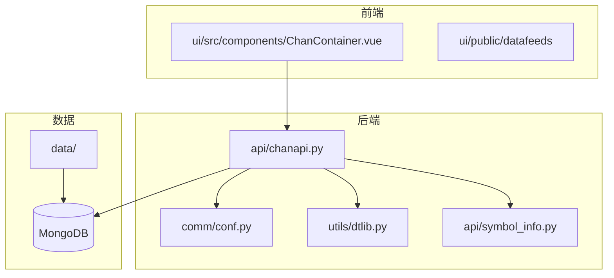
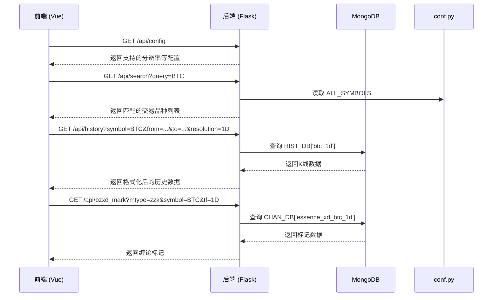
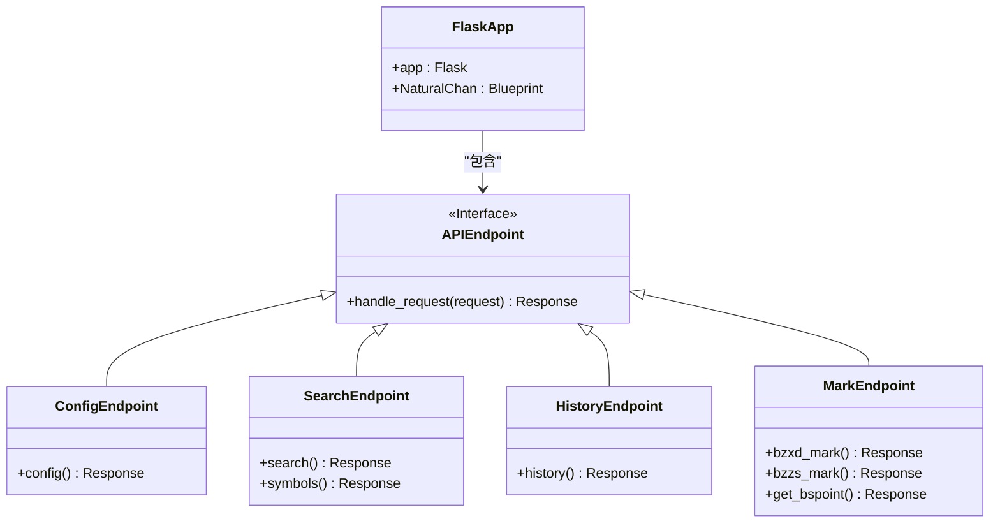
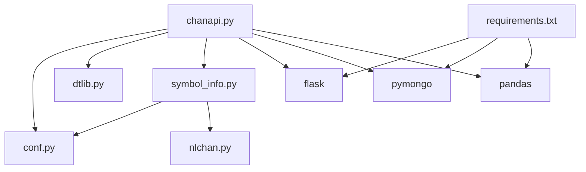

# 生产环境监控与安全

<cite>
**本文档引用的文件**   
- [chanapi.py](file://api/chanapi.py)
- [conf.py](file://comm/conf.py)
- [requirements.txt](file://api/requirements.txt)
- [symbol_info.py](file://api/symbol_info.py)
- [dtlib.py](file://utils/dtlib.py)
- [nlchan.py](file://utils/nlchan.py)
</cite>

## 目录

1. [引言](#引言)
2. [项目结构](#项目结构)
3. [核心组件](#核心组件)
4. [架构概述](#架构概述)
5. [详细组件分析](#详细组件分析)
6. [依赖分析](#依赖分析)
7. [性能考虑](#性能考虑)
8. [故障排除指南](#故障排除指南)
9. [结论](#结论)

## 引言

本文档旨在为基于TradingView本地SDK的缠论量化研究系统提供生产环境下的监控与安全加固指南。该系统前后端分离，前端基于Vue实现，后端采用Python Flask框架，通过API接口为前端提供K线历史数据、缠论分析结果等可视化所需信息。系统使用MongoDB存储K线历史数据和缠论结构数据。本指南将重点阐述如何配置日志记录、集成监控系统、实施API安全防护、加强数据库访问控制以及建立有效的告警机制，以确保系统在生产环境中的稳定性、安全性和可观测性。

## 项目结构

该项目采用前后端分离的架构，代码库结构清晰，职责分明。后端API服务位于`api/`目录，核心逻辑在`chanapi.py`中实现。`comm/`目录存放全局配置和常量，是整个项目的基础配置中心。`data/`目录存放通过ETL脚本导入的MongoDB数据。`hetl/`目录包含数据提取、转换和加载（ETL）相关的脚本。`ui/`目录是前端Vue应用。`utils/`目录提供日期处理和缠论相关的辅助函数。这种模块化的设计便于维护和扩展。



**图表来源**
- [chanapi.py](file://api/chanapi.py#L23-L567)
- [conf.py](file://comm/conf.py#L1-L166)
- [symbol_info.py](file://api/symbol_info.py#L1-L74)

**本节来源**
- [README.md](file://README.md#L1-L153)
- [chanapi.py](file://api/chanapi.py#L1-L568)
- [conf.py](file://comm/conf.py#L1-L166)

## 核心组件

系统的核心组件是Flask应用`app`和蓝图`NaturalChan`，它们定义了所有对外提供的API接口。`NaturalChan`蓝图注册了多个路由，如`/api/config`、`/api/history`、`/api/search`等，这些接口是前端与后端通信的桥梁。配置管理是通过`comm/conf.py`文件实现的，它集中定义了数据库连接、路径、时间周期映射等关键参数。数据访问通过`pymongo`库直接操作MongoDB，`CHAN_DB`、`HIST_DB`等变量封装了数据库连接。`symbol_info.py`文件负责加载和格式化交易品种信息，供前端搜索和显示使用。

**本节来源**
- [chanapi.py](file://api/chanapi.py#L23-L567)
- [conf.py](file://comm/conf.py#L1-L166)
- [symbol_info.py](file://api/symbol_info.py#L1-L74)

## 架构概述

系统采用典型的客户端-服务器架构。前端Vue应用作为客户端，通过HTTP请求调用后端Flask API。后端API处理业务逻辑，主要从MongoDB中读取K线历史数据和预先计算好的缠论分析结果（如线段、中枢），并将数据格式化为前端所需的格式后返回。数据的预处理和计算在系统外部完成，通过`hetl`目录下的脚本导入到MongoDB中。这种设计将复杂的量化计算与实时的可视化服务分离，保证了API的响应速度。



**图表来源**
- [chanapi.py](file://api/chanapi.py#L41-L234)
- [chanapi.py](file://api/chanapi.py#L61-L72)
- [chanapi.py](file://api/chanapi.py#L96-L234)
- [chanapi.py](file://api/chanapi.py#L280-L420)
- [conf.py](file://comm/conf.py#L143-L147)

## 详细组件分析

### API接口分析

API接口是系统与外界交互的唯一入口，其安全性和稳定性至关重要。

#### API路由与功能
系统通过`NaturalChan`蓝图定义了多个API端点，每个端点负责特定的功能。`/api/config`提供前端初始化所需的配置信息，如支持的时间周期。`/api/search`和`/api/symbols`用于交易品种的搜索和详情查询。`/api/history`是核心接口，用于获取指定交易品种、时间范围和周期的K线数据。`/api/bzxd_mark`和`/api/bzzs_mark`等接口则用于获取缠论分析的标记数据，如买卖点、中枢等。



**图表来源**
- [chanapi.py](file://api/chanapi.py#L41-L58)
- [chanapi.py](file://api/chanapi.py#L61-L93)
- [chanapi.py](file://api/chanapi.py#L96-L234)
- [chanapi.py](file://api/chanapi.py#L280-L420)

**本节来源**
- [chanapi.py](file://api/chanapi.py#L41-L420)

### 日志记录与监控集成

#### Python Logging配置
项目已在`comm/conf.py`中配置了Python的`logging`模块，这是实现生产环境监控的基础。当前配置为`DEBUG`级别，并将日志输出到控制台，格式包含时间戳、日志级别、模块名、函数名和消息内容。在生产环境中，应调整此配置以适应监控系统的要求。

```python
# comm/conf.py
logging.basicConfig(
    level=logging.DEBUG,
    format='%(asctime)s - %(levelname)6s - %(name)s - %(funcName)s - %(message)s'
)
```

为了集成ELK或Prometheus+Grafana，建议进行以下改造：
1.  **日志级别**：将`level`从`DEBUG`改为`INFO`或`WARNING`，以减少日志量。
2.  **日志输出**：将日志输出到文件而非控制台，便于Filebeat等工具收集。
3.  **结构化日志**：使用`python-json-logger`等库将日志格式化为JSON，便于ELK解析。
4.  **Prometheus集成**：在Flask应用中集成`prometheus-flask-exporter`，暴露HTTP请求计数、响应时间等指标。

#### 监控指标与告警
关键性能指标（KPI）应包括：
-   **API响应时间**：监控`/api/history`等核心接口的P95、P99响应时间，阈值可设为500ms和1000ms。
-   **请求速率**：监控每秒请求数（QPS），识别异常流量。
-   **错误率**：监控HTTP 5xx错误率，阈值可设为1%。
-   **内存占用**：监控Flask应用的内存使用情况，避免内存泄漏。
-   **数据库连接**：监控MongoDB的连接数和查询性能。

告警机制应通过Grafana设置，当指标超过阈值时，通过邮件、钉钉或企业微信通知运维人员。

**本节来源**
- [conf.py](file://comm/conf.py#L139-L140)

### API安全防护

当前系统缺乏基本的安全防护措施，存在安全风险。以下是必要的加固建议：

#### 请求频率限制 (Rate Limiting)
应使用`Flask-Limiter`等库实现请求频率限制。例如，限制单个IP地址每分钟对`/api/history`接口的请求次数不超过60次，以防止滥用和DDoS攻击。

#### IP白名单
对于内部使用的API，应配置IP白名单，只允许来自特定IP或IP段的请求。这可以通过Flask的装饰器或Nginx反向代理来实现。

#### JWT认证
虽然当前API是公开的，但为了未来扩展，应设计JWT认证机制。用户在登录后获取JWT令牌，后续请求需在`Authorization`头中携带该令牌。后端需验证令牌的有效性。`flask-jwt-extended`是实现此功能的常用库。

#### 其他安全措施
-   **输入验证**：对所有API参数进行严格验证，防止注入攻击。
-   **HTTPS**：生产环境必须使用HTTPS加密传输。
-   **CORS**：当前使用`flask_cors`允许所有来源，生产环境应限制为可信的前端域名。

**本节来源**
- [chanapi.py](file://api/chanapi.py#L565)

### 数据库与配置安全

#### 数据库访问控制
当前代码中`MongoClient`直接连接`localhost`，且无用户名密码。生产环境必须：
1.  为MongoDB配置强密码认证。
2.  在`conf.py`中通过环境变量读取数据库连接字符串（包含用户名密码），避免将敏感信息硬编码在代码中。
3.  为应用创建最小权限的数据库用户，仅授予其所需集合的读取权限。

#### 敏感配置加密
`conf.py`中的数据库连接信息、API密钥等都属于敏感配置。应使用环境变量或配置管理工具（如Hashicorp Vault）来管理这些信息。代码中通过`os.getenv()`读取，确保`.env`文件被`.gitignore`忽略。

**本节来源**
- [conf.py](file://comm/conf.py#L143-L147)

## 依赖分析

系统依赖关系清晰，层次分明。`api/chanapi.py`是核心，它依赖于`comm/conf.py`获取配置和数据库连接，依赖于`utils/dtlib.py`进行日期时间处理，依赖于`api/symbol_info.py`获取交易品种信息。`symbol_info.py`又依赖于`comm/conf.py`和`utils/nlchan.py`。`requirements.txt`明确定义了第三方库依赖，包括`flask`、`pymongo`、`pandas`等。这种依赖结构确保了代码的模块化和可维护性。



**图表来源**
- [chanapi.py](file://api/chanapi.py#L17-L20)
- [symbol_info.py](file://api/symbol_info.py#L1-L2)
- [requirements.txt](file://api/requirements.txt#L1-L9)

**本节来源**
- [requirements.txt](file://api/requirements.txt#L1-L9)
- [chanapi.py](file://api/chanapi.py#L1-L568)
- [conf.py](file://comm/conf.py#L1-L166)

## 性能考虑

系统的性能瓶颈主要在于数据库查询。`/api/history`接口在查询大量K线数据时可能较慢。优化建议包括：
1.  **数据库索引**：确保在`ts`字段上创建了升序索引，以加速时间范围查询。
2.  **数据分页**：虽然当前接口返回所有匹配数据，但对于超长历史数据，应考虑实现分页。
3.  **缓存**：对频繁访问且不常变动的数据（如交易品种列表、近期K线）使用Redis等缓存，减少数据库压力。
4.  **异步处理**：对于复杂的标记数据查询，可考虑使用Celery等任务队列进行异步处理。

[无来源，本节提供通用性能建议]

## 故障排除指南

当系统出现问题时，可按以下步骤排查：
1.  **检查日志**：首先查看应用日志，根据`%(funcName)s`定位到具体函数，分析错误信息。
2.  **验证数据库连接**：确认MongoDB服务是否正常运行，应用能否成功连接。
3.  **测试API端点**：使用`curl`或Postman直接调用API，确认是应用问题还是前端问题。
4.  **检查数据完整性**：确认所需的数据集合是否存在，数据是否完整。

**本节来源**
- [conf.py](file://comm/conf.py#L139-L140)
- [chanapi.py](file://api/chanapi.py#L212-L213)

## 结论

本文档分析了基于TradingView的缠论量化系统，并提出了生产环境下的监控与安全加固方案。核心建议包括：改造`logging`配置以集成ELK或Prometheus；实施请求频率限制、IP白名单和JWT认证等API安全措施；通过环境变量和加密存储来保护数据库连接等敏感配置；并建立基于关键性能指标的告警机制。通过实施这些措施，可以显著提升系统的安全性、稳定性和可观测性，为生产环境的稳定运行提供保障。

[无来源，本节为总结性内容]