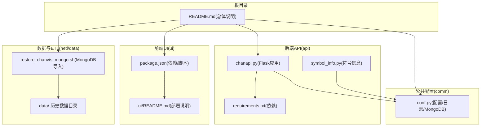
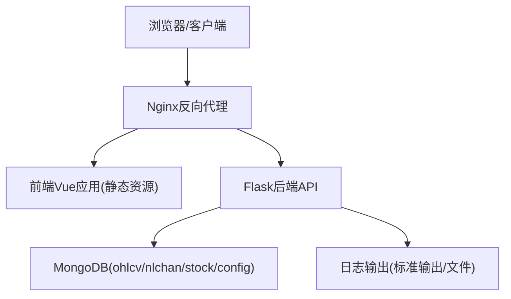
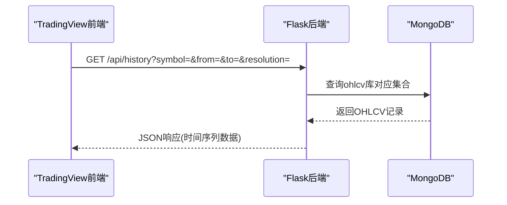
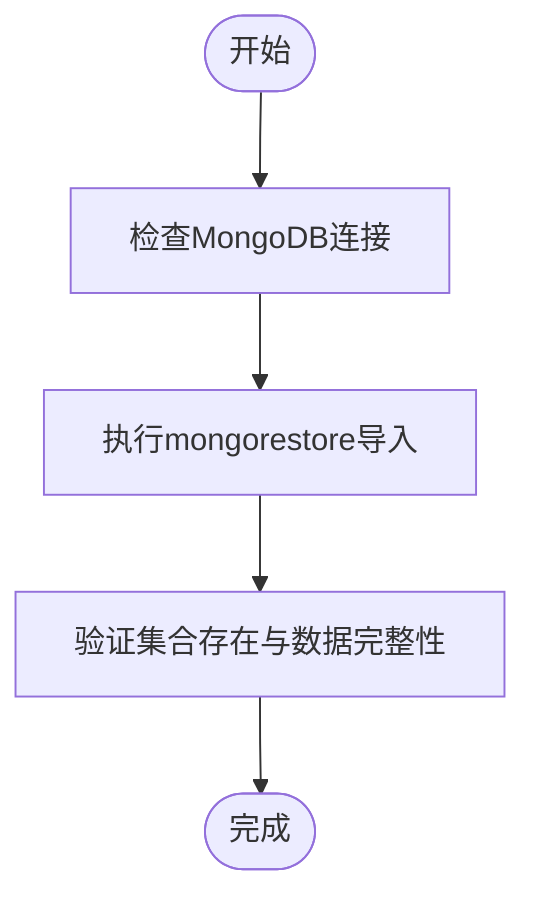
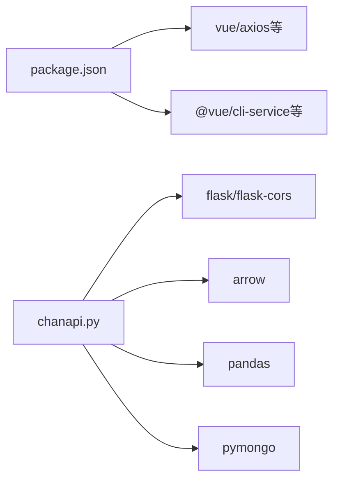

# 部署与运维

<cite>
**本文引用的文件**
- [README.md](file://README.md)
- [chanapi.py](file://api/chanapi.py)
- [requirements.txt](file://api/requirements.txt)
- [conf.py](file://comm/conf.py)
- [symbol_info.py](file://api/symbol_info.py)
- [package.json](file://ui/package.json)
- [ui/README.md](file://ui/README.md)
- [restore_chanvis_mongo.sh](file://hetl/hmgo/restore_chanvis_mongo.sh)
</cite>

## 目录
1. [简介](#简介)
2. [项目结构](#项目结构)
3. [核心组件](#核心组件)
4. [架构总览](#架构总览)
5. [详细组件分析](#详细组件分析)
6. [依赖关系分析](#依赖关系分析)
7. [性能考虑](#性能考虑)
8. [故障排查指南](#故障排查指南)
9. [结论](#结论)
10. [附录](#附录)

## 简介
本项目是一个基于 TradingView 本地 SDK 的可视化前后端系统，后端采用 Python Flask 提供 API 接口，前端使用 Vue 实现图表绘制与交互。系统支持本地部署与云端私有化部署，后端数据依赖 MongoDB 存储历史 K 线与缠论识别结果。本文档面向运维工程师与开发者，提供本地与云端部署方案、反向代理配置、容器化建议、日志与监控、安全加固以及高可用架构建议。

## 项目结构
- 后端 API：位于 api/ 目录，包含 Flask 应用、路由与依赖声明。
- 公共配置：位于 comm/ 目录，包含数据库连接、时间周期映射、日志配置等。
- 数据与ETL：位于 data/ 与 hetl/ 目录，包含历史数据与 MongoDB 导入脚本。
- 前端 UI：位于 ui/ 目录，包含 Vue 项目与构建说明。
- 文档与根目录：README.md 提供整体说明与目录结构。

**图表来源**
- [chanapi.py](file://api/chanapi.py#L1-L60)
- [requirements.txt](file://api/requirements.txt#L1-L9)
- [conf.py](file://comm/conf.py#L1-L40)
- [symbol_info.py](file://api/symbol_info.py#L1-L40)
- [package.json](file://ui/package.json#L1-L30)
- [ui/README.md](file://ui/README.md#L1-L20)
- [restore_chanvis_mongo.sh](file://hetl/hmgo/restore_chanvis_mongo.sh#L1-L30)
- [README.md](file://README.md#L107-L136)

**章节来源**
- [README.md](file://README.md#L107-L136)

## 核心组件
- Flask 后端服务：提供 TradingView 数据源接口（配置、搜索、符号、历史、标记点等），并注册蓝图。
- MongoDB 数据层：通过 conf.py 中的连接配置访问多个数据库（ohlcv、nlchan、stock、config）。
- 前端 Vue 应用：集成 TradingView 本地 SDK，构建与运行脚本由 package.json 管理。
- 符号与时间周期映射：symbol_info.py 生成支持的交易对与股票符号信息；conf.py 定义分辨率与秒数映射。

**章节来源**
- [chanapi.py](file://api/chanapi.py#L1-L60)
- [conf.py](file://comm/conf.py#L135-L166)
- [symbol_info.py](file://api/symbol_info.py#L1-L40)
- [package.json](file://ui/package.json#L1-L30)

## 架构总览
系统采用前后端分离架构，后端提供 REST 风格接口，前端通过 axios 请求后端数据，使用 TradingView 本地 SDK 渲染图表。数据访问通过 MongoDB 完成，配置与日志在后端集中管理。

**图表来源**
- [chanapi.py](file://api/chanapi.py#L1-L60)
- [conf.py](file://comm/conf.py#L135-L166)
- [ui/README.md](file://ui/README.md#L1-L20)

## 详细组件分析

### Flask 后端组件
- 应用入口与蓝图：后端以 Flask 创建应用并注册 NaturalChan 蓝图，统一前缀。
- 关键路由：
  - 配置接口：返回 TradingView 支持的分辨率与时间戳支持。
  - 搜索接口：返回支持的交易对与股票列表。
  - 符号接口：按名称或代码匹配返回符号详情。
  - 历史接口：按周期与时间范围查询 OHLCV 数据，支持回放场景的部分周期处理。
  - 标记点接口：按类型返回中枢、线段、买卖点等标记数据。
  - 辅助接口：返回上层分型区间等。
- 跨域支持：开发模式下启用 CORS，便于本地联调。
- 日志：通过 logging 配置输出格式，便于定位问题。

**图表来源**
- [chanapi.py](file://api/chanapi.py#L96-L170)
- [conf.py](file://comm/conf.py#L135-L166)

**章节来源**
- [chanapi.py](file://api/chanapi.py#L41-L235)
- [conf.py](file://comm/conf.py#L135-L166)

### MongoDB 配置与数据导入
- 连接配置：默认连接本地 MongoDB，分别指向 ohlcv、nlchan、stock、config 数据库。
- 数据导入：提供 mongorestore 脚本，按命名空间导入股票、回放配置与缠论分析结果集合。
- 建议：生产环境应使用副本集或分片集群，配合备份策略与网络隔离。

**图表来源**
- [conf.py](file://comm/conf.py#L135-L166)
- [restore_chanvis_mongo.sh](file://hetl/hmgo/restore_chanvis_mongo.sh#L21-L30)

**章节来源**
- [conf.py](file://comm/conf.py#L135-L166)
- [restore_chanvis_mongo.sh](file://hetl/hmgo/restore_chanvis_mongo.sh#L1-L30)

### 前端组件
- 依赖与脚本：package.json 定义构建、开发与校验脚本。
- 部署准备：ui/README.md 指导复制 TradingView SDK 至 public 与 src 目录，并提供本地启动方式。
- 建议：生产构建后将 dist 输出作为静态资源由 Nginx 提供。

**章节来源**
- [package.json](file://ui/package.json#L1-L30)
- [ui/README.md](file://ui/README.md#L1-L38)

## 依赖关系分析
- 后端依赖：Flask、Flask-CORS、arrow、pymongo、pandas 等。
- 前端依赖：axios、vue、@vue/cli-service 等。
- 运行时依赖：MongoDB 服务器。

**图表来源**
- [requirements.txt](file://api/requirements.txt#L1-L9)
- [package.json](file://ui/package.json#L1-L30)
- [chanapi.py](file://api/chanapi.py#L1-L20)

**章节来源**
- [requirements.txt](file://api/requirements.txt#L1-L9)
- [package.json](file://ui/package.json#L1-L30)

## 性能考虑
- 数据查询优化
  - 历史接口按 ts 字段升序排序并限定时间范围，建议在 ts 上建立索引以提升查询性能。
  - 对高频分辨率（如 1 分钟）数据，建议分表或分区策略，避免单表过大。
- 并发与进程模型
  - 生产环境推荐使用 Gunicorn 或 uWSGI 部署，结合多 worker 与合适的并发模型。
  - 前端静态资源由 Nginx 提供，后端仅处理 API，降低后端压力。
- 缓存策略
  - 对热点符号与周期的 OHLCV 可引入 Redis 缓存，减少 MongoDB 压力。
- 日志与监控
  - 后端日志输出至标准输出，便于容器日志采集；建议接入集中式日志系统（如 ELK/Fluentd）。
  - 结合 Prometheus/Grafana 监控请求延迟、错误率与资源占用。

[本节为通用指导，无需特定文件来源]

## 故障排查指南
- 后端无法连接 MongoDB
  - 检查 conf.py 中的连接字符串与数据库名是否正确。
  - 确认 MongoDB 服务状态与网络连通性。
- 前端无法加载 TradingView SDK
  - 按 ui/README.md 的步骤复制 charting_library、charting_library.js 与 datafeeds 至 public/src。
- 历史数据为空或无数据
  - 检查历史数据是否导入成功，确认集合命名与数据格式符合预期。
  - 核对时间范围参数与分辨率映射是否一致。
- CORS 跨域问题
  - 开发阶段已启用 CORS，生产环境需在 Nginx 层配置允许跨域头。
- 日志定位
  - 后端日志格式包含时间、级别、模块与函数名，便于快速定位异常。

**章节来源**
- [conf.py](file://comm/conf.py#L135-L166)
- [ui/README.md](file://ui/README.md#L1-L38)
- [chanapi.py](file://api/chanapi.py#L1-L60)

## 结论
本项目提供了清晰的前后端分离架构与可扩展的数据层设计。通过合理的部署与运维实践（反向代理、容器化、日志与监控、安全加固），可在本地与云端环境中稳定运行。建议优先采用容器化与反向代理方案，结合高可用与灾备策略，确保系统在生产环境中的可靠性与可维护性。

[本节为总结，无需特定文件来源]

## 附录

### 本地部署与云端私有化部署对比
- 本地部署
  - 优点：部署简单、数据可控、调试便利。
  - 缺点：资源受限、扩展性差、运维成本高。
- 云端私有化部署
  - 优点：弹性扩容、高可用、集中运维、备份与监控完善。
  - 缺点：网络与合规要求更高、数据外泄风险需严格管控。

[本节为概念性对比，无需特定文件来源]

### 使用 Gunicorn/uWSGI 部署 Flask 后端
- 选择 WSGI 服务器
  - 推荐使用 Gunicorn，配置多 worker 与合适的并发模型。
  - 如需更高性能或兼容性，可考虑 uWSGI。
- 进程与线程
  - 根据 CPU 核心数设置 worker 数量，每个 worker 内部可配置线程池。
- 日志与健康检查
  - 后端日志输出至标准输出，便于容器日志采集。
  - 配置健康检查端点，定期探测后端存活。

[本节为通用指导，无需特定文件来源]

### 使用 Nginx 反向代理前后端服务
- 静态资源与 API 分离
  - 前端构建产物由 Nginx 提供静态服务。
  - 后端 API 通过反向代理转发至 Flask 应用。
- 跨域与缓存
  - 在 Nginx 层配置跨域头与静态资源缓存策略。
- TLS 与限流
  - 配置 HTTPS 证书与安全头，必要时开启限流与 WAF。

[本节为通用指导，无需特定文件来源]

### Docker 化部署建议
- 目录结构
  - 后端镜像：打包 Flask 应用与依赖，暴露 API 端口。
  - 前端镜像：构建 Vue 应用，使用 Nginx 提供静态服务。
  - MongoDB 镜像：使用官方镜像，挂载持久化卷。
- docker-compose.yml 关键点
  - 服务编排：后端、前端、MongoDB 三者网络互通。
  - 环境变量：数据库连接、日志级别、时区等。
  - 持久化：MongoDB 数据卷与日志卷。
  - 健康检查：对后端与数据库进行健康检查。
- MongoDB 容器配置
  - 使用副本集或分片集群（生产）。
  - 配置备份计划与快照策略。

[本节为通用指导，无需特定文件来源]

### 生产环境下的日志管理、性能监控与安全配置
- 日志管理
  - 后端日志输出至标准输出，结合容器日志驱动收集。
  - 前端静态日志由 Nginx 访问日志记录，结合后端业务日志统一分析。
- 性能监控
  - 指标：请求延迟、吞吐量、错误率、数据库慢查询。
  - 工具：Prometheus + Grafana + Alertmanager。
- 安全配置
  - API 访问控制：鉴权与限流（如基于令牌或 IP 白名单）。
  - 网络隔离：后端与数据库置于内网，仅开放必要端口。
  - TLS：启用 HTTPS，强制重定向。
  - 输入校验：对查询参数进行白名单与长度限制。

[本节为通用指导，无需特定文件来源]

### 高可用架构建议
- 多实例与负载均衡
  - 后端多实例部署，Nginx/LB 做健康检查与故障切换。
- 数据高可用
  - MongoDB 使用副本集，开启自动故障转移与仲裁节点。
- 缓存与CDN
  - 前端静态资源使用 CDN，热点数据引入缓存层。
- 监控与告警
  - 全链路监控覆盖 API、数据库、存储与网络。
- 备份与演练
  - 定期备份与灾难恢复演练，确保 RPO/RTO 满足业务要求。

[本节为通用指导，无需特定文件来源]