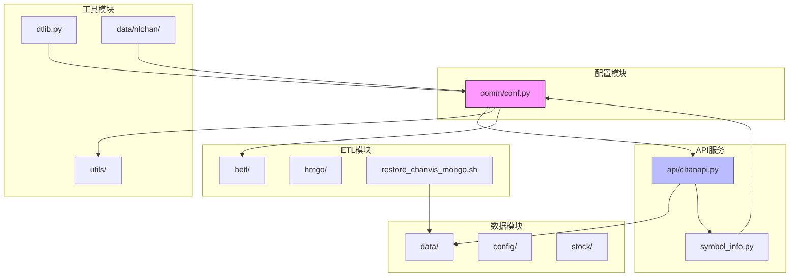
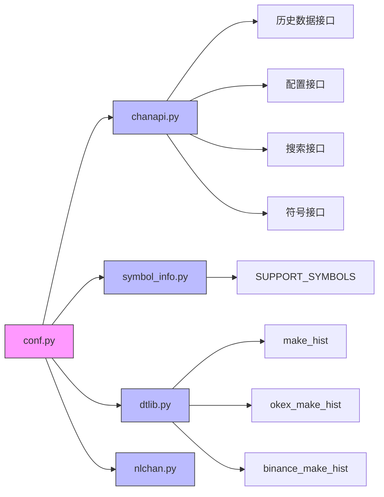
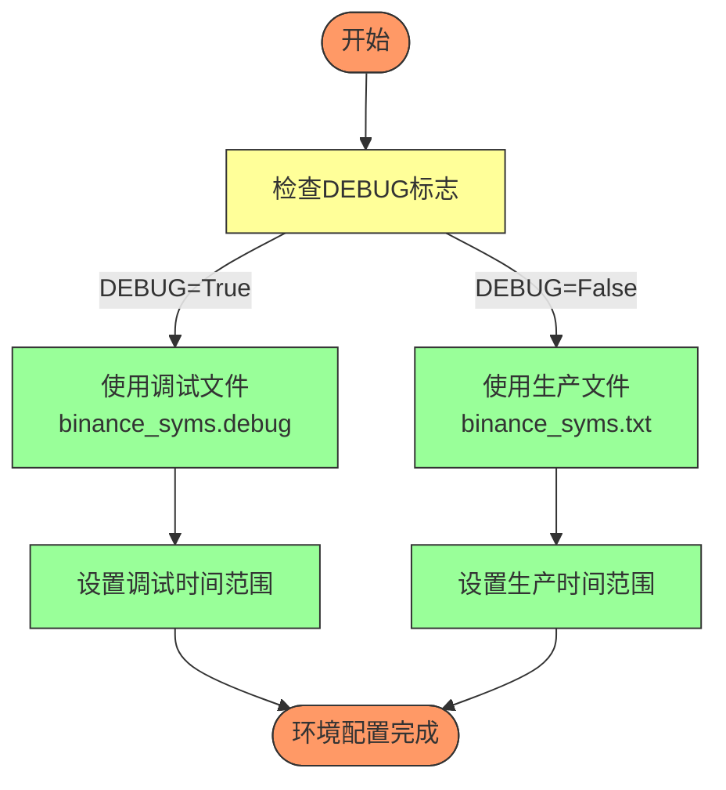
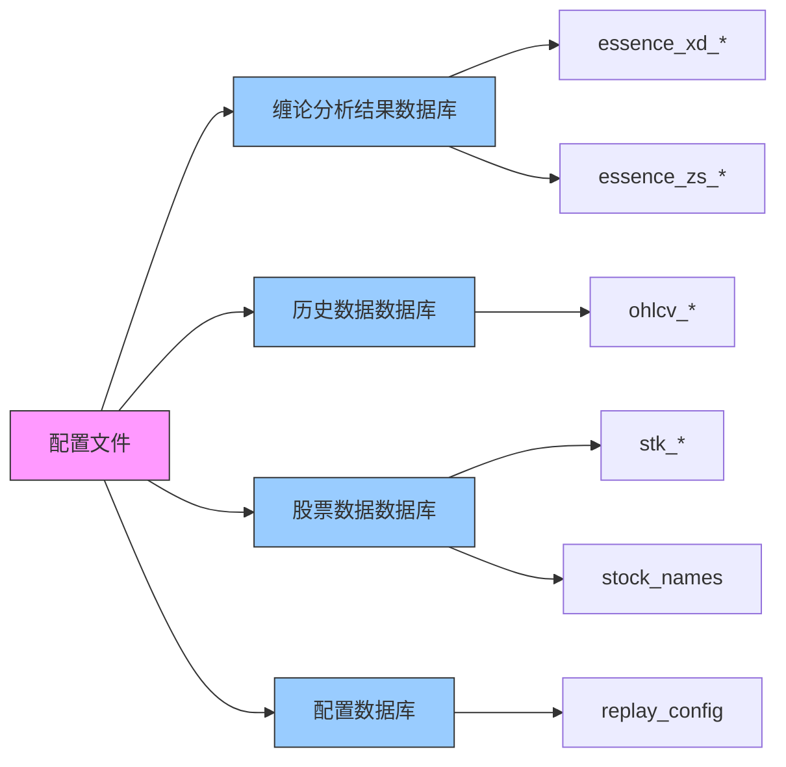
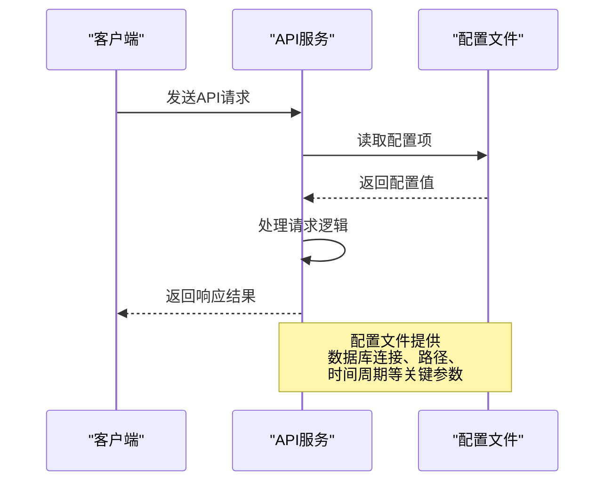
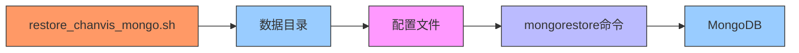

# 配置管理

<cite>
**本文档引用的文件**
- [conf.py](file://comm/conf.py)
- [chanapi.py](file://api/chanapi.py)
- [symbol_info.py](file://api/symbol_info.py)
- [dtlib.py](file://utils/dtlib.py)
- [nlchan.py](file://utils/nlchan.py)
- [restore_chanvis_mongo.sh](file://hetl/hmgo/restore_chanvis_mongo.sh)
- [replay_config.metadata.json](file://data/config/replay_config.metadata.json)
- [stock_names.metadata.json](file://data/stock/stock_names.metadata.json)
- [essence_xd_000001.XSHG_1d.metadata.json](file://data/nlchan/essence_xd_000001.XSHG_1d.metadata.json)
- [stk_000001.XSHG_1d.metadata.json](file://data/stock/stk_000001.XSHG_1d.metadata.json)
</cite>

## 目录
1. [项目结构](#项目结构)
2. [核心配置项分析](#核心配置项分析)
3. [配置引用关系](#配置引用关系)
4. [环境切换机制](#环境切换机制)
5. [配置最佳实践](#配置最佳实践)
6. [系统集成中的核心作用](#系统集成中的核心作用)

## 项目结构

本项目采用模块化设计，将配置、API服务、数据处理等功能分离到不同的目录中，确保代码的可维护性和可扩展性。



**图示来源**
- [conf.py](file://comm/conf.py)
- [chanapi.py](file://api/chanapi.py)
- [symbol_info.py](file://api/symbol_info.py)
- [dtlib.py](file://utils/dtlib.py)
- [nlchan.py](file://utils/nlchan.py)
- [restore_chanvis_mongo.sh](file://hetl/hmgo/restore_chanvis_mongo.sh)

## 核心配置项分析

`conf.py`文件定义了系统的核心配置，包括路径、数据库连接、时间周期映射、K线列定义等关键参数。

### 路径配置
系统定义了根路径和数据路径，确保文件访问的一致性和可移植性。

```python
ROOT_PATH = os.path.dirname(os.path.dirname(os.path.abspath(__file__)))
DATA_PATH = os.path.join(ROOT_PATH, 'data')
```

### 数据库配置
系统配置了多个MongoDB数据库连接，分别用于存储不同类型的业务数据。

```python
client = MongoClient('localhost', 27017)
CHAN_DB = client.nlchan
HIST_DB = client.ohlcv
STOCK_DB = client.stock
CONF_DB = client.config
```

### 时间周期配置
系统定义了时间周期与秒数的映射关系，以及不同时间周期在一天内的K线数量。

```python
TF_SEC_MAP = {'1m': 1 * 60, '5m': 5 * 60, '30m': 30 * 60, '1h': 1 * 60 * 60, '4h': 4 * 60 * 60, '1d': 24 * 60 * 60, '1w': 7 * 24 * 60 * 60}
TF_DAY_KLINE_CNT = {'1m': 1440, '5m': 1440 // 5, '30m': 1440 // 30, '1h': 1440 // 60, '4h': 1440 // 240, '1d': 1440 // 1440}
```

### K线列定义
系统定义了不同交易所的K线数据列，以及标准化的K线列格式。

```python
HB_KDATA_COLUMNS = ['id', 'datetime', 'open', 'high', 'low', 'close', 'count', 'vol', 'amount']
OK_KDATA_COLUMNS = ['ts', 'datetime', 'open', 'high', 'low', 'close', 'cnt', 'volume', 'currency_volume']
STAND_KDATA_COLUMNS = ['id', 'datetime', 'open', 'high', 'low', 'close', 'volume', 'amount']
```

### 符号配置
系统从文件中读取交易符号配置，支持动态加载和过滤特殊符号。

```python
ALL_SYMBOLS = []
SPECILS = ['DAI', 'TUSD']
fname = os.path.join(ROOT_PATH, 'hetl/selcoin/binance_syms.txt')
with open(fname) as f:
    for line in f:
        line = line.strip()
        sym, minmov = line.split()
        if sym in SPECILS:
            continue
        item = {'symbol': sym, 'minmov': minmov}
        ALL_SYMBOLS.append(item)
```

### 集合名称模板
系统使用模板化方式定义MongoDB集合名称，支持动态生成。

```python
ESSENCE_XD_COL = 'essence_xd_{sym}_{tf}'
ESSENCE_ZS_COL = 'essence_zs_{sym}_{tf}'
LNCHAN_XD_COL = 'lnchan_xd_{sym}_{tf}'
LNCHAN_ZS_COL = 'lnchan_zs_{sym}_{tf}'
```

**本节来源**
- [conf.py](file://comm/conf.py)

## 配置引用关系

系统中的各个模块通过导入`conf.py`文件来引用配置项，确保配置的一致性和集中管理。

### API服务引用
`chanapi.py`文件导入了多个配置项，用于处理API请求和数据库操作。

```python
from comm.conf import DATA_PATH, RESOU_DICT, MAX_XD_LEN, STOCK_DB, TF_SEC_MAP, CHAN_DB, HIST_DB
from comm.conf import ESSENCE_XD_COL, ESSENCE_ZS_COL, LNCHAN_XD_COL, HIST_DB, CONF_DB
```

### 符号信息引用
`symbol_info.py`文件引用了`ALL_SYMBOLS`和`STOCK_DB`配置，用于生成支持的交易符号列表。

```python
from comm.conf import ALL_SYMBOLS, STOCK_DB
```

### 工具模块引用
`dtlib.py`文件引用了K线列定义配置，用于数据格式转换。

```python
from comm.conf import OK_KDATA_COLUMNS, STAND_KDATA_COLUMNS, BA_KDATA_COLUMNS
```

### 配置引用关系图


**图示来源**
- [conf.py](file://comm/conf.py)
- [chanapi.py](file://api/chanapi.py)
- [symbol_info.py](file://api/symbol_info.py)
- [dtlib.py](file://utils/dtlib.py)

**本节来源**
- [conf.py](file://comm/conf.py)
- [chanapi.py](file://api/chanapi.py)
- [symbol_info.py](file://api/symbol_info.py)
- [dtlib.py](file://utils/dtlib.py)

## 环境切换机制

系统通过`DEBUG`标志和条件语句实现开发环境和生产环境的切换。

### DEBUG标志
系统定义了`DEBUG`标志，用于控制不同环境下的行为。

```python
DEBUG = False
```

### 文件路径切换
根据`DEBUG`标志，系统选择不同的符号配置文件。

```python
if DEBUG:
    fname = os.path.join(ROOT_PATH, 'hetl/selcoin/binance_syms.debug')
else:
    fname = os.path.join(ROOT_PATH, 'hetl/selcoin/binance_syms.txt')
```

### 时间范围切换
系统根据`DEBUG`标志设置不同的时间范围。

```python
if DEBUG:
    ALL_TIMEFRAMES = ("30m", "5m", "4h", "1d", "1m")
else:
    ALL_TIMEFRAMES = ("30m", "5m", "4h", "1d", "1m")
```

### 环境切换流程图


**图示来源**
- [conf.py](file://comm/conf.py)

**本节来源**
- [conf.py](file://comm/conf.py)

## 配置最佳实践

### 使用环境变量替代硬编码
建议将敏感信息如数据库连接字符串、API密钥等通过环境变量注入，而不是硬编码在配置文件中。

```python
import os
MONGODB_HOST = os.getenv('MONGODB_HOST', 'localhost')
MONGODB_PORT = int(os.getenv('MONGODB_PORT', 27017))
```

### 配置文件分离
建议将配置文件按环境分离，如`conf_dev.py`、`conf_prod.py`，并通过环境变量选择加载哪个配置文件。

```python
import os
env = os.getenv('ENVIRONMENT', 'dev')
if env == 'prod':
    from conf_prod import *
else:
    from conf_dev import *
```

### 配置验证
在应用启动时验证配置的完整性和正确性，避免运行时错误。

```python
def validate_config():
    required_fields = ['ROOT_PATH', 'DATA_PATH', 'CHAN_DB', 'HIST_DB']
    for field in required_fields:
        if not hasattr(sys.modules[__name__], field):
            raise ValueError(f"Missing required configuration: {field}")
```

### 配置热更新
对于需要动态调整的配置，可以实现配置热更新机制，无需重启服务即可生效。

```python
import signal
def reload_config(signum, frame):
    global CONFIG
    CONFIG = load_config()
    
signal.signal(signal.SIGHUP, reload_config)
```

## 系统集成中的核心作用

配置文件在系统集成中扮演着核心角色，连接了各个模块和外部系统。

### 数据库集成
配置文件定义了多个MongoDB数据库连接，为不同类型的业务数据提供存储支持。



**图示来源**
- [conf.py](file://comm/conf.py)
- [replay_config.metadata.json](file://data/config/replay_config.metadata.json)
- [stock_names.metadata.json](file://data/stock/stock_names.metadata.json)
- [essence_xd_000001.XSHG_1d.metadata.json](file://data/nlchan/essence_xd_000001.XSHG_1d.metadata.json)
- [stk_000001.XSHG_1d.metadata.json](file://data/stock/stk_000001.XSHG_1d.metadata.json)

### API集成
配置文件为API服务提供了必要的参数，确保接口能够正确处理请求。



**图示来源**
- [conf.py](file://comm/conf.py)
- [chanapi.py](file://api/chanapi.py)

### ETL集成
配置文件为ETL过程提供了数据源和目标的定义，确保数据能够正确导入和导出。



**图示来源**
- [conf.py](file://comm/conf.py)
- [restore_chanvis_mongo.sh](file://hetl/hmgo/restore_chanvis_mongo.sh)
- [replay_config.metadata.json](file://data/config/replay_config.metadata.json)