# ChanVis - 缠论量化研究可视化平台

> 更新时间：2025-12-10 14:41:50

## 项目愿景

ChanVis 是一个基于 TradingView 本地 SDK 的缠论量化研究可视化平台，专为缠论研究者和量化交易者设计。项目旨在提供强大的几何交易分析工具，支持缠论理论的程序化实现与可视化，帮助交易者更好地理解和应用缠论分析体系。

## 架构总览

项目采用前后端分离架构，结合 TradingView 强大的图表展示能力和自定义扩展功能，为缠论研究提供专业的可视化解决方案。

### 技术架构
- **前端框架**: Vue.js 2.5 + JavaScript/TypeScript
- **图表引擎**: TradingView Charting Library (本地SDK)
- **后端框架**: Python Flask + RESTful API
- **数据存储**: MongoDB (存储历史K线数据、缠论结构数据)
- **数据处理**: Python Pandas + NumPy
- **智能体系统**: SQLite (AI Swarm 记忆存储)

### 部署模式
- **本地部署**: 支持本地环境运行，数据安全可控
- **云端部署**: 支持云平台私有化部署，便于团队协作

## ✨ 模块结构图

```mermaid
graph TD
    A["(根) ChanVis"] --> B["api"];
    A --> C["ui"];
    A --> D["comm"];
    A --> E["utils"];
    A --> F["hetl"];
    A --> G["data"];
    A --> H["pics"];
    A --> I[".claude-flow"];
    A --> J[".spec-workflow"];
    A --> K[".swarm"];

    B --> B1["Flask API服务"];
    B --> B2["数据接口"];
    B --> B3["符号信息"];

    C --> C1["Vue.js前端"];
    C --> C2["TradingView集成"];
    C --> C3["图表组件"];

    D --> D1["配置管理"];
    E --> E1["工具函数"];
    E --> E2["缠论算法"];
    F --> F1["数据ETL"];
    F --> F2["股票数据"];
    F --> F3["币圈数据"];

    G --> G1["MongoDB数据"];
    G --> G2["配置文件"];
    G --> G3["历史数据"];

    I --> I1["性能指标"];
    I --> I2["任务监控"];

    J --> J1["需求模板"];
    J --> J2["设计模板"];
    J --> J3["工作流程"];

    K --> K1["智能体记忆"];
    K --> K2["多Agent协作"];
    K --> K3["AI辅助分析"];

    click B "./api/CLAUDE.md" "查看 API 模块文档"
    click C "./ui/CLAUDE.md" "查看 UI 模块文档"
    click D "./comm/CLAUDE.md" "查看 comm 模块文档"
    click E "./utils/CLAUDE.md" "查看 utils 模块文档"
    click F "./hetl/CLAUDE.md" "查看 hetl 模块文档"
    click G "./data/CLAUDE.md" "查看 data 模块文档"
    click H "./pics/CLAUDE.md" "查看 pics 模块文档"
    click I "./.claude-flow/CLAUDE.md" "查看 AI工作流文档"
    click J "./.spec-workflow/CLAUDE.md" "查看 规格化工作流文档"
    click K "./.swarm/CLAUDE.md" "查看 Swarm智能体文档"
```



## 模块索引

| 模块名称 | 路径 | 主要技术 | 模块职责 | 文档覆盖率 | 最后更新 |
|---------|------|----------|----------|------------|----------|
| **API 服务** | `api/` | Python, Flask | 提供RESTful API，处理K线数据、缠论结构数据接口 | 100% | 2025-12-10 |
| **UI 前端** | `ui/` | Vue.js, TradingView SDK | 基于TradingView的可视化界面，展示K线和缠论分析 | 100% | 2025-12-10 |
| **公共配置** | `comm/` | Python | 全局配置文件、数据库连接、常量定义 | 100% | 2025-12-10 |
| **工具函数** | `utils/` | Python | 通用工具函数、日期处理、缠论算法辅助 | 100% | 2025-12-10 |
| **数据ETL** | `hetl/` | Python, Pandas | 数据抽取、转换、加载，支持股票和币圈数据源 | 100% | 2025-12-10 |
| **数据存储** | `data/` | BSON, JSON | MongoDB数据导出文件、配置文件存储 | 100% | 2025-12-10 |
| **图片资源** | `pics/` | - | 演示图片、效果图等静态资源 | 100% | 2025-12-10 |
| **AI工作流** | `.claude-flow/` | JSON | AI辅助开发的工作流配置和性能指标 | 100% | 2025-12-10 |
| **规格化工作流** | `.spec-workflow/` | Markdown | 软件开发规格化流程模板 | 100% | 2025-12-10 |
| **Swarm智能体** | `.swarm/` | SQLite | Agent协作记忆数据库，提供AI辅助分析功能 | 100% | 2025-12-10 |

## 运行与开发

### 环境要求
- Python 3.6+
- Node.js 14+
- MongoDB 4.0+
- TradingView Charting Library SDK
- SQLite 3.x (用于 Swarm 模块)

### 快速启动

1. **后端启动**
   ```bash
   cd api
   pip install -r requirements.txt
   python chanapi.py
   ```
   API服务将在 http://127.0.0.1:8421 启动

2. **前端启动**
   ```bash
   cd ui
   npm install
   npm run serve
   ```
   前端服务将在 http://127.0.0.1:8080 启动

3. **数据准备**
   ```bash
   # 导入MongoDB数据
   cd hetl/hmgo
   ./restore_chanvis_mongo.sh
   ```

4. **Swarm 智能体初始化**（可选）
   ```bash
   # 初始化智能体数据库
   python -c "
   import sqlite3
   conn = sqlite3.connect('.swarm/memory.db')
   # 创建必要的表结构（参考 .swarm/CLAUDE.md）
   conn.close()
   "
   ```

### 开发配置

- TradingView SDK需要放置在 `ui/public/charting_library/` 目录
- Datafeeds组件需要放置在 `ui/public/datafeeds/` 目录
- 详细的部署说明请参考 `ui/README.md`

## 测试策略

### 当前测试覆盖
- API接口测试：需要补充
- 前端组件测试：未实现
- 数据ETL测试：需要补充
- 集成测试：需要补充
- Swarm智能体测试：需要补充

### 建议的测试框架
- 后端：pytest + Flask-Testing
- 前端：Jest + Vue Test Utils
- E2E：Cypress
- 智能体：unittest + Mock

## 编码规范

### Python 后端规范
- 遵循 PEP 8 编码标准
- 使用 type hints 提高代码可读性
- API接口返回统一格式的JSON响应
- 使用日志记录关键操作

### 前端规范
- 遵循 Vue.js 官方风格指南
- 组件命名使用 PascalCase
- 事件处理器使用 camelCase
- CSS使用 BEM 命名规范

### 数据库规范
- 集合命名使用复数形式
- 字段命名使用 snake_case
- 建立适当的索引优化查询性能

## AI 使用指引

### 项目特点
1. **缠论理论集成**: 深度集成缠论分析理论，支持线段、中枢等核心概念
2. **TradingView生态**: 基于业界最专业的图表工具，提供专业级分析体验
3. **灵活扩展**: 支持自定义缠论策略，实现"千人千缠"的个性化需求
4. **多数据源**: 支持股票、期货、加密货币等多种金融数据
5. **智能体增强**: 集成 Swarm 多智能体系统，提供AI辅助分析

### AI 辅助开发建议
1. **缠论算法**: 可以利用AI优化缠论识别算法，提高准确性
2. **策略回测**: 集成AI进行策略优化和参数调优
3. **智能推荐**: 基于历史数据推荐可能的交易机会
4. **自动化报告**: 生成缠论分析报告和交易建议
5. **多智能体协作**: 利用 Swarm 实现专业化的分析智能体

### AI工作流集成
- 使用 `.claude-flow/` 监控开发性能
- 利用 `.spec-workflow/` 模板规范化开发流程
- 通过 `.swarm/` 实现多Agent协作和记忆

### 注意事项
- 本项目专注于可视化展示，不包含交易执行功能
- 策略的准确性需要使用者自行验证
- 建议结合实际交易经验使用本工具
- AI分析结果仅供参考，不构成投资建议

## 变更记录 (Changelog)

### 2025-12-10 14:41:50 - 第三轮终极扫描
- ✅ 完成全项目67个文件的100%扫描覆盖
- 🤖 新增 .swarm 模块文档，揭示AI智能体架构
- 📄 扫描并记录所有配置文件、脚本和资源文件
- 🔧 更新模块索引，所有模块文档覆盖率达到100%
- 💡 发现BSD 3-Clause开源许可证
- 📊 最终统计：Python文件5个，JavaScript/TypeScript文件5个，配置/脚本文件13个，数据文件38个，文档文件6个

### 2025-12-10 14:29:50
- 📊 完成全项目深度扫描，总文件67个，覆盖率29.9%
- ✨ 新增 pics、.claude-flow、.spec-workflow 模块文档
- 🔧 更新 index.json，包含详细的模块信息和统计数据
- 📝 完善 AI 辅助开发指引，集成 AI 工作流
- 🎯 明确下一步开发建议和优化方向

### 2025-12-10 12:19:50
- ✨ 完成项目架构初始化
- 📊 生成模块结构图和文档索引
- 🔧 建立完整的AI上下文文档体系
- 📝 创建各模块的CLAUDE.md文档
- 🎯 明确项目定位为缠论研究可视化平台

### 已知功能（从README整理）
- 基于TradingView本地SDK的专业K线图表
- 自定义按钮实现画笔、线段、中枢功能
- 自定义指标集成
- 支持多种时间周期（1分钟到周线）
- 无画图数量限制
- 本地/云端私有化部署
- 前后端完全分离架构
- AI智能体辅助分析（规划中）

### 待实现功能
- 图形保存和加载功能
- 逐K回放功能
- 更多缠论分支策略支持
- 实时数据推送
- 移动端适配
- Swarm智能体完整实现
- 社区功能开发

---

*提示：点击上方模块名称或 Mermaid 图表中的节点可快速跳转到对应模块的详细文档。*